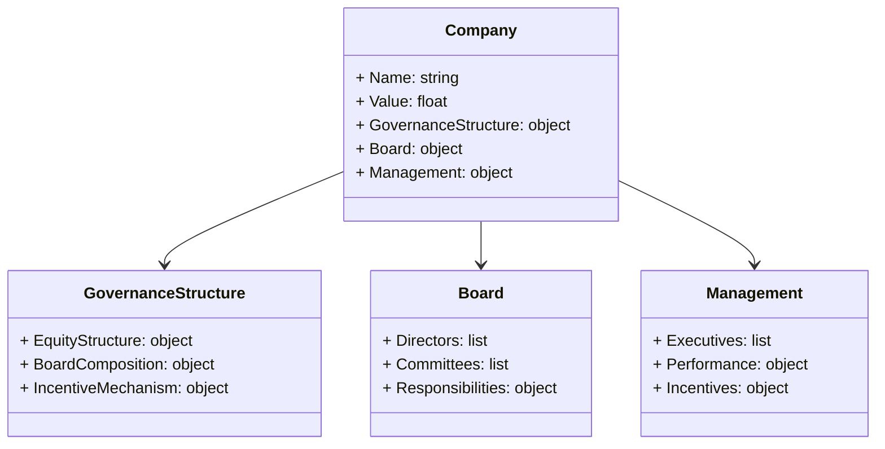

                 


# 价值投资与公司治理的关系

## 关键词：价值投资、公司治理、投资策略、企业价值、治理结构

## 摘要：  
本文探讨了价值投资与公司治理之间的深刻联系，分析了公司治理结构如何影响企业价值，以及价值投资者如何通过优化公司治理来提升投资收益。文章从核心概念、理论框架、系统分析到实际案例，全面解析了两者的关系，并提出了在投资实践中优化公司治理的具体方法。

---

# 第一部分：价值投资与公司治理的背景与基础

## 第1章：价值投资与公司治理的核心概念

### 1.1 价值投资的定义与特征

#### 1.1.1 价值投资的基本定义  
价值投资是一种以基本面分析为基础的投资策略，强调以低于内在价值的价格购买优质资产。其核心在于寻找市场低估的企业，长期持有以实现资本增值。

#### 1.1.2 价值投资的核心特征  
- **长期视角**：关注企业的长期价值，而非短期市场波动。  
- **基本面分析**：通过财务指标、行业地位、竞争优势等评估企业价值。  
- **安全边际**：买入价格低于内在价值，以降低投资风险。  

#### 1.1.3 价值投资的哲学基础  
价值投资的哲学源自格雷厄姆和多德，强调市场先生的非理性与投资的理性选择。投资者应独立思考，避免随市场情绪波动。

### 1.2 公司治理的定义与框架

#### 1.2.1 公司治理的基本概念  
公司治理是通过合理分配权力、责任和利益，确保企业有效运作并实现股东价值最大化的过程。  

#### 1.2.2 公司治理的主要框架  
- **股权结构**：股东如何分配权力与责任。  
- **董事会结构**：董事会的组成、职责与独立性。  
- **管理层激励**：如何通过激励机制提升管理效率。  

#### 1.2.3 公司治理的参与者与职责  
- **股东**：拥有所有权，监督管理层。  
- **董事会**：制定战略，监督管理层。  
- **管理层**：执行战略，确保公司高效运作。  

### 1.3 价值投资与公司治理的关联性

#### 1.3.1 价值投资与公司治理的关系概述  
价值投资关注企业内在价值，而公司治理决定了企业如何创造和分配价值。

#### 1.3.2 价值投资如何影响公司治理  
价值投资者通过股东 activism 或投资决策，推动企业改善治理结构，提升企业价值。

#### 1.3.3 公司治理对投资价值的影响  
良好的公司治理可以降低代理成本，提升企业效率，进而提升企业价值。

---

## 第2章：价值投资的核心理念与方法

### 2.1 价值投资的核心理念

#### 2.1.1 价值投资的核心思想  
- **内在价值**：企业未来现金流的现值，是投资的真正价值。  
- **安全边际**：买入价格低于内在价值，以降低风险。  

#### 2.1.2 价值投资与市场波动的关系  
市场波动为价值投资者提供了以低价买入优质资产的机会。

#### 2.1.3 价值投资的长期视角  
价值投资强调长期持有，避免短期市场波动的干扰。

### 2.2 价值投资的主要方法

#### 2.2.1 基本面分析法  
通过分析企业的财务报表、行业地位、竞争优势等，评估其内在价值。

#### 2.2.2 股价与内在价值的对比  
- **低估**：股价低于内在价值，投资机会。  
- **高估**：股价高于内在价值，投资风险。  

#### 2.2.3 安全边际的概念与应用  
通过安全边际，降低投资风险，确保买入价格合理。

### 2.3 价值投资的实践要点

#### 2.3.1 选股标准的制定  
- **财务健康**：低负债率、稳定的现金流、合理的利润率。  
- **竞争优势**：行业地位、技术壁垒、品牌影响力。  

#### 2.3.2 财务指标的分析与应用  
- **市盈率（P/E）**：衡量股价与盈利的关系。  
- **市净率（P/B）**：衡量股价与资产的关系。  
- **ROE**：衡量股东权益回报率。  

#### 2.3.3 行业分析与竞争优势的评估  
分析行业前景，选择具有竞争优势的企业。

---

## 第3章：公司治理的结构与机制

### 3.1 公司治理的基本结构

#### 3.1.1 股东、董事会、管理层的关系  
- **股东**：拥有所有权，监督董事会。  
- **董事会**：制定战略，监督管理层。  
- **管理层**：执行战略，确保公司高效运作。  

#### 3.1.2 股权结构的多样性  
- **集中型**：大股东控制，决策高效。  
- **分散型**：多个小股东，决策分散。  

#### 3.1.3 股东大会、董事会、监事会的职责  
- **股东大会**：决定公司重大事项。  
- **董事会**：制定战略，监督管理层。  
- **监事会**：监督公司运作，防范风险。  

### 3.2 公司治理的主要机制

#### 3.2.1 股权激励机制  
通过股权激励，将管理层利益与股东利益绑定，提升管理效率。

#### 3.2.2 绩效考核与薪酬机制  
通过绩效考核，确保管理层高效运作，薪酬机制激励管理层创造价值。

#### 3.2.3 监督与制衡机制  
通过监事会、审计委员会等，确保公司运作合规，防范风险。

### 3.3 公司治理的外部环境影响

#### 3.3.1 法律法规的约束  
- **公司法**：规范公司治理结构。  
- **证券法**：规范信息披露，保护投资者权益。  

#### 3.3.2 市场机制的调节  
市场机制通过价格信号，引导资源优化配置，影响公司治理。

#### 3.3.3 社会责任与企业声誉  
企业社会责任的履行，提升企业声誉，吸引投资者。

---

# 第二部分：价值投资与公司治理的理论框架

## 第4章：公司治理结构对企业价值的影响

### 4.1 公司治理结构对企业价值的影响机制

#### 4.1.1 股权结构对代理成本的影响  
- **集中型股权**：降低代理成本，提升效率。  
- **分散型股权**：增加代理成本，降低效率。  

#### 4.1.2 董事会结构对企业战略的影响  
- **独立董事会**：提供独立意见，优化决策。  
- **内部人控制**：可能导致决策偏差。  

#### 4.1.3 经理人激励机制对绩效的影响  
- **股权激励**：激励经理人创造价值。  
- **现金激励**：激励经理人短期绩效。  

### 4.2 价值投资者如何优化公司治理结构

#### 4.2.1 通过股东 activism 改善治理结构  
价值投资者通过参与股东大会、提出议案，推动公司治理结构优化。

#### 4.2.2 通过投资决策影响公司治理  
选择治理结构良好的企业，提升投资价值。

#### 4.2.3 监督与制衡机制的完善  
通过监事会、审计委员会等，确保公司治理合规，防范风险。

---

## 第5章：系统分析与架构设计方案

### 5.1 问题场景介绍

#### 5.1.1 投资者视角  
价值投资者关注企业的长期价值，希望通过优化公司治理结构，提升投资回报。

#### 5.1.2 企业视角  
良好的公司治理结构，可以降低代理成本，提升企业效率，创造更多价值。

### 5.2 项目介绍

#### 5.2.1 项目目标  
分析公司治理结构对企业价值的影响，提出优化公司治理的具体方法。

#### 5.2.2 项目范围  
研究公司治理结构、股权激励机制、董事会结构等对公司价值的影响。

### 5.3 系统功能设计

#### 5.3.1 领域模型（Mermaid 类图）  


#### 5.3.2 系统架构设计（Mermaid 架构图）  


### 5.4 系统接口设计

#### 5.4.1 输入接口  
- **股东输入**：股东大会决议、股东提案。  
- **董事会输入**：战略决策、董事会决议。  

#### 5.4.2 输出接口  
- **公司价值**：通过优化治理结构，提升公司价值。  
- **投资回报**：通过优化治理结构，提升投资回报。  

### 5.5 系统交互设计（Mermaid 序列图）  
```mermaid
sequenceDiagram
    participant Investor
    participant Board
    participant Management
    participant股东大会
    Investor -> Board: 提出治理优化建议
    Board -> Management: 审批并执行建议
    Management ->股东大会: 提交议案
   股东大会 --> Management: 批准或否决议案
    if 否决 then
        Board -> Management: 调整策略
    else
        Management -> Board: 执行优化措施
    end
```

---

## 第6章：项目实战

### 6.1 环境安装

#### 6.1.1 工具准备  
- **数据分析工具**：Excel、Python（Pandas、NumPy）。  
- **绘图工具**：Mermaid、PlantUML。  

#### 6.1.2 数据获取  
- **数据来源**：公司财务报表、行业报告、股价数据。  

### 6.2 核心实现

#### 6.2.1 公司治理结构分析  
- **股权结构分析**：计算大股东持股比例，评估股权集中度。  
- **董事会结构分析**：分析独立董事比例，评估独立性。  

#### 6.2.2 价值评估模型  
- **内在价值计算**：使用DCF模型计算企业内在价值。  
- **安全边际计算**：比较股价与内在价值，评估投资安全性。  

#### 6.2.3 治理优化建议  
- **股权激励设计**：设计合理的股权激励机制，提升管理层积极性。  
- **董事会优化建议**：建议增加独立董事比例，优化董事会结构。  

### 6.3 案例分析

#### 6.3.1 案例背景  
选择一家上市公司，分析其治理结构与投资价值。  

#### 6.3.2 数据分析  
- **财务指标**：计算ROE、P/E、P/B等指标。  
- **治理结构**：分析股权结构、董事会结构、激励机制。  

#### 6.3.3 投资决策  
基于分析结果，评估企业价值，决定是否投资。  

### 6.4 项目小结

#### 6.4.1 成果总结  
通过项目实战，掌握了公司治理结构分析与投资价值评估的方法。  

#### 6.4.2 经验总结  
价值投资与公司治理密切相关，优化治理结构可以提升企业价值。

---

## 第7章：最佳实践与小结

### 7.1 最佳实践 tips

#### 7.1.1 价值投资的注意事项  
- **深入研究**：全面分析企业基本面与治理结构。  
- **长期持有**：避免短期波动干扰。  
- **分散投资**：降低投资风险。  

#### 7.1.2 公司治理的优化建议  
- **完善股权激励机制**：提升管理层积极性。  
- **优化董事会结构**：增加独立董事比例，提升决策独立性。  
- **加强监督机制**：确保公司治理合规，防范风险。  

### 7.2 小结

#### 7.2.1 价值投资与公司治理的关系总结  
价值投资关注企业内在价值，而公司治理决定了企业如何创造和分配价值。优化公司治理结构，可以提升企业价值，实现投资收益最大化。

#### 7.2.2 投资实践中的注意事项  
投资者应关注企业治理结构，选择治理良好的企业，提升投资回报。

### 7.3 注意事项

#### 7.3.1 风险提示  
- **市场风险**：市场波动可能影响投资收益。  
- **治理风险**：治理结构不佳可能导致企业价值下降。  

#### 7.3.2 投资者心态  
- **耐心**：价值投资需要长期持有，避免短期波动干扰。  
- **独立思考**：不随市场情绪波动，坚持理性投资。  

### 7.4 拓展阅读

#### 7.4.1 推荐书籍  
- 《价值》——张磊  
- 《公司治理》——刘兴达  

#### 7.4.2 推荐博客与网站  
- 知识分子（http://www.zhihu.com）  
- 价值投资中文网（http://www.value investors.com.cn）  

---

# 作者：AI天才研究院/AI Genius Institute & 禅与计算机程序设计艺术 /Zen And The Art of Computer Programming

