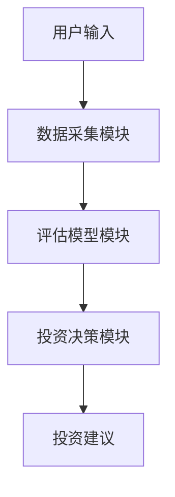

                 


# 价值投资与公司社会责任

> 关键词：价值投资、公司社会责任、ESG、投资策略、可持续发展

> 摘要：本文探讨了价值投资与公司社会责任之间的内在联系，分析了社会责任投资对价值投资策略的影响，并通过数学模型和实际案例展示了如何将社会责任因素纳入投资决策中，以实现可持续发展。

---

## 第一部分：价值投资与公司社会责任的背景介绍

### 第1章：价值投资的起源与发展

#### 1.1 价值投资的核心概念

##### 1.1.1 价值投资的定义与起源
价值投资是一种长期投资策略，起源于20世纪初。本杰明·格雷厄姆和戴维·多德是这一理论的奠基人。其核心理念是寻找市场价值低于内在价值的股票进行投资，通过长期持有实现收益。

##### 1.1.2 价值投资的核心理念
价值投资强调基本面分析，关注企业的财务状况、盈利能力、管理层质量等因素。投资者通过深入分析这些因素，寻找被市场低估的企业，长期持有以获得超额回报。

##### 1.1.3 价值投资的适用范围与边界
价值投资适用于成熟市场和稳定行业的企业，尤其适合那些具有强大财务基础和竞争优势的企业。其边界在于市场周期波动、信息不对称和管理层道德风险等因素可能影响投资决策。

#### 1.2 公司社会责任的概念与重要性

##### 1.2.1 公司社会责任的定义
公司社会责任（Corporate Social Responsibility, CSR）指企业在追求利润的同时，应承担对社会、环境和治理的责任。包括环境保护、员工福利、公平交易等方面。

##### 1.2.2 公司社会责任的演变与现状
随着全球化和环境问题的加剧，公司社会责任逐渐从边缘概念成为企业战略的重要组成部分。现代企业越来越重视ESG（环境、社会、治理）指标，以展示其社会责任履行情况。

##### 1.2.3 公司社会责任对企业与社会的影响
良好的社会责任履行能够提升企业声誉，增强员工凝聚力，降低经营风险。同时，它有助于社会可持续发展，改善环境质量，促进社会公平。

---

### 第2章：价值投资与公司治理的关系

#### 2.1 价值投资与公司治理的内在联系

##### 2.1.1 公司治理在价值投资中的作用
公司治理结构直接影响企业的经营效率和抗风险能力。良好的治理能够保障股东权益，提高企业透明度，从而影响价值投资者的决策。

##### 2.1.2 股东权益与公司治理的互动关系
股东权益是价值投资的核心关注点，而公司治理则是保障股东权益的重要机制。有效的治理能够防止管理层滥用职权，保护中小股东利益，从而提升企业价值。

##### 2.1.3 治理结构对投资价值的影响
治理结构的优化能够提升企业的管理效率和决策质量，降低代理成本，从而提高企业的市场价值。良好的治理结构是价值投资者选择企业的关键因素之一。

---

## 第二部分：价值投资与公司社会责任的核心概念与联系

### 第3章：价值投资与社会责任的内在联系

#### 3.1 价值投资中的社会责任因素

##### 3.1.1 社会责任在价值评估中的权重
随着社会对可持续发展的重视，越来越多的价值投资者将社会责任因素纳入评估体系。ESG指标逐渐成为价值评估的重要组成部分，影响企业的长期价值。

##### 3.1.2 社会责任对风险评估的影响
良好的社会责任履行能够降低企业的经营风险，提升企业的社会形象和品牌价值，从而降低投资风险。相反，社会责任履行不力可能导致企业面临声誉风险和法律风险。

##### 3.1.3 社会责任与企业长期竞争力的关系
企业社会责任的履行能够提升员工满意度和客户忠诚度，增强企业的社会影响力和市场竞争力。这为企业带来长期的经济效益和社会效益。

---

## 第三部分：价值投资与公司社会责任的算法原理

### 第4章：价值投资与社会责任的数学模型

#### 4.1 价值投资的数学模型

##### 4.1.1 基本面分析的数学公式
内在价值计算公式：
$$
\text{内在价值} = \frac{\text{现金流}}{\text{折现率}}
$$

##### 4.1.2 股票估值模型的比较与选择
常用股票估值模型包括：
- 市盈率模型：$$P/E$$
- 市净率模型：$$P/B$$
- 股息率模型：$$D/P$$

#### 4.2 社会责任投资的数学模型

##### 4.2.1 ESG评分的计算方法
ESG评分综合考虑环境、社会和治理三个维度，通常采用标准化评分系统，例如：
$$
\text{ESG评分} = 0.4 \times E + 0.3 \times S + 0.3 \times G
$$

##### 4.2.2 社会责任投资组合优化的数学模型
投资组合优化模型：
$$
\max \sum_{i=1}^{n} w_i R_i \\
\text{subject to} \sum_{i=1}^{n} w_i = 1, \sum_{i=1}^{n} w_i E_i \geq E_{\text{target}}, \sum_{i=1}^{n} w_i S_i \geq S_{\text{target}}, \sum_{i=1}^{n} w_i G_i \geq G_{\text{target}}
$$

---

## 第四部分：系统分析与架构设计方案

### 第5章：价值投资与社会责任的系统架构

#### 5.1 价值投资与社会责任的系统功能设计

##### 5.1.1 系统功能模块划分
- 数据采集模块：收集企业财务数据、ESG评分等。
- 评估模型模块：计算企业内在价值和ESG评分。
- 投资决策模块：根据评估结果生成投资建议。

##### 5.1.2 系统功能流程图


---

## 第五部分：项目实战与案例分析

### 第6章：项目实战

#### 6.1 环境安装

##### 6.1.1 安装Python环境
使用Anaconda或Miniconda安装Python 3.8及以上版本。

##### 6.1.2 安装必要的库
安装numpy、pandas、scikit-learn等库：
```bash
pip install numpy pandas scikit-learn
```

#### 6.2 核心实现源代码

##### 6.2.1 数据预处理代码
```python
import pandas as pd
import numpy as np

# 加载数据
data = pd.read_csv('company_data.csv')

# 删除缺失值
data = data.dropna()

# 标准化处理
from sklearn.preprocessing import StandardScaler
scaler = StandardScaler()
data_scaled = scaler.fit_transform(data)
```

##### 6.2.2 ESG评分计算代码
```python
def calculate_esg_score(data, weights):
    return np.dot(data, weights)
```

##### 6.2.3 投资组合优化代码
```python
from scipy.optimize import minimize

def optimize_portfolio(weights, target_esg, data):
    # 定义目标函数
    def objective(x):
        return -np.dot(x, data)
    # 定义约束条件
    constraints = [
        ('sum', x, 1),
        ('dot', x, weights, target_esg)
    ]
    # 使用SLSQP求解
    result = minimize(objective, x0=weights, method='SLSQP', constraints=constraints)
    return result.x

# 示例调用
weights = np.array([0.4, 0.3, 0.3])
target_esg = 0.75
optimized_weights = optimize_portfolio(weights, target_esg, data)
```

---

### 第7章：案例分析

#### 7.1 案例分析与解读

##### 7.1.1 案例背景
假设我们选取一家科技公司，分析其财务数据和ESG评分。

##### 7.1.2 数据分析与评估
使用上述代码进行数据预处理和模型计算，得出该公司的内在价值和ESG评分。

##### 7.1.3 投资决策
根据评估结果，生成投资建议，包括是否纳入投资组合、预期回报率等。

#### 7.2 案例小结

通过案例分析，我们展示了如何将社会责任因素纳入投资决策中，实现长期稳健的投资回报。

---

## 第六部分：总结与展望

### 第8章：总结

#### 8.1 核心观点回顾
- 价值投资与社会责任的内在联系
- 社会责任投资对投资价值的影响
- 可持续发展的重要性

#### 8.2 投资策略建议
- 在投资决策中加入ESG因素
- 关注企业的长期竞争力和社会责任履行
- 保持长期投资策略，避免短期波动影响

---

## 参考文献

- 格雷厄姆，本杰明. 《证券分析》
- 约瑟夫，洛温斯坦. 《社会责任投资指南》
- 环境、社会和治理（ESG）相关研究报告

---

## 作者信息

作者：AI天才研究院/AI Genius Institute & 禅与计算机程序设计艺术/Zen And The Art of Computer Programming

---

希望这篇技术博客文章能满足您的要求！如果需要进一步修改或补充，请随时告知。

