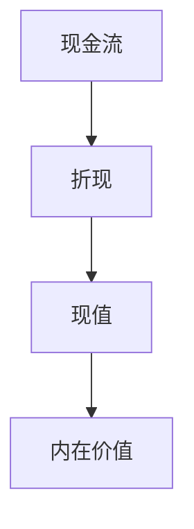
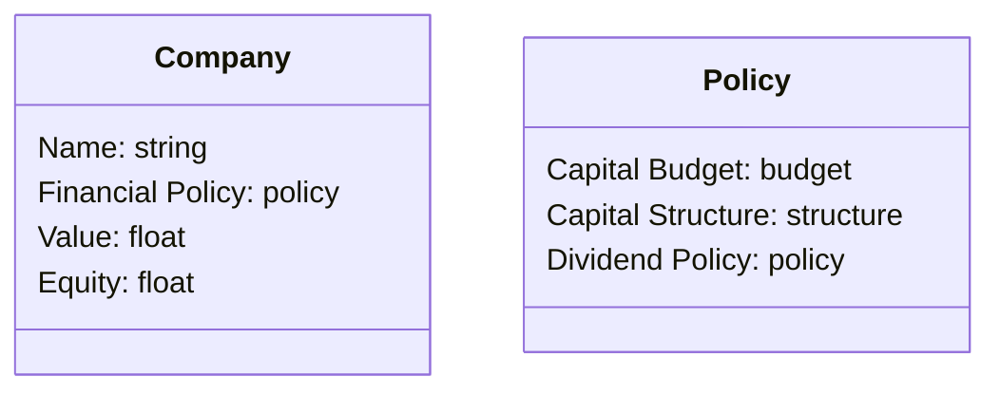

                 


# 价值投资与公司财务政策

## 关键词

- 价值投资
- 公司财务政策
- 投资策略
- 财务分析
- 股权价值

## 摘要

本文探讨了价值投资与公司财务政策之间的深层联系，分析了价值投资的核心原理、公司财务政策的主要内容及其对投资决策的影响。通过数学模型和实际案例，详细讲解了如何将价值投资理念与公司财务政策相结合，制定科学的投资策略。文章还从系统架构和项目实战的角度，提供了详细的分析工具和方法，帮助投资者更好地理解和应用相关知识。

---

# 第1章 价值投资的基本原理

## 1.1 价值投资的核心概念

### 1.1.1 价值投资的定义与内涵

价值投资是一种以公司内在价值为导向的投资策略，强调通过分析公司的基本面，寻找市场价格低于其内在价值的公司进行投资。其核心在于识别被市场低估的优质企业，长期持有，等待价值回归。

### 1.1.2 价值投资的基本原则

- **安全边际**：买入价格低于内在价值，确保有一定的安全空间。
- **长期视角**：关注企业的长期盈利能力，而非短期价格波动。
- **质量优先**：选择行业地位稳固、财务健康的企业。

### 1.1.3 价值投资的历史与发展

价值投资由本杰明·格雷厄姆和戴维·多德提出，经过 Warren Buffett 等投资者的发展，成为一种成熟的投资理念，广泛应用于资本市场。

## 1.2 公司财务政策的概述

### 1.2.1 公司财务政策的定义

公司财务政策是指企业在财务管理方面的基本方针和策略，包括资本预算、资本结构、股利政策等方面。

### 1.2.2 公司财务政策的主要内容

- 资本预算：确定投资项目。
- 资本结构：合理配置债务和股权。
- 股利政策：决定股利分配。

### 1.2.3 财务政策与公司价值的关系

良好的财务政策能够提升公司价值，反之则可能导致价值下降。投资者需要通过分析财务政策，评估公司的财务健康状况。

---

# 第2章 价值投资与公司财务政策的相互作用

## 2.1 价值投资视角下的公司财务政策

### 2.1.1 资本预算决策与价值投资

资本预算决策直接影响公司的未来现金流，价值投资者需要分析投资项目是否能够创造额外价值。

### 2.1.2 资本结构优化与价值创造

合理的资本结构能够降低资本成本，提升公司价值。价值投资者关注企业的杠杆水平和偿债能力。

### 2.1.3 股利政策与股东价值最大化

股利政策影响股东的当前收益和未来投资机会，价值投资者关注股利的可持续性和增长性。

## 2.2 公司财务政策对投资价值的影响

### 2.2.1 财务健康状况对投资价值的影响

财务健康状况包括盈利能力、偿债能力、运营效率等方面，直接影响公司的内在价值。

### 2.2.2 财务风险与投资决策

过高的财务杠杆可能导致财务风险增加，影响公司的长期价值。

### 2.2.3 财务透明度与投资者信任

高透明度的财务政策能够增强投资者的信任，提升公司的市场价值。

---

# 第3章 价值评估的数学模型

## 3.1 现金流折现模型

### 3.1.1 现金流折现模型的原理

通过将未来现金流折现，计算公司的内在价值。公式为：

$$
\text{内在价值} = \sum_{t=1}^{n} \frac{\text{CF}_t}{(1 + r)^t}
$$

其中，CFₜ为第t年的现金流，r为折现率。

### 3.1.2 永续年金与贴现率的计算

永续年金的现值公式为：

$$
PV = \frac{C}{r}
$$

其中，C为每年的现金流，r为贴现率。

### 3.1.3 企业自由现金流的计算公式

企业自由现金流公式为：

$$
FCF = EBIT(1 - t) + Depreciation - Capital Expenditure
$$

其中，EBIT为息税前利润，t为税率，Depreciation为折旧，Capital Expenditure为资本支出。

### 3.1.4 现金流折现模型的mermaid流程图



---

## 3.2 股权价值评估模型

### 3.2.1 股权价值的定义

股权价值是指公司股权的市场价值，与公司盈利能力、成长性和财务状况密切相关。

### 3.2.2 股权价值的计算公式

股权价值公式为：

$$
\text{Equity Value} = \frac{\text{Net Income}}{ROE \text{ Target}}
$$

其中，ROE为目标净资产收益率。

---

# 第4章 价值投资与公司财务政策的系统分析

## 4.1 问题场景介绍

通过分析某公司的财务政策，评估其内在价值，制定投资策略。

## 4.2 系统功能设计

### 4.2.1 领域模型mermaid类图



## 4.3 系统架构设计mermaid架构图

```mermaid
container 财务分析系统 {
    component 数据输入模块
    component 计算模块
    component 输出模块
}
```

---

# 第5章 项目实战

## 5.1 环境安装

安装必要的财务分析工具和编程库，如Python、Pandas、NumPy等。

## 5.2 系统核心实现源代码

```python
def calculate_intrinsic_value(enterprise_value, net_debt):
    return enterprise_value - net_debt

def calculate_shares_outstanding(company):
    return company.shares_outstanding

# 示例计算
enterprise_value = 1000000000
net_debt = 200000000
intrinsic_value = calculate_intrinsic_value(enterprise_value, net_debt)
shares_outstanding = calculate_shares_outstanding(company)
per_share_value = intrinsic_value / shares_outstanding
print(per_share_value)
```

---

# 第6章 总结与展望

## 6.1 项目小结

本文详细分析了价值投资与公司财务政策的关系，提出了基于现金流折现模型的股权价值评估方法，并通过案例分析验证了模型的有效性。

## 6.2 最佳实践 tips

- 价值投资者应关注企业的财务健康状况和财务政策。
- 使用数学模型进行价值评估时，确保数据的准确性和模型的合理性。

## 6.3 注意事项

- 投资者应结合市场环境和行业特点，灵活调整投资策略。
- 避免过度依赖单一模型，综合分析多种因素。

## 6.4 拓展阅读

- 格雷厄姆的《聪明的投资者》
- 巴菲特的股东信

---

作者：AI天才研究院/AI Genius Institute & 禅与计算机程序设计艺术 /Zen And The Art of Computer Programming

