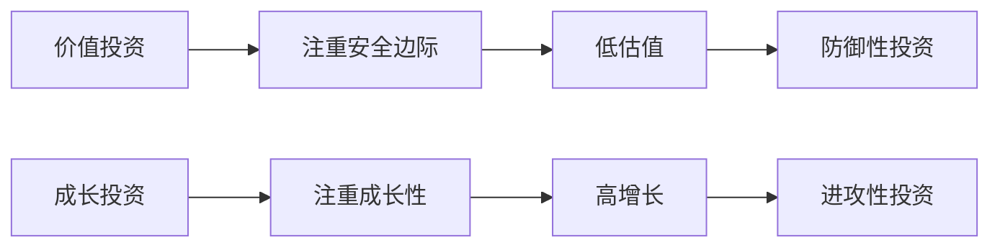
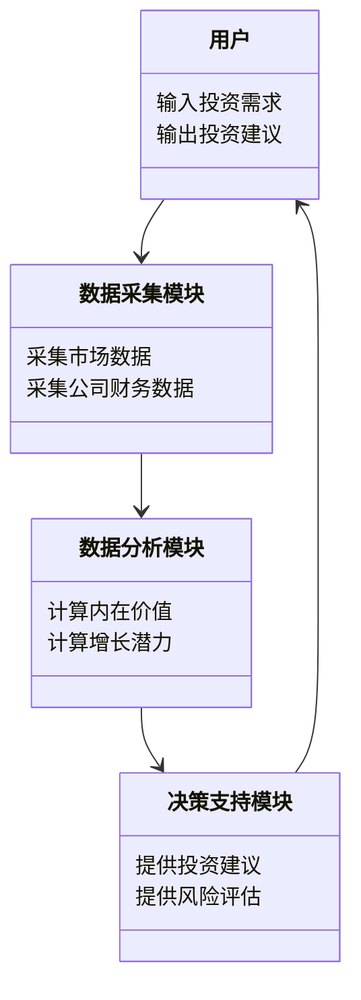
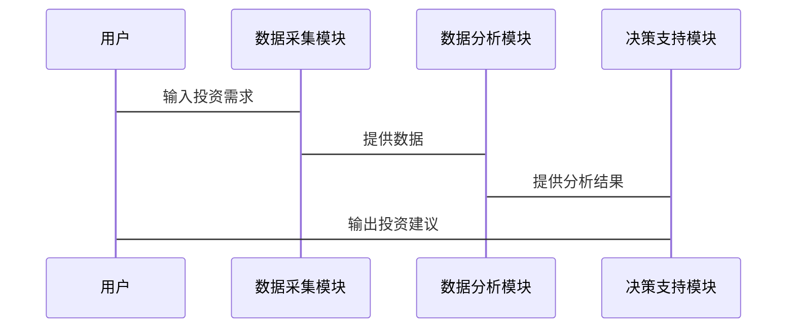
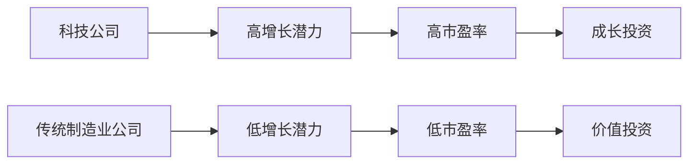

                 


# 价值投资与成长投资的对比

## 关键词：价值投资、成长投资、投资策略、对比分析、投资模型

## 摘要：  
本文从投资的基本概念出发，详细探讨了价值投资与成长投资的核心理念、分析方法及其适用场景。通过对比分析，揭示了两种投资策略在目标、时间框架、风险承受等方面的差异，并结合实际案例，分析了如何根据市场环境和个人需求选择合适的投资策略。最后，本文提出了一个基于价值与成长投资理念的投资决策支持系统架构，帮助投资者更好地进行投资决策。

---

## 第一部分: 背景介绍

### 第1章: 投资的基本概念与分类

#### 1.1 投资的基本概念  
投资是将资金投入到资产中以获得未来收益的行为。从金融学的角度来看，投资可以分为实物投资（如房地产、制造业）和金融投资（如股票、债券）。本文主要关注金融投资领域，特别是股票投资。

- **投资的目标**：追求资产增值，实现财富保值与增长。  
- **投资的风险**：与收益成正比，高风险可能带来高收益，也可能导致本金损失。  
- **投资的基本原则**：分散投资、长期持有、避免过度交易。  

#### 1.2 价值投资与成长投资的起源  
价值投资与成长投资是两种截然不同的投资理念，它们的起源和发展与市场环境密切相关。

- **价值投资的起源与发展**  
  价值投资的理念起源于20世纪初，由本杰明·格雷厄姆和戴维·多德提出。他们主张以低于内在价值的价格买入股票，长期持有，等待市场的重新评估。价值投资的核心在于寻找被市场低估的资产。  

- **成长投资的起源与发展**  
  成长投资的理念兴起于20世纪60年代，以菲德烈·柴纳·多尔曼（Fidelity’s Peter Lynch）和约翰·聂夫（John Neff）为代表。他们认为，投资于那些收入和利润快速增长的公司，可以实现超额收益。  

- **两种投资理念的对比**  
  尽管价值投资与成长投资在目标上有所不同，但它们都强调长期投资和基本面分析。价值投资注重安全边际，而成长投资注重增长潜力。  

---

## 第二部分: 核心概念与联系

### 第2章: 价值投资的核心概念与原理

#### 2.1 价值投资的定义与原则  
价值投资的核心在于寻找市场价格低于内在价值的股票。以下是其主要原则：

- **内在价值**：资产在合理估值下的真实价值，通常通过财务指标（如市盈率、市净率）计算得出。  
- **安全边际**：买入价格与内在价值之间的差距，用以降低投资风险。  
- **长期持有**：价值投资者通常会长期持有股票，等待市场重新认识到其内在价值。  

#### 2.2 价值投资的分析方法  
价值投资的分析方法主要集中在对公司财务状况的深入研究：

- **财务指标分析**  
  - 市盈率（P/E）：股价与每股收益的比率，用于衡量股票的估值。  
  - 市净率（P/B）：股价与每股净资产的比率，用于衡量股票的估值。  
  - 净利润增长率：公司利润的增长速度。  

- **行业分析**  
  选择具有稳定增长前景的行业，如公用事业、消费品行业等。  

- **公司分析**  
  重点关注公司的盈利能力、资产负债情况和管理层素质。  

#### 2.3 价值投资的适用场景  
价值投资适用于以下场景：

- **市场低迷期**：当市场整体估值较低时，更容易找到被低估的股票。  
- **防御性投资者**：那些注重本金安全、风险承受能力较低的投资者。  

### 第3章: 成长投资的核心概念与原理

#### 3.1 成长投资的定义与原则  
成长投资的核心在于投资于那些收入和利润快速增长的公司。以下是其主要原则：

- **成长性**：公司未来收入和利润的增长潜力。  
- **高估值容忍度**：成长投资者愿意以较高的市盈率买入股票，因为公司未来的增长可以弥补高估值。  
- **选择性持有**：与价值投资者不同，成长投资者可能会根据公司增长情况频繁调整投资组合。  

#### 3.2 成长投资的分析方法  
成长投资的分析方法主要集中在对公司未来增长潜力的预测：

- **财务指标分析**  
  - 市盈率（P/E）：用于衡量公司未来的增长潜力。  
  - 营收增长率：公司收入的增长速度。  
  - 净利润增长率：公司利润的增长速度。  

- **行业分析**  
  选择具有高增长潜力的行业，如科技、互联网行业等。  

- **公司分析**  
  重点关注公司的收入增长、利润率和管理层的战略规划。  

#### 3.3 成长投资的适用场景  
成长投资适用于以下场景：

- **市场繁荣期**：当市场整体估值较高时，成长型股票可能表现较好。  
- **进攻性投资者**：那些注重高收益、风险承受能力较高的投资者。  

### 第4章: 价值投资与成长投资的对比分析

#### 4.1 对比维度与表格  
以下是价值投资与成长投资在核心维度上的对比：

| 对比维度       | 价值投资                         | 成长投资                         |
|----------------|----------------------------------|----------------------------------|
| **目标**       | 寻找被低估的股票                 | 投资于高增长的公司               |
| **时间框架**    | 长期持有，注重价值回归           | 短期或中期，注重增长潜力         |
| **风险承受**    | 低风险，注重安全边际             | 高风险，容忍高估值               |
| **分析方法**    | 财务指标分析，注重内在价值       | 财务指标分析，注重增长潜力       |

#### 4.2 对比的Mermaid流程图  
以下是价值投资与成长投资的对比流程图：



---

## 第三部分: 算法与数学模型

### 第5章: 投资模型的构建与对比

#### 5.1 价值投资模型  
价值投资模型基于对公司内在价值的评估。以下是其数学表达式：

$$ \text{内在价值} = \frac{\text{未来现金流的现值}}{折现率} $$

- **未来现金流的现值**：公司未来现金流的折现值。  
- **折现率**：基于市场利率和风险因素确定的折现率。  

#### 5.2 成长投资模型  
成长投资模型基于对公司未来增长潜力的预测。以下是其数学表达式：

$$ \text{增长潜力} = \frac{\text{未来营收增长率}}{当前营收增长率} $$

- **未来营收增长率**：公司未来预计的营收增长率。  
- **当前营收增长率**：公司当前的营收增长率。  

#### 5.3 对比分析  
通过数学模型可以看出，价值投资注重当前的估值，而成长投资注重未来的增长潜力。两者在投资策略上各有优劣，具体选择取决于市场环境和个人风险偏好。

---

## 第四部分: 系统分析与架构设计

### 第6章: 投资决策支持系统的架构设计

#### 6.1 系统功能设计  
以下是投资决策支持系统的功能模块：



#### 6.2 系统架构设计  
以下是投资决策支持系统的架构图：


#### 6.3 系统接口设计  
以下是系统接口设计：



---

## 第五部分: 项目实战

### 第7章: 价值投资与成长投资的实战案例

#### 7.1 环境安装  
为了进行投资分析，需要安装以下工具：

- 数据分析工具：Python、Pandas、NumPy  
- 可视化工具：Matplotlib、Seaborn  
- 投资分析工具：Morningstar、Yahoo Finance API  

#### 7.2 核心实现  
以下是计算内在价值和增长潜力的Python代码示例：

```python
import pandas as pd
import numpy as np

# 计算内在价值
def calculate_intrinsic_value(future_cash_flows, discount_rate):
    present_value = np.npv(discount_rate, future_cash_flows)
    return present_value / (1 - discount_rate)

# 计算增长潜力
def calculate_growth_potential(future_revenue_growth, current_revenue_growth):
    return future_revenue_growth / current_revenue_growth

# 示例数据
future_cash_flows = [100, 200, 300, 400]
discount_rate = 0.05
future_revenue_growth = 0.2
current_revenue_growth = 0.1

# 计算并输出结果
iv = calculate_intrinsic_value(future_cash_flows, discount_rate)
gp = calculate_growth_potential(future_revenue_growth, current_revenue_growth)

print(f"内在价值：{iv}")
print(f"增长潜力：{gp}")
```

#### 7.3 案例分析  
以下是对比科技公司和传统制造业公司的案例分析：



---

## 第六部分: 总结与展望

### 第8章: 总结与展望

#### 8.1 总结  
本文从价值投资与成长投资的核心理念出发，对比分析了它们的优缺点，并提出了一个基于这两种投资理念的投资决策支持系统架构。通过实际案例分析，展示了如何根据市场环境和个人需求选择合适的投资策略。

#### 8.2 展望  
未来的研究可以进一步探讨以下方向：

- **动态调整模型**：根据市场变化动态调整投资策略。  
- **机器学习算法**：利用机器学习算法对股票进行预测和分类。  
- **风险管理**：建立更完善的风险管理模型，降低投资风险。  

---

## 作者：AI天才研究院/AI Genius Institute & 禅与计算机程序设计艺术 /Zen And The Art of Computer Programming

