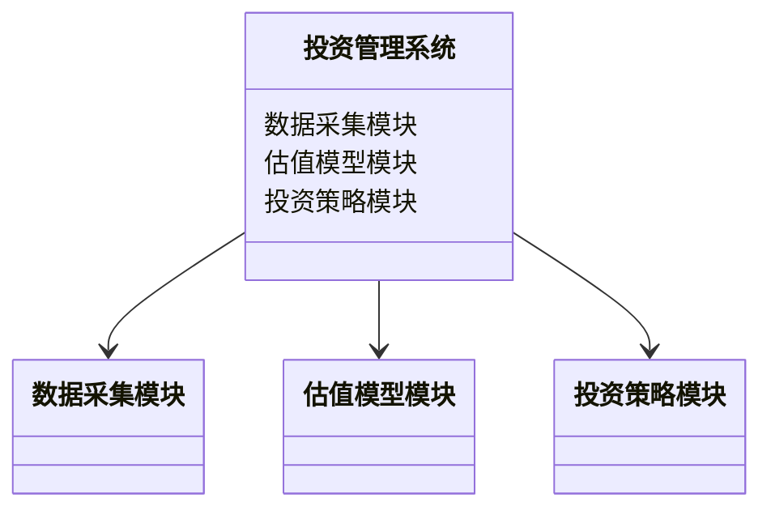
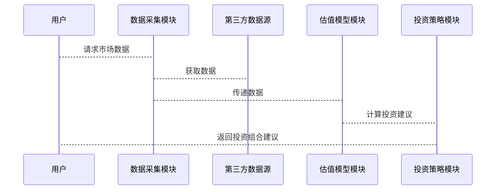

                 


# 《价值投资与通货膨胀的关系》

---

## 关键词：
价值投资、通货膨胀、资产配置、投资策略、经济分析

---

## 摘要：
本文深入探讨了价值投资与通货膨胀之间的关系，分析了通货膨胀对价值投资策略的影响，以及如何在通货膨胀环境下优化投资组合。通过数学模型和实际案例分析，本文揭示了通货膨胀对资产估值和投资决策的关键影响，并提出了在不同通胀环境下的价值投资策略优化方法。同时，本文结合技术方法，从系统架构和算法实现的角度，详细阐述了如何利用技术手段量化通货膨胀对价值投资的影响。

---

## 正文：

---

## 第一部分：价值投资与通货膨胀的背景介绍

### 第1章：通货膨胀的基本概念与类型

#### 1.1 通货膨胀的定义与分类

**1.1.1 通货膨胀的定义**  
通货膨胀是指物价总水平在一段时间内持续上涨的现象。通常用消费者价格指数（CPI）或生产者价格指数（PPI）来衡量。通货膨胀的本质是货币购买力的下降，即单位货币所能购买的商品和服务数量减少。

**1.1.2 通货膨胀的类型**  
通货膨胀可以分为以下几种类型：
1. **温和通胀**：年通胀率在2%-5%之间，通常被认为是可接受的通胀水平。
2. **恶性通胀**：通胀率极高，货币失去购买力，经济秩序混乱。
3. **滞胀**：经济增长停滞，同时通胀率较高，失业率上升。

**1.1.3 通货膨胀的成因与影响**  
通货膨胀的成因包括货币供应量增加、需求拉动、成本推动等因素。其影响包括资产价格波动、消费能力下降、企业盈利能力变化等。

---

#### 1.2 通货膨胀对经济的影响

**1.2.1 对消费者价格水平的影响**  
通货膨胀会导致日常消费品价格上涨，降低购买力，进而影响消费行为。

**1.2.2 对企业盈利能力的影响**  
通货膨胀可能导致企业成本上升，但如果企业能够通过提高产品价格转嫁成本，盈利能力可能保持不变或提高。

**1.2.3 对资产价格的推动作用**  
通货膨胀通常会导致资产价格（如房地产、股票）上涨，因为投资者寻求保值资产以应对货币贬值。

---

### 第2章：价值投资的基本原理

#### 2.1 价值投资的核心概念

**2.1.1 价值投资的定义**  
价值投资是一种投资策略，强调以低于资产内在价值的价格买入优质资产，长期持有，等待价格回归合理水平。

**2.1.2 价值投资的核心理念**  
- **安全边际**：买入价格低于内在价值，以降低投资风险。
- **内在价值**：资产在未来现金流的现值，通常通过 discounted cash flow (DCF) 模型计算。

**2.1.3 价值投资与成长投资的区别**  
价值投资关注低估资产，而成长投资关注高增长潜力的资产。

---

#### 2.2 价值投资的策略与方法

**2.2.1 股票估值方法**  
- **DCF模型**：通过预测未来现金流，计算其现值。
- **PE（市盈率）和PB（市净率）**：比较市场价格与基本面指标的关系。

**2.2.2 资产配置策略**  
- 通过分散投资降低风险。
- 根据市场环境调整资产配置比例。

**2.2.3 安全边际的计算与应用**  
安全边际 = 内在价值 - 市场价格，通常建议安全边际不低于20%。

---

## 第二部分：通货膨胀与价值投资的关系

### 第3章：通货膨胀对价值投资的影响

#### 3.1 通货膨胀对资产价格的影响

**3.1.1 股票、债券、黄金等资产在通胀环境下的表现**  
- **股票**：企业盈利能力上升，但通胀可能导致无风险利率上升，影响股票估值。
- **债券**：通胀上升会增加债券的违约风险，债券价格可能下跌。
- **黄金**：作为避险资产，黄金在通胀上升时通常价格上涨。

**3.1.2 通胀对资产估值模型的影响**  
通胀会影响无风险利率和折现率，从而影响资产的内在价值计算。

---

#### 3.2 通货膨胀对投资策略的调整

**3.2.1 如何在通胀环境下调整资产配置**  
- 增加抗通胀资产（如房地产、大宗商品）的比例。
- 减少对债券等固定收益资产的配置。

**3.2.2 如何通过分散投资降低通胀风险**  
分散投资于不同资产类别，避免过度依赖单一资产。

**3.2.3 通胀对安全边际的影响**  
通胀上升可能导致资产市场价格波动加剧，安全边际需要重新评估。

---

### 第4章：价值投资在通货膨胀环境下的策略优化

#### 4.1 通胀环境下的选股策略

**4.1.1 寻找具有抗通胀能力的行业**  
- 能源行业：石油、天然气价格上涨。
- 农业行业：粮食价格上涨。
- 原材料行业：金属、化工产品价格上涨。

**4.1.2 选择具有定价权的企业**  
企业能够通过提高产品价格转嫁成本上升的压力。

**4.1.3 通胀环境下企业盈利能力的评估**  
关注企业毛利率和净利率的变化，确保企业在通胀环境下能够保持或提高盈利能力。

---

#### 4.2 通胀环境下的估值调整

**4.2.1 通胀对无风险利率的影响**  
无风险利率上升会增加债券收益率，影响股票的相对吸引力。

**4.2.2 通胀对折现率的影响**  
折现率上升会降低未来现金流的现值，影响资产的内在价值计算。

**4.2.3 如何调整DCF模型以应对通胀**  
在DCF模型中，假设通胀会影响未来现金流的增长率和折现率。

---

## 第三部分：数学模型与算法解析

### 第5章：通货膨胀与价值投资的数学模型

#### 5.1 通胀对资产价值的数学模型

**5.1.1 资产价格与通胀的关系模型**  
假设通胀率为\( \pi \)，资产价格\( P \)与通胀率的关系可以表示为：  
$$ P = P_0 \times (1 + \pi) $$  
其中，\( P_0 \)为初始价格。

**5.1.2 通货膨胀对股票估值的影响**  
假设股票的未来现金流\( CF_t \)在通胀环境下增长，其现值为：  
$$ V = \sum_{t=1}^{n} \frac{CF_t}{(1 + r)^t} $$  
其中，\( r \)为折现率，包括通胀影响。

---

#### 5.2 价值投资的数学模型

**5.2.1 DCF模型**  
股票的内在价值\( V \)可以通过以下公式计算：  
$$ V = \frac{CF}{r - g} $$  
其中，\( CF \)为未来现金流，\( r \)为折现率，\( g \)为现金流增长率。

**5.2.2 安全边际的计算**  
安全边际 = 内在价值 - 市场价格  
$$ \text{安全边际} = V - P $$

---

## 第四部分：系统分析与架构设计

### 第6章：通货膨胀与价值投资的系统分析

#### 6.1 投资管理系统功能设计

**6.1.1 系统功能模块**  
- 数据采集模块：收集市场数据（CPI、股价、债券收益率等）。
- 估值模型模块：计算资产的内在价值和安全边际。
- 投资策略模块：根据通胀环境调整资产配置。

**6.1.2 系统功能设计（领域模型）**  


---

#### 6.2 系统架构设计

**6.2.1 系统架构（分层架构）**  


---

#### 6.3 系统接口设计

**6.3.1 接口描述**  
- 数据采集接口：从第三方数据源获取市场数据。
- 估值模型接口：计算资产的内在价值。
- 投资策略接口：生成投资组合建议。

---

#### 6.4 系统交互设计

**6.4.1 系统交互（序列图）**  


---

## 第五部分：项目实战

### 第7章：通货膨胀环境下的价值投资实战

#### 7.1 案例分析：滞胀环境下的投资策略

**7.1.1 项目背景**  
滞胀环境下，通胀率高企，经济增长停滞，企业盈利能力下降。

**7.1.2 投资策略**  
- 选择具有抗通胀能力的行业（如能源、农业）。
- 增加黄金等避险资产的配置比例。

---

#### 7.2 环境安装与代码实现

**7.2.1 环境安装**  
- 安装Python和相关库（Pandas、NumPy、Matplotlib）。
- 安装第三方数据源接口（如Yahoo Finance）。

**7.2.2 核心代码实现**  
```python
import pandas as pd
import numpy as np
import yfinance as yf

# 下载数据
aapl = yf.download('AAPL', start='2020-01-01', end='2023-01-01')

# 计算价格走势
aapl['Return'] = aapl['Close'].pct_change()

# 计算通胀率（假设CPI数据已知）
cpi = pd.read_csv('cpi_data.csv')
cpi['Inflation_Rate'] = cpi['CPI'].pct_change()

# 合并数据
merged_data = pd.merge(aapl['Return'], cpi['Inflation_Rate'], left_index=True, right_index=True)
```

---

## 第六部分：最佳实践与小结

### 第8章：最佳实践与小结

#### 8.1 投资策略建议

**8.1.1 在通胀环境下的投资策略**  
- 增加抗通胀资产的配置。
- 选择具有定价权的企业。
- 保持合理的安全边际。

**8.1.2 风险管理**  
- 分散投资以降低风险。
- 定期评估和调整投资组合。

---

#### 8.2 小结

本文深入探讨了通货膨胀对价值投资的影响，分析了通货膨胀对资产价格、估值模型和投资策略的具体影响，并提出了在不同通胀环境下的投资策略优化方法。通过数学模型和系统设计，本文为投资者提供了技术化的投资决策支持。

---

## 参考文献

1. Graham, Benjamin. *The Intelligent Investor*.  
2. Fama, Eugene. *Investment Value and Price*.  
3. Federal Reserve Economic Review.  
4. Shiller, Robert. *Irrational Exuberance*.  

---

## 作者

作者：AI天才研究院（AI Genius Institute） & 禅与计算机程序设计艺术（Zen And The Art of Computer Programming）

---

## 版权声明

本文版权归作者所有，未经授权不得转载或使用。如需转载请注明出处。

---

