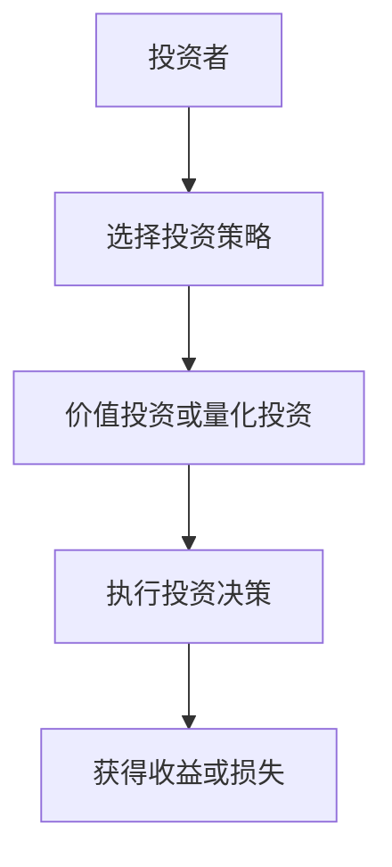

                 

# 《价值投资与量化投资的对比》

## 关键词：价值投资、量化投资、投资策略、风险收益、算法交易、基本面分析

## 摘要：  
本文通过对比价值投资与量化投资的核心理念、策略、优劣势和适用场景，深入分析两种投资方法的异同。文章结合实际案例和数学模型，探讨如何在不同市场环境下选择最优的投资策略。通过技术化的分析方法，本文旨在为投资者提供一种更加全面的投资视角。

---

## 第一部分：引言

### 1.1 投资的基本概念

投资是指将资金投入到某种资产或项目中，以期在未来获得收益的行为。投资的核心目标是通过资产配置和风险管理，实现财富的保值与增值。

#### 1.1.1 价值投资与量化投资的定义

- **价值投资**：以基本面分析为核心，寻找市场价格低于其内在价值的资产进行投资。其核心理念是“买 cheap，卖 dear”，强调长期持有的投资策略。
- **量化投资**：基于数学模型和算法，通过大数据分析和统计套利寻找投资机会。量化投资注重短期交易和高频操作，强调技术分析和数据驱动的决策。

#### 1.1.2 对比的必要性

价值投资与量化投资在理念、方法和目标上存在显著差异。通过对比分析，可以帮助投资者更好地理解两种策略的特点，从而在实际投资中做出更明智的选择。

---

## 第二部分：价值投资的理论基础

### 2.1 价值投资的核心理念

#### 2.1.1 基本面分析的核心要素

基本面分析是价值投资的核心工具，主要包括以下几个方面：

1. **财务报表分析**：通过分析资产负债表、利润表和现金流量表，评估企业的盈利能力、偿债能力和发展潜力。
2. **估值指标**：市盈率（P/E）、市净率（P/B）、股息率等指标用于衡量资产的内在价值。
3. **行业分析**：研究企业的行业地位、竞争优势和市场前景。

#### 2.1.2 价值投资的关键原则

1. **安全边际**：买入价格低于内在价值，以降低投资风险。
2. **长期持有**：价值投资强调长期持有，避免频繁交易。
3. **分散投资**：通过分散投资降低特定资产的风险。

#### 2.1.3 价值投资的代表人物

- **巴菲特**：以长期价值投资闻名，强调寻找具有持续竞争优势的企业。
- **彼得·林奇**：通过基本面分析寻找被低估的股票。

### 2.2 价值投资的适用场景

#### 2.2.1 长期投资与价值发现

价值投资适用于长期投资者，尤其是在市场波动较大时，长期持有优质资产能够获得超额收益。

#### 2.2.2 价值投资的风险与挑战

- **市场波动风险**：短期市场波动可能会影响资产价格，但长期来看，优质资产的价值会逐渐回归。
- **基本面变化**：企业经营状况的变化可能会影响其内在价值。

---

## 第三部分：量化投资的理论基础

### 3.1 量化投资的核心理念

#### 3.1.1 数学模型与算法在投资中的应用

量化投资依赖于数学模型和算法，主要包括以下几种：

1. **回归分析**：用于发现资产价格与相关因素之间的关系。
2. **时间序列分析**：通过历史数据预测未来价格走势。
3. **机器学习**：利用算法识别数据中的模式，预测市场走势。

#### 3.1.2 量化投资的关键技术与工具

- **高频交易**：利用算法在极短时间内完成交易，捕捉市场价差。
- **大数据分析**：通过海量数据挖掘投资机会。
- **算法交易**：基于数学模型自动执行交易策略。

#### 3.1.3 算法交易的基本原理

算法交易的核心是通过数学模型生成交易信号，并通过自动化系统执行交易。其流程如下：

1. 数据采集：从市场数据中提取相关信息。
2. 模型构建：基于历史数据训练模型。
3. 信号生成：模型生成交易信号。
4. 交易执行：自动化系统根据信号执行交易。

### 3.2 量化投资的适用场景

#### 3.2.1 短期交易与高频交易

量化投资适用于短期交易，尤其是高频交易场景。通过快速捕捉市场价差，量化投资者可以在短时间内获得收益。

#### 3.2.2 数据驱动的投资决策

量化投资依赖于数据和模型，适用于数据量大、市场流动性强的环境。

#### 3.2.3 量化投资的风险与挑战

- **模型风险**：模型失效可能导致重大损失。
- **技术风险**：系统故障或网络延迟可能影响交易执行。

---

## 第四部分：价值投资与量化投资的对比分析

### 4.1 两种投资策略的异同

#### 4.1.1 投资目标与时间跨度的对比

- **价值投资**：长期目标，注重资产的内在价值。
- **量化投资**：短期目标，注重市场价差和统计套利。

#### 4.1.2 投资方法与工具的对比

- **价值投资**：依赖基本面分析，工具主要是财务报表和估值指标。
- **量化投资**：依赖数学模型和算法，工具主要是大数据分析和高频交易系统。

#### 4.1.3 风险与收益的对比

- **价值投资**：收益相对稳定，波动较小，但需要较长时间。
- **量化投资**：收益波动较大，但可能在短期内获得超额收益。

### 4.2 价值投资与量化投资的优劣势分析

#### 4.2.1 价值投资的优势与局限性

- **优势**：
  1. 长期收益稳定。
  2. 适合低波动市场环境。
  3. 风险较低。
- **局限性**：
  1. 短期波动风险较大。
  2. 需要较高的市场研究能力。

#### 4.2.2 量化投资的优势与局限性

- **优势**：
  1. 短期收益高。
  2. 数据驱动决策，效率高。
  3. 适合高频交易环境。
- **局限性**：
  1. 模型风险较高。
  2. 需要较高的技术能力。

#### 4.2.3 两种策略的互补性与融合可能性

尽管价值投资与量化投资在理念上存在差异，但在实际操作中可以相互补充。例如，通过量化方法筛选出优质资产，再结合基本面分析进行投资决策。

---

## 第五部分：价值投资与量化投资的案例分析

### 5.1 价值投资的经典案例

#### 5.1.1 巴菲特的伯克希尔案例

巴菲特通过长期持有优质资产，如可口可乐和苹果，实现了稳定的超额收益。

#### 5.1.2 离子资产的长期价值投资案例

通过长期持有具有持续竞争优势的企业，离子资产实现了稳定的收益。

### 5.2 量化投资的经典案例

#### 5.2.1 高频交易的收益与风险

某量化投资机构通过高频交易在短期内获得了超额收益，但也曾因模型失效而遭受重大损失。

#### 5.2.2 统计套利的应用

通过统计套利模型，某量化投资机构在市场波动中捕捉到了多个投资机会。

---

## 第六部分：价值投资与量化投资的技术分析

### 6.1 量化投资的数学模型

#### 6.1.1 回归分析

回归分析用于发现资产价格与相关因素之间的关系。例如，通过回归模型可以预测股票价格与宏观经济指标的关系。

$$ y = \beta_0 + \beta_1x + \epsilon $$

其中，$y$ 是股票价格，$x$ 是宏观经济指标，$\beta_0$ 和 $\beta_1$ 是回归系数，$\epsilon$ 是误差项。

#### 6.1.2 时间序列分析

时间序列分析用于预测未来价格走势。例如，ARIMA模型可以用于股票价格的预测。

$$ ARIMA(p, d, q) $$

其中，$p$ 是自回归阶数，$d$ 是差分阶数，$q$ 是移动平均阶数。

#### 6.1.3 机器学习算法

机器学习算法，如随机森林和神经网络，可以用于分类和回归任务。例如，通过训练模型可以预测股票的涨跌。

### 6.2 价值投资与量化投资的算法流程图

---

## 第七部分：价值投资与量化投资的实践与优化

### 7.1 投资策略的优化

#### 7.1.1 结合价值投资与量化投资的优势

通过结合价值投资的长期视角和量化投资的短期洞察，可以制定更加稳健的投资策略。

#### 7.1.2 风险管理的重要性

无论采用哪种投资策略，风险管理都是确保投资成功的关键。

### 7.2 量化投资的数学模型优化

#### 7.2.1 优化算法

通过优化算法，可以提高量化投资模型的准确性和稳定性。

#### 7.2.2 数据预处理

通过对数据进行清洗和预处理，可以提高模型的预测能力。

---

## 第八部分：结论

价值投资与量化投资是两种截然不同的投资策略。价值投资注重长期基本面分析，适合稳健型投资者；量化投资依赖数学模型和算法，适合技术型投资者。在实际投资中，可以根据市场环境和个人能力选择合适的投资策略。通过结合两种策略的优势，可以制定更加全面的投资计划。

---

## 作者：AI天才研究院/AI Genius Institute & 禅与计算机程序设计艺术 /Zen And The Art of Computer Programming

