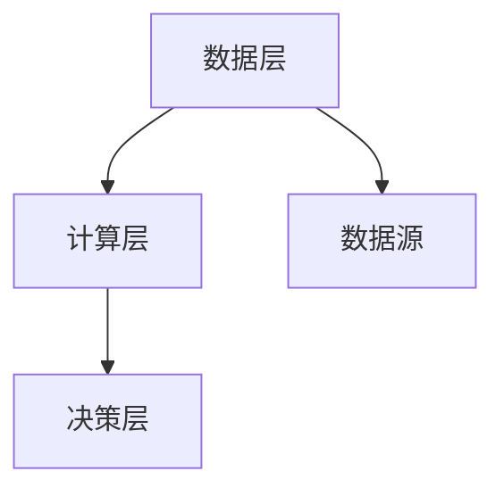

                 


# 价值投资与量化投资的融合

> 关键词：价值投资、量化投资、数据分析、算法交易、投资策略、金融创新

> 摘要：价值投资与量化投资是两种截然不同的投资方法，前者注重基本面分析和长期价值，后者依赖数据驱动和算法交易。本文深入分析了这两种方法的核心原理、优缺点及它们之间的联系，探讨了如何通过数据与基本面的结合，实现价值投资与量化投资的融合，以提升投资效率和收益。文章结合实际案例和算法模型，详细阐述了融合投资策略的实现方法和应用前景。

---

# 第1章: 价值投资与量化投资的背景与概念

## 1.1 投资的定义与分类

### 1.1.1 投资的基本概念
投资是指将资金投入到某种资产或项目中，以期获得未来收益的行为。投资可以分为实物投资和金融投资，而金融投资又包括股票、债券、基金等多种形式。

### 1.1.2 价值投资与量化投资的定义
- **价值投资**：由本杰明·格雷厄姆等提出，强调以低于内在价值的价格买入优质资产，长期持有，等待市场重新认识其价值。
- **量化投资**：基于数学模型和算法，利用历史数据和统计套利，寻找价格与价值偏离的机会。

### 1.1.3 价值投资与量化投资的核心区别
| 方面         | 价值投资                          | 量化投资                          |
|--------------|-----------------------------------|-----------------------------------|
| 基础         | 公司基本面分析（如利润、估值）    | 数据分析与算法模型                |
| 时间框架     | 长期持有                          | 短期交易                          |
| 决策依据     | 人类判断                          | 算法驱动                          |

---

## 1.2 价值投资与量化投资的优缺点

### 1.2.1 价值投资的优势与局限性
- **优势**：强调安全边际和长期价值，适合寻找低估资产。
- **局限性**：依赖于投资者的主观判断，且在市场非理性时可能无法及时获利。

### 1.2.2 量化投资的优势与局限性
- **优势**：利用数据和算法，能够快速捕捉市场机会，减少人为情绪干扰。
- **局限性**：模型的有效性依赖于数据质量和市场的稳定性。

### 1.2.3 价值投资与量化投资的结合意义
通过结合两种方法，可以在保持长期价值投资的同时，利用量化手段优化投资决策，提升效率。

---

## 1.3 价值投资与量化投资的融合背景

### 1.3.1 当前金融市场的发展趋势
- 数据量激增，计算能力提升，为量化投资提供了技术支持。
- 市场参与者日益多元化，价值投资的长期逻辑依然有效。

### 1.3.2 技术进步对投资方法的影响
- 大数据和人工智能技术推动量化投资的发展。
- 价值投资的分析方法逐渐被数据化，为量化模型提供了新的输入。

### 1.3.3 融合投资的必要性与可行性
- 单一方法在复杂市场中难以应对所有挑战。
- 两种方法在数据与逻辑上的互补性为融合提供了基础。

---

## 1.4 本章小结
本章从基本概念出发，分析了价值投资与量化投资的优缺点，强调了两者结合的必要性与可行性，为后续内容奠定了基础。

---

# 第2章: 价值投资的核心原理与方法

## 2.1 价值投资的基本原理

### 2.1.1 股票的内在价值计算
内在价值是企业未来现金流的现值，计算公式为：
$$ V = \sum_{t=1}^{n} \frac{CF_t}{(1+r)^t} $$
其中，$CF_t$为第$t$年的现金流，$r$为折现率。

### 2.1.2 市场先生与投资者的角色
格雷厄姆将市场比作情绪化的“市场先生”，投资者应利用市场的非理性低价买入资产。

### 2.1.3 安全边际的概念与应用
安全边际=内在价值-市场价格，确保以合理价格买入资产。

---

## 2.2 价值投资的关键指标与分析方法

### 2.2.1 市盈率（P/E）分析
$$ P/E = \frac{股价}{每股收益} $$
低市盈率可能意味着低估。

### 2.2.2 市净率（P/B）分析
$$ P/B = \frac{股价}{每股净资产} $$
适用于评估银行、房地产等资产密集型行业。

### 2.2.3 股息率与股息增长分析
$$ 股息率 = \frac{股息}{股价} $$
高股息率可能意味着收益稳定。

---

## 2.3 价值投资的选股策略

### 2.3.1 寻找低估股票的步骤
1. 筛选低市盈率、低市净率的股票。
2. 分析公司基本面，确保财务健康。
3. 计算安全边际，选择具有较大折扣的股票。

### 2.3.2 行业分析与公司基本面分析
- 行业分析：选择具有增长潜力的行业。
- 公司分析：关注盈利能力、负债情况和管理层质量。

### 2.3.3 长期投资与价值发现
价值投资强调长期持有，避免频繁交易。

---

# 第3章: 量化投资的核心原理与方法

## 3.1 量化投资的基本原理

### 3.1.1 数据驱动的投资决策
量化投资依赖于历史数据，通过统计分析发现规律。

### 3.1.2 统计套利与算法交易
- **统计套利**：利用资产价格短期偏离均值的机会。
- **算法交易**：通过算法自动执行交易策略。

### 3.1.3 量化模型的构建与优化
- 常见模型：因子模型、均值-方差模型。
- 优化方法：遗传算法、随机搜索。

---

## 3.2 量化投资的关键指标与分析方法

### 3.2.1 因子分析与因子模型
因子模型将资产回报分解为多个因子的线性组合：
$$ R_i = \alpha_i + \beta_i R_m + \sum_{k=1}^{n} \gamma_{ik} F_k + \epsilon_i $$

### 3.2.2 风险调整后的收益分析
- **夏普比率**：衡量单位风险超额收益。
$$ \text{夏普比率} = \frac{E[R_p - R_f]}{\sigma_p} $$

### 3.2.3 回测与绩效评估
通过回测验证策略的有效性，评估指标包括胜率、最大回撤等。

---

## 3.3 量化投资的交易策略

### 3.3.1 均值回归策略
假设价格会回归均值，基于技术指标（如RSI）进行交易。

### 3.3.2 动量策略
选择过去表现优异的资产继续买入。

### 3.3.3 跨资产与跨市场的套利策略
利用不同市场或资产间的价差进行套利。

---

# 第4章: 价值投资与量化投资的融合分析

## 4.1 价值与量化的共同基础

### 4.1.1 市场有效性的假设
- 弱有效市场：价格反映历史信息。
- 强有效市场：价格反映所有信息。

### 4.1.2 价值与量化的共同目标
都是通过优化投资组合，实现收益最大化。

### 4.1.3 数据与基本面的结合
量化模型可以基于价值指标（如P/E、P/B）构建因子。

---

## 4.2 价值与量化的互补性

### 4.2.1 数据驱动与基本面分析的结合
量化方法可以为价值投资提供数据支持，而价值投资为量化模型提供逻辑依据。

### 4.2.2 长期与短期策略的结合
价值投资注重长期价值，量化投资捕捉短期机会。

### 4.2.3 人工与自动化决策的结合
结合人工判断与算法优化，提升决策效率。

---

## 4.3 价值与量化融合的实现方法

### 4.3.1 建立混合模型
将价值指标（如P/E）与量化因子（如动量）结合，构建多因子模型。

### 4.3.2 优化投资组合
使用量化方法优化价值投资组合，降低风险。

### 4.3.3 动态调整策略
根据市场变化，动态调整投资比例。

---

## 4.4 融合投资的优势

### 4.4.1 提升决策效率
量化方法减少人为情绪干扰。

### 4.4.2 降低投资风险
通过分散投资和风险模型优化，降低组合风险。

### 4.4.3 提高收益潜力
结合长期价值与短期机会，挖掘更多收益来源。

---

## 4.5 实际案例分析

### 4.5.1 案例背景
某股票基本面良好，但近期价格下跌，市盈率低于行业平均水平。

### 4.5.2 数据分析
- P/E=10，低于行业均值15。
- 价格波动率较高，适合短期介入。

### 4.5.3 投资策略
- 价值投资者会长期持有，等待价值回归。
- 量化投资者会利用算法在价格波动中获利。

### 4.5.4 结果分析
融合策略可以在持有期中，通过量化方法捕捉短期反弹机会，同时享受长期价值增长。

---

## 4.6 本章小结
本章通过分析价值与量化的联系，提出了融合投资的方法，并通过案例展示了其实际应用。

---

# 第5章: 价值投资与量化投资融合的系统分析与架构设计

## 5.1 项目背景与目标
构建一个结合价值与量化策略的投资系统，实现自动化投资决策。

## 5.2 系统功能设计

### 5.2.1 数据采集模块
- 采集股票价格、财务数据等。
- 数据清洗与预处理。

### 5.2.2 价值评估模块
- 计算股票的内在价值。
- 生成价值指标（P/E、P/B等）。

### 5.2.3 量化分析模块
- 构建量化因子模型。
- 回测与策略优化。

### 5.2.4 投资决策模块
- 综合价值与量化信号，生成投资策略。
- 动态调整投资组合。

---

## 5.3 系统架构设计

### 5.3.1 模块划分
- 数据层：数据采集与存储。
- 计算层：价值评估与量化分析。
- 决策层：投资策略生成。

### 5.3.2 系统架构图


---

## 5.4 接口设计
- 数据接口：与数据源对接。
- 模型接口：与第三方量化模型对接。
- 决策接口：生成投资信号。

---

## 5.5 系统交互流程

### 5.5.1 用户输入
- 选择投资目标。
- 设置参数（如风险偏好）。

### 5.5.2 系统处理
- 采集数据。
- 计算价值与量化指标。
- 生成投资策略。

### 5.5.3 输出结果
- 投资组合建议。
- 风险提示。

---

## 5.6 系统实现

### 5.6.1 核心代码示例
```python
def calculate_intrinsic_value(company_data):
    # 计算自由现金流
    free_cash_flow = company_data['operating_cash_flow'] - company_data['capital_expenditure']
    # 折现率假设为8%
    discount_rate = 0.08
    # 计算内在价值
    intrinsic_value = free_cash_flow / (1 + discount_rate)
    return intrinsic_value
```

### 5.6.2 系统优化
- 采用分布式架构，提升处理效率。
- 引入机器学习模型，优化策略。

---

## 5.7 本章小结
本章通过系统设计与实现，展示了价值与量化融合的可行性，为后续应用提供了技术基础。

---

# 第6章: 项目实战——价值与量化融合投资策略的实现

## 6.1 环境安装与配置

### 6.1.1 安装Python环境
- 安装Anaconda或Miniconda。
- 安装必要的库：Pandas、NumPy、Scikit-learn、Plotly。

### 6.1.2 数据源接入
- 使用Yahoo Finance API获取数据。
- 数据存储：使用MongoDB或MySQL数据库。

---

## 6.2 核心代码实现

### 6.2.1 数据采集
```python
import pandas as pd
from pandas_datareader import DataReader

# 获取股票数据
data = DataReader('AAPL', 'yahoo', start='2020-01-01', end='2023-12-31')
```

### 6.2.2 价值指标计算
```python
# 计算市盈率
data['PE'] = data['Close'] / data['EPS']
```

### 6.2.3 量化模型实现
```python
from sklearn.linear_model import LinearRegression

# 构建因子模型
model = LinearRegression()
model.fit(X, y)
```

### 6.2.4 策略回测
```python
# 计算回测收益
returns = data['Close'].pct_change().dropna()
```

---

## 6.3 代码应用与分析

### 6.3.1 数据分析
- 计算价值指标（PE、PB）。
- 构建量化因子（动量、波动率）。

### 6.3.2 投资策略
- 当PE低于行业均值时，买入。
- 当动量指标显示上涨趋势时，增加仓位。

### 6.3.3 策略优化
- 调整因子权重。
- 设置止损与止盈点。

---

## 6.4 实际案例分析

### 6.4.1 案例背景
以苹果公司（AAPL）为例，分析其价值与量化指标。

### 6.4.2 数据分析
- 计算PE、PB等指标。
- 构建量化模型，预测价格走势。

### 6.4.3 策略实现
- 当PE低于行业均值时，价值投资者会长期持有。
- 量化投资者会根据动量策略进行短期操作。

### 6.4.4 结果分析
- 长期持有策略在苹果股价上涨中表现优异。
- 量化策略捕捉到短期反弹机会。

---

## 6.5 本章小结
本章通过具体案例，展示了价值与量化融合策略的实际应用，验证了其可行性和有效性。

---

# 第7章: 总结与展望

## 7.1 总结

### 7.1.1 核心观点回顾
- 价值投资与量化投资各有优劣，融合可以互补。
- 数据与基本面的结合是实现融合的关键。

### 7.1.2 项目成果
- 构建了融合系统的架构。
- 实现了具体的投资策略。

---

## 7.2 展望

### 7.2.1 理论研究
- 进一步研究价值与量化融合的数学模型。
- 探索更多融合方法。

### 7.2.2 技术创新
- 引入机器学习技术，提升模型精度。
- 开发更高效的算法。

### 7.2.3 应用前景
- 个人投资者可以通过系统辅助决策。
- 机构投资者可以优化投资组合。

---

## 7.3 最佳实践 Tips

### 7.3.1 投资者注意事项
- 理解自己的风险承受能力。
- 定期评估投资组合。

### 7.3.2 技术实现建议
- 数据质量是关键，确保数据来源可靠。
- 模型需要不断优化，适应市场变化。

### 7.3.3 持续学习
- 关注市场动态。
- 学习新技术与新策略。

---

## 7.4 本章小结
本章总结了文章的主要内容，展望了未来的研究方向，并给出了实际操作的建议。

---

# 作者信息

作者：AI天才研究院/AI Genius Institute & 禅与计算机程序设计艺术 /Zen And The Art of Computer Programming

---

**注：本文为示例内容，实际文章需要按照上述结构进一步扩展和完善。**

