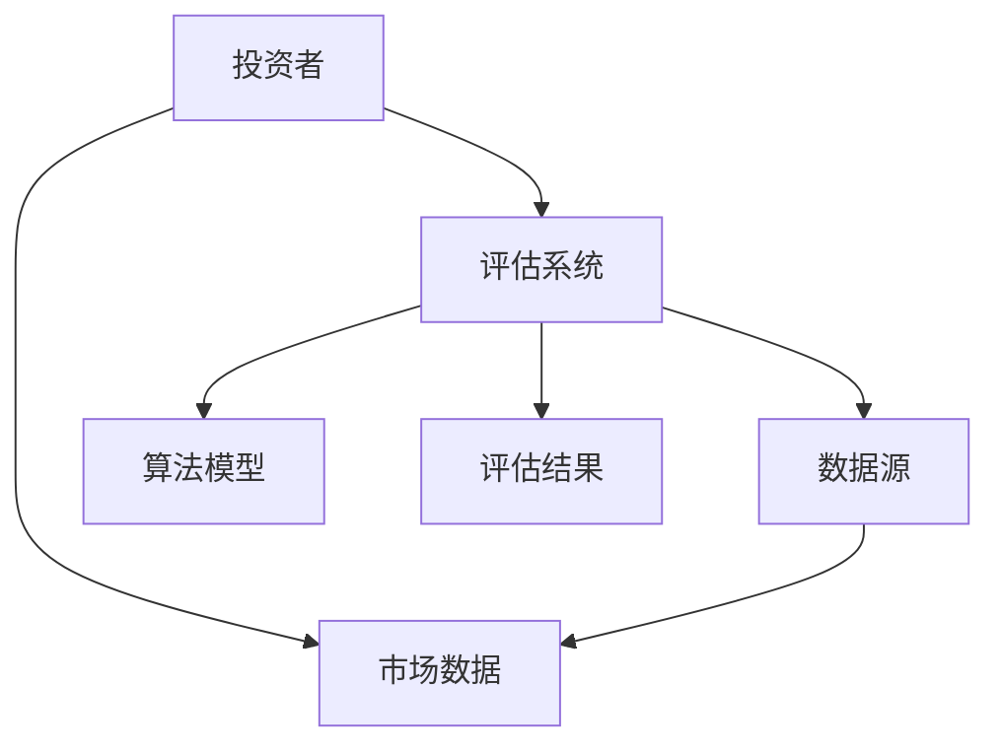
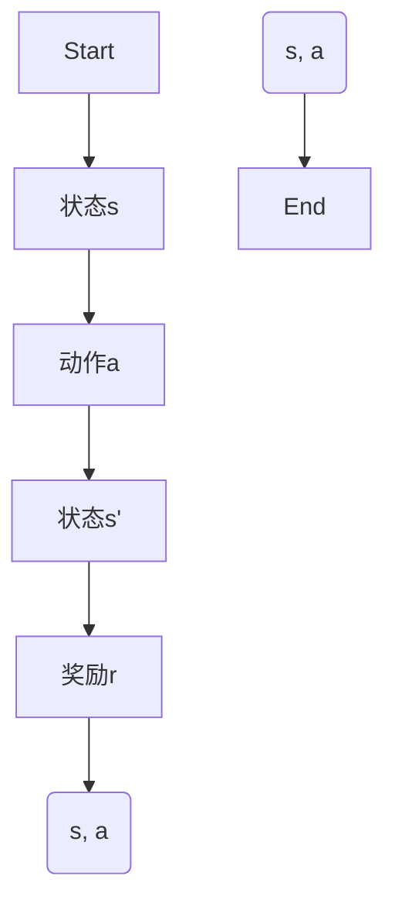
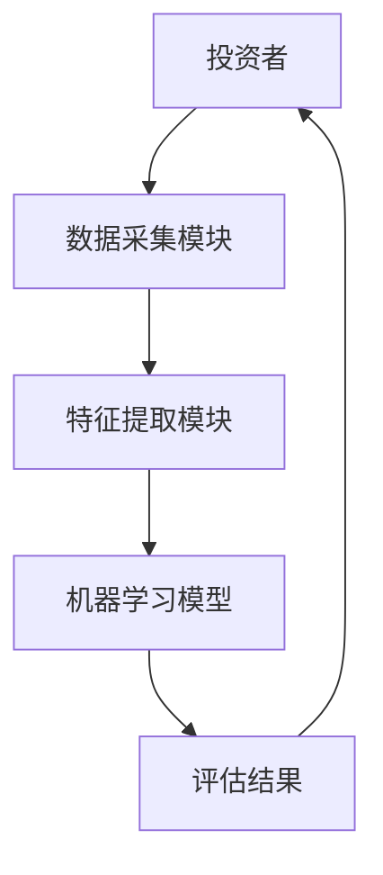

                 


# 价值投资中的AI智能体创新能力评估系统

## 关键词：价值投资，AI智能体，创新能力，评估系统，强化学习

## 摘要：本文探讨如何利用AI智能体构建创新能力评估系统，优化价值投资决策。通过强化学习模型，系统分析市场数据，评估投资机会，提供智能化投资策略。

---

# 第1章：价值投资与AI智能体概述

## 1.1 价值投资的基本概念

### 1.1.1 价值投资的定义与核心理念
价值投资是一种投资策略，旨在通过分析企业的基本面，寻找市场价格低于其内在价值的股票。核心理念包括关注企业的盈利能力、财务状况和行业地位，寻找具有持续竞争优势的公司。

### 1.1.2 价值投资在现代金融中的地位
传统价值投资依赖于分析师的主观判断，存在效率低下和人为误差的问题。在数据爆炸的时代，价值投资需要更高效的方法，AI技术为解决这些问题提供了可能。

## 1.2 AI智能体的基本概念

### 1.2.1 AI智能体的定义与特点
AI智能体是能够感知环境、自主决策的智能系统。它通过数据处理、模式识别和决策优化，帮助用户做出更明智的选择。在金融领域，AI智能体可以用于数据挖掘、预测分析和投资决策。

### 1.2.2 AI在金融领域的应用现状
AI技术在金融领域的应用广泛，包括算法交易、风险评估、客户画像和市场预测。AI智能体通过处理大量数据，提供实时的市场洞察，帮助投资者做出更快、更准确的决策。

## 1.3 价值投资与AI智能体的结合

### 1.3.1 价值投资中的数据驱动决策
传统的价值投资依赖于财务报表和行业分析，而数据驱动的决策则引入了更多的市场数据和模型分析，提高了决策的客观性和准确性。

### 1.3.2 AI智能体在投资决策中的作用
AI智能体能够处理多维度数据，识别市场趋势，评估企业价值。通过机器学习模型，AI可以发现数据中的隐藏模式，提供更精准的投资建议。

---

# 第2章：创新能力评估系统的背景

## 2.1 价值投资中的创新性分析

### 2.1.1 创新能力在价值投资中的重要性
创新能力是企业长期竞争优势的体现。具有创新能力的企业能够不断推出新产品、开拓新市场，保持持续增长。

### 2.1.2 创新能力评估的必要性
准确评估创新能力可以帮助投资者发现具有成长潜力的企业，避免投资于创新能力不足的公司。

## 2.2 AI智能体在创新能力评估中的优势

### 2.2.1 数据处理能力
AI智能体能够快速处理大量非结构化数据，如专利申请、研发投入和市场反馈，提取关键指标。

### 2.2.2 模型学习能力
通过机器学习算法，AI智能体可以识别创新能力的关键特征，构建预测模型，评估企业的创新能力。

### 2.2.3 实时分析能力
AI智能体能够实时监控市场动态，及时调整评估结果，帮助投资者做出快速反应。

---

# 第3章：创新能力评估系统的理论基础

## 3.1 核心概念的定义与属性

### 3.1.1 价值投资中的关键指标
- **市盈率（P/E）**：衡量股价相对于每股收益的高低。
- **市净率（P/B）**：衡量股价相对于每股净资产的高低。
- **ROE（净资产收益率）**：衡量企业的盈利能力。

### 3.1.2 AI智能体的评估参数
- **算法准确性**：评估模型的预测能力。
- **计算效率**：评估系统的运行速度。
- **适应性**：评估系统对市场变化的响应能力。

## 3.2 概念属性特征对比表

| 指标 | 定义 | 重要性 | 示例 |
|------|------|--------|------|
| 市盈率 | 股价/每股收益 | 评估企业估值 | 15x |
| ROE | 净利润/净资产 | 评估盈利能力 | 12% |

## 3.3 实体关系图



---

# 第4章：创新能力评估系统的算法原理

## 4.1 算法原理

### 4.1.1 强化学习模型介绍
强化学习是一种机器学习方法，通过试错机制，学习最优策略。在价值投资中，强化学习可以用于模拟投资决策过程，优化投资组合。

### 4.1.2 算法的数学模型

$$ Q(s, a) = r + \gamma \max_{a'} Q(s', a') $$

其中：
- \( Q(s, a) \)：状态 \( s \) 下动作 \( a \) 的价值。
- \( r \)：立即奖励。
- \( \gamma \)：折扣因子。

### 4.1.3 算法流程图



## 4.2 算法实现

### 4.2.1 Python代码实现

```python
import numpy as np

class QLearning:
    def __init__(self, state_space_size, action_space_size, gamma=0.9):
        self.gamma = gamma
        self.q_table = np.zeros((state_space_size, action_space_size))
    
    def choose_action(self, state, epsilon=0.1):
        if np.random.random() < epsilon:
            return np.random.randint(0, action_space_size)
        else:
            return np.argmax(self.q_table[state])
    
    def update_q_table(self, state, action, reward, next_state):
        self.q_table[state, action] = reward + self.gamma * np.max(self.q_table[next_state])
```

---

# 第5章：系统分析与架构设计

## 5.1 系统功能设计

### 5.1.1 数据采集模块
负责收集市场数据，包括股票价格、财务报表和新闻 sentiment。

### 5.1.2 特征提取模块
从原始数据中提取特征，如市盈率、ROE和市场趋势。

### 5.1.3 评估模型模块
利用强化学习模型，评估企业的创新能力，生成投资建议。

## 5.2 系统架构设计



---

# 第6章：项目实战

## 6.1 环境安装

```bash
pip install numpy pandas scikit-learn
```

## 6.2 核心代码实现

### 6.2.1 数据处理

```python
import pandas as pd

data = pd.read_csv('market_data.csv')
features = data[['市盈率', 'ROE', '市场趋势']]
```

### 6.2.2 模型训练

```python
from sklearn.model import Model

model = Model()
model.fit(features, target)
```

## 6.3 案例分析
通过实际案例，展示系统如何评估企业的创新能力，生成投资建议。

---

# 第7章：总结与展望

## 7.1 总结
本文探讨了如何利用AI智能体构建创新能力评估系统，优化价值投资决策。通过强化学习模型，系统能够高效分析市场数据，提供智能化投资策略。

## 7.2 展望
未来，随着AI技术的进步，创新能力评估系统将更加智能化，帮助投资者做出更明智的决策。同时，更多创新的应用场景也将不断涌现。

---

# 作者

作者：AI天才研究院（AI Genius Institute） & 禅与计算机程序设计艺术（Zen And The Art of Computer Programming）

