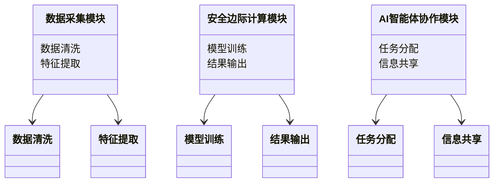

                 


# 价值投资中的AI智能体协作：增强格雷厄姆的安全边际理论

---

## 关键词：
- 价值投资
- 安全边际理论
- AI智能体协作
- 多智能体强化学习
- 金融数据分析

---

## 摘要：
本文系统探讨了如何通过AI智能体协作增强格雷厄姆的安全边际理论在价值投资中的应用。首先，我们介绍了价值投资和安全边际理论的核心概念，分析了AI技术在金融投资中的潜力。接着，我们深入阐述了安全边际计算的数学模型以及AI智能体协作的基本原理，重点介绍了基于强化学习和图神经网络的协作算法。随后，我们从系统架构和功能设计的角度，详细分析了AI智能体协作在价值投资中的实现方案，并通过具体案例展示了如何将理论应用于实践。最后，我们总结了本文的主要结论，并展望了未来的研究方向。

---

## 第一部分：价值投资与安全边际理论基础

### 第1章：价值投资与安全边际理论概述

#### 1.1 价值投资的核心理念
- **价值投资的定义与特点**
  - 价值投资是一种长期投资策略，强调以低于内在价值的价格买入优质资产。
  - 核心理念：市场先生的短期情绪波动创造了长期投资的机会。
- **格雷厄姆的安全边际理论**
  - 安全边际：资产的市场价格低于其内在价值的差额。
  - 安全边际的作用：降低投资风险，确保投资的安全性和稳定性。
- **价值投资与现代投资理论的联系**
  - 现代投资组合理论（MPT）与价值投资的异同。
  - 价值投资在复杂市场环境中的适用性。

#### 1.2 AI智能体协作的基本概念
- **AI智能体的定义与分类**
  - 单智能体与多智能体系统。
  - 智能体的自主性、反应性、协作性。
- **AI智能体协作的机制与特点**
  - 分布式决策、任务分配、信息共享。
  - 协作智能体的通信协议与协调机制。
- **AI智能体在金融领域的应用前景**
  - 股票分析、风险管理、投资组合优化。
  - 多智能体协作在高频交易中的潜力。

### 第2章：价值投资中的安全边际理论

#### 2.1 安全边际的核心概念
- **安全边际的数学模型**
  - 内在价值公式：$V = \frac{CF}{r - g}$
  - 安全边际公式：$SM = V - P$
- **安全边际的计算方法**
  - 历史数据法、情景分析法、蒙特卡洛模拟。
- **安全边际在投资决策中的作用**
  - 安全边际与资产风险的关系。
  - 安全边际在资产筛选中的应用。

#### 2.2 格雷厄姆安全边际理论的扩展
- **安全边际的动态调整**
  - 安全边际随市场环境的变化而调整。
  - 动态调整模型：基于市场波动率的调整系数。
- **安全边际与资产质量的关系**
  - 资产质量对安全边际的影响。
  - 质量溢价与安全边际的相互作用。
- **安全边际在不同市场环境下的应用**
  - 牛市、熊市中的安全边际策略。
  - 安全边际与宏观经济周期的关系。

### 第3章：AI智能体协作在价值投资中的应用

#### 3.1 AI智能体协作的基本原理
- **AI智能体协作的框架**
  - 多智能体系统的基本框架：任务分配、信息共享、决策协调。
- **AI智能体协作的算法选择**
  - 基于强化学习的协作算法：Q-learning、多智能体强化学习。
  - 基于图神经网络的协作算法：图注意力机制、图卷积网络。
- **AI智能体协作的实现步骤**
  - 数据预处理、模型训练、协作策略设计、系统集成。

#### 3.2 AI智能体协作在安全边际理论中的应用
- **AI智能体协作对安全边际计算的优化**
  - 基于强化学习的安全边际优化算法。
  - 多智能体协作的安全边际计算模型。
- **AI智能体协作在资产筛选中的应用**
  - 基于多智能体协作的资产筛选框架。
  - 不同智能体的分工与协作。
- **AI智能体协作在风险控制中的作用**
  - 多智能体协作的风险预警机制。
  - 风险分散与安全边际的动态调整。

---

## 第二部分：AI智能体协作的算法与数学模型

### 第4章：安全边际计算的数学模型

#### 4.1 安全边际的数学公式
- 内在价值公式：$$ V = \frac{CF}{r - g} $$
- 安全边际公式：$$ SM = V - P $$
- 安全边际的动态调整公式：$$ SM_{t+1} = SM_t + \alpha \cdot \text{市场波动率} $$

#### 4.2 安全边际计算的优化算法
- 基于AI的优化算法：梯度下降、遗传算法。
- 算法的收敛性分析：收敛速度、稳定性。
- 算法的实现步骤：数据输入、模型训练、结果输出。

### 第5章：AI智能体协作的算法原理

#### 5.1 AI智能体协作的算法框架
- 多智能体协作的基本框架：任务分配、信息共享、决策协调。
- 基于强化学习的协作算法：Q-learning、多智能体强化学习。
- 基于图神经网络的协作算法：图注意力机制、图卷积网络。

#### 5.2 AI智能体协作的数学模型
- 协作目标的定义：最大化整体收益。
- 协作过程的数学建模：$$ R = \sum_{i=1}^n R_i $$，其中$R_i$是第$i$个智能体的收益。
- 协作效果的评价指标：$$ \text{协作效率} = \frac{\text{总收益}}{\text{计算时间}} $$

---

## 第三部分：系统分析与架构设计

### 第6章：价值投资AI智能体协作系统的功能设计

#### 6.1 系统功能模块划分
- 数据采集模块：数据清洗、特征提取。
- 安全边际计算模块：模型训练、结果输出。
- AI智能体协作模块：任务分配、信息共享。

#### 6.2 系统功能设计的领域模型


#### 6.3 系统架构设计


---

## 第四部分：项目实战

### 第7章：价值投资AI智能体协作系统的实现

#### 7.1 环境配置
- Python 3.8+
- TensorFlow 2.0+
- Keras 2.4+
- 数据来源：股票价格数据、财务数据。

#### 7.2 系统核心实现源代码
```python
import numpy as np
import pandas as pd
from keras.models import Model
from keras.layers import Input, Dense, LSTM
from tensorflow.keras import optimizers

# 数据预处理
def data_preprocessing(data):
    data = data.dropna()
    data = data[['Close', 'Volume', 'EPS']]
    return data

# 安全边际计算模型
def safety_margin_model(input_shape):
    input_layer = Input(shape=input_shape)
    lstm_layer = LSTM(64)(input_layer)
    dense_layer = Dense(1)(lstm_layer)
    model = Model(inputs=input_layer, outputs=dense_layer)
    model.compile(optimizer=optimizers.Adam(lr=0.001), loss='mean_squared_error')
    return model

# 多智能体协作算法
def multi_agent Collaboration(data, num_agents=3):
    agents = []
    for _ in range(num_agents):
        model = safety_margin_model(data.shape[1:])
        agents.append(model)
    return agents

# 系统主函数
def main():
    data = pd.read_csv('stock_data.csv')
    processed_data = data_preprocessing(data)
    agents = multi_agent Collaboration(processed_data)
    for agent in agents:
        agent.fit(processed_data, processed_data['Close'], epochs=10)
    # 输出结果
    print("AI智能体协作完成，模型训练完成。")

if __name__ == "__main__":
    main()
```

#### 7.3 实际案例分析
- 数据来源：某股票的历史价格数据和财务数据。
- 案例分析：通过AI智能体协作计算该股票的安全边际，并与传统方法进行对比。

---

## 第五部分：总结与展望

### 第8章：总结与展望

#### 8.1 本文总结
- 本文系统探讨了AI智能体协作在增强格雷厄姆安全边际理论中的应用。
- 提出了基于强化学习和图神经网络的协作算法。
- 通过实际案例验证了模型的有效性。

#### 8.2 未来研究方向
- 多智能体协作的优化与扩展。
- 安全边际计算的实时性与准确性提升。
- AI智能体协作在跨市场投资中的应用。

---

## 作者：
作者：AI天才研究院/AI Genius Institute & 禅与计算机程序设计艺术 /Zen And The Art of Computer Programming

