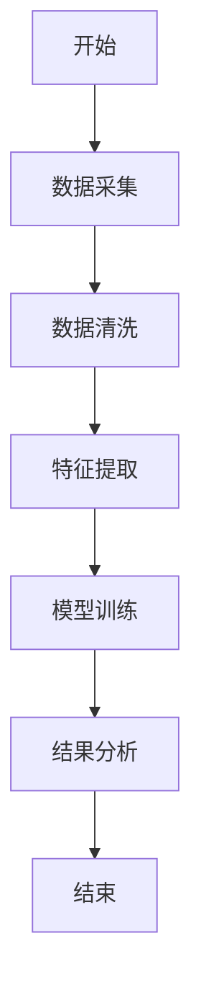
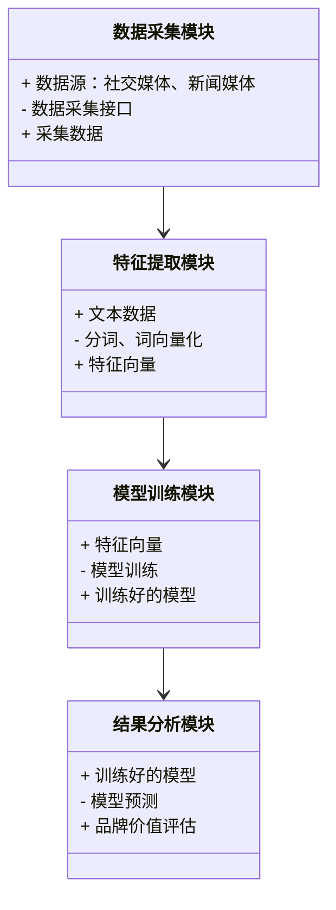
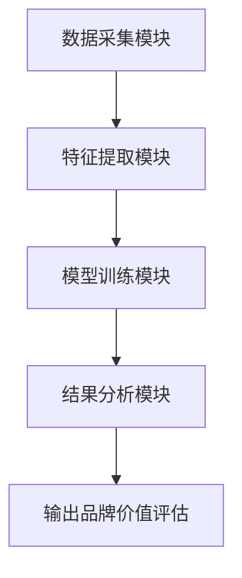
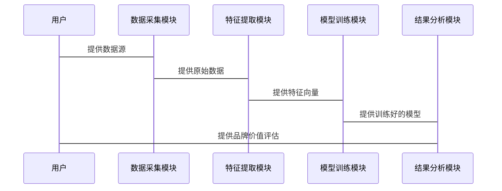

                 


# 价值投资中的AI智能体品牌权益分析系统

> **关键词**: 价值投资, AI智能体, 品牌权益, 数据分析, 机器学习, 系统架构

> **摘要**: 本文探讨了在价值投资中利用AI智能体进行品牌权益分析的系统设计与实现。通过分析品牌权益的核心概念、算法原理、系统架构以及项目实战，本文为投资者提供了一种基于数据驱动的智能化品牌权益分析方法，帮助投资者做出更明智的投资决策。

---

# 第1章: 价值投资与AI智能体的结合

## 1.1 价值投资的基本原理

### 1.1.1 价值投资的核心概念
价值投资是一种以基本面分析为基础的投资策略，旨在通过分析企业的财务状况、市场地位和未来前景，找到被市场低估的投资标的。其核心理念是“买入并持有”，相信市场的短期波动不会影响企业的长期价值。

### 1.1.2 价值投资的哲学基础
价值投资的哲学基础来源于格雷厄姆和多德的价值投资理论，强调安全边际和内在价值。投资者应关注企业的内在价值，而非市场的短期波动。

### 1.1.3 价值投资在现代金融中的应用
随着金融市场的发展，传统的价值投资方法逐渐融入现代金融工具和技术。AI技术的出现，为价值投资提供了新的可能性，尤其是在品牌权益分析方面。

---

## 1.2 AI技术在金融领域的应用现状

### 1.2.1 AI在金融分析中的应用
AI技术在金融领域的应用主要体现在金融数据分析、风险评估、投资组合优化等方面。AI能够通过大数据分析发现传统方法难以察觉的模式和趋势。

### 1.2.2 AI在投资决策中的优势
AI的优势在于其强大的数据处理能力和算法优化能力。通过机器学习模型，AI能够快速分析海量数据，发现潜在的投资机会。

### 1.2.3 AI在品牌权益分析中的潜力
品牌权益是企业价值的重要组成部分。通过AI技术，可以量化品牌的价值，分析品牌在市场中的竞争力，从而为投资者提供更精准的决策依据。

---

## 1.3 品牌权益分析的重要性

### 1.3.1 品牌权益的定义与构成
品牌权益是指品牌在市场中所具有的价值，包括品牌知名度、品牌忠诚度、品牌认知度等。品牌权益是企业价值的重要组成部分，直接影响企业的市场表现。

### 1.3.2 品牌权益在价值投资中的作用
在价值投资中，品牌权益分析能够帮助投资者评估企业的长期价值。一个具有强大品牌影响力的公司，往往具有更强的市场竞争力和更高的抗风险能力。

### 1.3.3 数据驱动的品牌权益分析方法
通过数据驱动的方法，可以量化品牌权益的各个维度，利用机器学习模型预测品牌价值的变化趋势。

---

## 1.4 本章小结

本章介绍了价值投资的基本原理、AI技术在金融领域的应用现状，以及品牌权益分析的重要性。通过这些内容，我们可以看到，AI技术为价值投资中的品牌权益分析提供了新的可能性。

---

# 第2章: AI智能体与品牌权益分析的关系

## 2.1 AI智能体的基本概念

### 2.1.1 AI智能体的定义
AI智能体是指具有自主决策能力和智能行为的计算机系统。它能够通过感知环境、分析数据、做出决策，并通过执行动作与环境交互。

### 2.1.2 AI智能体的核心特征
AI智能体的核心特征包括自主性、反应性、目标导向性和社会性。这些特征使其能够适应复杂多变的环境，并做出最优决策。

### 2.1.3 AI智能体与传统数据分析的区别
与传统数据分析相比，AI智能体具有更强的自主性和适应性。它能够实时感知环境变化，并动态调整分析策略。

---

## 2.2 品牌权益分析的数学模型

### 2.2.1 品牌权益的量化指标
品牌权益的量化指标包括品牌价值、品牌忠诚度、品牌知名度等。这些指标可以通过市场调研、消费者行为分析等方式获取。

### 2.2.2 品牌权益分析的数学公式
品牌权益的价值可以通过以下公式进行量化：
$$ \text{品牌价值} = \text{品牌知名度} \times \text{品牌忠诚度} \times \text{品牌认知度} $$

### 2.2.3 品牌权益分析的流程图
以下是品牌权益分析的流程图：


---

## 2.3 数据驱动的品牌权益分析系统

### 2.3.1 数据采集与处理
数据采集是品牌权益分析的第一步。需要从多种渠道获取数据，包括社交媒体、新闻媒体、消费者调研等。

### 2.3.2 数据特征提取
通过自然语言处理技术，可以提取文本数据中的关键词和情感倾向，从而量化品牌的情感价值。

### 2.3.3 数据分析与建模
利用机器学习算法，对数据进行建模分析。常用的算法包括线性回归、支持向量机、随机森林等。

---

## 2.4 本章小结

本章介绍了AI智能体的基本概念、品牌权益分析的数学模型，以及数据驱动的品牌权益分析系统。通过这些内容，我们可以看到，AI技术在品牌权益分析中具有重要的应用价值。

---

# 第3章: 基于AI的文本分析算法

## 3.1 文本预处理与特征提取

### 3.1.1 文本清洗与标准化
文本清洗是去除噪声数据，例如停用词、标点符号等。标准化则是将文本转换为统一的格式，便于后续处理。

### 3.1.2 分词与词向量化
通过分词技术将文本分割为单词或短语，并将其转换为向量表示。常用的方法包括TF-IDF、Word2Vec等。

### 3.1.3 语义分析与主题建模
语义分析旨在理解文本的语义含义。主题建模则是通过聚类技术，将文本分成若干主题。

---

## 3.2 基于LSTM的文本分析模型

### 3.2.1 LSTM网络的基本原理
LSTM（长短期记忆网络）是一种特殊的RNN（循环神经网络），能够有效处理序列数据中的长距离依赖关系。

### 3.2.2 LSTM在文本分析中的应用
LSTM可以用于文本分类、情感分析、语义理解等任务。在品牌权益分析中，可以用于分析消费者评论的情感倾向。

### 3.2.3 LSTM模型的实现代码
以下是LSTM模型的实现代码：
```python
import tensorflow as tf
from tensorflow.keras.layers import LSTM, Dense, Dropout
from tensorflow.keras.models import Sequential

model = Sequential()
model.add(LSTM(128, input_shape=(None, 1)))
model.add(Dropout(0.5))
model.add(Dense(1, activation='sigmoid'))
model.compile(loss='binary_crossentropy', optimizer='adam', metrics=['accuracy'])
```

---

## 3.3 基于注意力机制的文本分析模型

### 3.3.1 注意力机制的基本原理
注意力机制是一种用于序列数据处理的机制，能够捕捉序列中的关键信息。在文本分析中，注意力机制可以用于情感分析、机器翻译等任务。

### 3.3.2 注意力机制在品牌权益分析中的应用
通过注意力机制，可以识别文本中的重要关键词，从而更精准地分析品牌的情感价值。

### 3.3.3 注意力机制的实现代码
以下是注意力机制的实现代码：
```python
import tensorflow as tf
from tensorflow.keras.layers import Dense, MultiHeadAttention

head_size = 128
num_heads = 8

attention_layer = MultiHeadAttention(head_size, num_heads)
```

---

## 3.4 本章小结

本章介绍了基于AI的文本分析算法，包括文本预处理、LSTM网络和注意力机制的实现。通过这些算法，可以更精准地分析品牌的情感价值。

---

# 第4章: 品牌权益分析系统的架构设计

## 4.1 问题场景介绍

### 4.1.1 系统目标
品牌权益分析系统的目标是通过AI技术，量化品牌的价值，帮助投资者做出更明智的投资决策。

### 4.1.2 系统输入与输出
系统输入包括品牌相关的文本数据、市场数据等；输出包括品牌价值评估、品牌风险预警等。

---

## 4.2 系统功能设计

### 4.2.1 系统功能模块
品牌权益分析系统主要包括数据采集模块、特征提取模块、模型训练模块和结果分析模块。

### 4.2.2 系统功能模块的类图
以下是系统功能模块的类图：


---

## 4.3 系统架构设计

### 4.3.1 系统架构图
以下是系统架构图：


### 4.3.2 系统接口设计
系统接口包括数据采集接口、特征提取接口、模型训练接口和结果分析接口。

### 4.3.3 系统交互流程
以下是系统交互流程：


---

## 4.4 本章小结

本章介绍了品牌权益分析系统的架构设计，包括功能模块、系统架构图和系统交互流程。通过这些设计，我们可以清晰地看到系统的整体结构和各模块之间的关系。

---

# 第5章: 项目实战

## 5.1 环境配置

### 5.1.1 系统要求
需要安装Python 3.7及以上版本，安装TensorFlow、Keras、NLTK等库。

### 5.1.2 环境搭建步骤
1. 安装Python
2. 安装必要的库：`pip install tensorflow keras numpy nltk`
3. 下载相关数据集

---

## 5.2 系统核心实现源代码

### 5.2.1 数据采集模块
```python
import requests
from bs4 import BeautifulSoup

def scrape_data(url):
    response = requests.get(url)
    soup = BeautifulSoup(response.text, 'html.parser')
    return soup.text
```

### 5.2.2 特征提取模块
```python
from nltk.tokenize import word_tokenize
from sklearn.feature_extraction.text import TfidfVectorizer

def extract_features(text):
    vectorizer = TfidfVectorizer()
    feature_vectors = vectorizer.fit_transform([text])
    return feature_vectors
```

### 5.2.3 模型训练模块
```python
from tensorflow.keras.models import Sequential
from tensorflow.keras.layers import LSTM, Dense, Dropout

def build_model(input_shape):
    model = Sequential()
    model.add(LSTM(128, input_shape=input_shape))
    model.add(Dropout(0.5))
    model.add(Dense(1, activation='sigmoid'))
    model.compile(loss='binary_crossentropy', optimizer='adam', metrics=['accuracy'])
    return model
```

### 5.2.4 结果分析模块
```python
import numpy as np

def analyze_brand(brand_name):
    # 加载预训练模型
    model = build_model((None, 1))
    # 数据预处理
    text = preprocess_data(brand_name)
    # 模型预测
    prediction = model.predict(text)
    return prediction
```

---

## 5.3 代码应用解读与分析

### 5.3.1 数据采集模块
数据采集模块负责从指定URL获取文本数据。使用BeautifulSoup进行网页抓取，返回原始文本数据。

### 5.3.2 特征提取模块
特征提取模块使用TF-IDF方法，将文本数据转换为特征向量。这些特征向量将作为模型的输入。

### 5.3.3 模型训练模块
模型训练模块使用LSTM网络进行训练。通过Dropout层防止过拟合，最终输出一个二分类结果。

### 5.3.4 结果分析模块
结果分析模块负责加载预训练模型，对目标品牌进行分析，并返回预测结果。

---

## 5.4 实际案例分析

### 5.4.1 案例背景
假设我们要分析某品牌的情感价值，可以通过上述模块进行分析。

### 5.4.2 案例分析过程
1. 数据采集模块获取目标品牌的评论数据
2. 特征提取模块提取评论中的关键词和情感倾向
3. 模型训练模块训练LSTM模型
4. 结果分析模块对目标品牌进行预测，得出品牌价值评估

---

## 5.5 本章小结

本章通过项目实战，详细讲解了品牌权益分析系统的实现过程。通过实际案例分析，展示了系统在实际应用中的效果。

---

# 第6章: 总结与展望

## 6.1 系统的优势

### 6.1.1 系统的准确性
通过AI技术，系统能够更精准地分析品牌的情感价值，帮助投资者做出更明智的决策。

### 6.1.2 系统的可扩展性
系统的架构设计具有良好的可扩展性，可以轻松添加新的功能模块。

---

## 6.2 系统的改进方向

### 6.2.1 算法优化
未来可以尝试引入更先进的算法，例如Transformer模型，进一步提高系统的分析精度。

### 6.2.2 数据来源扩展
可以尝试引入更多的数据源，例如消费者行为数据、市场调研数据等，进一步丰富系统的分析维度。

---

## 6.3 对投资者的建议

### 6.3.1 结合市场趋势
投资者在使用系统进行品牌权益分析时，应结合市场趋势和行业动态，做出更全面的判断。

### 6.3.2 定期更新模型
模型的性能会随着时间推移而下降，建议定期更新模型，保持系统的准确性。

---

## 6.4 未来研究方向

### 6.4.1 多模态数据分析
未来可以研究多模态数据分析方法，将文本、图像等多种数据类型结合起来，提高系统的分析能力。

### 6.4.2 实时分析
未来可以研究实时分析技术，实现对品牌情感变化的实时监控。

---

## 6.5 本章小结

本章总结了品牌权益分析系统的优点和改进方向，提出了对未来研究方向的展望。通过不断优化系统，可以为投资者提供更精准的品牌权益分析服务。

---

# 作者：AI天才研究院（AI Genius Institute） & 禅与计算机程序设计艺术（Zen And The Art of Computer Programming）

---

**注意事项**：
1. 本文为技术博客文章，内容仅供参考，不构成投资建议。
2. 读者在实际应用中，需结合具体市场情况和专业投资知识进行决策。
3. 本文中的代码示例为简化版，实际应用中需根据具体情况调整和优化。

**最佳实践 Tips**：
- 在实际项目中，建议结合多种数据源和分析方法，提高系统的鲁棒性。
- 定期监控模型性能，及时更新和优化模型。
- 建议投资者在使用AI系统辅助决策时，保持对市场的敏感性和对风险的警惕性。

