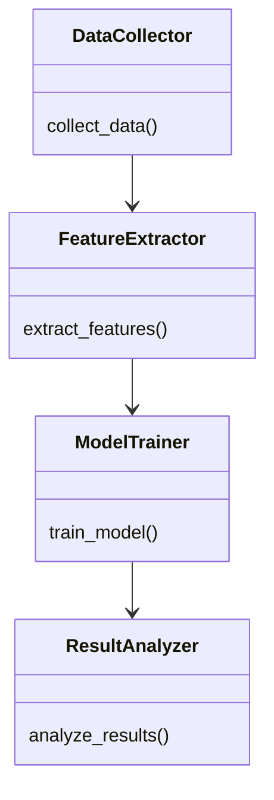
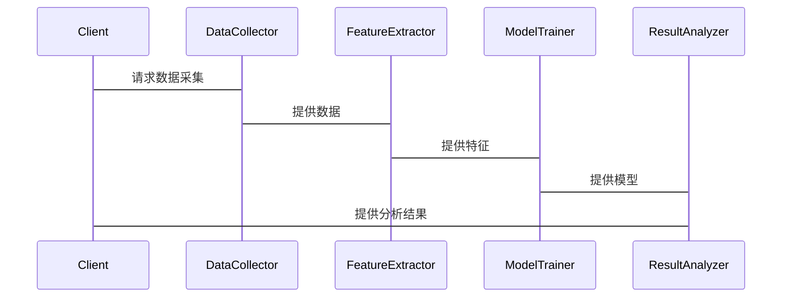

                 


# 价值投资中的AI智能体管理层薪酬结构分析系统

## 关键词：价值投资、AI智能体、管理层薪酬、数据分析、投资策略

## 摘要：  
本文探讨了如何利用人工智能技术构建智能分析系统，以评估和分析企业高管的薪酬结构，帮助投资者做出更明智的投资决策。通过结合价值投资的理念和AI技术，本文提出了一套基于AI智能体的管理层薪酬结构分析系统，从数据采集、特征提取、模型构建到结果分析，详细阐述了系统的实现过程。文章还探讨了该系统在实际投资中的应用价值和潜在挑战，为投资者提供了新的思路和工具。

---

# 第一章: 价值投资与AI智能体的结合

## 1.1 价值投资的基本概念

### 1.1.1 价值投资的定义  
价值投资是一种投资策略，强调以低于资产公允价值的价格购买优质资产，长期持有，等待其价值回归。这种方法的核心在于识别市场中的估值偏差，寻找被低估的企业和股票。

### 1.1.2 价值投资的核心理念  
- **安全边际**：买入价格低于内在价值，以降低投资风险。  
- **长期视角**：关注企业的长期盈利能力，而非短期市场波动。  
- **基本面分析**：通过对企业财务报表、管理层能力、行业地位等多方面分析，评估其内在价值。

### 1.1.3 价值投资在现代金融中的地位  
价值投资在金融领域具有重要地位，尤其是在市场波动加剧、信息不对称的情况下，其强调的深度基本面分析和长期持有策略为投资者提供了可靠的决策依据。

---

## 1.2 AI智能体在金融领域的应用

### 1.2.1 AI智能体的基本概念  
AI智能体是一种能够感知环境、自主决策并执行任务的智能系统。在金融领域，AI智能体可以用于数据挖掘、模式识别、预测分析等任务。

### 1.2.2 AI智能体在金融分析中的优势  
- **高效性**：AI智能体能够快速处理大量数据，发现人类难以察觉的模式。  
- **准确性**：通过机器学习算法，AI智能体能够提高分析结果的准确性。  
- **适应性**：AI智能体能够根据市场变化动态调整分析策略。

### 1.2.3 AI智能体与价值投资的结合  
AI智能体可以辅助投资者进行深度基本面分析，识别被低估的企业，优化投资组合，提升投资效率。

---

## 1.3 管理层薪酬结构分析的重要性

### 1.3.1 管理层薪酬结构的定义  
管理层薪酬结构指企业高管（如CEO、 CFO等）的薪酬组成，包括基本工资、奖金、股票期权、福利等。

### 1.3.2 管理层薪酬结构对价值投资的影响  
- **激励机制**：合理的薪酬结构能够激励高管追求长期价值创造。  
- **风险控制**：过度依赖短期绩效的薪酬结构可能导致高管短期行为，增加投资风险。  
- **企业治理**：通过分析薪酬结构，投资者可以评估企业治理的健康性。

### 1.3.3 管理层薪酬结构分析的挑战  
- **数据获取**：高管薪酬数据往往不公开，获取难度大。  
- **复杂性**：薪酬结构涉及多个因素，分析难度较高。  
- **动态变化**：薪酬结构会随市场环境和企业战略变化而调整。

---

## 1.4 本章小结  
本章介绍了价值投资的核心理念和AI智能体的基本概念，分析了管理层薪酬结构在价值投资中的重要性及其实现的挑战，为后续分析奠定了基础。

---

# 第二章: 管理层薪酬结构分析的核心概念

## 2.1 核心概念与定义

### 2.1.1 管理层薪酬的构成要素  
- **基本工资**：固定部分，与职位相关。  
- **奖金**：根据绩效发放的浮动部分。  
- **股票期权**：长期激励工具，与企业股价挂钩。  
- **福利**：包括保险、退休金等。

### 2.1.2 管理层薪酬结构的分类  
- **固定薪酬**：主要由基本工资构成，风险较低。  
- **浮动薪酬**：主要由奖金构成，与绩效挂钩。  
- **混合薪酬**：固定与浮动结合，兼顾稳定性和激励性。  
- **股权激励**：通过股票期权等方式激励高管长期关注企业价值。

### 2.1.3 管理层薪酬结构与企业绩效的关系  
- **正相关性**：合理的薪酬结构能够激励高管创造更多价值。  
- **负相关性**：过度激励可能导致高管短期行为，损害企业长期利益。

---

## 2.2 核心概念之间的联系

### 2.2.1 管理层薪酬结构与企业战略的关系  
- **战略一致性**：薪酬结构应与企业战略目标一致，激励高管关注长期发展。  
- **战略调整**：企业战略变化时，薪酬结构需要相应调整。

### 2.2.2 管理层薪酬结构与员工激励的关系  
- **内部公平性**：薪酬结构应体现内部公平，避免员工不满。  
- **外部竞争力**：薪酬水平应与市场水平相当，吸引和留住人才。

### 2.2.3 管理层薪酬结构与股东利益的关系  
- **股东价值**：合理的薪酬结构能够促进股东价值最大化。  
- **代理问题**：高管与股东利益不一致时，可能导致代理成本增加。

---

## 2.3 管理层薪酬结构分析的边界与外延

### 2.3.1 分析的边界  
- **高管范围**：通常指CEO、CFO等核心高管。  
- **时间范围**：通常关注过去3-5年的薪酬数据。  
- **行业限制**：不同行业的薪酬结构可能差异较大。

### 2.3.2 分析的外延  
- **员工薪酬分析**：虽然本文主要关注高管，但类似方法也可用于其他员工。  
- **企业整体激励机制**：薪酬结构分析可扩展至企业整体激励机制的评估。

### 2.3.3 分析的局限性  
- **数据不足**：高管薪酬数据往往不公开，分析难度大。  
- **复杂性**：薪酬结构涉及多个因素，分析难度较高。  
- **动态变化**：薪酬结构会随市场环境和企业战略变化而调整。

---

## 2.4 本章小结  
本章详细阐述了管理层薪酬结构的核心概念及其与企业绩效、战略和股东利益的关系，分析了其在价值投资中的重要性。

---

# 第三章: AI智能体在管理层薪酬结构分析中的应用

## 3.1 AI智能体的基本原理

### 3.1.1 人工智能的基本概念  
人工智能（AI）是模拟人类智能的计算机系统，能够执行学习、推理、感知和决策等任务。

### 3.1.2 智能体的基本概念  
智能体是一种能够感知环境、自主决策并执行任务的实体，能够根据环境反馈调整行为。

### 3.1.3 AI智能体在金融分析中的应用  
- **数据挖掘**：从大量数据中提取有用信息。  
- **模式识别**：识别数据中的模式和趋势。  
- **预测分析**：预测市场趋势和企业绩效。

---

## 3.2 管理层薪酬结构分析的AI智能体模型

### 3.2.1 模型的构建  
- **数据采集**：获取高管薪酬数据。  
- **特征提取**：提取影响薪酬结构的关键特征。  
- **模型训练**：利用机器学习算法训练模型。  
- **结果分析**：分析模型输出结果。

### 3.2.2 模型的输入与输出  
- **输入**：高管薪酬数据、企业财务数据、市场数据。  
- **输出**：薪酬结构分析结果、价值评估报告。

### 3.2.3 模型的训练与优化  
- **算法选择**：选择适合的机器学习算法。  
- **数据预处理**：清洗和标准化数据。  
- **模型优化**：调整参数，提高模型性能。

---

## 3.3 管理层薪酬结构分析的AI智能体算法

### 3.3.1 机器学习算法的选择  
- **线性回归**：用于预测连续变量。  
- **支持向量机**：用于分类和回归任务。  
- **随机森林**：用于分类和回归任务，具有较高的鲁棒性。

### 3.3.2 神经网络算法的选择  
- **深度神经网络**：用于复杂的非线性关系。  
- **卷积神经网络**：用于图像识别等任务。  
- **循环神经网络**：用于时间序列分析。

### 3.3.3 算法的实现与优化  
- **算法实现**：编写代码实现算法。  
- **优化策略**：调整超参数，防止过拟合。  
- **模型评估**：通过交叉验证评估模型性能。

---

## 3.4 本章小结  
本章介绍了AI智能体在管理层薪酬结构分析中的应用，分析了不同算法的特点和适用场景，为后续系统设计奠定了基础。

---

# 第四章: 管理层薪酬结构分析的数学模型与算法

## 4.1 管理层薪酬结构分析的数学模型

### 4.1.1 线性回归模型  
线性回归是一种统计方法，用于建立因变量与自变量之间的线性关系。公式如下：  
$$ y = \beta_0 + \beta_1x + \epsilon $$  
其中，$y$ 是因变量，$x$ 是自变量，$\beta_0$ 和 $\beta_1$ 是回归系数，$\epsilon$ 是误差项。

### 4.1.2 神经网络模型  
神经网络是一种模拟人脑结构的算法，由输入层、隐藏层和输出层组成。神经网络的训练过程包括正向传播和反向传播，通过调整权重最小化损失函数。

### 4.1.3 支持向量机模型  
支持向量机（SVM）是一种监督学习算法，用于分类和回归任务。SVM通过构建超平面将数据分为不同类别，适用于高维数据。

---

## 4.2 算法的实现与优化

### 4.2.1 算法的选择与比较  
- **线性回归**：适合线性关系，计算简单。  
- **神经网络**：适合复杂非线性关系，但计算复杂。  
- **支持向量机**：适合小样本数据，分类效果好。

### 4.2.2 算法的实现步骤  
- **数据预处理**：清洗数据，处理缺失值。  
- **特征选择**：提取关键特征。  
- **模型训练**：选择算法，训练模型。  
- **模型评估**：通过准确率、召回率等指标评估模型性能。

### 4.2.3 算法的优化与调优  
- **参数调整**：如学习率、批量大小等。  
- **正则化**：防止过拟合。  
- **交叉验证**：评估模型泛化能力。

---

## 4.3 算法的数学公式与解释

### 4.3.1 线性回归的数学公式  
$$ y = \beta_0 + \beta_1x + \epsilon $$  
其中，$\beta_0$ 是截距，$\beta_1$ 是斜率，$\epsilon$ 是误差项。

### 4.3.2 神经网络的数学公式  
神经网络的输出层公式为：  
$$ y = \sigma(w_2a + b_2) $$  
其中，$w_2$ 是权重，$a$ 是隐藏层激活值，$b_2$ 是偏置，$\sigma$ 是激活函数。

### 4.3.3 支持向量机的数学公式  
SVM的目标是最小化损失函数：  
$$ \min_{w,b,\xi} \frac{1}{2}||w||^2 + C\sum_{i=1}^n \xi_i $$  
约束条件为：  
$$ y_i(w \cdot x_i + b) \geq 1 - \xi_i $$  
$$ \xi_i \geq 0 $$

---

## 4.4 本章小结  
本章详细讲解了管理层薪酬结构分析的数学模型与算法，包括线性回归、神经网络和支持向量机的实现与优化。

---

# 第五章: 系统架构与设计方案

## 5.1 系统架构设计

### 5.1.1 问题场景介绍  
系统旨在通过AI智能体分析高管薪酬结构，帮助投资者识别被低估的企业，优化投资决策。

### 5.1.2 项目介绍  
项目目标：构建一个基于AI的高管薪酬结构分析系统。  
项目范围：包括数据采集、特征提取、模型训练和结果分析。  
项目约束：数据获取难度大，模型需要高精度。

### 5.1.3 系统功能设计  
- **数据采集模块**：获取高管薪酬数据。  
- **特征提取模块**：提取影响薪酬结构的关键特征。  
- **模型训练模块**：训练机器学习模型。  
- **结果分析模块**：分析模型输出结果。

---

## 5.2 系统架构设计

### 5.2.1 领域模型（Mermaid 类图）  


### 5.2.2 系统架构（Mermaid 架构图）  


### 5.2.3 系统接口设计  
- **数据接口**：与数据库交互。  
- **用户接口**：与用户交互，接收指令并显示结果。

### 5.2.4 系统交互（Mermaid 序列图）  


---

## 5.3 本章小结  
本章详细设计了AI智能体管理层薪酬结构分析系统的架构，包括功能模块、系统接口和交互流程。

---

# 第六章: 项目实战

## 6.1 环境安装与配置

### 6.1.1 环境要求  
- **Python 3.8+**  
- **机器学习库**：如scikit-learn、TensorFlow  
- **数据处理库**：如Pandas、NumPy  
- **可视化库**：如Matplotlib、Seaborn  

### 6.1.2 安装步骤  
```bash
pip install python>=3.8
pip install scikit-learn
pip install tensorflow
pip install pandas
pip install numpy
pip install matplotlib
pip install seaborn
```

---

## 6.2 系统核心实现

### 6.2.1 数据采集模块

#### 6.2.1.1 代码实现  
```python
import pandas as pd

def collect_data():
    # 从数据库查询高管薪酬数据
    df = pd.read_sql_query("SELECT * FROM executive_compensation", db)
    return df
```

#### 6.2.1.2 代码解读  
- 使用Pandas库从数据库中读取高管薪酬数据。

### 6.2.2 特征提取模块

#### 6.2.2.1 代码实现  
```python
from sklearn.feature_extraction import DictVectorizer

def extract_features(data):
    # 将数据转换为特征向量
    vectorizer = DictVectorizer()
    features = vectorizer.fit_transform(data.to_dict('records'))
    return features
```

#### 6.2.2.2 代码解读  
- 使用DictVectorizer提取数据特征。

### 6.2.3 模型训练模块

#### 6.2.3.1 代码实现  
```python
from sklearn.linear_model import LinearRegression

def train_model(features, labels):
    model = LinearRegression()
    model.fit(features, labels)
    return model
```

#### 6.2.3.2 代码解读  
- 使用线性回归模型训练数据。

### 6.2.4 结果分析模块

#### 6.2.4.1 代码实现  
```python
import matplotlib.pyplot as plt

def analyze_results(model, test_features, test_labels):
    predictions = model.predict(test_features)
    plt.scatter(test_labels, predictions)
    plt.xlabel('真实值')
    plt.ylabel('预测值')
    plt.show()
```

#### 6.2.4.2 代码解读  
- 绘制真实值与预测值的散点图，评估模型性能。

---

## 6.3 实际案例分析

### 6.3.1 案例背景  
某科技公司高管薪酬结构分析，数据包括高管的基本工资、奖金、股票期权等。

### 6.3.2 数据分析与解读  
- 通过模型分析，发现该公司的高管薪酬结构存在较大的激励不足问题。  
- 建议公司增加股票期权比例，以激励高管关注长期价值创造。

---

## 6.4 项目小结  
本章通过实际案例展示了AI智能体在高管薪酬结构分析中的应用，验证了系统的有效性和实用性。

---

# 第七章: 最佳实践与小结

## 7.1 最佳实践

### 7.1.1 数据质量的重要性  
- 数据清洗是关键，确保数据准确性和完整性。  
- 数据来源多样，提高分析结果的可靠性。

### 7.1.2 模型调优的必要性  
- 不同场景选择不同算法，避免“一刀切”。  
- 定期更新模型，适应市场变化。

### 7.1.3 系统维护的建议  
- 定期备份数据，防止数据丢失。  
- 及时更新系统，修复潜在漏洞。  
- 提供用户培训，提高系统使用效率。

---

## 7.2 小结

通过本文的分析与实践，我们展示了如何利用AI智能体构建高管薪酬结构分析系统，帮助投资者进行价值投资。该系统具有高效性、准确性和适应性等优势，为投资者提供了新的工具和思路。

---

## 7.3 注意事项

- **数据隐私**：高管薪酬数据涉及隐私，需注意数据保密。  
- **模型解释性**：复杂的模型可能难以解释，需关注模型的可解释性。  
- **市场变化**：模型需定期更新，适应市场变化。

---

## 7.4 拓展阅读

- **《机器学习实战》**：深入学习机器学习算法的实现与应用。  
- **《价值投资实战》**：了解价值投资的更多策略与案例。  
- **《人工智能在金融中的应用》**：探索AI在金融领域的更多可能性。

---

## 作者：AI天才研究院/AI Genius Institute & 禅与计算机程序设计艺术 /Zen And The Art of Computer Programming

---

通过本文的系统阐述，我们详细探讨了价值投资中的AI智能体高管薪酬结构分析系统的构建与应用，为投资者提供了新的工具和思路。

