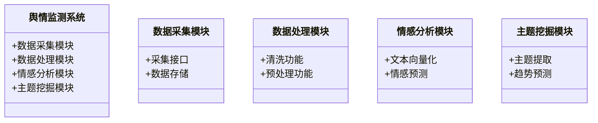
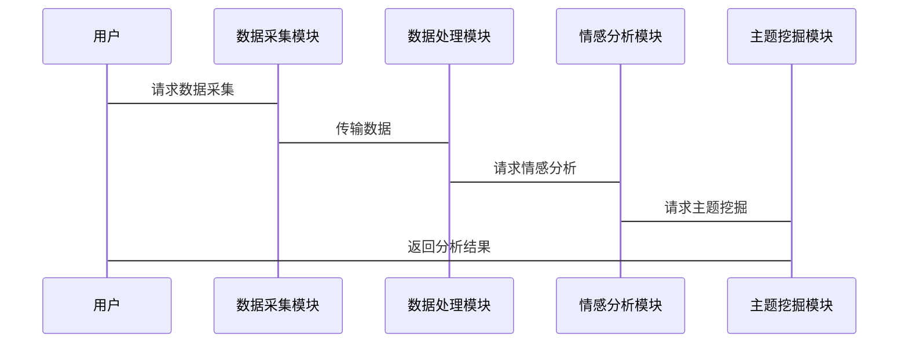

                 


# 价值投资中的AI智能体舆情监测与分析系统

> 关键词：价值投资，AI智能体，舆情监测，情感分析，主题挖掘

> 摘要：本文深入探讨了在价值投资中如何利用AI智能体进行舆情监测与分析，通过系统化的分析流程和算法实现，帮助投资者做出更明智的投资决策。文章从背景介绍、核心概念、算法原理到系统设计和实战案例，全面解析了如何将AI技术应用于金融投资领域。

---

## 第1章: 背景介绍

### 1.1 价值投资与AI的结合
#### 1.1.1 价值投资的核心概念
- 价值投资的基本原理
- 市场情绪对投资决策的影响
- 传统投资分析的局限性

#### 1.1.2 AI技术在金融领域的应用前景
- AI在金融数据分析中的优势
- 情感分析在市场情绪预测中的作用
- AI如何提升投资决策的效率和准确性

#### 1.1.3 舆情监测与分析在价值投资中的作用
- 舆情监测如何揭示市场情绪
- 市场情绪对资产价格的影响
- 如何利用舆情数据优化投资策略

---

## 第2章: 核心概念与联系

### 2.1 舆情监测与分析的定义与特点
#### 2.1.1 舆情监测的定义
- 舆情监测的定义和范围
- 数据来源的多样性
- 实时监测与历史数据分析

#### 2.1.2 情感分析的核心特点
- 情感分析的准确性与实时性
- 数据清洗与特征提取的重要性
- 情感强度的量化与分类

#### 2.1.3 舆情分析与主题挖掘的结合
- 主题挖掘的定义与实现方法
- 主题与情感的关联性分析
- 如何利用主题挖掘识别市场趋势

### 2.2 价值投资的策略分析
#### 2.2.1 价值投资的基本策略
- 基本面分析的核心要素
- 市场情绪对估值的影响
- 舆情数据在基本面分析中的应用

#### 2.2.2 市场情绪与投资决策
- 市场情绪的周期性与波动性
- 如何利用舆情数据预测市场拐点
- 舆情分析在风险管理中的作用

#### 2.2.3 舆情监测与价值投资的结合
- 舆情数据如何辅助基本面分析
- 市场情绪与资产定价的关系
- 如何构建基于舆情的智能投资系统

### 2.3 舆情监测与价值投资的关联性分析
#### 2.3.1 舆情数据对市场情绪的影响
- 舆情数据的影响力分析
- 不同市场阶段中舆情的影响权重
- 舆情数据的滞后性和实时性问题

#### 2.3.2 舆情分析在投资决策中的应用
- 舆情分析如何影响投资策略
- 基于舆情的多因子投资模型
- 如何结合舆情数据优化投资组合

#### 2.3.3 舆情监测系统的构建目标
- 系统的目标与功能模块
- 系统的性能指标与优化方向
- 系统的可扩展性和灵活性设计

---

## 第3章: 情感分析算法

### 3.1 情感分析的定义与分类
#### 3.1.1 情感分析的定义
- 情感分析的目标与任务
- 情感分析的分类（如二分类、多分类）
- 情感分析的应用场景

#### 3.1.2 情感分析的分类
- 二元情感分类（正面/负面）
- 多元情感分类（正面、中性、负面）
- 强度情感分析（情感强度量化）

#### 3.1.3 情感分析的应用场景
- 舆情监测中的情感分析
- 股票推荐中的情感分析
- 风险管理中的情感分析

### 3.2 基于深度学习的情感分析算法
#### 3.2.1 LSTM网络的原理
- LSTM的基本结构（包括输入门、遗忘门、输出门）
- LSTM在序列数据处理中的优势
- LSTM在情感分析中的应用案例

#### 3.2.2 BERT模型在情感分析中的应用
- BERT模型的基本原理
- BERT在情感分析中的优势（如上下文理解能力强）
- BERT模型的训练与微调策略

#### 3.2.3 情感分析的实现流程
- 数据预处理（清洗、分词、去停用词）
- 模型训练（包括数据输入、模型训练、模型评估）
- 模型部署与应用（API接口、实时分析）

### 3.3 情感分析算法的优缺点
#### 3.3.1 传统机器学习算法的局限性
- 传统算法（如SVM、随机森林）的优缺点
- 传统算法在情感分析中的表现
- 传统算法的应用场景

#### 3.3.2 深度学习算法的优势
- 深度学习在情感分析中的表现
- 深度学习算法的可扩展性
- 深度学习算法的计算资源需求

#### 3.3.3 情感分析算法的未来发展方向
- 更细粒度的情感分析（如情感类别细分）
- 多语言情感分析
- 结合领域知识的定制化情感分析

---

## 第4章: 系统分析与架构设计方案

### 4.1 系统分析
#### 4.1.1 问题场景介绍
- 价值投资中的舆情监测需求
- 系统的目标与功能
- 系统的边界与限制

#### 4.1.2 项目介绍
- 项目目标
- 项目范围
- 项目团队与分工

### 4.2 系统功能设计
#### 4.2.1 领域模型设计（Mermaid类图）


#### 4.2.2 系统架构设计（Mermaid架构图）
```mermaid
archi
    舆情监测系统
        数据采集模块 --> 数据处理模块
        数据处理模块 --> 情感分析模块
        情感分析模块 --> 主题挖掘模块
```

### 4.3 系统接口设计
#### 4.3.1 接口设计
- 数据接口（数据输入格式与输出格式）
- API接口（RESTful API设计）
- 数据库接口（数据库设计与交互）

#### 4.3.2 系统交互设计（Mermaid序列图）


---

## 第5章: 项目实战

### 5.1 环境安装
- 安装Python和相关库（如TensorFlow、Keras、NLTK）
- 安装深度学习框架（如PyTorch、BERT）
- 安装可视化工具（如Matplotlib、Seaborn）

### 5.2 核心实现
#### 5.2.1 数据采集与预处理
- 数据采集代码示例
- 数据清洗与分词代码示例
- 数据预处理代码示例

#### 5.2.2 情感分析实现
- 基于LSTM的情感分析代码示例
- 基于BERT的情感分析代码示例
- 模型训练与评估代码示例

#### 5.2.3 主题挖掘实现
- 主题挖掘算法（如LDA）代码示例
- 主题提取与可视化代码示例
- 趋势预测代码示例

### 5.3 实际案例分析
#### 5.3.1 数据分析与解读
- 数据来源与分析目标
- 数据分析结果的解读
- 数据分析对投资决策的影响

#### 5.3.2 投资策略优化
- 基于舆情分析的投资策略优化
- 策略回测与绩效评估
- 策略的可扩展性和鲁棒性分析

---

## 第6章: 总结与最佳实践

### 6.1 总结
- 价值投资中的舆情监测与分析系统的整体框架
- 系统的核心算法与实现
- 系统的应用价值与意义

### 6.2 最佳实践 tips
- 数据质量的重要性
- 模型选择与调优的注意事项
- 系统部署与维护的建议

### 6.3 未来研究方向
- 更高级的情感分析算法（如多模态情感分析）
- 结合区块链技术的舆情监测系统
- 智能投资顾问系统的进一步发展

---

## 作者：AI天才研究院/AI Genius Institute & 禅与计算机程序设计艺术/Zen And The Art of Computer Programming

---

以上是一个详细的目录大纲，您可以根据这个结构撰写完整的文章。每章内容都涵盖了从基础概念到实际应用的各个方面，确保读者能够全面理解并掌握相关知识。

