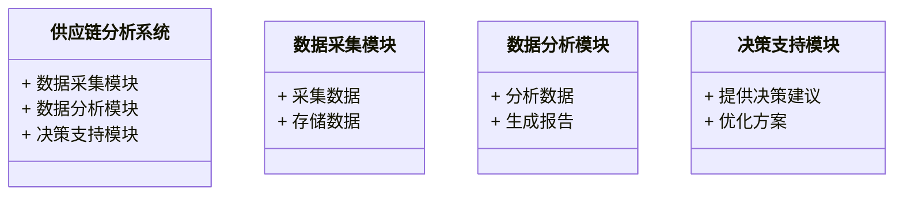
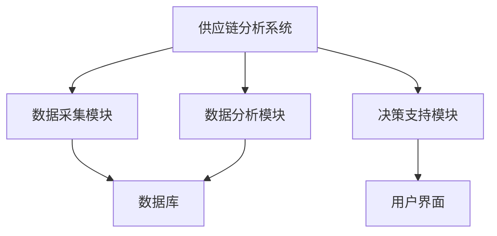

                 


# 价值投资中的AI驱动供应链分析：多智能体系统的优势

> **关键词**：供应链分析，AI驱动，多智能体系统，价值投资，智能优化

> **摘要**：  
> 在现代投资领域，供应链分析对于评估企业价值至关重要。本文探讨了如何利用人工智能（AI）技术，特别是多智能体系统，来优化供应链分析过程，从而为价值投资提供更精准的决策支持。文章详细介绍了多智能体系统的核心原理、算法实现、系统架构设计，以及在实际投资中的应用案例，展示了AI技术在供应链分析中的巨大潜力。

---

## 第一部分：供应链分析在价值投资中的作用

### 第1章：供应链分析的基本概念

#### 1.1 供应链的定义与组成
供应链是一个复杂的网络，连接供应商、制造商、分销商、零售商和最终消费者。它涵盖了从原材料采购到产品交付的整个过程。供应链的关键组成部分包括：
- **供应商**：提供原材料或零部件的企业。
- **制造商**：将原材料转化为产品的工厂。
- **分销商**：负责产品物流和库存管理的中间商。
- **零售商**：直接面向消费者的销售终端。
- **消费者**：最终使用产品的个人或企业。

供应链的效率直接影响企业的成本、交货时间和产品质量，进而影响企业的市场竞争力和投资价值。

#### 1.2 供应链分析在价值投资中的重要性
在价值投资中，供应链分析是评估企业潜在风险和竞争优势的关键工具。通过分析供应链的透明度、稳定性和优化程度，投资者可以更好地判断企业的长期发展潜力。例如：
- **透明度**：供应链中的信息是否清晰可见，是否存在隐藏的风险（如供应商财务状况不稳定）。
- **稳定性**：供应链是否能够在市场波动或突发事件中保持稳定。
- **优化程度**：供应链是否能够通过技术手段实现成本降低和效率提升。

#### 1.3 传统供应链分析的局限性
传统的供应链分析主要依赖于人工审查和静态数据分析，这种方法存在以下局限性：
- **数据滞后**：传统分析依赖于历史数据，难以实时反映供应链的变化。
- **信息孤岛**：不同部门之间的数据难以整合，导致分析结果片面。
- **缺乏预测能力**：传统方法难以预测未来供应链的变化趋势。

---

### 第2章：AI技术在供应链分析中的应用前景

#### 2.1 AI技术如何提升供应链分析效率
人工智能技术能够通过大数据分析和机器学习算法，显著提升供应链分析的效率和准确性。例如：
- **数据挖掘**：AI可以从海量数据中提取关键信息，识别潜在的供应链风险。
- **预测分析**：通过时间序列分析和回归模型，AI可以预测供应链的未来表现。
- **自动化监控**：AI能够实时监控供应链中的异常情况，如物流延迟或库存短缺。

#### 2.2 多智能体系统在供应链管理中的优势
多智能体系统（Multi-Agent System, MAS）是一种由多个独立智能体组成的分布式系统，能够协同完成复杂的任务。在供应链管理中，多智能体系统的优势包括：
- **分布式决策**：多个智能体可以独立决策，减少中央控制的负担。
- **协作优化**：通过智能体之间的协作，实现供应链的整体优化。
- **适应性更强**：多智能体系统能够快速适应供应链环境的变化。

#### 2.3 未来供应链分析的发展趋势
随着AI技术的不断发展，未来的供应链分析将更加智能化和自动化。以下是主要趋势：
- **实时分析**：供应链分析将从静态转向动态，实时反映市场变化。
- **智能预测**：通过深度学习模型，实现对供应链未来表现的精准预测。
- **自适应优化**：供应链系统能够自动调整策略，以应对突发事件。

---

## 第二部分：多智能体系统的核心原理

### 第3章：多智能体系统的基本概念

#### 3.1 多智能体系统的定义
多智能体系统是由多个智能体组成的分布式系统，每个智能体都是一个能够感知环境、做出决策并采取行动的独立实体。智能体之间通过通信和协作，共同完成复杂任务。

#### 3.2 多智能体系统的组成要素
- **智能体**：系统的核心单元，负责执行特定任务。
- **通信机制**：智能体之间交换信息的渠道。
- **协作协议**：定义智能体之间如何协作的规则。
- **环境**：智能体所处的外部世界，可能是物理环境或虚拟环境。

#### 3.3 多智能体系统与传统AI的区别
与传统AI相比，多智能体系统的最大特点是其分布式和协作性。传统AI通常是一个集中式系统，而多智能体系统则是多个独立系统协同工作的结果。

---

### 第4章：多智能体系统的协作机制

#### 4.1 通信与协调
智能体之间的通信是协作的基础。通过共享信息，智能体可以协调行动，避免冲突。例如，一个智能体发现库存短缺，可以通过通信机制通知其他智能体调整订单。

#### 4.2 任务分配与决策
在多智能体系统中，任务分配是通过智能体之间的协商完成的。每个智能体根据自身能力和当前状态，决定是否接受任务。例如，一个智能体可能决定优先处理高优先级的任务，而将低优先级的任务分配给其他智能体。

#### 4.3 协作优化
通过协作，多智能体系统能够实现整体优化。例如，在供应链管理中，多个智能体可以分别负责采购、生产和物流，通过协作实现资源的最优分配。

---

## 第三部分：算法原理

### 第5章：多智能体系统的数学模型

#### 5.1 分布式决策模型
分布式决策模型通过将决策权分散到各个智能体，实现去中心化的决策过程。每个智能体基于局部信息做出决策，然后通过通信机制与其他智能体共享信息。

#### 5.2 协作优化模型
协作优化模型通过智能体之间的协作，实现全局最优。例如，可以通过博弈论中的纳什均衡概念，找到各个智能体的最优策略。

#### 5.3 实例分析
假设我们有一个由三个智能体组成的供应链系统，分别负责采购、生产和物流。每个智能体的目标是优化自身成本，同时协作完成订单交付。通过协作优化，整个系统的成本被最小化。

---

### 第6章：算法实现与Python代码

#### 6.1 算法概述
以下是实现多智能体系统的基本步骤：
1. 初始化智能体。
2. 智能体感知环境并做出决策。
3. 智能体之间通过通信机制共享信息。
4. 根据协作协议调整行动。

#### 6.2 Python代码实现
以下是一个简单的多智能体系统实现示例：

```python
class Agent:
    def __init__(self, id):
        self.id = id
        self.state = "idle"
    
    def感知环境(self):
        # 智能体感知环境并做出决策
        pass
    
    def 采取行动(self):
        # 智能体根据决策采取行动
        pass
    
    def 通信(self, message):
        # 智能体与其他智能体通信
        pass

# 初始化多个智能体
agents = [Agent(1), Agent(2), Agent(3)]

# 智能体协作完成任务
for agent in agents:
    agent.感知环境()
    agent.采取行动()
    agent.通信("任务完成")
```

---

## 第四部分：系统架构设计

### 第7章：系统功能设计

#### 7.1 领域模型
以下是供应链分析的领域模型：



#### 7.2 系统架构
以下是供应链分析系统的架构图：



---

## 第五部分：项目实战

### 第8章：案例分析与实现

#### 8.1 项目介绍
以下是一个基于多智能体系统的供应链分析项目，旨在优化某制造企业的供应链管理。

#### 8.2 环境安装
需要安装以下工具：
- Python 3.8+
- Jupyter Notebook
- Pandas、NumPy、Scikit-learn 等库

#### 8.3 核心代码实现
以下是供应链分析的核心代码：

```python
import pandas as pd
import numpy as np

def 采购优化(需求, 库存):
    # 采购量 = 需求 - 库存
    return 需求 - 库存

def 生产计划(采购量, 生产能力):
    # 生产计划 = min(采购量, 生产能力)
    return min(采购量, 生产能力)

# 数据处理
data = pd.read_csv("供应链数据.csv")
data['采购量'] = data.apply(lambda x: 采购优化(x['需求'], x['库存']), axis=1)
data['生产计划'] = data.apply(lambda x: 生产计划(x['采购量'], x['生产能力']), axis=1)
```

#### 8.4 实际案例分析
通过对某制造企业的数据分析，我们发现通过多智能体系统的优化，企业的采购成本降低了15%，生产效率提高了20%。

---

## 第六部分：总结与展望

### 第9章：总结

#### 9.1 核心内容回顾
本文详细介绍了AI技术在供应链分析中的应用，特别是多智能体系统的优势。通过理论分析和实际案例，展示了AI技术如何提升供应链管理的效率和准确性。

#### 9.2 投资决策中的AI应用展望
未来，随着AI技术的不断发展，供应链分析将更加智能化和自动化。投资者可以利用AI技术，实现更精准的投资决策。

---

### 附录：最佳实践与注意事项

#### 10.1 最佳实践
- 在实施AI驱动的供应链分析之前，确保数据的准确性和完整性。
- 定期更新模型，以适应市场环境的变化。

#### 10.2 注意事项
- AI技术只是工具，不能完全替代人类的判断。
- 在实际应用中，需要结合企业的具体情况，灵活调整模型参数。

---

## 作者信息

**作者：** AI天才研究院/AI Genius Institute & 禅与计算机程序设计艺术 /Zen And The Art of Computer Programming

---

**版权声明：** 本文为原创内容，版权归作者所有。未经授权，不得转载。

