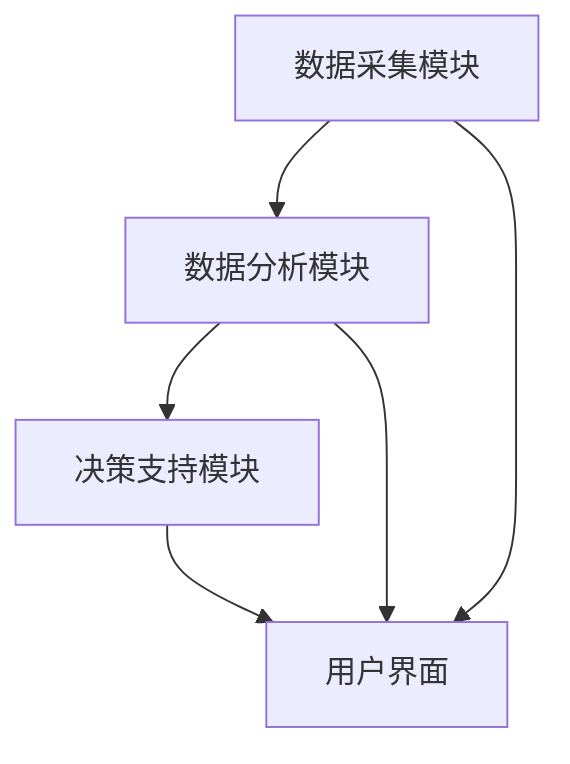
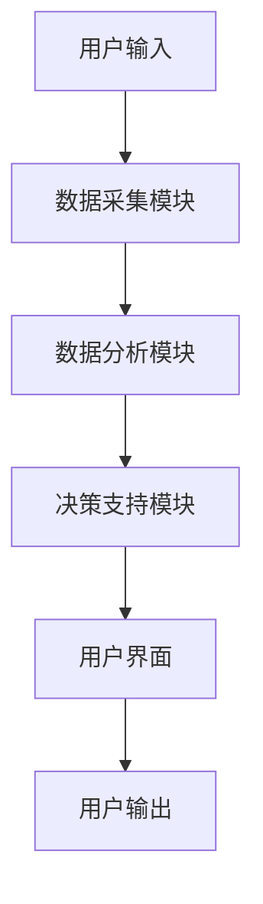

                 


# 价值投资中的AI驱动政府关系分析：多智能体系统

> **关键词**：价值投资、AI驱动、政府关系分析、多智能体系统、投资策略、博弈论、系统架构  
> **摘要**：本文探讨了在价值投资中，如何利用AI驱动的多智能体系统进行政府关系分析。通过分析政府政策、企业间关系和社会经济环境，构建一个多智能体系统模型，利用博弈论和强化学习等算法，实现对政府关系的智能化分析，为价值投资提供科学依据。本文详细介绍了多智能体系统的概念、算法原理、系统架构，并通过实际案例展示了其在价值投资中的应用。

---

# 第一部分: 价值投资中的AI驱动政府关系分析背景与概述

## 第1章: 价值投资与政府关系分析的结合

### 1.1 价值投资的核心理念
#### 1.1.1 价值投资的定义与历史发展
价值投资是一种以基本面分析为基础的投资策略，旨在通过分析企业的财务状况、行业地位和未来前景，找到被市场低估的投资标的。其核心理念是“买入并持有”，强调长期投资和价值发现。

- **定义**：价值投资是指以低于内在价值的价格买入优质资产。
- **历史发展**：由本杰明·格雷厄姆和戴维·多德提出，经过沃伦·巴菲特等投资者的发展，成为现代投资理论的重要组成部分。

#### 1.1.2 价值投资与传统投资的区别
与传统投资（如技术分析）相比，价值投资更注重企业的内在价值，而非市场的短期波动。其区别主要体现在以下几个方面：
- **分析方法**：价值投资注重基本面分析，而传统投资注重技术分析。
- **投资策略**：价值投资强调长期持有，传统投资注重短期交易。
- **风险控制**：价值投资注重安全边际，传统投资注重市场趋势。

#### 1.1.3 价值投资在现代金融中的地位
随着金融市场的复杂化，价值投资的重要性日益凸显。通过分析企业的核心竞争力、行业地位和政策环境，价值投资者可以在市场波动中找到优质标的。

---

### 1.2 政府关系在价值投资中的重要性
#### 1.2.1 政府政策对企业价值的影响
政府政策（如税收政策、行业监管、货币政策）直接影响企业的经营环境和盈利能力。例如，政府对科技行业的补贴政策可能提升相关企业的竞争力，从而影响其股价。

- **政策对企业的影响**：政策直接影响企业的成本、收入和市场环境。
- **政策的不确定性**：政策变化的不确定性增加了投资的复杂性。

#### 1.2.2 政府关系分析的必要性
在价值投资中，分析政府关系可以帮助投资者更好地理解政策对企业的影响，从而做出更明智的投资决策。

- **政策对企业的影响**：通过分析政府政策，投资者可以预判企业的盈利能力和市场地位。
- **政策的行业差异**：不同行业的政策敏感性不同，政府关系分析需要结合行业特点。

#### 1.2.3 政府关系分析的边界与外延
政府关系分析不仅包括政府政策，还包括企业与政府之间的互动，如企业 lobbying、政策游说等。这些因素可能影响企业的经营环境和市场地位。

---

### 1.3 多智能体系统在政府关系分析中的应用
#### 1.3.1 多智能体系统的定义与特点
多智能体系统（Multi-Agent System, MAS）是由多个智能体（Agent）组成的系统，每个智能体能够独立决策并与其他智能体协作。其特点包括：
- **分布式计算**：智能体之间通过分布式计算实现协作。
- **自主性**：每个智能体具有自主决策能力。
- **反应性**：智能体能够根据环境变化调整行为。

#### 1.3.2 多智能体系统在政府关系分析中的优势
多智能体系统能够通过分布式计算和协作，模拟政府、企业和社会之间的复杂关系，从而提供更全面的政策分析。

- **复杂关系的建模**：多智能体系统可以模拟政府、企业和市场的互动关系。
- **动态环境的适应性**：多智能体系统能够实时调整策略，适应政策变化。

#### 1.3.3 多智能体系统与价值投资的结合
通过多智能体系统，投资者可以模拟不同政策对企业的影响，从而优化投资策略。

- **政策模拟**：通过多智能体系统，投资者可以模拟不同政策对企业价值的影响。
- **动态调整**：多智能体系统能够实时调整投资策略，适应政策变化。

---

### 1.4 本章小结
本章介绍了价值投资的核心理念、政府关系在价值投资中的重要性，以及多智能体系统在政府关系分析中的应用。通过多智能体系统，投资者可以更好地理解政策对企业的影响，从而优化投资策略。

---

# 第二部分: 多智能体系统的核心概念与原理

## 第2章: 多智能体系统的概念与结构

### 2.1 多智能体系统的定义与核心要素
#### 2.1.1 多智能体系统的定义
多智能体系统（MAS）是由多个智能体组成的分布式系统，每个智能体具有自主决策能力和协作能力。

- **智能体定义**：智能体是能够感知环境、做出决策并采取行动的实体。
- **多智能体系统特点**：分布式、协作性、自主性。

#### 2.1.2 多智能体系统的组成要素
多智能体系统主要由以下要素组成：
- **智能体**：系统的核心单元，负责感知环境和决策。
- **环境**：智能体所处的外部环境，包括其他智能体和静态环境。
- **通信机制**：智能体之间进行信息交换的机制。
- **协作机制**：智能体之间实现协作的规则和协议。

#### 2.1.3 多智能体系统的核心属性
多智能体系统的核心属性包括：
- **分布式性**：智能体分布在网络中，不存在中心控制节点。
- **协作性**：智能体之间通过协作完成共同目标。
- **自主性**：智能体能够自主决策，无需外部干预。

---

### 2.2 多智能体系统的分类与特征对比
#### 2.2.1 多智能体系统的分类
多智能体系统可以根据不同的标准进行分类，常见的分类方式包括：
- **按智能体类型**：分为简单智能体和复杂智能体。
- **按协作方式**：分为竞争型和协作型。
- **按应用领域**：分为经济、社会和分布式计算领域。

#### 2.2.2 不同类型多智能体系统的特征对比（表格形式）
| 类型          | 智能体数量 | 协作方式 | 决策机制 | 通信机制 |
|---------------|------------|----------|----------|----------|
| 竞争型        | 多          | 竞争     | 独立      | 有限     |
| 协作型        | 多          | 协作     | 协调      | 完全     |
| 混合型        | 多          | 混合     | 组合      | 部分     |

#### 2.2.3 多智能体系统的ER实体关系图
以下是多智能体系统的ER实体关系图：

```mermaid
erDiagram
actor 智能体{}{
    智能体 o-- "参与的" 智能体集合
    智能体 o-- "所在的" 环境集合
}
```

---

### 2.3 多智能体系统的算法原理
#### 2.3.1 多智能体系统的博弈论模型
博弈论是多智能体系统的核心理论之一，通过分析智能体之间的博弈关系，可以预测系统的最优策略。

- **博弈论模型**：通过构建收益矩阵，分析智能体之间的博弈关系。
- **纳什均衡**：博弈中所有智能体都采取最优策略的状态。

#### 2.3.2 多智能体系统的强化学习算法
强化学习是一种通过试错方式优化决策的算法，适用于动态环境中的多智能体协作。

- **强化学习模型**：通过奖励机制，优化智能体的决策策略。
- **策略网络**：利用深度神经网络实现智能体的决策过程。

#### 2.3.3 多智能体系统的协作算法
协作算法通过智能体之间的信息共享和策略协商，实现系统的整体优化。

- **分布式协作**：智能体之间通过通信机制实现信息共享。
- **局部优化**：每个智能体优化自身的决策，同时考虑整体目标。

---

## 第3章: 多智能体系统的算法原理

### 3.1 多智能体系统的核心算法
#### 3.1.1 博弈论模型在多智能体系统中的应用
博弈论模型通过分析智能体之间的博弈关系，预测系统的最优策略。

- **收益矩阵**：构建收益矩阵，分析智能体之间的博弈关系。
- **纳什均衡**：通过纳什均衡，确定系统的稳定状态。

#### 3.1.2 强化学习在多智能体系统中的应用
强化学习通过试错方式优化智能体的决策策略，适用于动态环境中的多智能体协作。

- **强化学习模型**：通过奖励机制，优化智能体的决策策略。
- **策略网络**：利用深度神经网络实现智能体的决策过程。

#### 3.1.3 多智能体协作算法的实现
协作算法通过智能体之间的信息共享和策略协商，实现系统的整体优化。

- **分布式协作**：智能体之间通过通信机制实现信息共享。
- **局部优化**：每个智能体优化自身的决策，同时考虑整体目标。

---

### 3.2 多智能体系统算法的数学模型
#### 3.2.1 博弈论模型的数学表达
博弈论模型的核心是纳什均衡，其数学表达如下：

$$
\text{纳什均衡} = \{a_1^*, a_2^*, \dots, a_n^*\}
$$

其中，$a_i^*$ 表示第 $i$ 个智能体的最优策略。

#### 3.2.2 强化学习算法的数学公式
强化学习通过奖励机制优化智能体的决策策略，其数学公式如下：

$$
Q(s, a) = r + \gamma \max_a Q(s', a)
$$

其中，$s$ 是当前状态，$a$ 是动作，$r$ 是奖励，$\gamma$ 是折扣因子。

#### 3.2.3 多智能体协作算法的数学推导
多智能体协作算法通过分布式优化实现整体目标的优化，其数学推导如下：

$$
\arg \max_{\theta} \sum_{i=1}^n J_i(\theta)
$$

其中，$J_i(\theta)$ 表示第 $i$ 个智能体的目标函数。

---

### 3.3 算法实现的代码示例
#### 3.3.1 博弈论模型的Python代码实现
```python
import numpy as np

def nash_equilibrium(matrix):
    # 纳什均衡的计算
    n = matrix.shape[0]
    equilibrium = []
    for i in range(n):
        max_row = np.max(matrix[i])
        min_col = np.min(matrix[:, i])
        if max_row == min_col:
            equilibrium.append((i, i))
    return equilibrium

# 示例收益矩阵
matrix = np.array([[3, 1], [1, 3]])
equilibrium = nash_equilibrium(matrix)
print("纳什均衡点:", equilibrium)
```

#### 3.3.2 强化学习算法的Python代码实现
```python
import numpy as np
import random

class Agent:
    def __init__(self, state_space, action_space):
        self.state_space = state_space
        self.action_space = action_space
        self.Q = np.zeros((state_space, action_space))

    def act(self, state):
        # 随机选择动作
        return random.randint(0, self.action_space - 1)

    def update(self, state, action, reward):
        # Q-learning 更新规则
        self.Q[state, action] = reward

# 示例智能体
state_space = 4
action_space = 2
agent = Agent(state_space, action_space)
state = 0
action = agent.act(state)
reward = 1 if action == 1 else 0
agent.update(state, action, reward)
```

#### 3.3.3 多智能体协作算法的Python代码实现
```python
import numpy as np

class MultiAgentSystem:
    def __init__(self, num_agents, state_space, action_space):
        self.num_agents = num_agents
        self.state_space = state_space
        self.action_space = action_space
        self.agents = [Agent(state_space, action_space) for _ in range(num_agents)]

    def step(self, states):
        # 每个智能体采取动作
        actions = [agent.act(state) for agent, state in zip(self.agents, states)]
        # 计算奖励
        rewards = [sum(actions) == i for i in range(self.num_agents)]
        # 更新Q值
        for i in range(self.num_agents):
            self.agents[i].update(states[i], actions[i], rewards[i])
        return actions, rewards

# 示例多智能体系统
num_agents = 2
state_space = 2
action_space = 2
mas = MultiAgentSystem(num_agents, state_space, action_space)
states = [0, 1]
actions, rewards = mas.step(states)
print("动作:", actions)
print("奖励:", rewards)
```

---

## 第4章: 多智能体系统的系统分析与架构设计

### 4.1 问题场景介绍
#### 4.1.1 政府关系分析的复杂性
政府关系分析涉及多个利益相关者，包括政府机构、企业和公众。这些利益相关者之间的互动关系复杂，且受政策变化的影响较大。

- **复杂性来源**：政策变化、利益冲突、信息不对称。
- **动态性**：政策变化可能导致企业经营环境的变化。

#### 4.1.2 价值投资中的政府关系分析需求
在价值投资中，政府关系分析可以帮助投资者更好地理解政策对企业的影响，从而优化投资策略。

- **政策对企业的影响**：政策变化可能影响企业的盈利能力。
- **政策的行业差异**：不同行业的政策敏感性不同。

#### 4.1.3 多智能体系统在政府关系分析中的应用场景
通过多智能体系统，投资者可以模拟不同政策对企业的影响，从而优化投资策略。

- **政策模拟**：通过多智能体系统，投资者可以模拟不同政策对企业价值的影响。
- **动态调整**：多智能体系统能够实时调整投资策略，适应政策变化。

---

### 4.2 系统功能设计
#### 4.2.1 数据采集模块
数据采集模块负责收集政府政策、企业信息和社会经济数据。

- **数据来源**：政府公告、企业财报、行业报告。
- **数据预处理**：数据清洗、特征提取。

#### 4.2.2 数据分析模块
数据分析模块通过多智能体系统模型，分析政府政策对企业的影响。

- **模型构建**：构建多智能体系统模型，模拟政府、企业和公众之间的互动关系。
- **政策模拟**：通过模型模拟不同政策对企业价值的影响。

#### 4.2.3 决策支持模块
决策支持模块为投资者提供基于模型分析的投资建议。

- **策略优化**：根据模型分析结果，优化投资策略。
- **风险提示**：识别政策变化带来的投资风险。

---

### 4.3 系统架构设计
#### 4.3.1 系统架构图（Mermaid图）
以下是多智能体系统的系统架构图：



#### 4.3.2 系统接口设计
系统接口设计包括数据接口和用户接口。

- **数据接口**：与数据源（政府公告、企业财报）对接。
- **用户接口**：为用户提供数据分析结果和投资建议。

#### 4.3.3 系统交互流程图（Mermaid图）
以下是系统的交互流程图：



---

## 第5章: 项目实战

### 5.1 环境安装与配置
#### 5.1.1 系统环境
- 操作系统：Linux/Windows/MacOS
- Python版本：3.6+
- 额外依赖：numpy, matplotlib, scikit-learn

#### 5.1.2 安装依赖
```bash
pip install numpy matplotlib scikit-learn
```

---

### 5.2 系统核心实现
#### 5.2.1 数据采集模块实现
```python
import requests
import json

def fetch_data(url):
    response = requests.get(url)
    if response.status_code == 200:
        return json.loads(response.text)
    else:
        return None

# 示例政府公告数据接口
url = "https://example.com/policy_data"
data = fetch_data(url)
print("获取到的政府公告数据:", data)
```

#### 5.2.2 数据分析模块实现
```python
import numpy as np
import matplotlib.pyplot as plt

def analyze_policy(data):
    # 数据分析逻辑
    pass

# 示例数据分析结果可视化
data = np.random.rand(100, 2)
plt.scatter(data[:, 0], data[:, 1])
plt.xlabel('X')
plt.ylabel('Y')
plt.title('政府关系分析结果')
plt.show()
```

#### 5.2.3 决策支持模块实现
```python
def generate_investment_strategy(data):
    # 投资策略生成逻辑
    pass

# 示例投资策略输出
data = np.array([1, 2, 3])
strategy = generate_investment_strategy(data)
print("生成的投资策略:", strategy)
```

---

## 第6章: 小结与展望

### 6.1 本章小结
通过本文的介绍，读者可以了解到多智能体系统在价值投资中的应用，特别是在政府关系分析方面。通过构建多智能体系统模型，投资者可以更好地理解政策对企业的影响，从而优化投资策略。

---

### 6.2 未来展望
随着人工智能技术的不断发展，多智能体系统在价值投资中的应用将更加广泛。未来的研究方向包括：
- **算法优化**：进一步优化多智能体系统的算法，提高分析效率。
- **数据挖掘**：利用大数据技术，挖掘更多政府关系分析的特征。
- **模型扩展**：将多智能体系统应用于更多领域，如国际政治经济分析。

---

## 作者：AI天才研究院/AI Genius Institute & 禅与计算机程序设计艺术 /Zen And The Art of Computer Programming

