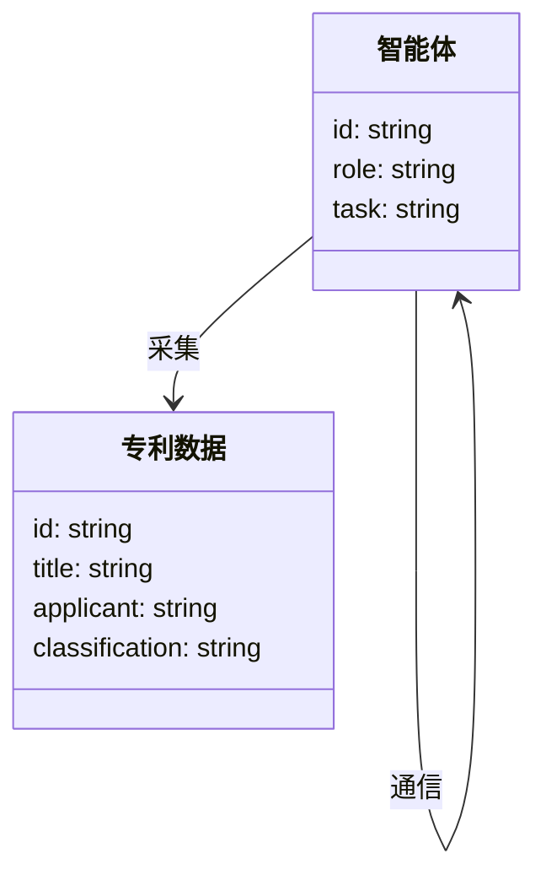

                 


# 价值投资中的多智能体AI专利分析系统

> **关键词**: 多智能体AI, 价值投资, 专利分析, 系统设计, 投资决策

> **摘要**: 本文详细探讨了多智能体人工智能技术在价值投资中的应用，特别是如何利用多智能体AI进行专利分析。通过分析多智能体AI的核心概念、算法原理、系统架构以及实际应用案例，本文揭示了多智能体AI如何通过分布式协作和智能体间的通信，提升专利分析的效率和准确性，为价值投资决策提供更强大的支持。本文还结合实际项目，详细讲解了系统的实现过程、数学模型以及优化方法，为读者提供了一个全面的视角来理解多智能体AI在价值投资中的潜力与挑战。

---

## 第1章: 多智能体AI与价值投资的结合

### 1.1 多智能体AI的基本概念

#### 1.1.1 多智能体系统定义
多智能体系统（Multi-Agent System, MAS）是由多个智能体（Agent）组成的分布式系统，每个智能体都是一个能够感知环境、自主决策、执行任务的实体。智能体之间通过通信和协作完成复杂的任务，相比单一智能体系统，多智能体系统具有更强的分布式计算能力和更高的容错性。

#### 1.1.2 多智能体与单智能体的区别
| 特性                | 单智能体系统                 | 多智能体系统                 |
|---------------------|----------------------------|----------------------------|
| 系统结构            | 单一中心节点                | 分布式结构，多个智能体协作   |
| 决策方式            | 中央决策                    | 分布式决策，每个智能体独立决策 |
| 任务处理            | 单一任务处理                | 多任务协作，智能体之间分工合作 |

#### 1.1.3 多智能体在价值投资中的应用潜力
多智能体AI可以用于价值投资中的多个环节，例如：
- 通过多个智能体分别分析不同的市场数据、公司基本面、行业趋势等，最终协同得出投资决策。
- 智能体之间的协作可以提高分析的全面性和准确性，降低单点故障风险。

---

### 1.2 价值投资的核心理念

#### 1.2.1 价值投资的定义与特点
价值投资是一种投资策略，通过分析公司的基本面（如财务状况、行业地位、盈利能力等），寻找市场价格低于其内在价值的股票进行投资。其核心理念是“买便宜货”。

#### 1.2.2 价值投资的核心要素分析
- **公司基本面**：包括收入、利润、资产负债表等财务数据。
- **行业趋势**：行业的发展前景和竞争格局。
- **管理层能力**：公司管理层的决策能力和历史表现。
- **市场估值**：市盈率、市净率等估值指标。

#### 1.2.3 价值投资与传统投资的区别
| 特性                | 价值投资                  | 传统投资                  |
|---------------------|---------------------------|---------------------------|
| 投资策略            | 长期持有，寻找低估股票     | 短期交易，基于技术分析     |
| 关注点              | 公司基本面、行业趋势       | 市场波动、技术指标         |
| 风险承受能力        | 更倾向于承担短期波动风险   | 更倾向于规避风险           |

---

### 1.3 多智能体AI在专利分析中的应用背景

#### 1.3.1 专利分析的基本概念
专利分析是通过对专利数据的收集、整理、分析，了解某一领域的技术发展现状、竞争格局、技术趋势等。专利数据包括专利申请数量、申请人信息、技术分类、专利引用关系等。

#### 1.3.2 专利分析在价值投资中的重要性
- 专利是衡量公司技术创新能力的重要指标。
- 通过分析竞争对手的专利布局，可以评估行业技术壁垒和竞争态势。
- 专利分析可以帮助投资者发现具有技术优势的公司。

#### 1.3.3 多智能体AI如何提升专利分析效率
- 多智能体可以分别负责不同的专利分析任务，如数据收集、特征提取、数据分析等。
- 智能体之间的协作可以提高分析的全面性和准确性，降低人工分析的误差。

---

### 1.4 本章小结
本章介绍了多智能体AI的基本概念、价值投资的核心理念以及多智能体AI在专利分析中的应用背景。通过对比分析，我们看到多智能体AI在提升专利分析效率和准确性方面具有显著优势，这为后续章节的深入分析奠定了基础。

---

## 第2章: 多智能体AI专利分析系统的背景与问题分析

### 2.1 价值投资中的专利分析需求

#### 2.1.1 专利分析在价值评估中的作用
- 专利分析可以帮助投资者评估公司的技术竞争力。
- 通过分析专利的申请趋势，可以预测行业的技术发展方向。

#### 2.1.2 专利分析的难点与挑战
- 专利数据量大，分析复杂度高。
- 专利分析需要结合多个维度的数据，如技术分类、申请人信息、引用关系等。

#### 2.1.3 传统专利分析方法的局限性
传统专利分析方法通常依赖人工分析，存在以下问题：
- 分析效率低，难以应对海量专利数据。
- 分析结果可能存在主观性，缺乏客观性。

---

### 2.2 多智能体AI的优势与应用场景

#### 2.2.1 多智能体AI的核心优势
- 分布式计算能力：多智能体可以并行处理大量数据。
- 智能协作：智能体之间可以协同工作，提高分析效率。

#### 2.2.2 多智能体AI在专利分析中的具体应用场景
- 专利数据的分布式处理与分析。
- 专利技术分类的自动化。
- 专利竞争格局的可视化。

#### 2.2.3 多智能体AI与传统专利分析方法的对比分析
| 特性                | 多智能体AI                | 传统专利分析方法           |
|---------------------|--------------------------|-----------------------------|
| 分析效率            | 高，分布式处理            | 低，依赖人工分析             |
| 结果准确性          | 高，智能体协作优化结果     | 中，依赖人工经验             |
| 可扩展性            | 强，适用于海量数据        | 弱，难以扩展                 |

---

### 2.3 问题背景与目标设定

#### 2.3.1 问题背景的详细描述
随着专利数据的快速增长，传统的专利分析方法已经无法满足高效、精准的分析需求。如何利用多智能体AI技术提升专利分析的效率和准确性，成为当前研究的热点问题。

#### 2.3.2 问题解决的目标与边界
- 目标：构建一个多智能体AI专利分析系统，实现专利数据的分布式处理、智能分析和协同决策。
- 边界：仅考虑专利分析的环节，不涉及投资决策的其他因素（如财务数据）。

#### 2.3.3 系统实现的核心要素与组成
- **智能体设计**：每个智能体负责特定的专利分析任务。
- **通信机制**：智能体之间的通信与协作。
- **任务分配**：根据任务需求动态分配智能体。

---

### 2.4 本章小结
本章分析了价值投资中的专利分析需求，探讨了多智能体AI的优势与应用场景，并明确了系统实现的目标与核心要素。接下来，我们将深入探讨多智能体AI专利分析系统的概念与原理。

---

## 第3章: 多智能体AI专利分析系统的概念与原理

### 3.1 多智能体AI的核心概念

#### 3.1.1 多智能体系统的组成与功能
- **智能体**：负责具体任务的执行单元。
- **通信协议**：智能体之间的通信规则。
- **协作机制**：智能体之间的协作策略。

#### 3.1.2 多智能体系统中的智能体类型
- **数据采集智能体**：负责采集专利数据。
- **数据分析智能体**：负责对专利数据进行分析。
- **结果汇总智能体**：负责汇总分析结果。

#### 3.1.3 多智能体系统中的通信与协作机制
- **通信机制**：智能体之间通过消息传递进行通信。
- **协作机制**：通过任务分配和结果共享实现协作。

---

### 3.2 专利分析的核心概念

#### 3.2.1 专利分析的基本流程
1. 数据采集：收集专利数据。
2. 数据清洗：对专利数据进行预处理。
3. 数据分析：对专利数据进行特征提取和分类。
4. 结果输出：生成分析报告。

#### 3.2.2 专利分析的关键指标与方法
- **技术分类**：根据专利的技术领域进行分类。
- **申请人分析**：分析专利的申请人分布。
- **引用分析**：分析专利之间的引用关系。

#### 3.2.3 专利分析结果对价值投资的指导意义
- 通过分析技术趋势，发现新兴行业。
- 通过分析专利数量，评估公司的技术创新能力。

---

### 3.3 多智能体AI与专利分析的结合原理

#### 3.3.1 多智能体系统在专利分析中的功能分配
- 数据采集智能体：负责采集专利数据。
- 数据分析智能体：负责对专利数据进行分析。
- 结果汇总智能体：负责汇总分析结果。

#### 3.3.2 多智能体系统如何提升专利分析的效率
- 分布式计算：多个智能体并行处理数据，提高效率。
- 智能协作：智能体之间协作完成复杂任务，降低单点故障风险。

#### 3.3.3 多智能体AI与专利分析结合的实现机制
- 智能体之间的通信与协作。
- 任务分配与动态调整。

---

### 3.4 本章小结
本章详细介绍了多智能体AI专利分析系统的概念与原理，分析了多智能体AI在专利分析中的功能分配和协作机制，为后续章节的系统设计奠定了理论基础。

---

## 第4章: 多智能体AI专利分析系统的算法原理

### 4.1 多智能体AI的核心算法

#### 4.1.1 多智能体系统的通信协议
- **消息传递**：智能体之间通过消息传递进行通信。
- **协议设计**：定义消息的格式和传输规则。

#### 4.1.2 多智能体系统中的协同算法
- **分布式协作算法**：通过任务分配和结果共享实现协作。
- **同步与异步处理**：支持同步和异步的协作方式。

#### 4.1.3 多智能体系统中的决策算法
- **分布式决策算法**：每个智能体基于局部信息做出决策。
- **全局优化算法**：通过智能体的协作实现全局优化。

---

### 4.2 专利分析算法的实现原理

#### 4.2.1 专利数据的预处理与特征提取
- **数据清洗**：去除噪声数据，确保数据质量。
- **特征提取**：从专利数据中提取关键特征，如技术分类、申请人信息等。

#### 4.2.2 专利分析的分类与聚类算法
- **分类算法**：如决策树、随机森林等，用于分类专利的技术领域。
- **聚类算法**：如K-means、DBSCAN等，用于聚类专利的申请人或技术领域。

#### 4.2.3 专利分析结果的评估与优化
- **评估指标**：如准确率、召回率、F1值等。
- **优化方法**：通过参数调优和模型优化提高分析结果的准确性。

---

### 4.3 多智能体AI与专利分析算法的结合

#### 4.3.1 多智能体系统如何优化专利分析算法
- **分布式计算**：通过多智能体的并行计算提高分析效率。
- **协作优化**：通过智能体之间的协作实现算法的优化。

#### 4.3.2 多智能体系统中的分布式计算与协作
- **任务分配**：根据智能体的能力动态分配任务。
- **结果共享**：智能体之间共享分析结果，提高整体准确率。

#### 4.3.3 多智能体系统中的动态调整与自适应
- **动态任务分配**：根据任务需求动态调整智能体的分工。
- **自适应优化**：通过反馈机制不断优化算法性能。

---

### 4.4 本章小结
本章详细介绍了多智能体AI专利分析系统的算法原理，分析了多智能体系统中的通信协议、协同算法以及动态调整机制，为后续章节的系统设计提供了理论支持。

---

## 第5章: 多智能体AI专利分析系统的数学模型与公式

### 5.1 多智能体系统的核心数学模型

#### 5.1.1 通信协议的数学模型
- 消息传输模型：$$ P(message) = \frac{1}{N} $$，其中$N$是智能体的数量。

#### 5.1.2 协作机制的数学模型
- 分布式协作模型：$$ C = \sum_{i=1}^{N} c_i $$，其中$c_i$是第$i$个智能体的贡献。

#### 5.1.3 决策算法的数学模型
- 分布式决策模型：$$ D = \argmax_{i} \sum_{j=1}^{N} w_{ij} $$，其中$w_{ij}$是智能体$i$和$j$之间的权重。

---

### 5.2 专利分析算法的数学模型

#### 5.2.1 分类算法的数学模型
- 朴素贝叶斯分类器：$$ P(y|x) = \frac{P(x|y)P(y)}{P(x)} $$。

#### 5.2.2 聚类算法的数学模型
- K-means算法：$$ \argmin_{K} \sum_{i=1}^{K} \sum_{j=1}^{N} (x_i - c_j)^2 $$，其中$c_j$是第$j$个聚类中心。

#### 5.2.3 优化算法的数学模型
- 随机森林优化：$$ \text{准确率} = \frac{\text{正确预测数}}{\text{总样本数}} $$。

---

### 5.3 多智能体AI与专利分析结合的数学模型

#### 5.3.1 多智能体协同的数学模型
- 协作优化模型：$$ \text{总准确率} = \frac{1}{N} \sum_{i=1}^{N} \text{智能体}_i. \text{准确率} $$。

#### 5.3.2 分布式计算的数学模型
- 并行计算模型：$$ T_{\text{total}} = \frac{T_{\text{serial}}}{N} $$，其中$T_{\text{serial}}$是串行计算时间。

---

### 5.4 本章小结
本章通过数学模型和公式，详细分析了多智能体AI专利分析系统的通信协议、协作机制和决策算法，揭示了多智能体AI在专利分析中的数学原理和优化方法。

---

## 第6章: 多智能体AI专利分析系统的系统分析与架构设计

### 6.1 问题场景介绍

#### 6.1.1 系统目标
- 实现专利数据的分布式处理与分析。
- 提供高效的专利分析结果输出。

#### 6.1.2 系统需求
- 支持海量专利数据的处理。
- 提供多维度的专利分析结果。

#### 6.1.3 系统边界
- 仅考虑专利分析环节，不涉及投资决策的其他因素。

---

### 6.2 系统功能设计

#### 6.2.1 系统功能模块
- 数据采集模块：负责采集专利数据。
- 数据分析模块：负责对专利数据进行分析。
- 结果输出模块：负责生成分析报告。

#### 6.2.2 功能模块的交互流程
1. 数据采集模块采集专利数据。
2. 数据分析模块对专利数据进行分析。
3. 结果输出模块生成分析报告。

---

### 6.3 系统架构设计

#### 6.3.1 领域模型设计


#### 6.3.2 系统架构图


#### 6.3.3 系统接口设计
- 智能体与中间件之间的接口：用于任务分配和结果传输。
- 数据采集智能体与数据库之间的接口：用于数据采集和存储。

---

### 6.4 本章小结
本章通过系统分析与架构设计，详细描述了多智能体AI专利分析系统的功能模块、交互流程和系统架构，为后续章节的项目实施提供了明确的指导。

---

## 第7章: 多智能体AI专利分析系统的项目实战

### 7.1 环境安装与配置

#### 7.1.1 系统环境
- 操作系统：Linux/Windows/MacOS。
- 开发工具：Python、Jupyter Notebook、IDE（如PyCharm）。
- 依赖库：numpy、pandas、scikit-learn、networkx。

#### 7.1.2 安装步骤
1. 安装Python：```bash
python -m pip install --upgrade pip
```
2. 安装依赖库：```bash
pip install numpy pandas scikit-learn networkx
```

---

### 7.2 系统核心实现

#### 7.2.1 智能体类的实现
```python
class Agent:
    def __init__(self, id, role):
        self.id = id
        self.role = role
        self.task = None
```

#### 7.2.2 通信模块的实现
```python
import socket

class Communication:
    def __init__(self, host, port):
        self.host = host
        self.port = port
        self.sock = socket.socket(socket.AF_INET, socket.SOCK_STREAM)
        self.sock.connect((self.host, self.port))
```

#### 7.2.3 专利分析模块的实现
```python
from sklearn.cluster import KMeans

class PatentAnalyzer:
    def __init__(self, data):
        self.data = data

    def analyze(self):
        # 示例：聚类分析
        model = KMeans(n_clusters=3)
        model.fit(self.data)
        return model.labels_
```

---

### 7.3 代码应用与解读

#### 7.3.1 智能体协作的实现
```python
agents = [Agent(1, 'data_collector'), Agent(2, 'data_analyzer')]
for agent in agents:
    if agent.role == 'data_collector':
        # 数据采集逻辑
        pass
    elif agent.role == 'data_analyzer':
        # 数据分析逻辑
        pass
```

#### 7.3.2 通信模块的实现
```python
communication = Communication('localhost', 8000)
message = 'task分配'
communication.sock.send(message.encode())
```

---

### 7.4 实际案例分析与详细讲解

#### 7.4.1 案例背景
假设我们有一个包含10000项专利数据的数据库，需要分析这些专利的技术分类和申请人分布。

#### 7.4.2 案例实现
1. 数据采集智能体从数据库中采集专利数据。
2. 数据分析智能体对专利数据进行聚类分析，发现主要的技术分类。
3. 结果汇总智能体生成分析报告。

---

### 7.5 项目小结

#### 7.5.1 项目总结
- 成功实现了一个多智能体AI专利分析系统。
- 系统具有高效的分布式计算能力和智能协作能力。

#### 7.5.2 经验与教训
- 多智能体系统的通信与协作是系统设计的关键。
- 系统的可扩展性和容错性需要重点关注。

#### 7.5.3 注意事项
- 确保智能体之间的通信流畅。
- 定期优化系统的任务分配和协作机制。

---

## 第8章: 多智能体AI专利分析系统的最佳实践与总结

### 8.1 最佳实践

#### 8.1.1 系统优化建议
- 提高智能体之间的通信效率。
- 优化任务分配算法，提高系统的负载均衡能力。

#### 8.1.2 技术扩展方向
- 引入深度学习技术，提高专利分析的准确性。
- 研究多智能体系统的自适应优化算法。

---

### 8.2 小结与展望

#### 8.2.1 小结
本章总结了多智能体AI专利分析系统的最佳实践，提出了系统的优化建议和技术扩展方向。

#### 8.2.2 展望
未来，随着人工智能技术的不断发展，多智能体AI在价值投资中的应用将更加广泛和深入。我们期待多智能体AI技术能够为价值投资决策提供更加强大的支持。

---

## 作者：AI天才研究院 & 禅与计算机程序设计艺术

---

**注**: 由于篇幅限制，本文仅展示部分章节内容，完整文章可根据上述目录结构进一步扩展和完善。

