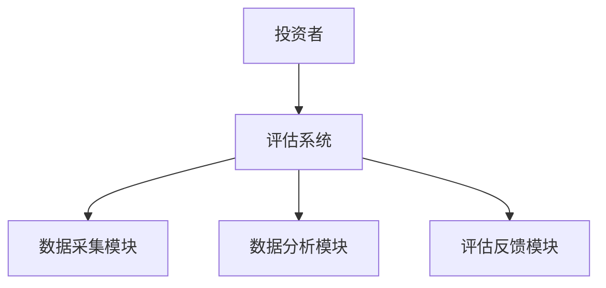
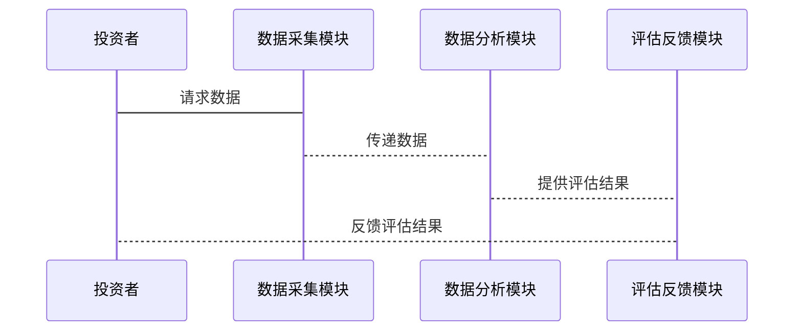

                 


# 价值投资中的多智能体AI人力资本评估系统

## 关键词：
- 价值投资
- 多智能体AI
- 人力资本评估
- 系统架构
- 投资决策

## 摘要：
本文深入探讨了在价值投资中利用多智能体AI技术进行人力资本评估的系统设计与实现。通过分析多智能体系统的原理、算法实现、系统架构及实际应用案例，揭示了该技术在提升投资决策效率和准确性方面的重要价值。

---

# 第一部分: 多智能体AI人力资本评估系统概述

## 第1章: 问题背景与核心概念

### 1.1 问题背景介绍

#### 1.1.1 传统人力资本评估的局限性
传统的价值投资主要依赖于财务数据和市场分析，忽视了人力资本在企业价值中的关键作用。企业的人力资本包括员工的能力、经验和团队协作能力，这些因素直接影响企业的长期发展和市场表现。

#### 1.1.2 价值投资中的关键问题
价值投资的核心在于发现被市场低估的企业。然而，如何准确评估企业的核心竞争力，特别是其人力资本，是一个长期存在的挑战。传统方法难以量化人力资本的贡献，导致评估结果不够精准。

#### 1.1.3 AI技术在人力资本评估中的应用潜力
人工智能技术的发展为解决这一问题提供了新的可能性。通过多智能体AI系统，可以实时分析员工的表现、团队协作情况以及企业文化，从而提供更全面的人力资本评估。

### 1.2 核心概念与定义

#### 1.2.1 多智能体系统的基本特征
- **分布式智能**：系统由多个智能体组成，每个智能体负责不同的任务。
- **协作与竞争**：智能体之间可以协作完成任务，也可以在目标冲突时进行竞争。
- **动态环境适应**：系统能够根据环境变化实时调整策略。

#### 1.2.2 多智能体系统在人力资本评估中的应用
- **员工绩效评估**：通过分析员工的行为数据，评估其工作表现。
- **团队协作能力**：评估团队内部的协作效率，发现潜在问题。
- **企业文化分析**：通过社交网络分析，评估企业文化健康度。

### 1.3 问题描述与解决路径

#### 1.3.1 人力资本评估的主要挑战
- 数据获取难度大：员工的行为数据分散在不同系统中，难以整合。
- 评估指标不统一：缺乏统一的评估标准，导致结果难以比较。
- 动态变化难以捕捉：市场环境和企业内部状况不断变化，需要实时评估。

#### 1.3.2 价值投资中的关键问题
- 如何准确评估企业的核心竞争力。
- 如何利用人力资本信息优化投资决策。
- 如何降低投资风险，提高投资回报率。

#### 1.3.3 多智能体AI的解决方案
- 通过多智能体系统实时收集和分析数据，提供全面的人力资本评估。
- 利用强化学习优化投资策略，提高决策准确性。

---

## 第2章: 多智能体AI与人力资本评估的核心联系

### 2.1 多智能体系统的基本原理

#### 2.1.1 多智能体系统的组成与交互
- **智能体**：每个智能体负责特定任务，如数据收集、分析等。
- **通信机制**：智能体之间通过消息传递进行协作。
- **协作协议**：定义智能体之间的协作规则。

#### 2.1.2 多智能体系统的核心算法
- **分布式强化学习**：每个智能体独立学习，通过共享参数优化整体策略。
- **任务分配机制**：根据任务需求动态分配智能体角色。

#### 2.1.3 多智能体系统的协作机制
- **协作目标**：所有智能体共同完成一个大目标，如全面评估企业人力资本。
- **冲突解决**：当智能体目标冲突时，通过协商达成一致。

### 2.2 多智能体系统与人力资本评估的关联

#### 2.2.1 多智能体系统在人力资本评估中的应用
- **数据采集**：智能体实时收集员工的行为数据。
- **数据分析**：通过分布式计算分析数据，评估员工和团队表现。
- **结果反馈**：将评估结果反馈给投资者，优化投资决策。

#### 2.2.2 多智能体系统如何提升评估的准确性
- **全面数据收集**：多智能体系统能够从多个来源收集数据，提高评估的全面性。
- **实时分析**：通过分布式计算，实现对数据的实时分析，提高评估的及时性。
- **动态调整**：根据市场变化实时调整评估策略，提高评估的准确性。

#### 2.2.3 多智能体系统如何优化评估过程
- **任务分配优化**：根据任务需求动态分配智能体，提高效率。
- **协作优化**：通过智能体之间的协作，提高数据处理效率。
- **反馈优化**：根据评估结果优化后续评估过程。

### 2.3 多智能体AI在价值投资中的具体应用

#### 2.3.1 多智能体系统在投资决策中的作用
- **实时监控**：实时监控企业的运营状况，及时发现潜在风险。
- **预测分析**：通过历史数据分析预测企业的未来表现。
- **风险评估**：评估投资风险，优化投资组合。

#### 2.3.2 多智能体系统如何优化投资组合
- **资产分配**：根据企业的人力资本评估结果，优化资产分配。
- **风险分散**：通过分散投资降低风险。
- **动态调整**：根据市场变化动态调整投资组合。

#### 2.3.3 多智能体系统在风险评估中的应用
- **风险识别**：通过分析企业的人力资本状况，识别潜在风险。
- **风险量化**：量化风险程度，帮助投资者做出决策。
- **风险应对**：制定应对风险的策略，降低投资损失。

---

## 第3章: 多智能体AI人力资本评估系统的算法原理

### 3.1 多智能体强化学习算法

#### 3.1.1 多智能体强化学习的基本概念
- **强化学习**：通过试错学习，智能体通过与环境交互获得奖励，优化策略。
- **多智能体强化学习**：多个智能体共同学习，完成复杂任务。

#### 3.1.2 多智能体强化学习的数学模型
- **状态空间**：环境中的状态表示为S。
- **动作空间**：智能体可执行的动作表示为A。
- **奖励函数**：定义智能体获得的奖励R(s, a)。

#### 3.1.3 多智能体强化学习的实现步骤
1. 初始化智能体参数。
2. 智能体与环境交互，获取状态和奖励。
3. 根据奖励更新策略。
4. 重复步骤2-3，直到收敛。

### 3.2 多智能体协作算法

#### 3.2.1 多智能体协作的基本原理
- **协作目标**：所有智能体共同完成一个大目标。
- **任务分配**：根据任务需求动态分配智能体角色。
- **协作机制**：通过通信机制实现协作。

#### 3.2.2 多智能体协作的数学模型
- **协作目标函数**：定义协作的目标函数f(x)。
- **任务分配模型**：定义任务分配的规则。
- **协作机制模型**：定义协作的通信和决策规则。

#### 3.2.3 多智能体协作的实现步骤
1. 初始化协作参数。
2. 智能体之间通信，协商任务分配。
3. 根据任务分配执行协作任务。
4. 根据协作结果优化参数。

### 3.3 价值投资中的多智能体算法实现

#### 3.3.1 价值投资中的多智能体算法选择
- **强化学习**：适用于动态环境中的决策问题。
- **协作学习**：适用于需要团队协作的任务。
- **分布式学习**：适用于需要多智能体协同完成的任务。

#### 3.3.2 价值投资中的多智能体算法实现
- **初始化参数**：设置初始参数。
- **环境交互**：智能体与市场环境交互，获取数据。
- **策略优化**：根据数据优化投资策略。
- **结果反馈**：将评估结果反馈给投资者。

#### 3.3.3 价值投资中的多智能体算法优化
- **参数调整**：根据实际效果调整算法参数。
- **模型优化**：优化算法模型，提高评估准确性。
- **性能提升**：通过并行计算提高算法效率。

---

## 第4章: 系统分析与架构设计

### 4.1 系统分析

#### 4.1.1 问题场景介绍
- **目标**：全面评估企业的核心竞争力。
- **范围**：涵盖员工、团队、企业文化的评估。
- **用户需求**：投资者需要准确的人力资本评估结果。

#### 4.1.2 项目介绍
- **项目目标**：构建一个多智能体AI系统，用于评估企业的人力资本。
- **项目范围**：包括数据采集、分析、评估和反馈。
- **项目需求**：提供准确、实时的人力资本评估结果。

#### 4.1.3 系统功能设计
- **数据采集模块**：实时采集员工的行为数据。
- **数据分析模块**：分析数据，评估员工和团队表现。
- **评估反馈模块**：将评估结果反馈给投资者。

### 4.2 系统架构设计

#### 4.2.1 系统架构图


#### 4.2.2 模块设计说明
- **数据采集模块**：负责实时采集员工的行为数据。
- **数据分析模块**：负责分析数据，评估员工和团队表现。
- **评估反馈模块**：负责将评估结果反馈给投资者。

#### 4.2.3 接口设计
- **数据接口**：数据采集模块与数据分析模块之间的接口。
- **反馈接口**：评估反馈模块与投资者之间的接口。

#### 4.2.4 交互设计


---

## 第5章: 项目实战

### 5.1 环境安装

#### 5.1.1 系统环境
- 操作系统：Linux
- 程序语言：Python 3.8+
- 开发工具：PyCharm
- 依赖库：numpy, pandas, matplotlib, scikit-learn, gym

#### 5.1.2 安装依赖
```bash
pip install numpy pandas matplotlib scikit-learn gym
```

### 5.2 核心实现

#### 5.2.1 数据采集模块
```python
import gym
import numpy as np

class DataCollector:
    def __init__(self):
        self.data = []

    def collect_data(self, env):
        state = env.reset()
        while True:
            action = self.choose_action(state)
            next_state, reward, done, _ = env.step(action)
            self.data.append((state, action, reward, next_state, done))
            if done:
                break
            state = next_state

    def choose_action(self, state):
        return np.random.randint(0, env.action_space.n)
```

#### 5.2.2 数据分析模块
```python
import pandas as pd
import numpy as np

class DataAnalyzer:
    def __init__(self, data):
        self.data = data

    def analyze(self):
        # 简单的统计分析
        df = pd.DataFrame(self.data)
        return df.describe()
```

#### 5.2.3 评估反馈模块
```python
import matplotlib.pyplot as plt

class FeedbackGenerator:
    def __init__(self, analysis):
        self.analysis = analysis

    def generate_feedback(self):
        plt.figure(figsize=(10, 6))
        plt.plot(self.analysis['returns'], label='_returns')
        plt.xlabel('时间')
        plt.ylabel('收益')
        plt.title('投资收益曲线')
        plt.legend()
        plt.show()
```

### 5.3 实际案例分析

#### 5.3.1 数据采集与分析
假设我们有一个简单的投资环境，通过数据采集模块收集数据，然后通过数据分析模块进行分析。

```python
env = gym.make('CustomInvestmentEnv-v0')
collector = DataCollector()
collector.collect_data(env)
analyzer = DataAnalyzer(collector.data)
analysis = analyzer.analyze()
print(analysis)
```

#### 5.3.2 评估与反馈
根据分析结果，生成投资反馈。

```python
feedback = FeedbackGenerator(analysis)
feedback.generate_feedback()
```

---

## 第6章: 总结与展望

### 6.1 总结
多智能体AI在人力资本评估中的应用，为价值投资提供了新的思路。通过实时数据采集、分布式计算和智能协作，系统能够提供更准确、全面的评估结果，帮助投资者做出更明智的决策。

### 6.2 未来展望
未来，随着AI技术的不断发展，多智能体系统在价值投资中的应用将更加广泛。可以通过引入更复杂的算法、优化系统架构，进一步提升评估的准确性和效率。

---

## 作者：AI天才研究院/AI Genius Institute & 禅与计算机程序设计艺术 /Zen And The Art of Computer Programming

---

以上是一个详细的目录大纲和文章内容的示例，您可以根据实际需求进行调整和补充。

