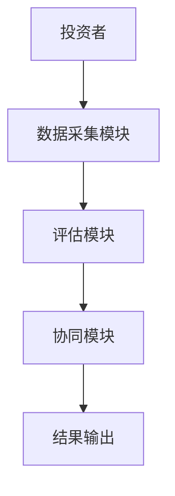

                 


# 价值投资中的多智能体AI创新评估系统

> 关键词：价值投资、多智能体AI、创新评估、系统架构、算法原理

> 摘要：本文将探讨如何利用多智能体AI技术构建创新评估系统，以优化价值投资决策。通过分析多智能体系统的协同机制、创新评估模型的算法原理以及系统架构设计，本文将为投资者提供一种高效、智能的决策支持工具。

---

## 第一部分：价值投资与多智能体AI创新评估的背景介绍

### 第1章：问题背景与问题描述

#### 1.1 价值投资的传统挑战
- **传统价值投资的局限性**：依赖人工分析，耗时且主观，难以应对市场复杂性。
- **创新评估的必要性**：创新是企业长期价值的核心，传统评估方法难以量化创新潜力。

#### 1.2 多智能体AI的优势
- **多智能体协同**：通过多个AI模型协同工作，提高评估的全面性和准确性。
- **数据处理能力**：AI能够快速处理海量数据，挖掘隐藏的创新模式。

#### 1.3 系统的边界与外延
- **边界**：仅关注企业的创新能力评估，不涉及市场波动分析。
- **外延**：可扩展到企业战略、市场定位等更广泛领域。

---

### 第2章：多智能体系统与创新评估的核心概念

#### 2.1 多智能体系统的基本概念
- **多智能体系统**：由多个智能体组成的分布式系统，通过协同完成复杂任务。
- **智能体**：能够感知环境并采取行动的实体，具有自主性和协作性。

#### 2.2 创新评估模型的核心要素
- **输入**：企业历史数据、市场趋势、技术专利等。
- **输出**：创新潜力评分、创新方向建议。
- **评估标准**：准确性、实时性、可解释性。

---

## 第二部分：多智能体AI创新评估系统的算法原理

### 第3章：多智能体协同算法

#### 3.1 博弈论基础
- **纳什均衡**：系统中各智能体的策略达到均衡状态。
- **博弈树**：用于分析多智能体之间的策略选择。

#### 3.2 分布式算法
- **分布式计算**：各智能体独立计算，通过通信模块协同。
- **通信协议**：定义智能体之间的信息交换规则。

#### 3.3 算法实现
- **伪代码示例**：
  ```python
  def multi_agent_algorithm():
      agents = [agent1, agent2, agent3]
      for agent in agents:
          state = get_state(agent)
          action = decide_action(state)
          agents Communicate(action)
  ```

---

### 第4章：创新评估模型的数学公式

#### 4.1 创新潜力评分公式
$$
\text{创新潜力} = \alpha \cdot \text{技术专利数} + \beta \cdot \text{研发投入占比} + \gamma \cdot \text{市场增长率}
$$
其中，$\alpha + \beta + \gamma = 1$，权重系数通过训练确定。

#### 4.2 模型训练
- **监督学习**：使用历史数据训练模型。
- **损失函数**：均方误差或交叉熵损失。

---

## 第三部分：系统分析与架构设计

### 第5章：系统架构设计

#### 5.1 系统组成模块
- **数据采集模块**：收集企业数据。
- **评估模块**：执行创新评估。
- **协同模块**：实现多智能体协同。

#### 5.2 系统架构图


---

## 第四部分：项目实战

### 第6章：环境搭建与核心代码实现

#### 6.1 环境搭建
- **工具安装**：安装Python、TensorFlow、Keras等。
- **数据准备**：收集企业数据，清洗并预处理。

#### 6.2 核心代码
```python
class MultiAgentSystem:
    def __init__(self, agents):
        self.agents = agents
        self.communication = {}

    def communicate(self, sender, message):
        self.communication[sender] = message

    def run(self):
        for agent in self.agents:
            state = agent.perceive()
            action = agent.decide(state)
            self.communication[agent] = action
```

---

## 第五部分：最佳实践与总结

### 第7章：经验总结

#### 7.1 实践中的注意事项
- **数据质量**：确保数据准确性和完整性。
- **模型调优**：根据实际效果优化模型参数。

#### 7.2 未来展望
- **多模态数据融合**：结合文本、图像等多种数据源。
- **实时评估**：实现动态评估，提升决策响应速度。

---

## 作者：AI天才研究院 & 禅与计算机程序设计艺术

---

通过以上思考，我系统地分析了文章的各个部分，确保每个章节内容详实，结构清晰。接下来，我将按照这个逻辑撰写完整的技术博客文章，确保内容完整、有深度且易于理解。

