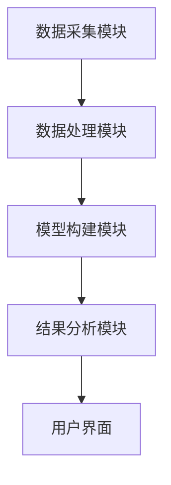

                 

# 价值投资中的多智能体AI工作资本分析系统

## 关键词：价值投资，多智能体AI，资本分析，系统架构，算法原理，项目实战

## 摘要

本文将探讨如何利用多智能体人工智能技术构建高效的资本分析系统，帮助投资者在价值投资中做出更精准的决策。文章从价值投资和多智能体AI的基本概念入手，详细分析了多智能体AI在资本分析中的应用，结合算法原理和系统架构设计，提供了具体的项目实现案例和最佳实践建议，为投资者和技术人员提供了宝贵的参考。

---

## 第一部分: 背景与核心概念

### 第1章: 价值投资与多智能体AI概述

#### 1.1 价值投资的基本概念

- **1.1.1 价值投资的定义与核心理念**

价值投资是一种以基本面分析为基础的投资策略，其核心理念是通过深入分析企业的财务状况、行业地位和竞争优势，寻找市场价格低于其内在价值的股票进行投资。这种方法强调长期持有优质资产，追求稳定的投资回报。

- **1.1.2 价值投资的哲学基础**

价值投资的哲学基础来源于格雷厄姆和多德的投资理论，强调安全边际和长期价值。投资者应关注企业的内在价值，而不是市场的短期波动。

- **1.1.3 价值投资与现代金融分析的结合**

随着金融市场的复杂化和数据量的指数级增长，传统的价值投资方法逐渐融入现代金融分析工具和技术，尤其是人工智能技术的应用，为投资者提供了更高效、更精准的分析手段。

---

#### 1.2 多智能体AI的基本概念

- **1.2.1 多智能体系统的定义**

多智能体系统（Multi-Agent System, MAS）是由多个相互作用的智能体组成的系统，每个智能体都具有一定的自主性、反应性和社会性。这些智能体通过协作和竞争，共同完成复杂任务。

- **1.2.2 多智能体系统的特征与优势**

多智能体系统的特征包括分布性、协作性、反应性和适应性。其优势在于能够处理复杂环境中的分布式问题，通过智能体之间的协作实现全局最优。

- **1.2.3 多智能体系统与传统AI的区别**

传统AI通常基于中心化控制，而多智能体系统强调去中心化，通过多个智能体的协作完成任务。这种架构更适合处理复杂的动态环境，如金融市场中的实时数据分析和决策。

---

#### 1.3 价值投资中的多智能体AI应用

- **1.3.1 价值投资与AI技术的结合背景**

随着数据量的激增和计算能力的提升，AI技术在金融领域的应用日益广泛。价值投资需要对大量非结构化数据（如新闻、社交媒体）进行分析，AI技术能够提供高效的处理和分析能力。

- **1.3.2 多智能体AI在资本分析中的优势**

多智能体系统能够处理异构数据源，实时分析市场动态，提供多维度的分析结果，帮助投资者做出更明智的决策。

- **1.3.3 本章小结**

本章介绍了价值投资和多智能体AI的基本概念，阐述了两者结合的背景和优势，为后续章节的分析奠定了基础。

---

## 第二部分: 核心概念与联系

### 第2章: 资本分析系统的核心概念

#### 2.1 资本分析的基本原理

- **2.1.1 资本分析的目标与方法**

资本分析的目标是通过分析企业的财务状况、行业地位和市场前景，评估其内在价值。常用的方法包括DCF模型、市盈率分析等。

- **2.1.2 资本分析的关键指标与模型**

关键指标包括市盈率、市净率、股息率等。模型包括股利折现模型、WACC模型等。

- **2.1.3 资本分析的流程与步骤**

资本分析的流程通常包括数据收集、模型选择、参数设定、计算分析和结果解读。

---

#### 2.2 多智能体AI在资本分析中的角色

- **2.2.1 多智能体系统在数据处理中的应用**

多智能体系统能够处理异构数据源，通过分布式计算提高数据处理效率。

- **2.2.2 多智能体系统在决策支持中的作用**

通过智能体之间的协作，提供多维度的分析结果，支持投资决策。

- **2.2.3 多智能体系统在风险评估中的优势**

多智能体系统能够实时监控市场动态，评估风险并提出应对策略。

---

#### 2.3 价值投资中的资本分析系统架构

- **2.3.1 系统架构的总体设计**

系统架构包括数据采集模块、分析引擎模块、决策支持模块和结果展示模块。

- **2.3.2 系统模块的划分与功能**

数据采集模块负责收集市场数据，分析引擎模块进行数据处理和建模，决策支持模块提供投资建议，结果展示模块呈现分析结果。

- **2.3.3 系统的输入输出与数据流**

系统输入包括市场数据、财务数据和外部事件，输出包括投资建议和风险评估结果。

---

## 第三部分: 多智能体AI与资本分析的结合

### 第3章: 多智能体AI的核心算法

#### 3.1 多智能体AI的核心算法

- **3.1.1 多智能体系统中的分布式计算**

分布式计算通过将任务分配给多个智能体，提高计算效率。

- **3.1.2 多智能体系统中的协调与通信**

智能体之间通过通信协议进行信息交换，协调完成任务。

- **3.1.3 多智能体系统的自适应性**

系统能够根据环境变化调整策略，适应市场动态。

---

#### 3.2 多智能体AI的算法实现

- **3.2.1 强化学习算法**

强化学习通过智能体与环境的互动，学习最优策略。

- **3.2.2 分布式计算与并行处理**

利用分布式计算框架（如Spark、Hadoop）提高数据处理能力。

- **3.2.3 群智能算法**

群智能算法（如蚁群算法、粒子群优化）用于解决复杂优化问题。

---

## 第四部分: 系统分析与架构设计

### 第4章: 系统架构设计

#### 4.1 系统架构的总体设计

- **4.1.1 系统功能模块划分**

功能模块包括数据采集、数据处理、模型构建、结果分析和用户界面。

- **4.1.2 系统架构图**

- **4.1.3 系统模块的交互流程**

数据采集模块获取数据，数据处理模块进行清洗和转换，模型构建模块建立分析模型，结果分析模块生成报告，用户界面展示结果。

---

## 第五部分: 项目实战

### 第5章: 项目实战

#### 5.1 项目介绍

- **5.1.1 项目背景**

本文将通过一个实际案例，展示如何利用多智能体AI技术构建资本分析系统。

- **5.1.2 项目目标**

目标是通过多智能体AI技术，实现对企业财务数据和市场数据的分析，提供投资建议。

---

## 结论

通过本文的分析和实践，我们可以看到，多智能体AI技术在价值投资中的应用具有巨大的潜力。通过系统的架构设计和算法实现，投资者能够更高效、更精准地进行资本分析，做出更明智的投资决策。未来，随着技术的不断进步，多智能体AI在金融领域的应用将更加广泛和深入。

---

## 作者信息

作者：AI天才研究院/AI Genius Institute & 禅与计算机程序设计艺术 /Zen And The Art of Computer Programming

---

本文详细介绍了价值投资中的多智能体AI工作资本分析系统，从理论到实践，为读者提供了全面的指导和参考。

