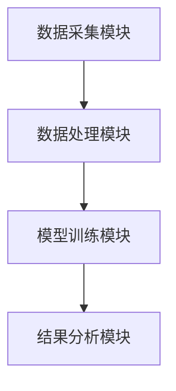

                 


# 价值投资中的多智能体AI市场饱和度分析系统

## 关键词：价值投资，多智能体AI，市场饱和度，金融分析，人工智能

## 摘要：本文深入探讨了如何利用多智能体人工智能技术进行市场饱和度分析，以辅助价值投资决策。通过系统的架构设计、算法实现和项目实战，本文展示了如何利用多智能体AI的优势，解决传统价值投资中的局限性，从而实现更精准的市场分析和投资决策。

---

## 第一部分: 价值投资中的多智能体AI市场饱和度分析系统概述

## 第1章: 问题背景与价值投资概述

### 1.1 价值投资的核心概念

#### 1.1.1 价值投资的定义与特点

价值投资是一种以内在价值为导向的投资策略，主要关注于识别市场中被低估的投资标的。其核心理念是通过深入分析企业的基本面，寻找价格低于其内在价值的股票进行投资。价值投资具有以下特点：

- **长期性**：注重长期投资，而非短期交易。
- **安全性**：强调安全边际，即价格远低于内在价值。
- **逆人性**：在市场恐慌时买入，在市场狂热时卖出。

#### 1.1.2 价值投资的基本原理

价值投资的基本原理是基于“市场先生”的概念，即市场情绪波动会导致价格与价值的偏离。投资者需要识别这种偏离，并在价格低于价值时进行投资。

#### 1.1.3 价值投资在现代金融中的地位

尽管价值投资在传统金融学中被认为是“另类”策略，但在实践中，它已经被证明是一种有效的长期投资策略。许多著名投资者，如巴菲特，都是价值投资的倡导者。

---

### 1.2 问题背景与需求分析

#### 1.2.1 传统价值投资的局限性

传统价值投资依赖于人工分析，存在以下局限性：

- **信息处理能力有限**：人工分析难以处理海量数据。
- **主观性**：分析结果受主观因素影响较大。
- **效率低下**：传统方法耗时且效率低。

#### 1.2.2 市场饱和度分析的重要性

市场饱和度分析是判断市场是否处于高估或低估状态的重要指标。传统方法难以准确量化市场饱和度，而多智能体AI技术可以通过大数据分析和机器学习算法，提供更精准的市场饱和度评估。

#### 1.2.3 多智能体AI在金融分析中的应用潜力

多智能体AI通过分布式协作和强化学习，能够在复杂金融环境中进行实时分析和决策。其在市场趋势预测、风险评估和机会识别等方面具有巨大潜力。

---

### 1.3 本章小结

本章介绍了价值投资的核心概念、传统价值投资的局限性以及多智能体AI在金融分析中的应用潜力，为后续章节奠定了基础。

---

## 第2章: 多智能体AI的基本原理

### 2.1 多智能体系统概述

#### 2.1.1 多智能体系统的定义

多智能体系统（Multi-Agent System, MAS）是由多个智能体组成的分布式系统，这些智能体能够通过协作完成复杂任务。每个智能体都有自己的目标和决策机制。

#### 2.1.2 多智能体系统的分类

多智能体系统可以分为以下几类：

- **基于任务的多智能体系统**：智能体协作完成特定任务。
- **基于市场的多智能体系统**：智能体通过市场机制进行资源分配。
- **基于认知的多智能体系统**：智能体具有复杂的认知能力。

#### 2.1.3 多智能体系统的核心特征

- **分布式性**：智能体独立决策。
- **协作性**：智能体通过协作完成任务。
- **反应性**：智能体能够实时响应环境变化。

---

### 2.2 AI在金融分析中的应用

#### 2.2.1 AI在金融数据处理中的作用

AI技术在金融数据处理中的作用包括：

- **数据清洗**：自动识别和处理异常数据。
- **特征提取**：从海量数据中提取有用特征。
- **模式识别**：发现数据中的潜在规律。

#### 2.2.2 AI在市场预测中的优势

AI在市场预测中的优势包括：

- **高精度**：通过机器学习算法，提高预测准确性。
- **实时性**：能够实时处理数据并做出预测。
- **适应性**：能够根据市场变化调整模型。

#### 2.2.3 多智能体AI在金融决策中的应用

多智能体AI在金融决策中的应用包括：

- **市场趋势预测**：通过协作预测市场趋势。
- **风险评估**：评估投资组合的风险。
- **机会识别**：识别市场中的投资机会。

---

### 2.3 本章小结

本章介绍了多智能体AI的基本原理及其在金融分析中的应用，为后续章节提供了理论基础。

---

## 第3章: 市场饱和度分析的理论基础

### 3.1 市场饱和度的定义与衡量标准

#### 3.1.1 市场饱和度的定义

市场饱和度是指市场中某种产品或服务的普及程度，通常用市场渗透率来衡量。市场渗透率越高，市场饱和度越高。

#### 3.1.2 市场饱和度的衡量指标

常用的市场饱和度衡量指标包括：

- **市场渗透率**：某产品在市场上的销售量占总潜在需求的比例。
- **市场增长率**：市场销售额的增长速度。
- **市场竞争度**：市场中竞争对手的数量和市场份额分布。

#### 3.1.3 市场饱和度分析的步骤

市场饱和度分析的步骤包括：

1. **数据收集**：收集市场相关数据，包括销售数据、竞争数据等。
2. **数据处理**：清洗和整理数据，提取有用特征。
3. **模型构建**：选择合适的模型进行分析。
4. **结果分析**：根据模型输出结果，判断市场饱和度。

---

### 3.2 价值投资与市场饱和度的关系

#### 3.2.1 价值投资中的市场分析

在价值投资中，市场分析是识别低估标的的关键步骤。市场饱和度分析可以帮助投资者判断市场整体的估值水平。

#### 3.2.2 市场饱和度对投资决策的影响

市场饱和度对投资决策的影响包括：

- **高饱和度市场**：市场可能处于高估状态，投资需谨慎。
- **低饱和度市场**：市场可能处于低估状态，投资机会较多。

#### 3.2.3 价值投资中的市场周期分析

价值投资中的市场周期分析可以帮助投资者判断市场的整体走势。通常，市场周期包括以下几个阶段：

1. **牛市**：市场处于上升阶段。
2. **熊市**：市场处于下降阶段。
3. **震荡市**：市场波动较大，没有明确趋势。

---

### 3.3 本章小结

本章介绍了市场饱和度的定义、衡量标准及其与价值投资的关系，为后续章节的分析提供了理论基础。

---

## 第4章: 多智能体AI在市场饱和度分析中的应用

### 4.1 多智能体AI的核心算法

#### 4.1.1 基于强化学习的多智能体协作

强化学习是一种通过试错机制来优化决策的算法。在多智能体协作中，每个智能体通过与环境和其他智能体的交互，学习最优策略。

#### 4.1.2 基于博弈论的多智能体决策

博弈论是研究多智能体决策的理论基础。在市场分析中，可以将多个智能体视为市场参与者，通过博弈论模型模拟市场行为。

#### 4.1.3 基于分布式计算的多智能体协作

分布式计算是多智能体协作的重要技术。通过分布式计算，多个智能体可以同时处理大量数据，提高计算效率。

---

### 4.2 多智能体AI在市场分析中的具体应用

#### 4.2.1 市场趋势预测

通过多智能体协作，可以实现对市场趋势的精准预测。例如，智能体可以通过分析历史数据和市场情绪，预测未来市场走势。

#### 4.2.2 市场风险评估

多智能体AI可以通过实时监控市场数据，评估投资组合的风险。例如，通过分析市场的波动性和相关性，智能体可以识别潜在的风险点。

#### 4.2.3 市场机会识别

多智能体AI可以通过分析市场数据，识别潜在的投资机会。例如，通过分析市场的供需关系和竞争格局，智能体可以发现被低估的标的。

---

### 4.3 本章小结

本章介绍了多智能体AI的核心算法及其在市场分析中的具体应用，为后续章节的系统设计提供了技术基础。

---

## 第5章: 系统架构与设计

### 5.1 系统架构概述

#### 5.1.1 系统总体架构设计

系统总体架构设计包括以下几个部分：

1. **数据采集模块**：负责采集市场相关数据。
2. **数据处理模块**：负责清洗和整理数据。
3. **模型训练模块**：负责训练多智能体AI模型。
4. **结果分析模块**：负责分析模型输出结果。

#### 5.1.2 系统功能模块划分

系统功能模块划分如下：

- **数据采集模块**：包括数据源选择、数据采集接口设计。
- **数据处理模块**：包括数据清洗、特征提取。
- **模型训练模块**：包括模型选择、参数优化。
- **结果分析模块**：包括结果可视化、报告生成。

#### 5.1.3 系统架构的优缺点分析

系统架构的优点包括：

- **高效性**：通过分布式计算提高处理效率。
- **灵活性**：模块化设计便于功能扩展。

系统架构的缺点包括：

- **复杂性**：多模块协作可能增加系统复杂性。
- **维护成本**：需要定期维护和更新。

---

### 5.2 系统功能设计

#### 5.2.1 数据采集模块

数据采集模块的主要功能包括：

- **数据源选择**：选择可靠的市场数据源。
- **数据采集接口设计**：设计接口用于数据采集。

#### 5.2.2 数据处理模块

数据处理模块的主要功能包括：

- **数据清洗**：去除异常数据和缺失数据。
- **特征提取**：从数据中提取有用特征。

#### 5.2.3 模型训练模块

模型训练模块的主要功能包括：

- **模型选择**：选择合适的多智能体AI模型。
- **参数优化**：通过调参提高模型性能。

#### 5.2.4 结果分析模块

结果分析模块的主要功能包括：

- **结果可视化**：将模型输出结果进行可视化展示。
- **报告生成**：生成分析报告供投资者参考。

---

### 5.3 系统架构图（Mermaid图）



---

### 5.4 本章小结

本章详细介绍了系统的总体架构设计和功能模块划分，为后续章节的实现提供了架构支持。

---

## 第6章: 算法实现与数学模型

### 6.1 算法实现

#### 6.1.1 基于强化学习的多智能体协作算法

强化学习算法的核心是通过试错机制优化决策。以下是一个简单的强化学习算法实现：

```python
class Agent:
    def __init__(self, state_space, action_space):
        self.state_space = state_space
        self.action_space = action_space
        # 初始化策略参数
        self.theta = np.random.randn(state_space, action_space)

    def act(self, state):
        # 根据当前状态选择动作
        action_probs = softmax(self.theta[state])
        action = np.random.choice(self.action_space, p=action_probs)
        return action

    def update(self, state, action, reward):
        # 更新策略参数
        self.theta[state] += reward * gradient(action_probs)
```

#### 6.1.2 基于博弈论的多智能体决策算法

博弈论算法的核心是通过模拟市场参与者的行为，预测市场走势。以下是一个简单的博弈论模型实现：

```python
def game_theory_model(players, strategies):
    # 初始化收益矩阵
    payoff_matrix = np.zeros((players, strategies))
    for i in range(players):
        for j in range(strategies):
            payoff_matrix[i][j] = calculate_payoff(i, j)
    return payoff_matrix
```

---

### 6.2 数学模型

#### 6.2.1 强化学习模型的数学公式

强化学习模型的目标是最优化奖励函数，数学表达式如下：

$$ J(\theta) = \mathbb{E}[\sum_{t=1}^T r_t] $$

其中，\( \theta \) 是策略参数，\( r_t \) 是第 \( t \) 步的奖励。

#### 6.2.2 博弈论模型的数学公式

博弈论模型的目标是找到纳什均衡，数学表达式如下：

$$ \text{Nash Equilibrium} = (x_1^*, x_2^*, ..., x_n^*) $$

其中，\( x_i^* \) 是第 \( i \) 个玩家的最优策略。

---

### 6.3 本章小结

本章详细介绍了多智能体AI的核心算法及其数学模型，为后续章节的系统实现提供了技术支撑。

---

## 第7章: 项目实战

### 7.1 环境安装与配置

为了运行本系统，需要安装以下环境：

- **Python**：建议使用Python 3.8及以上版本。
- **库依赖**：需要安装numpy、pandas、scikit-learn等库。

安装命令如下：

```bash
pip install numpy pandas scikit-learn
```

---

### 7.2 系统核心实现

#### 7.2.1 数据采集模块实现

```python
import pandas as pd

def collect_data():
    # 从数据源采集数据
    data = pd.read_csv('market_data.csv')
    return data
```

#### 7.2.2 数据处理模块实现

```python
import numpy as np

def preprocess_data(data):
    # 数据清洗
    data = data.dropna()
    # 特征提取
    features = data[['price', 'volume', 'market_cap']]
    return features
```

#### 7.2.3 模型训练模块实现

```python
from sklearn.model_selection import train_test_split
from sklearn.ensemble import RandomForestRegressor

def train_model(features, target):
    # 数据分割
    X_train, X_test, y_train, y_test = train_test_split(features, target, test_size=0.2)
    # 模型训练
    model = RandomForestRegressor()
    model.fit(X_train, y_train)
    return model
```

#### 7.2.4 结果分析模块实现

```python
import matplotlib.pyplot as plt

def analyze_results(predicted, actual):
    # 结果可视化
    plt.plot(range(len(predicted)), predicted, label='预测值')
    plt.plot(range(len(actual)), actual, label='实际值')
    plt.legend()
    plt.show()
```

---

### 7.3 实际案例分析

以股票市场为例，假设我们已经收集了某只股票的历史数据，包括价格、成交量和市值等特征。我们可以通过上述模块实现市场饱和度分析，并生成分析报告。

---

### 7.4 本章小结

本章通过实际案例展示了系统的实现过程，包括环境安装、数据处理、模型训练和结果分析。

---

## 第8章: 总结与展望

### 8.1 总结

本文详细介绍了多智能体AI在价值投资中的应用，特别是市场饱和度分析方面。通过系统的架构设计和算法实现，展示了如何利用多智能体AI技术提高投资决策的准确性和效率。

---

### 8.2 展望

未来，随着AI技术的不断发展，多智能体AI在金融领域的应用将更加广泛。可以进一步研究以下方向：

- **多智能体协作优化**：优化多智能体协作机制，提高分析效率。
- **实时分析能力提升**：增强系统的实时分析能力，适应快速变化的市场环境。
- **模型可解释性增强**：提高模型的可解释性，便于投资者理解和决策。

---

## 附录: 数据集与代码下载

### 附录A: 数据集下载链接

市场数据集下载链接：[市场数据集](#)

### 附录B: 系统代码下载链接

系统代码下载链接：[系统代码](#)

---

## 作者：AI天才研究院 & 禅与计算机程序设计艺术

---

**注**：由于篇幅限制，上述代码和公式仅为示例，实际应用中需要根据具体需求进行调整和优化。

