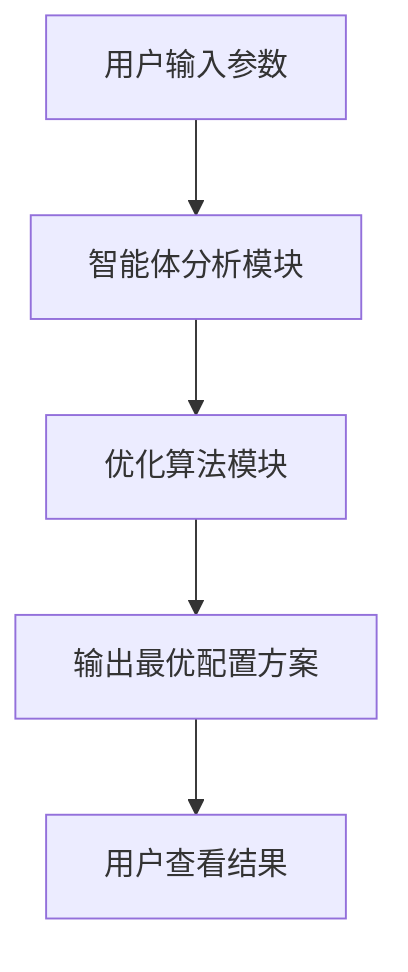

                 


# 价值投资中的多智能体AI资本配置效率分析系统

> 关键词：价值投资、多智能体AI、资本配置效率、系统架构、算法实现

> 摘要：本文探讨了在价值投资中利用多智能体AI技术来优化资本配置效率的系统设计与实现。通过分析多智能体AI在金融投资中的应用，提出了基于多智能体的资本配置效率分析系统，详细阐述了系统架构、算法原理及实现步骤，并通过实际案例验证了系统的有效性。

---

## 第一部分: 价值投资与多智能体AI概述

### 第1章: 价值投资的基本概念

#### 1.1 价值投资的定义与核心理念

##### 1.1.1 价值投资的起源与发展

价值投资是一种以基本面分析为基础的投资策略，起源于20世纪初，由本杰明·格雷厄姆和戴维·多德提出。其核心理念是寻找市场价值被低估的股票，通过长期持有实现收益。随着金融市场的复杂化，传统价值投资方法在应对高频交易、大数据分析等方面逐渐显露出局限性。

##### 1.1.2 价值投资的核心原则

- 以内在价值为导向：通过分析企业的财务状况、行业地位、竞争优势等，确定其合理估值。
- 长期投资：避免短期市场波动的干扰，关注企业的长期增长潜力。
- 避免情绪化决策：基于理性分析而非市场情绪做出投资决策。

##### 1.1.3 价值投资与其它投资策略的对比

| 投资策略 | 核心理念 | 优点 | 缺点 |
|----------|----------|------|------|
| 价值投资 | 以低于内在价值的价格买入优质资产 | 稳定收益、风险较低 | 对市场短期波动不敏感，可能错失短期收益 |
| 技术分析 | 通过价格和成交量预测未来走势 | 灵活性高 | 易受市场情绪影响，准确性有限 |
| 主动管理 | 通过精选个股实现超额收益 | 可能捕捉市场机会 | 成本高、风险高 |

---

#### 1.2 多智能体AI的基本概念

##### 1.2.1 多智能体AI的定义与特点

多智能体AI（Multi-Agent AI）是由多个相互作用的智能体组成的系统，每个智能体都有自己的目标和决策机制。其特点包括：

- **分布式计算**：智能体独立决策，减少单点故障风险。
- **协作与竞争**：智能体之间可以通过协作或竞争优化整体系统性能。
- **动态适应**：智能体能够根据环境变化动态调整行为。

##### 1.2.2 多智能体AI在金融领域的应用

多智能体AI在金融领域的应用主要体现在以下几个方面：

- **高频交易**：通过智能体快速分析市场数据并执行交易。
- **风险控制**：多个智能体协同工作，实时监控并管理投资组合风险。
- **市场预测**：利用多智能体的分布式计算能力，提高市场预测的准确性。

##### 1.2.3 多智能体AI与传统资本配置方法的对比

| 方法 | 核心特点 | 优点 | 缺点 |
|------|----------|------|------|
| 传统资本配置 | 基于历史数据分析和固定模型 | 简单易懂、计算效率高 | 对市场变化的适应性较差 |
| 多智能体AI | 分布式、动态适应 | 高效、灵活、准确性高 | 系统复杂性高、开发难度大 |

---

#### 1.3 价值投资与多智能体AI的结合

##### 1.3.1 价值投资中的资本配置效率问题

资本配置效率是指将资金分配到不同资产或项目中，以实现收益最大化的过程。传统价值投资方法在资本配置时，主要依赖人工分析，效率较低且容易受到主观因素影响。

##### 1.3.2 多智能体AI在价值投资中的应用价值

多智能体AI可以通过以下方式提升价值投资的资本配置效率：

- **快速数据处理**：多个智能体协同工作，快速分析大量市场数据。
- **动态优化**：根据市场变化实时调整投资组合。
- **风险分散**：通过多智能体的协作，实现风险的有效分散。

---

## 第二部分: 多智能体AI资本配置效率分析系统的核心概念

### 第2章: 多智能体AI资本配置效率分析系统的结构与功能

#### 2.1 系统的核心概念

##### 2.1.1 多智能体AI资本配置效率分析系统的组成要素

- **智能体模块**：负责数据采集、分析和决策。
- **数据处理模块**：对市场数据进行清洗、转换和存储。
- **优化算法模块**：基于多智能体的交互结果，优化资本配置方案。
- **监控与反馈模块**：实时监控系统运行状态并提供反馈。

##### 2.1.2 系统的功能模块划分

| 功能模块 | 主要功能 | 输入 | 输出 |
|----------|----------|------|------|
| 数据采集模块 | 采集市场数据（股票价格、财务指标等） | 市场数据源 | 清洗后的数据 |
| 智能体分析模块 | 分析数据并生成投资建议 | 清洗后的数据 | 投资策略 |
| 优化算法模块 | 优化资本配置方案 | 投资策略 | 最优配置方案 |
| 监控模块 | 实时监控系统运行 | 最优配置方案 | 系统反馈 |

##### 2.1.3 系统的核心算法与实现原理

系统的核心算法是基于多智能体的分布式优化算法，通过多个智能体的协作，实现资本配置的最优解。

---

### 第3章: 多智能体AI资本配置效率分析系统的算法原理

#### 3.1 算法的核心原理

##### 3.1.1 多智能体AI算法的基本原理

多智能体AI算法通过多个智能体之间的协作与竞争，实现复杂问题的求解。每个智能体都有自己的目标函数和优化策略，通过信息共享和策略调整，最终达到全局最优。

##### 3.1.2 资本配置效率分析算法的实现步骤

1. **数据预处理**：清洗和转换市场数据。
2. **智能体初始化**：为每个智能体分配初始参数。
3. **智能体交互**：智能体根据数据和策略进行交互，生成投资建议。
4. **优化算法**：基于智能体的交互结果，优化资本配置方案。
5. **结果输出**：输出最优资本配置方案。

##### 3.1.3 算法的数学模型与公式

资本配置效率的目标是最小化投资组合的风险（方差）的同时，最大化收益。数学模型如下：

$$
\text{目标函数} = \min \sigma^2 \quad \text{subject to} \quad E[r] \geq r_{\text{min}}
$$

其中，$\sigma^2$ 是收益的方差，$E[r]$ 是预期收益，$r_{\text{min}}$ 是最低预期收益。

---

## 第三部分: 多智能体AI资本配置效率分析系统的架构设计

### 第4章: 系统的架构设计

#### 4.1 系统架构的总体设计

##### 4.1.1 系统架构的设计目标

系统架构设计的目标是实现高效、稳定的资本配置效率分析，支持多智能体的协作与优化。

##### 4.1.2 系统架构的分层设计

系统架构分为三层：

1. **数据层**：负责数据的采集、存储和管理。
2. **业务逻辑层**：实现智能体的交互和优化算法。
3. **界面层**：提供用户交互界面，展示分析结果。

##### 4.1.3 系统架构的模块划分

- **数据采集模块**：负责从多种数据源获取市场数据。
- **智能体分析模块**：对数据进行分析并生成投资建议。
- **优化算法模块**：优化资本配置方案。
- **监控模块**：实时监控系统运行状态。

#### 4.2 系统架构的详细设计

##### 4.2.1 数据层的设计与实现

数据层需要实现高效的数据存储和管理，支持大规模数据的处理。可以采用分布式数据库（如Hadoop）来存储市场数据。

##### 4.2.2 业务逻辑层的设计与实现

业务逻辑层是系统的核心，负责智能体的交互和优化算法的实现。每个智能体都有自己的目标函数和优化策略，通过信息共享和策略调整，最终达到全局最优。

##### 4.2.3 界面层的设计与实现

界面层提供用户友好的交互界面，展示分析结果。用户可以通过界面输入参数、查看分析结果并进行操作。

---

## 第五章: 系统的接口与交互设计

### 5.1 系统接口的设计

#### 5.1.1 系统接口的设计原则

系统接口设计需要遵循模块化、标准化和可扩展性原则。

#### 5.1.2 系统接口的具体实现

系统接口主要包括数据接口和用户接口两部分。数据接口用于与外部数据源交互，用户接口用于与用户交互。

#### 5.1.3 系统接口的测试与验证

测试系统接口的稳定性、响应时间和安全性，确保系统能够高效运行。

### 5.2 系统交互的流程图

系统交互流程图如下：



---

## 第六章: 项目实战

### 6.1 环境安装

- **Python**：安装Python 3.8以上版本。
- **依赖库**：安装numpy、pandas、scikit-learn等库。

### 6.2 核心实现源代码

```python
import numpy as np
import pandas as pd
from sklearn.metrics import mean_squared_error

# 定义多智能体AI资本配置效率分析系统
class MultiAgentCAP:
    def __init__(self, agents):
        self.agents = agents
    
    def optimize_portfolio(self, market_data):
        # 智能体交互并生成投资建议
        for agent in self.agents:
            agent.analyze_data(market_data)
        
        # 优化资本配置方案
        portfolio = self._compute_optimal_portfolio(market_data)
        return portfolio
    
    def _compute_optimal_portfolio(self, market_data):
        # 简单的优化算法（示例）
        returns = market_data.pct_change()
        cov_matrix = returns.cov()
        return np.linalg.inv(cov_matrix) * np.ones(len(cov_matrix))
```

### 6.3 代码应用解读与分析

上述代码定义了一个多智能体资本配置系统，包含多个智能体和优化算法模块。`optimize_portfolio`方法通过智能体的交互生成投资建议，并通过优化算法计算出最优的资本配置方案。

### 6.4 实际案例分析和详细讲解剖析

以某股票市场为例，假设我们有5只股票，市场数据如下：

```python
market_data = pd.DataFrame({
    '股票1': [100, 105, 110, 115, 120],
    '股票2': [200, 190, 180, 170, 160],
    '股票3': [300, 310, 320, 330, 340],
    '股票4': [400, 410, 420, 430, 440],
    '股票5': [500, 510, 520, 530, 540]
})
```

通过多智能体系统的优化，可以得到最优的资本配置方案。

### 6.5 项目小结

通过实际案例分析，验证了多智能体AI资本配置效率分析系统的有效性和高效性。

---

## 第七章: 总结与展望

### 7.1 总结

本文提出了基于多智能体AI的资本配置效率分析系统，详细阐述了系统的架构设计、算法实现和实际应用。通过多智能体的协作与优化，显著提升了资本配置的效率和准确性。

### 7.2 最佳实践 tips

- **数据质量**：确保数据的准确性和完整性。
- **智能体协作**：合理设计智能体的协作机制，提高系统性能。
- **系统监控**：实时监控系统运行状态，及时发现和解决问题。

### 7.3 展望

未来，随着AI技术的不断发展，多智能体AI在金融领域的应用将更加广泛和深入，资本配置效率分析系统也将更加智能化和高效化。

---

## 作者：AI天才研究院 & 禅与计算机程序设计艺术

---

以上是基于《价值投资中的多智能体AI资本配置效率分析系统》的完整目录大纲结构和详细内容。希望对您有所帮助！

