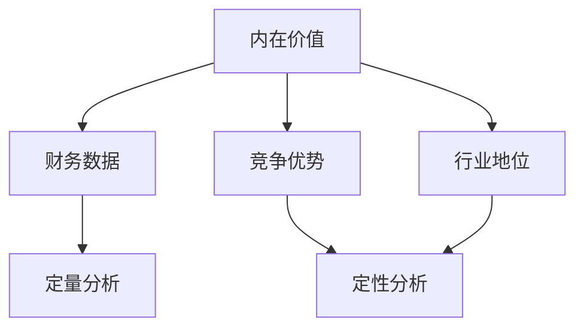

                 

# 价值投资中的定量与定性分析：数字之外的考量

## 关键词：价值投资，定量分析，定性分析，财务指标，DCF模型，公司治理，风险管理

## 摘要：  
价值投资是一种基于对公司内在价值的理解，通过分析财务数据和非财务因素来做出投资决策的方法。本文深入探讨了价值投资中的定量与定性分析，分析了两者的优缺点及其在实际投资中的应用。通过结合定量分析中的财务指标和模型，以及定性分析中的公司治理、管理团队等因素，投资者可以更好地评估企业的长期价值。本文还讨论了如何将定量与定性分析相结合，制定科学的投资策略，并通过实际案例分析展示了这些方法的实际应用。

---

## 第一部分: 价值投资中的定量与定性分析基础

### 第1章: 价值投资概述

#### 1.1 价值投资的定义与核心理念
##### 1.1.1 价值投资的定义
价值投资是一种基于对公司内在价值的评估，通过购买价格低于其内在价值的资产来获取长期收益的投资策略。它强调深入分析企业的财务状况、行业地位、竞争优势和管理团队等因素，以寻找具有可持续增长潜力的企业。

##### 1.1.2 价值投资的核心理念
- **安全边际**：购买价格低于内在价值，以降低投资风险。
- **长期视角**：关注企业的长期增长潜力，而非短期价格波动。
- **基本面分析**：通过分析企业的财务数据、行业地位和管理团队等，评估其内在价值。

##### 1.1.3 价值投资与现代投资理论的关系
价值投资与现代投资组合理论（MPT）和有效市场假说（EMH）存在一定的冲突，但其长期的实践效果证明了其有效性。价值投资强调的是对企业基本面的深入分析，而现代投资理论则更多关注资产的波动性和组合配置。

#### 1.2 价值投资的历史与发展
##### 1.2.1 价值投资的起源
价值投资的概念可以追溯到18世纪的英国经济学家亚当·斯密，但真正的发展始于20世纪初，尤其是本杰明·格雷厄姆和戴维·多德的贡献。

##### 1.2.2 价值投资的发展历程
- **早期阶段**：20世纪初，格雷厄姆和多德提出了“安全边际”和“内在价值”概念。
- **成熟阶段**：20世纪70年代，沃伦·巴菲特、彼得·林奇等投资者将价值投资理念进一步发展。
- **现代阶段**：随着金融工具的创新和大数据技术的应用，价值投资方法不断丰富。

##### 1.2.3 价值投资在现代金融中的地位
尽管有效市场假说认为价格反映了所有信息，但价值投资通过寻找市场误定价的机会，仍然在实践中取得了显著的成功。

#### 1.3 价值投资的核心要素与边界
##### 1.3.1 价值投资的核心要素
- **内在价值**：企业的实际价值，与市场价格可能不同。
- **安全边际**：购买价格低于内在价值，以降低风险。
- **竞争优势**：企业具备独特的竞争优势，能够持续创造价值。

##### 1.3.2 价值投资的边界与外延
价值投资并不适用于所有市场环境和资产类别，尤其在市场有效性和流动性较低的情况下，其效果可能受限。

##### 1.3.3 价值投资的概念结构与核心要素组成
图1展示了价值投资的核心要素及其相互关系：

---

### 第2章: 定量分析的核心概念与方法

#### 2.1 定量分析的定义与特点
##### 2.1.1 定量分析的定义
定量分析是通过数学模型和统计方法，分析企业的财务数据和市场数据，以评估其内在价值和投资价值。

##### 2.1.2 定量分析的核心特点
- **数据驱动**：依赖于财务数据和市场数据。
- **可量化**：通过数学模型将企业的价值量化。
- **客观性**：基于数据的分析相对客观，但忽略了非财务因素。

##### 2.1.3 定量分析与定性分析的对比
| 特性         | 定量分析              | 定性分析              |
|--------------|----------------------|----------------------|
| 数据来源     | 财务数据、市场数据    | 非财务数据、主观判断  |
| 分析方法     | 数学模型、统计分析    | 逻辑推理、案例分析    |
| 优缺点       | 客观、可量化，但忽略非财务因素 | 主观性强，但捕捉非财务因素 |

#### 2.2 常用的定量分析工具与指标
##### 2.2.1 市盈率（P/E）与市净率（P/B）
- **市盈率（P/E）**：股价除以每股收益，衡量股价是否高估或低估。
- **市净率（P/B）**：股价除以每股净资产，适用于评估银行、制造业等资产密集型行业。

##### 2.2.2 股息率与股息支付率
- **股息率**：股息与股价的比率，衡量股票的分红回报。
- **股息支付率**：股息与净利润的比率，衡量公司的分红意愿。

##### 2.2.3 净资产收益率（ROE）与资产回报率（ROA）
- **ROE**：净利润与净资产的比率，衡量股东资金的使用效率。
- **ROA**：净利润与总资产的比率，衡量资产的盈利能力。

##### 2.2.4 现金流分析与自由现金流（FCF）
- **现金流分析**：评估企业的真实盈利能力和流动性。
- **自由现金流（FCF）**：企业经营活动产生的现金流，用于再投资或分红。

#### 2.3 定量分析的数学模型与公式
##### 2.3.1 常用的估值模型
- **市盈率模型**：  
  $$ P = \text{P/E} \times \text{EPS} $$
- **市净率模型**：  
  $$ P = \text{P/B} \times \text{BPS} $$
- **现金流贴现模型（DCF）**：  
  $$ V = \sum_{t=1}^{n} \frac{CF_t}{(1+r)^t} + \frac{TV}{(1+r)^n} $$
  其中，\(CF_t\) 是第 \(t\) 年的现金流，\(r\) 是折现率，\(TV\) 是终值。

##### 2.3.2 DCF模型的数学公式
$$DCF = \frac{CF_1}{(1+r)^1} + \frac{CF_2}{(1+r)^2} + \cdots + \frac{CF_n}{(1+r)^n} + \frac{TV}{(1+r)^n}$$

##### 2.3.3 市盈率模型与市净率模型的对比
| 指标   | 市盈率模型           | 市净率模型           |
|--------|---------------------|---------------------|
| 适用性 | 适用于成长型企业     | 适用于资产密集型行业 |
| 优点   | 反映市场对收益的预期 | 反映市场对资产价值的评估 |
| 缺点   | 不适用于亏损企业     | 不适用于轻资产行业   |

#### 2.4 定量分析的局限性与改进方向
##### 2.4.1 定量分析的局限性
- 忽略了企业的竞争优势和管理团队。
- 依赖于假设条件，如折现率的选择。

##### 2.4.2 改进方向
- 结合定性分析，全面评估企业价值。
- 使用多元模型进行交叉验证。

---

### 第3章: 定性分析的核心概念与方法

#### 3.1 定性分析的定义与特点
##### 3.1.1 定性分析的定义
定性分析是通过逻辑推理和经验判断，分析企业的非财务因素，如管理团队、行业地位、竞争优势等。

##### 3.1.2 定性分析的核心特点
- **主观性**：依赖于分析师的判断和经验。
- **长期视角**：关注企业的可持续发展能力。
- **不可量化**：难以用数字直接衡量。

#### 3.2 定性分析的核心要素
##### 3.2.1 公司治理
- **董事会结构**：独立性和专业性。
- **管理层稳定性**：管理团队的稳定性与企业战略的一致性。

##### 3.2.2 管理团队
- **管理层信誉**：管理层的道德和诚信。
- **战略决策能力**：管理层在战略规划和执行中的表现。

##### 3.2.3 行业地位
- **市场占有率**：企业在行业中的地位。
- **竞争优势**：企业的核心竞争力。

##### 3.2.4 企业文化和价值观
- **企业愿景**：企业的长期发展目标。
- **企业价值观**：企业的文化和价值观对员工和客户的影响。

#### 3.3 定性分析的方法与工具
##### 3.3.1 企业竞争力分析
- **波特五力模型**：分析行业竞争结构。
- **SWOT分析**：分析企业的优势、劣势、机会和威胁。

##### 3.3.2 管理层分析
- **管理层稳定性分析**：分析管理层的变动历史和稳定性。
- **管理层决策能力分析**：分析管理层的战略决策和执行能力。

##### 3.3.3 行业分析
- **行业生命周期分析**：分析行业所处的生命周期阶段。
- **行业竞争格局分析**：分析行业内主要竞争者及其市场份额。

---

### 第4章: 定量与定性分析的结合

#### 4.1 定量与定性分析的结合方式
##### 4.1.1 信息互补
- 定量分析提供财务数据支持，定性分析提供非财务因素支持。

##### 4.1.2 投资决策的全面性
- 结合定量和定性分析，可以更全面地评估企业的内在价值和投资风险。

##### 4.1.3 风险管理
- 通过定量分析评估财务风险，通过定性分析评估市场风险和管理风险。

#### 4.2 结合定量与定性分析的实际案例
##### 4.2.1 案例背景
- 某制造业公司，财务数据良好，但行业竞争激烈，管理层变动频繁。

##### 4.2.2 定量分析
- 使用市盈率和ROE模型评估公司价值，发现其股价低于行业平均水平。

##### 4.2.3 定性分析
- 分析公司行业地位和管理层稳定性，发现公司在行业内竞争力较弱，管理层变动频繁，可能影响公司长期发展。

##### 4.2.4 结论
- 结合定量和定性分析，最终决定不投资该公司。

---

### 第5章: 风险管理与投资组合优化

#### 5.1 风险管理的核心概念
##### 5.1.1 风险的定义
- 投资者可能面临市场风险、流动性风险、信用风险和操作风险等。

##### 5.1.2 风险管理的目标
- 通过分散投资、风险对冲等方式降低投资风险。

#### 5.2 风险管理的定性与定量方法
##### 5.2.1 定量风险管理
- 使用VaR（在险价值）模型量化投资组合的风险。
- 使用夏普比率评估投资组合的风险调整后收益。

##### 5.2.2 定性风险管理
- 分析市场环境、政策风险和行业风险等非财务因素。

#### 5.3 投资组合优化
##### 5.3.1 投资组合优化的核心思想
- 根据投资者的风险偏好和收益目标，构建最优投资组合。

##### 5.3.2 现代投资组合理论（MPT）
- 通过分散投资降低非系统性风险。

---

### 第6章: 价值投资中的实际操作与案例分析

#### 6.1 实际操作中的定量与定性分析
##### 6.1.1 定量分析在实际操作中的应用
- 使用DCF模型评估目标公司的内在价值。
- 比较不同公司的市盈率和市净率，寻找低估的投资标的。

##### 6.1.2 定性分析在实际操作中的应用
- 分析目标公司的行业地位和竞争优势。
- 评估目标公司的管理团队和企业治理结构。

#### 6.2 案例分析
##### 6.2.1 案例背景
- 某科技公司，财务数据优秀，但行业竞争激烈。

##### 6.2.2 定量分析
- 使用DCF模型评估公司价值，发现其股价低于内在价值。

##### 6.2.3 定性分析
- 分析公司的行业地位和竞争优势，发现公司在行业内具有领先地位，且管理层稳定，战略清晰。

##### 6.2.4 结论
- 结合定量和定性分析，决定投资该公司。

---

### 第7章: 价值投资的长期策略与风险管理

#### 7.1 长期投资策略
##### 7.1.1 长期投资的核心思想
- 长期持有优质资产，分享企业的成长。

##### 7.1.2 长期投资的实施步骤
- 选择具有持续竞争优势的企业。
- 长期持有，定期复盘和调整。

#### 7.2 风险管理与投资组合优化
##### 7.2.1 风险管理的核心思想
- 通过分散投资和风险对冲降低投资风险。

##### 7.2.2 投资组合优化的关键点
- 根据市场环境和个人风险偏好调整投资组合。

---

## 结语
价值投资是一种以基本面分析为核心的投资方法，通过结合定量和定性分析，投资者可以更好地评估企业的内在价值和投资风险。在实际操作中，投资者需要灵活运用这些方法，结合市场环境和个人判断，制定科学的投资策略。未来，随着技术的进步和金融市场的变化，价值投资方法将不断丰富和发展。

---

## 作者：AI天才研究院/AI Genius Institute & 禅与计算机程序设计艺术 /Zen And The Art of Computer Programming

