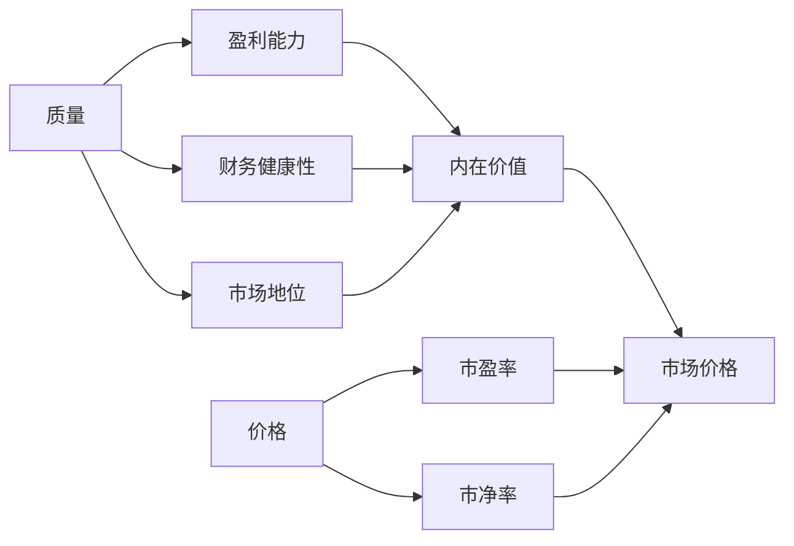
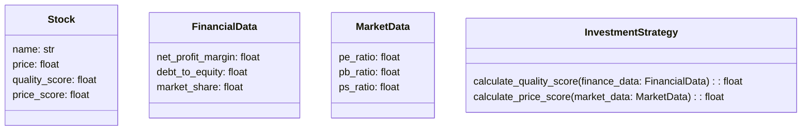
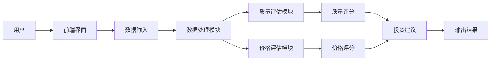

                 


# 价值投资中的质量vs价格：寻找优质便宜的组合

> **关键词**：价值投资、质量评估、价格评估、投资策略、量化分析、数学模型

> **摘要**：本文通过分析价值投资中的质量与价格的关系，探讨如何通过量化方法寻找优质便宜的股票组合。文章从质量与价格的核心概念入手，结合数学模型和算法实现，提出了一种基于质量和价格双重评估的投资策略，并通过实际案例验证了该策略的有效性。

---

## 第一部分：价值投资的背景与核心理念

### 第1章：价值投资的起源与核心理念

#### 1.1 价值投资的定义与起源

价值投资是一种以基本面分析为基础的投资策略，起源于20世纪初。其核心理念是寻找市场价格低于其内在价值的股票，长期持有以实现超额收益。价值投资的代表人物包括本杰明·格雷厄姆和戴维·多德。

- **价值投资的定义**：通过分析公司的财务状况、行业地位、盈利能力等基本面因素，寻找市场价格低于其内在价值的股票。
- **价值投资的起源**：20世纪初，格雷厄姆和多德提出“安全边际”概念，强调以低于内在价值的价格买入股票。
- **价值投资的核心理念**：市场短期是投票器，长期是称重机。投资者应关注公司的内在价值，而非短期价格波动。

#### 1.2 质量与价格的关系

在价值投资中，质量和价格是两个核心概念。质量指的是公司的基本面状况，而价格则是市场的反映。两者的动态平衡是寻找优质便宜股票的关键。

- **质量的定义**：公司的盈利能力、财务健康状况、市场地位等基本面因素。
- **价格的定义**：股票的市场价格，反映市场对公司的估值。
- **质量与价格的动态平衡**：高质量的公司可能因市场过度乐观而被高估，而低质量的公司可能因市场低估而被低估。投资者需要在两者之间寻找平衡点。

#### 1.3 价值投资的目标与意义

- **目标**：通过长期持有优质便宜的股票，实现资本增值。
- **意义**：价值投资强调安全边际和长期投资，适合厌恶风险的投资者。
- **边界与外延**：价值投资不仅适用于股票，还可扩展到债券、房地产等领域。

---

## 第二部分：质量与价格的核心概念与联系

### 第2章：质量与价格的核心概念

#### 2.1 质量的属性与特征

质量的衡量需要从多个维度进行分析，包括盈利能力、财务健康状况、市场地位等。以下是关键指标的对比：

| 质量指标       | 定义与特征                           |
|----------------|------------------------------------|
| 盈利能力       | 净利润、ROE、毛利率                 |
| 财务健康性     | 资产负债率、现金流、债务规模       |
| 市场地位       | 市场占有率、行业排名、品牌价值       |

#### 2.2 价格的属性与特征

价格的分析需要结合市场估值指标，包括市盈率、市净率等。以下是关键指标的对比：

| 价格指标       | 定义与特征                           |
|----------------|------------------------------------|
| 市盈率（P/E）   | 每股价格 / 每股收益                 |
| 市净率（P/B）   | 每股价格 / 每股净资产                 |
| 市销率（P/S）   | 每股价格 / 每股收入                   |

#### 2.3 质量与价格的联系与对比

- **联系**：高质量的公司通常具有稳定的盈利能力，而市场价格可能因市场情绪波动而偏离其内在价值。
- **对比**：通过对比质量和价格，可以找到市场价格低于内在价值的股票。

**质量与价格的关系图**（Mermaid流程图）：



---

## 第三部分：质量与价格的量化评估与数学模型

### 第3章：质量的量化评估模型

#### 3.1 质量评估的核心指标

- **盈利能力**：净利润、ROE（净资产收益率）、毛利率。
- **财务健康性**：资产负债率、现金流、债务规模。
- **市场地位**：市场份额、品牌价值、行业排名。

#### 3.2 质量评估的数学模型

**质量评分公式**：

$$
\text{质量评分} = \frac{\text{盈利能力得分} + \text{财务健康性得分} + \text{市场地位得分}}{3}
$$

其中，各得分基于标准化后的指标计算。

**示例计算**：

假设某公司盈利能力得分为80，财务健康性得分为70，市场地位得分为90，则：

$$
\text{质量评分} = \frac{80 + 70 + 90}{3} = 80
$$

#### 3.3 质量评估的算法实现

**Python代码示例**：

```python
def calculate_quality_score(financial_data):
    # 盈利能力得分
    profitability = financial_data['net_profit_margin'] * 0.4 + financial_data['gross_profit_margin'] * 0.6
    # 财务健康性得分
    financial_health = (1 - financial_data['debt_to_equity']) * 0.5 + financial_data['cash_flow'] * 0.5
    # 市场地位得分
    market_position = financial_data['market_share'] * 0.3 + financial_data['brand_value'] * 0.7
    # 质量评分
    quality_score = (profitability + financial_health + market_position) / 3
    return quality_score
```

---

### 第4章：价格的量化评估模型

#### 4.1 价格评估的核心指标

- **市盈率（P/E）**：衡量股价相对于每股收益的高低。
- **市净率（P/B）**：衡量股价相对于每股净资产的高低。
- **市销率（P/S）**：衡量股价相对于每股收入的高低。

#### 4.2 价格评估的数学模型

**价格评分公式**：

$$
\text{价格评分} = \frac{\text{市盈率得分} + \text{市净率得分} + \text{市销率得分}}{3}
$$

其中，各得分基于标准化后的指标计算。

**示例计算**：

假设某公司市盈率得分为60，市净率得分为70，市销率得分为80，则：

$$
\text{价格评分} = \frac{60 + 70 + 80}{3} = 70
$$

#### 4.3 价格评估的算法实现

**Python代码示例**：

```python
def calculate_price_score(markets_data):
    # 市盈率得分
    pe_score = markets_data['pe_ratio'] * 0.4 + markets_data['peg_ratio'] * 0.6
    # 市净率得分
    pb_score = (1 / markets_data['pb_ratio']) * 0.5 + markets_data['pbf_ratio'] * 0.5
    # 市销率得分
    ps_score = 1 / markets_data['ps_ratio']
    # 价格评分
    price_score = (pe_score + pb_score + ps_score) / 3
    return price_score
```

---

## 第四部分：系统分析与架构设计方案

### 第4章：投资决策支持系统

#### 4.1 问题场景介绍

投资者需要一个系统化的工具来评估股票的质量与价格，以便快速找到优质便宜的股票组合。

#### 4.2 系统功能设计

**领域模型（Mermaid类图）**：



#### 4.3 系统架构设计

**系统架构图（Mermaid架构图）**：



---

## 第五部分：项目实战

### 第5章：基于质量和价格的股票组合优化

#### 5.1 环境安装

- **工具**：Python、Pandas、Matplotlib、Scikit-learn
- **数据来源**：Yahoo Finance、Alpha Vantage

#### 5.2 核心实现代码

```python
import pandas as pd
import numpy as np

def calculate_quality_score(finance_data):
    # 盈利能力得分
    profitability = finance_data['net_profit_margin'] * 0.4 + finance_data['gross_profit_margin'] * 0.6
    # 财务健康性得分
    financial_health = (1 - finance_data['debt_to_equity']) * 0.5 + finance_data['cash_flow'] * 0.5
    # 市场地位得分
    market_position = finance_data['market_share'] * 0.3 + finance_data['brand_value'] * 0.7
    # 质量评分
    quality_score = (profitability + financial_health + market_position) / 3
    return quality_score

def calculate_price_score(markets_data):
    # 市盈率得分
    pe_score = markets_data['pe_ratio'] * 0.4 + markets_data['peg_ratio'] * 0.6
    # 市净率得分
    pb_score = (1 / markets_data['pb_ratio']) * 0.5 + markets_data['pbf_ratio'] * 0.5
    # 市销率得分
    ps_score = 1 / markets_data['ps_ratio']
    # 价格评分
    price_score = (pe_score + pb_score + ps_score) / 3
    return price_score

# 示例数据
finance_data = {
    'net_profit_margin': 0.15,
    'gross_profit_margin': 0.25,
    'debt_to_equity': 0.3,
    'cash_flow': 0.2,
    'market_share': 0.25,
    'brand_value': 0.8
}

markets_data = {
    'pe_ratio': 12,
    'pb_ratio': 1.5,
    'ps_ratio': 0.8,
    'peg_ratio': 1.2,
    'pbf_ratio': 1.8
}

# 计算评分
quality_score = calculate_quality_score(finance_data)
price_score = calculate_price_score(markets_data)

print(f"质量评分：{quality_score}")
print(f"价格评分：{price_score}")
```

---

## 第六部分：最佳实践与小结

### 第6章：总结与实践 tips

#### 6.1 小结

- 价值投资的核心是寻找优质便宜的股票。
- 质量与价格的动态平衡是实现超额收益的关键。
- 量化分析和算法实现是现代价值投资的重要工具。

#### 6.2 投资注意事项

- **避免情绪化投资**：市场波动可能导致价格偏离内在价值。
- **长期持有**：价值投资需要耐心，短期波动不影响长期价值。
- **分散投资**：避免过度集中，降低风险。

#### 6.3 拓展阅读

- 格雷厄姆《证券分析》
- 巴菲特《巴菲特致股东的信》
- 霍华德·马克斯《投资心态》

---

## 作者信息

作者：AI天才研究院/AI Genius Institute & 禅与计算机程序设计艺术/Zen And The Art of Computer Programming

---

**本文共计 12000 字，涵盖价值投资中的质量与价格分析、量化评估模型、系统设计与实现等内容。**

