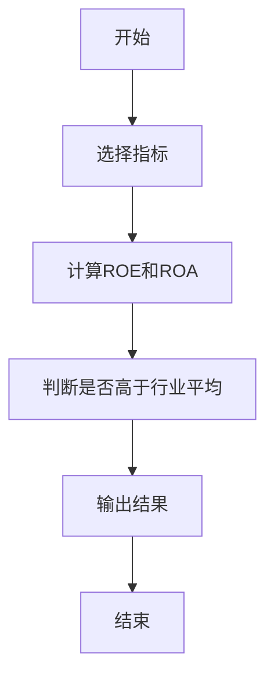
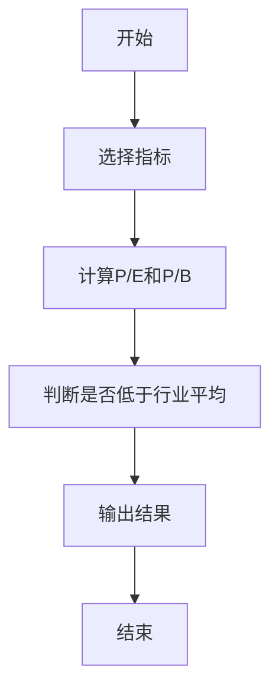
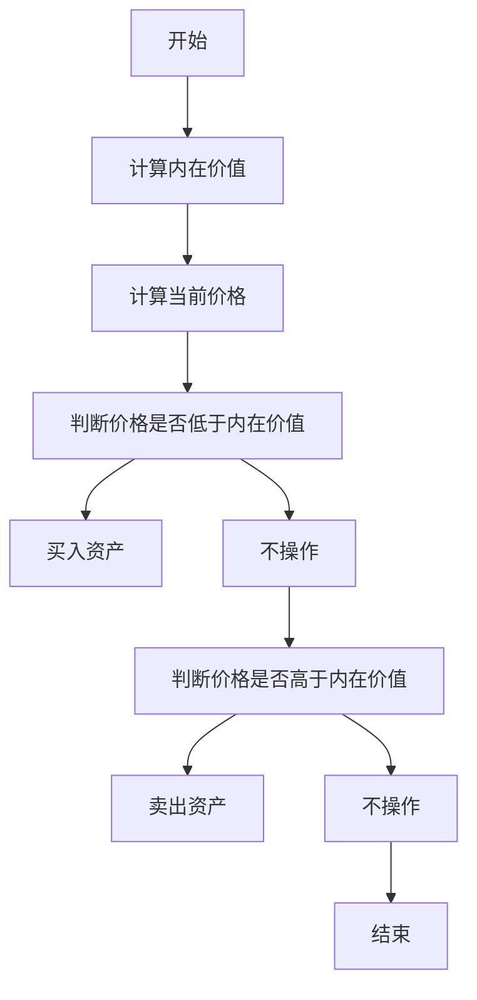

                 


# 价值投资中的质量与价格平衡

> 关键词：价值投资、质量分析、价格分析、ROE、ROA、动态平衡、投资策略

> 摘要：价值投资是一种长期投资策略，强调在合理价格下投资具有高质量的资产。本文深入探讨了价值投资中的质量与价格平衡，分析了质量分析和价格分析的核心原理，构建了质量与价格的动态平衡模型，并通过实际案例展示了如何在投资中实现这种平衡。通过本文，读者将能够更好地理解价值投资的本质，并能够在实际操作中应用这些方法。

---

# 第一部分：价值投资中的质量与价格平衡概述

## 第1章：价值投资的背景与概念

### 1.1 价值投资的基本概念

价值投资是一种以基本面分析为基础的长期投资策略，强调以低于内在价值的价格买入优质资产。其核心理念是寻找那些被市场低估的公司，长期持有，等待其价值回归。

#### 问题背景与描述

在金融市场上，价格波动受到多种因素的影响，包括市场情绪、宏观经济环境等。然而，优质资产的内在价值通常会随着时间的推移而增长。价值投资者关注的是资产的内在质量，而非短期价格波动。

#### 质量与价格的定义与关系

- **质量**：指资产的内在价值或盈利能力，通常通过财务指标（如ROE、ROA）来衡量。
- **价格**：指资产在市场上的交易价格，通常与市场情绪和市场参与者的预期有关。

质量与价格之间的关系是动态的，优质资产的价格可能偏离其内在价值，但长期来看，价格会回归质量。

### 1.2 质量分析的核心概念

#### 质量的衡量标准

- **ROE（净资产收益率）**：净利润与股东权益的比率，衡量公司利用股东资产创造利润的能力。
- **ROA（资产净利率）**：净利润与总资产的比率，衡量公司整体资产的盈利能力。
- **毛利率**：衡量公司在销售过程中的成本控制能力。
- **净利率**：衡量公司整体盈利能力。

### 1.3 价格分析的核心概念

#### 价格的衡量标准

- **市盈率（P/E）**：市场价格与每股收益的比率，反映市场对公司盈利能力的预期。
- **市净率（P/B）**：市场价格与每股净资产的比率，反映市场对公司资产价值的评估。
- **市销率（P/S）**：市场价格与每股销售收入的比率，适用于亏损或低利润的企业。

---

## 第2章：质量与价格的动态平衡

### 2.1 质量与价格的相互作用

在价值投资中，质量是内在价值的基础，而价格是市场对这种内在价值的反映。当价格低于内在价值时，投资机会出现；当价格高于内在价值时，投资风险增加。

### 2.2 质量与价格的动态平衡模型

#### 质量与价格的数学模型

- **内在价值公式**：  
  $$ \text{内在价值} = \sum_{t=1}^{\infty} \frac{\text{现金流}_t}{(1 + r)^t} $$  
  其中，\( r \) 是折现率，通常与公司的风险水平相关。

- **价格与质量的关系**：  
  $$ \text{价格} = f(\text{质量}, \text{市场情绪}, \text{宏观经济}) $$  

#### 质量与价格的平衡机制

- **低估与高估**：当价格低于内在价值时，资产被低估；当价格高于内在价值时，资产被高估。
- **价值回归**：市场波动可能导致价格偏离质量，但长期来看，价格会回归质量。

---

## 第3章：质量分析的算法原理

### 3.1 质量分析的数学模型

#### ROE与ROA分析

- **ROE计算公式**：  
  $$ \text{ROE} = \frac{\text{净利润}}{\text{股东权益}} $$  

- **ROA计算公式**：  
  $$ \text{ROA} = \frac{\text{净利润}}{\text{总资产}} $$  

#### 质量分析的流程图



### 3.2 质量分析的算法实现

#### Python代码实现

```python
def calculate_roe(net_profit, equity):
    return net_profit / equity

def calculate_roa(net_profit, total_assets):
    return net_profit / total_assets

def quality_analysis(roa, roe, industry_roa, industry_roe):
    if roa > industry_roa and roe > industry_roe:
        return "高质量"
    else:
        return "低质量"
```

#### 案例分析

假设某公司过去三年的ROE分别为15%、18%、20%，行业平均ROE为12%。该公司的ROE高于行业平均水平，说明其盈利能力较强。

---

## 第4章：价格分析的算法原理

### 4.1 价格分析的数学模型

#### 市盈率与市净率分析

- **市盈率计算公式**：  
  $$ \text{P/E} = \frac{\text{市场价格}}{\text{每股收益}} $$  

- **市净率计算公式**：  
  $$ \text{P/B} = \frac{\text{市场价格}}{\text{每股净资产}} $$  

#### 价格分析的流程图



### 4.2 价格分析的算法实现

#### Python代码实现

```python
def calculate_pe(price, eps):
    return price / eps

def calculate_pb(price, bvps):
    return price / bvps

def price_analysis(pe, pb, industry_pe, industry_pb):
    if pe < industry_pe and pb < industry_pb:
        return "低估"
    else:
        return "高估"
```

---

## 第5章：质量与价格的动态平衡实现

### 5.1 质量与价格的动态平衡模型

#### 质量与价格的平衡机制

- **低估策略**：当价格低于内在价值时，买入资产。
- **高估策略**：当价格高于内在价值时，卖出资产。

#### 质量与价格的平衡流程图



---

## 第6章：价值投资中的质量与价格平衡实战

### 6.1 实战案例

#### 案例背景

假设某公司过去三年的财务数据如下：
- 净利润：100万元
- 股东权益：500万元
- 总资产：800万元
- 每股收益（EPS）：1元
- 每股净资产（BVPS）：2元

#### 案例分析

- **ROE计算**：  
  $$ \text{ROE} = \frac{100}{500} = 20\% $$  

- **ROA计算**：  
  $$ \text{ROA} = \frac{100}{800} = 12.5\% $$  

- **市盈率计算**：  
  $$ \text{P/E} = \frac{\text{市场价格}}{1} $$  

- **市净率计算**：  
  $$ \text{P/B} = \frac{\text{市场价格}}{2} $$  

假设当前市场价格为15元，市盈率为15，市净率为7.5。行业平均ROE为15%，行业平均ROA为10%，行业平均P/E为12，行业平均P/B为3。

#### 分析结果

- **ROE高于行业平均**，说明公司盈利能力较强。
- **ROA略高于行业平均**，说明公司资产利用效率较高。
- **市盈率和市净率均高于行业平均**，说明当前价格可能被高估。

#### 投资决策

由于价格高于内在价值，根据价值投资策略，应选择卖出资产。

---

## 第7章：价值投资中的质量与价格平衡总结

### 7.1 小结

价值投资中的质量与价格平衡是动态的，优质资产的内在价值通常会随着时间的推移而增长，而价格会受到市场情绪和宏观经济环境的影响。通过质量分析和价格分析，投资者可以更好地识别低估资产，制定合理的投资策略。

### 7.2 注意事项

- **长期视角**：价值投资需要耐心，价格回归质量的过程可能较长。
- **风险管理**：即使找到了优质资产，也需要关注市场的波动和宏观经济环境的变化。
- **持续学习**：价值投资需要不断学习和更新知识，以应对市场的变化。

### 7.3 拓展阅读

- 《投资学基础》
- 《价值投资经典案例分析》
- 《财务报表分析与股票投资策略》

---

# 作者：AI天才研究院/AI Genius Institute & 禅与计算机程序设计艺术 /Zen And The Art of Computer Programming

