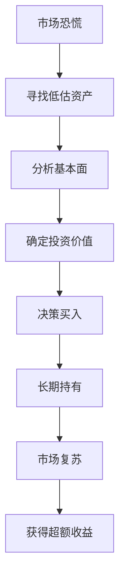
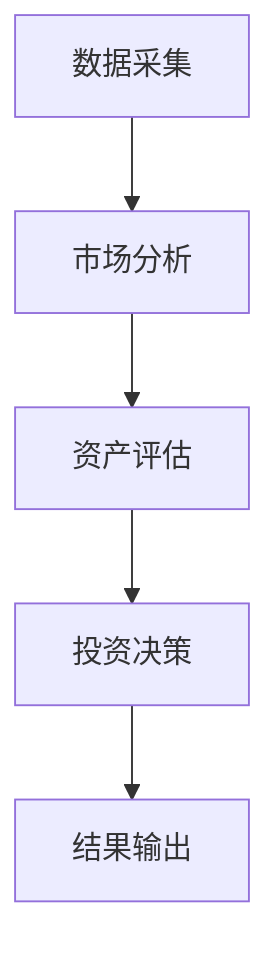
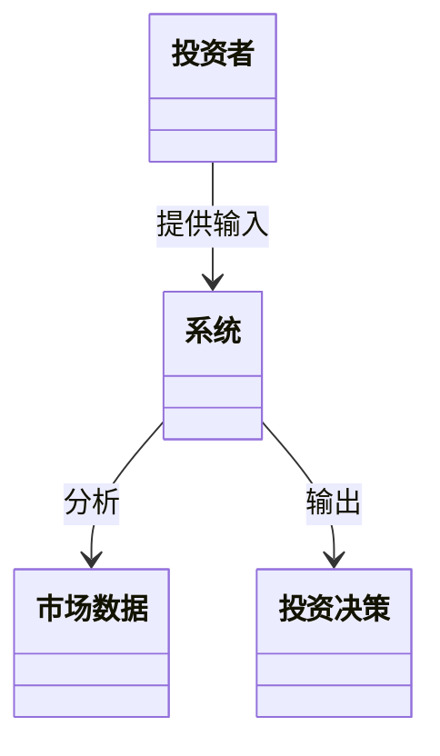

                 


---

# 价值投资中的逆向思维：当别人恐惧时贪婪

## 关键词：价值投资、逆向思维、巴菲特定律、投资策略、数学模型、系统架构、项目实战

## 摘要：本文深入探讨了价值投资中的逆向思维，分析了其核心概念、数学模型、系统架构以及实际案例。通过对比正向思维与逆向思维，结合巴菲特定律，展示了如何在市场恐慌时发现投资机会。文章详细阐述了价值评估的数学公式，设计了投资决策系统的架构，并通过实际案例分析，为读者提供了实用的投资策略和注意事项。

---

## 第一部分: 价值投资中的逆向思维基础

### 第1章: 价值投资的基本概念

#### 1.1 价值投资的定义与核心理念

##### 1.1.1 价值投资的起源与发展

价值投资是一种长期投资策略，起源于20世纪初，由本杰明·格雷厄姆和戴维·多德提出。它强调购买那些市场价格低于其内在价值的资产。随着时间的发展，巴菲特将其发扬光大，形成了独特的投资哲学。

##### 1.1.2 价值投资的核心理念

价值投资的核心理念是寻找市场上的“定价错误”，即购买那些被市场低估的资产。投资者需要深入分析公司的基本面，如财务状况、盈利能力、行业地位等，以确定其内在价值。

##### 1.1.3 价值投资与其它投资策略的对比

与其他投资策略相比，价值投资更注重长期持有和安全边际。与趋势投资和短期交易不同，价值投资强调深度研究和长期回报。

#### 1.2 逆向思维在投资中的重要性

##### 1.2.1 逆向思维的定义

逆向思维是指在市场普遍恐慌或悲观时，寻找投资机会。它与价值投资的结合，使得投资者能够在市场低谷时买入优质资产。

##### 1.2.2 逆向思维在投资中的应用

逆向思维在投资中的应用包括在市场恐慌时买入低估资产、在市场乐观时卖出高估资产。这种方法可以帮助投资者在市场波动中获得超额收益。

##### 1.2.3 逆向思维的优势与局限性

优势：逆向思维能够在市场底部发现机会，避免追高杀低的错误。局限性：需要投资者具备强大的心理素质和深度分析能力。

#### 1.3 巴菲特定律与价值投资

##### 1.3.1 巴菲特的投资理念

巴菲特的投资理念强调长期持有、安全边际和股息回报。他注重公司的基本面，尤其是其竞争优势和管理层能力。

##### 1.3.2 巴菲特定律的核心思想

巴菲特定律认为，市场先生的情绪波动为理性投资者提供了低价买入优质资产的机会。逆向思维在巴菲特定律中得到了充分体现。

##### 1.3.3 巴菲特与逆向思维的结合

巴菲特在市场恐慌时大量买入优质资产，如在2008年金融危机期间抄底银行股。这种逆向操作体现了他投资理念的核心。

#### 1.4 价值投资的适用场景与边界

##### 1.4.1 价值投资的适用市场环境

价值投资在市场低迷、资产价格被低估时尤为适用。在市场恐慌时，逆向思维能够帮助投资者发现机会。

##### 1.4.2 价值投资的边界与限制

价值投资的局限性包括对市场短期波动的无能为力、对管理层决策的依赖以及对行业周期的敏感性。投资者需要在这些方面做好风险管理。

##### 1.4.3 价值投资与市场周期的关系

价值投资与市场周期密切相关。在市场底部，逆向思维能够帮助投资者发现低估资产；在市场顶部，价值投资可以帮助投资者避免高估风险。

#### 1.5 本章小结

本章介绍了价值投资的基本概念、逆向思维的重要性以及巴菲特定律的核心思想。价值投资强调长期基本面分析，逆向思维在市场恐慌时提供投资机会。

---

## 第2章: 逆向思维的核心概念与联系

### 2.1 逆向思维的原理与机制

#### 2.1.1 逆向思维的原理

逆向思维的原理是基于市场情绪的非理性波动。当市场恐慌时，投资者往往做出非理性决策，导致资产价格偏离其内在价值。逆向思维通过识别这种偏差，寻找投资机会。

#### 2.1.2 逆向思维在投资中的具体应用

逆向思维的具体应用包括在市场恐慌时买入低估资产、在市场乐观时卖出高估资产。这种方法需要投资者具备独立思考和深度分析能力。

#### 2.1.3 逆向思维的数学模型

逆向思维的数学模型可以通过概率论和统计学来分析市场波动。例如，利用均值回归理论预测资产价格的未来走势。

### 2.2 核心概念对比分析

#### 2.2.1 逆向思维与正向思维的对比

逆向思维与正向思维在市场情绪、决策时机和风险偏好上有显著差异。逆向思维强调在市场恐慌时寻找机会，而正向思维则在市场乐观时参与。

#### 2.2.2 不同投资策略的核心概念对比

不同投资策略的核心概念包括价值投资、趋势投资和套利投资。逆向思维在价值投资中尤为重要。

#### 2.2.3 逆向思维与其他投资策略的联系

逆向思维可以与其他投资策略结合，如结合趋势投资形成逆趋势投资策略。这种结合能够帮助投资者在市场波动中寻找机会。

### 2.3 实体关系图与流程图

#### 2.3.1 实体关系图（ER图）

```mermaid
erDiagram
    actor 投资者
    actor 市场
    actor 管理层
    entity 资产
    entity 财务报表
    entity 行业状况
    entity 市场情绪
    investor --> 资产 : 持有
    market --> 资产 : 价格波动
    management --> 资产 : 经营决策
    投资者 --> 财务报表 : 分析
    投资者 --> 行业状况 : 分析
    投资者 --> 市场情绪 : 分析
```

#### 2.3.2 逆向思维的流程图（Mermaid）



---

## 第3章: 价值投资中的数学模型与算法原理

### 3.1 价值评估的数学模型

#### 3.1.1 市盈率模型

市盈率（P/E）= 股价 / 每股净利润

$$ P/E = \frac{P}{E} $$

#### 3.1.2 市净率模型

市净率（P/B）= 股价 / 每股净资产

$$ P/B = \frac{P}{B} $$

#### 3.1.3 现金流折现模型

企业价值 = 现金流的现值之和

$$ V = \sum_{t=1}^{n} \frac{CF_t}{(1+r)^t} $$

### 3.2 逆向思维的算法原理

#### 3.2.1 逆向思维的算法流程

1. 监测市场情绪
2. 分析资产价格
3. 寻找低估资产
4. 做出投资决策

#### 3.2.2 逆向思维的数学表达式

$$ V_{\text{内在价值}} > V_{\text{市场价格}} $$

### 3.3 投资决策的数学公式

#### 3.3.1 投资价值计算公式

$$ V = \frac{EFC}{k} $$

其中，EFC为未来现金流，k为折现率。

#### 3.3.2 投资风险评估公式

$$ R = \frac{\text{标准差}}{\text{期望收益}} $$

#### 3.3.3 投资收益与风险的平衡公式

$$ \text{夏普比率} = \frac{R_p - R_f}{\sigma_p} $$

---

## 第4章: 投资决策的系统架构设计

### 4.1 投资决策系统概述

#### 4.1.1 系统目标与范围

系统目标是帮助投资者进行逆向思维决策。范围包括市场分析、资产评估和投资决策。

#### 4.1.2 系统功能模块划分

- 数据采集模块
- 市场分析模块
- 资产评估模块
- 投资决策模块

#### 4.1.3 系统架构设计



### 4.2 系统功能设计

#### 4.2.1 系统功能模块划分

- 数据采集：收集市场数据
- 市场分析：分析市场情绪
- 资产评估：评估资产价值
- 投资决策：做出投资决策

#### 4.2.2 系统架构图



#### 4.2.3 系统交互序列图

```mermaid
sequenceDiagram
    投资者 -> 系统 : 提供市场数据
    系统 -> 市场数据 : 分析
    系统 -> 投资决策 : 生成决策
    投资者 <- 系统 : 输出结果
```

---

## 第5章: 项目实战

### 5.1 环境安装

需要安装数据采集工具、数据分析工具和投资决策系统。

### 5.2 系统核心实现源代码

```python
def calculate_intrinsic_value(financials, discount_rate):
    cash_flows = calculate_future_cash_flows(financials)
    intrinsic_value = sum(cash_flow / (1 + discount_rate) ** t for t, cash_flow in enumerate(cash_flows))
    return intrinsic_value

def main():
    # 假设financials包含未来现金流数据
    financials = get_financial_data()
    discount_rate = 0.1  # 假设折现率为10%
    iv = calculate_intrinsic_value(financials, discount_rate)
    print(f"内在价值: {iv}")
```

### 5.3 代码应用解读与分析

代码展示了如何计算资产的内在价值。通过折现未来现金流，确定其内在价值是否低于市场价格。

### 5.4 实际案例分析

以某公司为例，分析其财务报表，计算内在价值，判断是否低估。

### 5.5 项目小结

通过项目实战，读者可以掌握逆向思维在实际投资中的应用，提高分析能力。

---

## 第6章: 总结与注意事项

### 6.1 逆向思维在价值投资中的重要性

逆向思维帮助投资者在市场恐慌时发现机会，提高投资回报。

### 6.2 投资中的注意事项

- 风险管理
- 深度分析
- 长期持有

### 6.3 未来投资趋势

随着市场的发展，逆向思维将更加重要。技术进步和数据驱动的投资分析将为逆向思维提供更多机会。

---

## 作者：AI天才研究院/AI Genius Institute & 禅与计算机程序设计艺术 /Zen And The Art of Computer Programming

--- 

通过以上结构和内容，读者可以系统地理解逆向思维在价值投资中的应用，掌握相关的数学模型和系统架构设计。希望这篇文章能为投资者提供有价值的见解和实用的策略。

