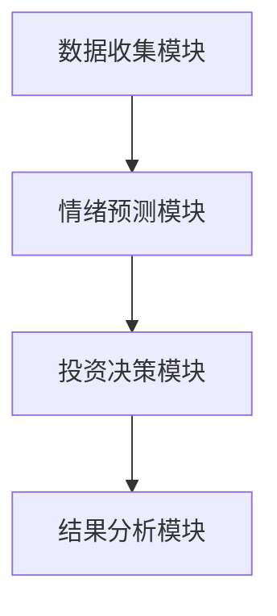

                 


# 《价值投资中的逆向思维：当别人恐惧时贪婪》

## 关键词：价值投资、逆向思维、市场情绪、风险管理、数据分析

## 摘要：
价值投资是一种长期投资策略，强调购买被市场低估的资产。逆向思维在价值投资中扮演着重要角色，尤其是在市场恐慌时，逆向思维能够帮助投资者识别低估机会。本文将从理论到实践，详细探讨逆向思维在价值投资中的应用，包括市场情绪分析、数据分析、风险管理策略等，并通过实际案例和系统架构设计，帮助投资者在实践中应用这些策略。

---

## 第一部分：价值投资与逆向思维的理论基础

### 第1章：价值投资概述

#### 1.1 价值投资的核心理念
- **定义与起源**：价值投资是一种以基本面分析为基础的投资策略，由本杰明·格雷厄姆和戴维·多德提出。它强调购买那些市场价格低于其内在价值的资产。
- **核心原则**：价值投资的核心是寻找安全边际，即市场价格与内在价值之间的差距。
- **市场周期的关系**：在市场繁荣时，价值投资者可能会感到困惑，但在市场恐慌时，他们往往能找到低估的机会。

#### 1.2 逆向思维的定义与特征
- **逆向思维的定义**：逆向思维是指在市场参与者普遍悲观或乐观时，采取相反的行动。例如，在市场恐慌时买入，在市场狂热时卖出。
- **特征**：逆向思维具有反直觉性、独立性和长期性。
- **与正向思维的对比**：正向思维跟随市场情绪，而逆向思维则反其道而行之。

#### 1.3 逆向思维在价值投资中的应用
- **核心要素**：独立思考、耐心、风险管理和深度研究。
- **优势**：逆向思维能够在市场底部找到机会，避免短期波动的干扰。
- **局限性**：需要投资者具备强大的心理素质和长期视角。

### 第2章：市场情绪与逆向思维

#### 2.1 市场情绪的定义与分类
- **定义**：市场情绪是指投资者在市场中的整体情绪状态，通常由贪婪和恐惧两种情绪驱动。
- **分类**：市场情绪可以分为乐观、中性和悲观三种状态。
- **与市场周期的关系**：市场情绪通常在市场顶部和底部达到极端状态。

#### 2.2 逆向思维与市场情绪的关系
- **在市场恐慌中的应用**：恐慌时，市场情绪低落，投资者可能卖出低估资产，逆向投资者可以买入。
- **在市场狂热中的应用**：狂热时，市场情绪高涨，投资者可能买入高估资产，逆向投资者可以卖出。
- **互动机制**：市场情绪影响资产价格，而逆向思维帮助投资者在极端情绪中找到机会。

#### 2.3 逆向思维的实践原则
- **独立思考**：避免被市场情绪左右，坚持自己的分析。
- **风险管理**：设置止损点，避免过度亏损。
- **长期投资**：逆向思维需要时间验证，长期持有优质资产。

---

## 第二部分：逆向思维的实践与应用

### 第3章：逆向思维的投资策略与风险管理

#### 3.1 逆向思维的投资策略
- **核心要素**：识别市场恐慌中的低估资产，制定买入计划。
- **资产配置**：根据市场情绪调整资产配置比例，如在市场恐慌时增加股票配置。
- **买入时机**：在市场恐慌时，选择优质资产进行买入。

#### 3.2 风险管理策略
- **止损策略**：设置止损点，避免过度亏损。
- **分散投资**：通过分散投资降低风险。
- **心理管理**：保持冷静，避免情绪化决策。

### 第4章：基于数据分析的逆向思维

#### 4.1 数据分析在逆向思维中的作用
- **数据来源**：包括历史价格、财务数据、市场情绪指标等。
- **分析方法**：使用技术分析、基本面分析和情绪分析。
- **工具与平台**：如Python、Excel、金融数据分析平台。

#### 4.2 技术指标与逆向思维
- **移动平均线（MA）**：用于识别超卖和超买状态。
- **相对强弱指数（RSI）**：用于判断资产的超买或超卖状态。
- **成交量分析**：用于判断市场情绪。

#### 4.3 情绪分析与逆向思维
- **情绪指标的计算**：通过新闻 sentiment 分析和社交媒体情绪分析，计算市场情绪指数。
- **案例分析**：如2020年新冠疫情市场恐慌中的情绪分析与投资策略。

---

## 第三部分：系统架构与实现

### 第5章：系统架构设计

#### 5.1 系统功能设计
- **数据收集模块**：收集历史价格、财务数据和情绪数据。
- **情绪预测模块**：基于机器学习模型预测市场情绪。
- **投资决策模块**：根据情绪预测和数据分析，生成投资策略。
- **结果分析模块**：分析投资结果，优化决策模型。

#### 5.2 系统架构图


#### 5.3 系统接口设计
- **输入接口**：接收外部数据源的数据。
- **输出接口**：输出投资决策和结果分析报告。

---

## 第四部分：项目实战

### 第6章：环境搭建与核心实现

#### 6.1 环境搭建
- **工具安装**：安装Python、Pandas、NumPy、Scikit-learn等库。
- **数据源选择**：选择金融数据API（如Yahoo Finance）。

#### 6.2 核心代码实现
```python
import pandas as pd
import numpy as np
from sklearn.linear_model import LinearRegression

# 数据预处理
data = pd.read_csv('market_data.csv')
data['Price'] = data['Close']
data = data.dropna()

# 情绪预测模型
model = LinearRegression()
X = data[['Volume', 'RSI']]
y = data['Price']
model.fit(X, y)

# 投资决策
predicted_price = model.predict(X)
threshold = np.percentile(predicted_price, 5)
buy_signals = data[predicted_price < threshold]
```

#### 6.3 代码解读
- **数据预处理**：清洗数据，处理缺失值。
- **模型训练**：使用线性回归模型预测价格。
- **投资决策**：根据预测结果，判断买入信号。

---

## 第五部分：总结与展望

### 第7章：总结与展望

#### 7.1 总结
- 逆向思维在价值投资中具有重要意义，尤其是在市场恐慌时。
- 数据分析和机器学习模型能够帮助投资者更好地识别机会和风险。
- 系统化的方法能够提高投资决策的效率和准确性。

#### 7.2 展望
- 结合AI技术进一步优化市场情绪预测模型。
- 开发更复杂的策略，如多资产配置和动态风险管理。
- 探索更多应用场景，如量化投资和对冲基金。

---

## 作者：AI天才研究院/AI Genius Institute & 禅与计算机程序设计艺术 /Zen And The Art of Computer Programming

---

这篇文章从理论到实践，全面探讨了逆向思维在价值投资中的应用。通过详细的章节划分和具体案例分析，帮助读者理解如何在市场恐慌时抓住机会。

