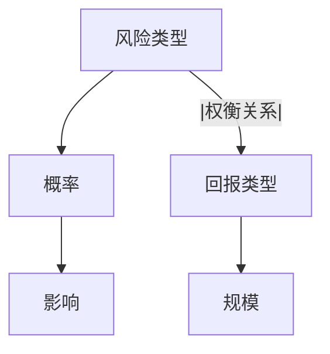
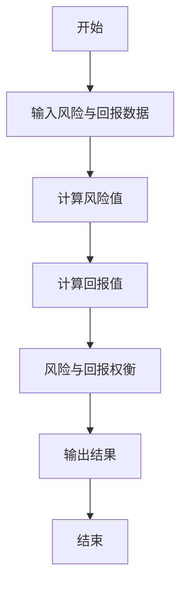
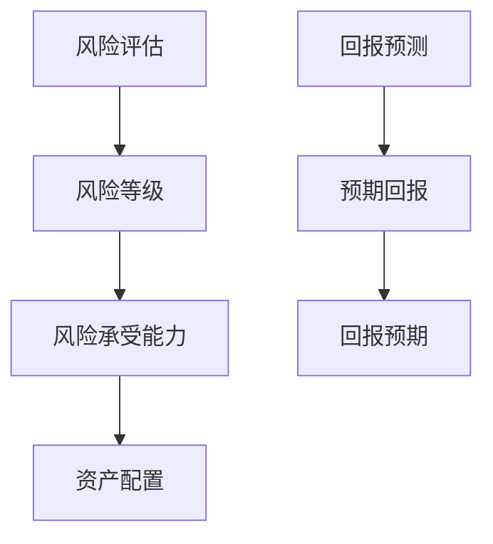
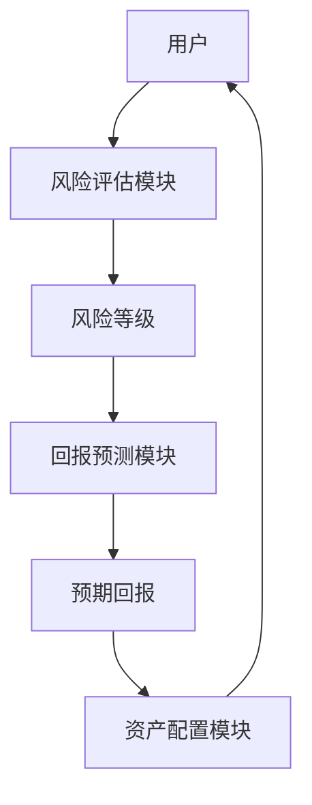

                 


# 价值投资中的风险与回报权衡

> 关键词：价值投资，风险，回报，权衡，投资策略，风险管理，回报预测

> 摘要：本文深入探讨了价值投资中风险与回报的权衡问题，分析了风险与回报的核心概念、数学模型、系统架构设计以及实际应用中的案例。通过详细的分析和实例，展示了如何在价值投资中实现风险与回报的最佳权衡。

---

# 第一部分：价值投资中的风险与回报权衡概述

## 第1章：价值投资与风险回报权衡的背景介绍

### 1.1 价值投资的基本概念

#### 1.1.1 价值投资的定义

价值投资是一种长期投资策略，旨在通过购买那些市场价格低于其内在价值的资产，以获得长期稳定的收益。其核心理念是寻找被市场低估的投资标的，长期持有，等待其价值回归。

#### 1.1.2 价值投资的核心理念

- **安全边际**：购买价格低于内在价值的资产，以降低投资风险。
- **长期视角**：关注企业的长期价值，而非短期市场波动。
- **基本面分析**：通过对企业财务状况、行业地位、管理团队等因素的分析，评估其内在价值。

#### 1.1.3 价值投资与其它投资策略的区别

- **成长投资**：侧重于投资高成长性的企业，接受较高的风险以追求更高的回报。
- **指数投资**：通过投资指数基金，分散风险，追求市场平均回报。
- **价值投资**：注重安全边际和低估值，追求稳定且高于市场的回报。

### 1.2 风险与回报的定义与特征

#### 1.2.1 风险的定义与分类

- **风险**：指投资可能遭受损失或收益低于预期的可能性。
- **系统性风险**：影响整个市场的风险，如经济衰退、政策变化等。
- **非系统性风险**：特定于个别资产或行业的风险，如企业经营风险。

#### 1.2.2 回报的定义与类型

- **回报**：投资资产的收益，包括资本增值和现金流流入。
- **短期回报**：投资在短期内的收益，波动较大。
- **长期回报**：投资在较长时间内的累计收益，通常较为稳定。

#### 1.2.3 风险与回报的关系

- **正相关关系**：通常，风险越高，潜在回报也越高。
- **负相关关系**：在某些情况下，为了降低风险，可能需要接受较低的回报。

### 1.3 价值投资中的风险与回报权衡

#### 1.3.1 风险与回报的权衡原则

- **风险承受能力**：投资者根据自身财务状况和风险偏好确定可承受的风险水平。
- **投资期限**：长期投资者可以承担较高的风险，短期投资者则更注重安全性和流动性。

#### 1.3.2 价值投资中风险与回报的动态平衡

- **动态调整**：根据市场变化和个人风险承受能力，定期调整投资组合。
- **风险管理**：通过分散投资、设置止损等方式，降低整体投资组合的风险。

#### 1.3.3 风险与回报权衡的案例分析

- **案例一**：购买一只低估值的蓝筹股，虽然波动较小，但长期回报稳定。
- **案例二**：投资一只高成长性的科技股，虽然风险较高，但潜在回报也较高。

### 1.4 本章小结

本章介绍了价值投资的基本概念，分析了风险与回报的定义、特征及两者的关系。在价值投资中，风险与回报的权衡是核心问题，需要根据投资者的自身情况和市场环境进行动态调整。

---

## 第2章：风险与回报的核心概念与联系

### 2.1 风险与回报的核心要素

#### 2.1.1 风险的核心要素

- **概率**：风险发生的可能性。
- **影响**：风险对企业或投资组合的影响程度。

#### 2.1.2 回报的核心要素

- **类型**：包括股息收益、资本增值等。
- **时间维度**：短期回报与长期回报的区别。

#### 2.1.3 风险与回报的相互作用

- **正相关**：高风险通常伴随着高回报。
- **负相关**：低风险通常伴随着较低的回报。

### 2.2 风险与回报的属性特征对比

| 特性       | 风险                     | 回报                     |
|------------|--------------------------|--------------------------|
| 定义       | 投资可能遭受的损失或收益低于预期的可能性。 | 投资资产的收益，包括资本增值和现金流流入。 |
| 时间维度   | 可能在短期内集中发生，也可能长期积累。 | 短期波动较大，长期较为稳定。 |
| 可量化性   | 可以通过概率和影响程度量化。 | 可以通过收益率量化。     |
| 不确定性   | 高，尤其是系统性风险。     | 高，尤其是短期回报。     |

### 2.3 风险与回报的ER实体关系图



### 2.4 本章小结

本章详细分析了风险与回报的核心要素，通过对比和关系图展示了两者之间的联系。理解这些核心概念是进行风险与回报权衡的基础。

---

## 第3章：风险与回报的数学模型与算法原理

### 3.1 风险与回报的数学模型

#### 3.1.1 风险与回报的线性关系模型

$$ \text{风险} = a \times \text{回报} + b $$

其中，$a$ 是风险系数，$b$ 是截距。

#### 3.1.2 风险与回报的非线性关系模型

$$ \text{风险} = a \times (\text{回报})^2 + b $$

#### 3.1.3 风险调整后的回报模型

$$ \text{调整后回报} = \text{原始回报} - \text{风险调整值} $$

### 3.2 风险与回报的算法原理

#### 3.2.1 风险调整回报的算法步骤

1. **计算资产的预期回报**。
2. **评估资产的风险水平**。
3. **根据风险调整预期回报**。

#### 3.2.2 风险与回报的权重分配算法

1. 确定风险与回报的权重比例。
2. 根据权重分配资产配置。

#### 3.2.3 风险与回报的平衡优化算法

1. **确定目标风险水平**。
2. **调整资产配置以达到目标风险水平**。

### 3.3 风险与回报的数学公式

#### 3.3.1 风险与回报的基本公式

$$ \text{风险} = \text{概率} \times \text{影响} $$

#### 3.3.2 风险调整后的回报公式

$$ \text{调整后回报} = \text{原始回报} - (\text{概率} \times \text{影响}) $$

### 3.4 算法流程图



### 3.5 本章小结

本章通过数学模型和算法原理，详细分析了如何量化和平衡风险与回报。这些方法为投资者提供了科学的决策依据。

---

## 第4章：价值投资中的风险与回报权衡系统分析

### 4.1 投资决策场景分析

#### 4.1.1 风险与回报权衡的场景描述

投资者在选择投资标的时，需要综合考虑其风险承受能力和预期回报。例如，选择一只低估值但波动较大的股票，还是选择一只高成长但风险较高的股票。

#### 4.1.2 价值投资中的典型问题场景

- 高风险资产的回报是否值得冒险。
- 如何通过分散投资降低整体风险。

### 4.2 系统功能设计

#### 4.2.1 风险评估模块

- 输入：资产的历史数据、市场环境。
- 输出：资产的风险等级。

#### 4.2.2 回报预测模块

- 输入：资产的基本面数据、市场趋势。
- 输出：预期回报率。

#### 4.2.3 权衡优化模块

- 输入：风险评估结果、回报预测结果。
- 输出：最优资产配置方案。

### 4.3 系统架构设计



### 4.4 系统交互流程图



### 4.5 本章小结

本章通过系统分析，展示了如何通过模块化设计和系统架构优化，实现风险与回报的动态权衡。

---

## 第5章：项目实战——价值投资中的风险与回报权衡

### 5.1 环境安装

- **工具安装**：安装Python、Pandas、NumPy等工具。
- **数据获取**：获取历史数据和实时数据。

### 5.2 核心实现代码

```python
import pandas as pd
import numpy as np

def calculate_risk(reports):
    # 计算风险
    pass

def calculate_return(reports):
    # 计算回报
    pass

def optimize_portfolio(risks, returns):
    # 风险与回报的权衡优化
    pass
```

### 5.3 代码实现与解读

- **数据清洗**：处理缺失值和异常值。
- **风险评估**：计算每只股票的风险等级。
- **回报预测**：基于历史数据和模型预测未来回报。
- **权衡优化**：根据风险承受能力和预期回报，调整资产配置。

### 5.4 案例分析

- **案例一**：某投资者的风险承受能力较低，选择低风险、稳定回报的资产。
- **案例二**：某投资者的风险承受能力较高，选择高风险、高回报的资产。

### 5.5 本章小结

本章通过实际项目实战，展示了如何将理论应用于实践，实现风险与回报的动态权衡。

---

## 第6章：总结与展望

### 6.1 总结

本文深入探讨了价值投资中风险与回报的权衡问题，通过理论分析、数学建模和系统设计，提供了科学的决策方法。

### 6.2 展望

未来的研究可以进一步探索人工智能在风险与回报权衡中的应用，例如使用机器学习模型进行更精准的风险评估和回报预测。

---

## 附录

### 附录A：相关术语解释

- **风险评估**：对投资标的进行风险等级的评估。
- **回报预测**：基于历史数据和模型预测未来回报。

### 附录B：参考文献

- 《投资学》（书籍）
- 《风险管理》（书籍）
- 相关学术论文

---

## 作者信息

作者：AI天才研究院 & 禅与计算机程序设计艺术

---

以上是《价值投资中的风险与回报权衡》的技术博客文章的完整内容。

