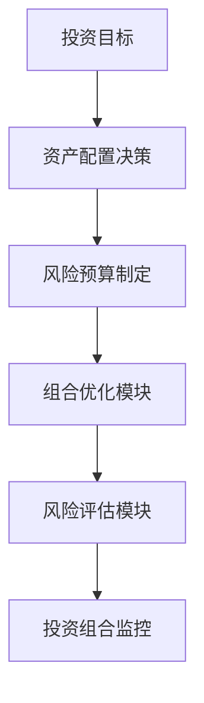

                 


# 《价值投资中的风险管理：分散投资的艺术》

> 关键词：风险管理, 分散投资, 价值投资, 风险量化, 投资组合优化

> 摘要：本文深入探讨了价值投资中的风险管理策略，特别是分散投资的艺术。通过分析风险管理的核心概念、量化方法及分散投资的策略，结合实际案例和系统架构设计，为投资者提供一套科学的风险管理方法。文章从理论到实践，逐步引导读者掌握如何在价值投资中有效分散风险，优化投资组合，实现稳健收益。

---

## 目录

1. **风险管理与分散投资的概述**  
   - 1.1 价值投资的核心理念  
   - 1.2 风险管理的重要性  
   - 1.3 分散投资的艺术

2. **风险的量化与度量**  
   - 2.1 风险的量化方法  
   - 2.2 风险的数学模型  
   - 2.3 风险与收益的平衡

3. **分散投资的策略与实施**  
   - 3.1 投资组合理论  
   - 3.2 分散投资的数学模型  
   - 3.3 分散投资的策略选择

4. **系统分析与架构设计**  
   - 4.1 投资组合的风险管理架构  
   - 4.2 系统化的分散投资架构  
   - 4.3 系统架构设计

5. **项目实战：分散投资的系统实现**  
   - 5.1 环境安装与数据准备  
   - 5.2 系统核心实现源代码  
   - 5.3 实际案例分析与解读  
   - 5.4 项目小结

6. **最佳实践与总结**  
   - 6.1 投资风险管理的关键点  
   - 6.2 分散投资的注意事项  
   - 6.3 拓展阅读与进一步学习

---

## 正文

### 1. 风险管理与分散投资的概述

#### 1.1 价值投资的核心理念

**1.1.1 价值投资的定义与起源**  
价值投资是一种投资策略，强调以低于其内在价值的价格购买优质资产。这种方法由本杰明·格雷厄姆和戴维·多德提出，核心在于寻找市场先生情绪波动下的投资机会。

**1.1.2 价值投资的核心原则**  
- 投资优质企业：选择具有强大护城河、良好管理团队和稳定财务状况的公司。  
- 长期持有：避免频繁交易，降低交易成本和税务负担。  
- 安全边际：购买价格低于内在价值，以降低亏损风险。

**1.1.3 价值投资与风险管理的关系**  
风险管理是价值投资的重要组成部分。通过控制风险，投资者可以在市场波动中保持投资组合的稳健性。

#### 1.2 风险管理的重要性

**1.2.1 风险的定义与分类**  
- **市场风险**：整体市场波动带来的风险。  
- **流动性风险**：资产无法快速变现的风险。  
- **信用风险**：债券发行人违约的风险。  
- **操作风险**：投资决策或交易过程中的失误风险。

**1.2.2 风险管理的目标与意义**  
- **目标**：通过识别、评估和控制风险，减少投资损失，提高收益的稳定性。  
- **意义**：在不确定的市场环境中，风险管理是实现长期投资目标的关键。

**1.2.3 风险管理在投资中的作用**  
- 保护资本：避免重大损失，确保投资本金的安全。  
- 提高收益：通过分散风险，优化投资回报。  
- 降低压力：减少市场波动对投资者情绪的影响。

#### 1.3 分散投资的艺术

**1.3.1 分散投资的定义与特点**  
分散投资是指将资金分配到不同的资产、行业或地区，以降低特定风险。

**1.3.2 分散投资的优势与局限性**  
- **优势**：降低特定资产的风险，平滑投资组合的波动。  
- **局限性**：过于分散可能导致收益稀释，增加管理复杂性。

**1.3.3 分散投资与价值投资的结合**  
价值投资强调选择优质资产，而分散投资则强调降低风险。两者的结合可以平衡收益与风险，实现稳健投资。

---

### 2. 风险的量化与度量

#### 2.1 风险的量化方法

**2.1.1 波动率的计算与应用**  
波动率是衡量资产价格波动程度的重要指标，通常用标准差表示。

$$ \text{波动率} = \sigma = \sqrt{\frac{1}{n-1} \sum_{i=1}^{n} (x_i - \bar{x})^2} $$

**2.1.2 风险价值（VaR）的定义与计算**  
VaR是指在一定置信水平下，投资可能遭受的最大损失。

**2.1.3 期望损失（EL）与非期望损失（UEL）的区分**  
- **期望损失（EL）**：基于历史数据的平均损失。  
- **非期望损失（UEL）**：超出预期的损失，通常与尾部风险相关。

#### 2.2 风险的数学模型

**2.2.1 风险的期望值与方差公式**  
方差衡量资产收益的波动程度：

$$ \text{方差} = \sigma^2 = E[(R - E[R])^2] $$

**2.2.2 马科维茨均值-方差模型**  
马科维茨模型通过优化投资组合的期望收益和风险，找到最优风险收益组合。

$$ \min_w \frac{1}{2} w^T \Sigma w \quad \text{subject to} \quad E[rw] = \mu $$

**2.2.3 风险调整后的收益计算公式**  
夏普比率衡量资产在承担风险后的超额收益：

$$ \text{夏普比率} = \frac{E[r - r_f]}{\sigma} $$

#### 2.3 风险与收益的平衡

**2.3.1 风险收益比的定义与计算**  
风险收益比 = 收益 / 风险（波动率）。

**2.3.2 风险调整后的回报模型**  
调整后的回报 = 实际回报 - 风险调整后的预期回报。

**2.3.3 风险与收益的权衡艺术**  
在投资中，找到收益与风险的最佳平衡点是风险管理的核心。

---

### 3. 分散投资的策略与实施

#### 3.1 投资组合理论

**3.1.1 马科维茨的有效投资组合理论**  
通过优化投资组合的方差和期望收益，找到最优风险收益组合。

$$ \text{投资组合方差} = w^T \Sigma w $$

**3.1.2 多因素模型在分散投资中的应用**  
多因素模型（如Fama-French三因子模型）考虑多个风险因素，帮助分散系统性风险。

**3.1.3 现代投资组合理论（MPT）的核心思想**  
通过分散投资，降低非系统性风险，优化投资组合的风险收益比。

#### 3.2 分散投资的数学模型

**3.2.1 投资组合的方差计算公式**  
$$ \text{组合方差} = \sum_{i=1}^{n} \sum_{j=1}^{n} w_i w_j \text{Cov}(r_i, r_j) $$

**3.2.2 资产之间的协方差矩阵**  
协方差矩阵反映资产之间的相关性，用于计算组合风险。

**3.2.3 最优投资组合的求解过程**  
使用拉格朗日乘数法优化投资组合，满足收益和风险约束。

#### 3.3 分散投资的策略选择

**3.3.1 资产配置策略**  
- **股债配置**：平衡股票和债券的比例，降低波动性。  
- **多资产配置**：包括房地产、黄金等多种资产。

**3.3.2 行业分散策略**  
避免集中投资于单一行业，降低行业风险。

**3.3.3 地域分散策略**  
在全球范围内配置资产，分散区域风险。

---

### 4. 系统分析与架构设计

#### 4.1 投资组合的风险管理架构

**4.1.1 风险识别与评估**  
通过数据分析识别潜在风险点。

**4.1.2 风险量化与测量**  
使用VaR、波动率等指标量化风险。

**4.1.3 风险控制与调整**  
根据风险评估结果，调整投资组合配置。

#### 4.2 系统化的分散投资架构

**4.2.1 投资目标的设定**  
明确投资目标、风险承受能力和收益预期。

**4.2.2 资产配置的决策**  
根据目标制定合理的资产分配方案。

**4.2.3 风险预算的制定**  
设定每种资产或资产类别可承受的风险水平。

#### 4.3 系统架构设计

**4.3.1 数据流与模块划分**  
- 数据输入：市场数据、资产信息。  
- 处理模块：风险量化、组合优化。  
- 输出结果：优化后的投资组合。

**4.3.2 系统功能设计**  
- 风险评估模块：计算资产风险。  
- 组合优化模块：生成最优投资组合。  
- 监控模块：实时跟踪组合风险。

**4.3.3 系统架构图（Mermaid）**  


---

### 5. 项目实战：分散投资的系统实现

#### 5.1 环境安装与数据准备

**5.1.1 环境安装**  
安装Python、Pandas、NumPy、Scipy等库。

**5.1.2 数据准备**  
收集历史市场数据，包括股票价格、债券收益等。

#### 5.2 系统核心实现源代码

**5.2.1 风险量化代码**  
计算资产的波动率和VaR。

```python
import numpy as np

def calculate_volatile(prices):
    returns = np.log(prices[1:] / prices[:-1])
    return np.std(returns)

def calculate_var(returns, confidence_level=0.95):
    sorted_returns = np.sort(returns)
    percentile = (1 - confidence_level) * len(sorted_returns)
    var = sorted_returns[int(percentile)]
    return -var
```

**5.2.2 组合优化代码**  
使用优化算法生成最优投资组合。

```python
import numpy as np
from scipy.optimize import minimize

def portfolio_optimization(returns, weights=None):
    n = returns.shape[1]
    if weights is None:
        weights = np.ones(n) / n
    def objective(weights, returns):
        return -np.mean(returns.T @ weights) + 0.5 * (weights.T @ np.cov(returns.T))
    cons = ({'type': 'eq', 'fun': lambda w: np.sum(w) - 1})
    result = minimize(objective, weights, args=(returns,), constraints=cons)
    return result.x

# 示例数据
returns = np.array([[0.05, 0.03, 0.07],
                    [0.02, 0.04, 0.06],
                    [0.03, 0.05, 0.08]])
weights = portfolio_optimization(returns)
print("Optimal weights:", weights)
```

#### 5.3 实际案例分析与解读

**5.3.1 投资组合优化案例**  
假设我们有三只股票，计算最优投资组合权重。

**5.3.2 风险与收益分析**  
计算组合的期望收益和波动率，验证优化效果。

#### 5.4 项目小结

通过代码实现投资组合优化，验证了分散投资的有效性。优化后的组合在控制风险的同时，提高了收益。

---

### 6. 最佳实践与总结

#### 6.1 投资风险管理的关键点

- 定期评估投资组合的风险和收益。  
- 根据市场变化调整分散策略。  
- 保持长期投资视角，避免短期波动影响决策。

#### 6.2 分散投资的注意事项

- 分散投资不能完全消除风险，尤其市场系统性风险。  
- 需要根据自身风险承受能力调整分散程度。  
- 选择可靠的分散工具和平台，降低操作风险。

#### 6.3 拓展阅读与进一步学习

- 《投资学》（书籍推荐）  
- 《Python在金融中的应用》（技能提升）  
- 《风险管理与VaR模型》（深入学习）

---

## 结语

风险管理是价值投资成功的关键，而分散投资是实现这一目标的重要手段。通过量化风险、优化投资组合，投资者可以在不确定的市场中保持稳健的投资回报。希望本文提供的方法和案例能够为投资者提供实用的指导，帮助他们在复杂多变的市场中实现长期稳健的投资收益。

---

**作者：AI天才研究院/AI Genius Institute & 禅与计算机程序设计艺术 /Zen And The Art of Computer Programming**

