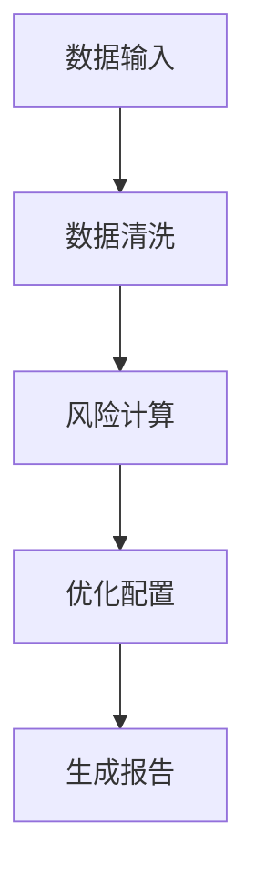
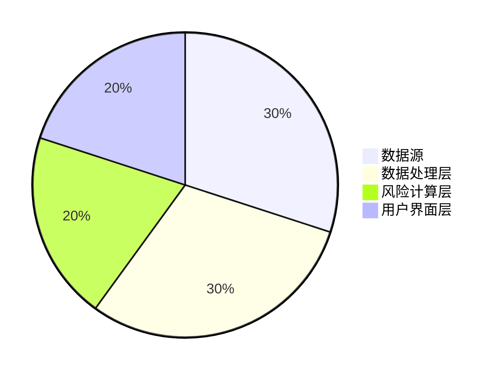
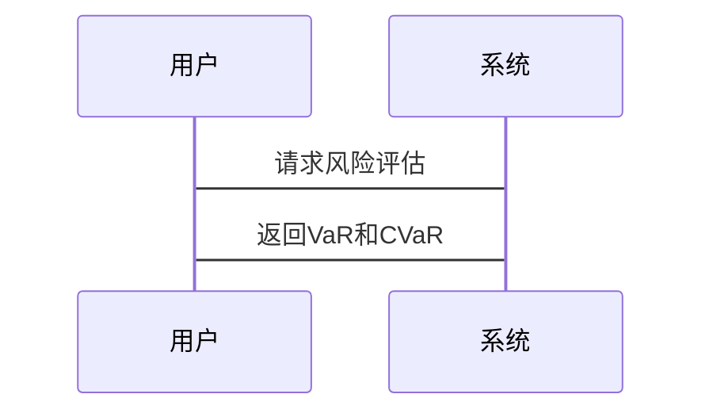

                 


# 价值投资中的风险管理：如何降低损失

## 关键词：风险管理，价值投资，夏普比率，VaR，投资组合优化

## 摘要：本文深入探讨了价值投资中的风险管理，从基本概念到数学模型，再到系统架构和项目实战，全面分析了如何通过科学的方法降低投资损失。文章结合理论与实践，为投资者提供了一套系统化的风险管理解决方案。

---

# 第1章：风险管理的核心概念

## 1.1 风险的定义与分类

### 1.1.1 风险的定义
风险是指在投资活动中，由于不确定性因素导致的损失或收益波动。在价值投资中，风险通常与投资标的的价值波动相关。

### 1.1.2 风险的分类
- **系统性风险**：影响整个市场的风险，如经济衰退、政策变化。
- **非系统性风险**：特定于个别资产的风险，如公司经营风险。
- **流动性风险**：资产难以快速变现的风险。

### 1.1.3 风险与收益的关系
高风险通常意味着高收益，但风险管理的核心是在可接受的风险范围内追求最大收益。

---

## 1.2 价值投资中的风险管理

### 1.2.1 价值投资的基本原理
价值投资强调以低于内在价值的价格购买优质资产，长期持有的策略。

### 1.2.2 风险管理在价值投资中的重要性
- 避免过度集中投资。
- 控制回撤幅度。
- 降低市场波动对投资组合的影响。

### 1.2.3 风险管理的核心目标
- 保护本金安全。
- 稳定投资收益。
- 提高风险调整后的收益。

---

## 1.3 风险管理的基本原则

### 1.3.1 风险与收益的平衡
通过分散投资和选择优质资产来平衡风险与收益。

### 1.3.2 风险分散化原理
将资金分散投资于不同资产或行业，降低非系统性风险。

### 1.3.3 风险控制的边界
设定最大回撤和风险承受能力，避免过度冒险。

---

## 1.4 本章小结
本章介绍了风险管理的核心概念，包括风险的定义、分类以及在价值投资中的重要性。风险管理是价值投资成功的关键，需要在追求收益的同时控制风险。

---

# 第2章：风险管理的核心要素

## 2.1 投资组合的风险构成

### 2.1.1 投资组合的波动性
波动性是衡量资产风险的重要指标，波动性越高，风险越大。

### 2.1.2 投资组合的相关性
资产之间的相关性影响整体投资组合的风险。相关性低的资产可以有效分散风险。

### 2.1.3 投资组合的集中度
集中度过高会增加特定资产的风险，分散化是降低集中度的有效方法。

---

## 2.2 风险调整后的收益

### 2.2.1 夏普比率
夏普比率衡量投资组合超额收益相对于其风险的表现，公式为：
$$ \text{夏普比率} = \frac{E[r_p] - r_f}{\sigma_p} $$
其中，\( E[r_p] \) 是投资组合的期望收益，\( r_f \) 是无风险利率，\( \sigma_p \) 是投资组合的波动率。

### 2.2.2 特雷诺比率
特雷诺比率衡量投资组合相对于市场指数的超额收益，公式为：
$$ \text{特雷诺比率} = \frac{E[r_p] - E[r_m]}{\sigma_p - \sigma_m} $$
其中，\( E[r_m] \) 是市场指数的期望收益，\( \sigma_m \) 是市场指数的波动率。

### 2.2.3 净风险调整后收益
净风险调整后收益是将投资收益调整为在相同风险水平下的最大收益。

---

## 2.3 风险管理的量化指标

### 2.3.1 VaR（Value at Risk）
VaR是一定置信水平下，投资组合的最大可能损失，公式为：
$$ VaR = \text{置信水平} \times \text{标准差} $$

### 2.3.2 CVaR（Conditional Value at Risk）
CVaR是VaR的平均损失，用于衡量尾部风险。

### 2.3.3 风险溢价
风险溢价是投资者因承担风险而要求的额外收益。

---

## 2.4 本章小结
本章详细讨论了投资组合的风险构成和风险调整后的收益指标，强调了夏普比率和VaR等量化工具在风险管理中的重要性。

---

# 第3章：现代投资组合理论与风险管理

## 3.1 马科维茨投资组合理论

### 3.1.1 理论概述
马科维茨理论指出，通过优化投资组合可以实现收益与风险的最优平衡。

### 3.1.2 有效前沿的概念
有效前沿是所有可能投资组合中收益风险比最优的集合。

### 3.1.3 风险与收益的优化
通过均值-方差优化模型，找到最优投资组合：
$$ \text{优化目标} = \min_w \sigma_p^2 $$
$$ \text{约束条件} = \sum_{i=1}^n w_i = 1 $$

---

## 3.2 风险资产配置模型

### 3.2.1 均值-方差优化
通过优化算法找到风险最小的收益目标组合。

### 3.2.2 风险平价资产配置
将风险在不同资产间分配，使每种资产的风险贡献相等。

### 3.2.3 情景分析法
基于不同市场情景，调整资产配置比例。

---

## 3.3 现代风险管理框架

### 3.3.1 风险因子分析
分析影响资产价格的主要因子，如市场因子、行业因子等。

### 3.3.2 资产定价模型
使用CAPM等模型评估资产的合理定价。

### 3.3.3 风险对冲策略
通过衍生品对冲特定风险，降低整体投资组合的波动性。

---

## 3.4 本章小结
本章结合现代投资组合理论，介绍了风险资产配置和风险对冲策略，强调了科学的资产配置在风险管理中的作用。

---

# 第4章：风险管理的数学模型与公式

## 4.1 风险度量的数学公式

### 4.1.1 方差与标准差
方差衡量资产收益的波动性，公式为：
$$ \sigma^2 = \frac{1}{n}\sum_{i=1}^n (r_i - \bar{r})^2 $$
标准差为方差的平方根。

### 4.1.2 VaR的计算公式
基于正态分布的VaR计算：
$$ VaR = z \times \sigma $$
其中，\( z \) 是对应置信水平的分位数，\( \sigma \) 是资产的标准差。

### 4.1.3 CVaR的计算公式
CVaR是VaR的平均损失，公式为：
$$ CVaR = \frac{1}{1-\alpha} \int_{\alpha}^{1} VaR \, dF $$

---

## 4.2 投资组合优化的数学模型

### 4.2.1 均值-方差优化模型
$$ \text{优化目标} = \min_w \sigma_p^2 $$
$$ \text{约束条件} = \sum_{i=1}^n w_i = 1 $$

### 4.2.2 风险平价模型
$$ \text{优化目标} = \min_w \sum_{i=1}^n w_i^2 \times \sigma_i^2 $$
$$ \text{约束条件} = \sum_{i=1}^n w_i = 1 $$

---

## 4.3 风险调整后的收益计算

### 4.3.1 夏普比率的计算
$$ \text{夏普比率} = \frac{E[r_p] - r_f}{\sigma_p} $$

### 4.3.2 特雷诺比率的计算
$$ \text{特雷诺比率} = \frac{E[r_p] - E[r_m]}{\sigma_p - \sigma_m} $$

### 4.3.3 净风险调整后收益的计算
$$ \text{净收益} = \text{总收益} - \text{风险调整收益} $$

---

## 4.4 本章小结
本章通过数学公式详细阐述了风险管理的核心指标和优化模型，为实际应用提供了理论基础。

---

# 第5章：系统分析与架构设计方案

## 5.1 风险管理系统的功能设计

### 5.1.1 系统概述
风险管理系统的目的是帮助投资者量化和控制投资组合风险。

### 5.1.2 系统功能模块
- 数据采集模块：获取市场数据和资产信息。
- 风险评估模块：计算VaR、CVaR等风险指标。
- 资产配置模块：优化投资组合。
- 报告生成模块：输出风险管理报告。

### 5.1.3 系统功能流程图


---

## 5.2 风险管理系统的架构设计

### 5.2.1 系统架构图


### 5.2.2 系统模块划分
- 数据源：市场数据、资产信息。
- 数据处理层：清洗、转换数据。
- 风险计算层：计算VaR、CVaR。
- 用户界面层：展示结果、操作界面。

---

## 5.3 风险管理系统的交互

### 5.3.1 系统接口设计
- 数据接口：API调用市场数据。
- 报告接口：生成PDF或HTML格式的报告。

### 5.3.2 系统交互流程图


---

## 5.4 本章小结
本章从系统架构的角度，详细设计了风险管理系统的功能模块和交互流程，为实际开发提供了指导。

---

# 第6章：项目实战

## 6.1 环境安装

### 6.1.1 安装Python
使用Anaconda安装Python 3.8以上版本。

### 6.1.2 安装依赖库
安装numpy、pandas、scipy等库：
```bash
pip install numpy pandas scipy
```

---

## 6.2 系统核心实现源代码

### 6.2.1 风险计算代码
```python
import numpy as np
import pandas as pd
import scipy.stats as stats

def calculate VaR(returns, confidence_level=0.95):
    sorted_returns = sorted(returns)
    VaR = -np.percentile(sorted_returns, 100 * (1 - confidence_level))
    return VaR

def calculate CVaR(returns, confidence_level=0.95):
    sorted_returns = sorted(returns)
    VaR = calculate_VaR(returns, confidence_level)
    mask = returns <= VaR
    average_loss = np.mean(returns[mask])
    return average_loss
```

### 6.2.2 资产配置代码
```python
from numpy import matrix, sqrt, genfromtxt
from numpy.random import randn
from scipy.optimize import minimize

def portfolio_optimization(returns_matrix, weights_sum=1):
    n = returns_matrix.shape[1]
    # 定义优化目标函数
    def objective(weights):
        return np.dot(weights.T, np.dot(returns_matrix, weights))
    # 约束条件
    constraints = [
        {'type': 'eq', 'fun': lambda w: sum(w) - weights_sum}
    ]
    # 初始权重
    init_guess = np.array([1.0 / n] * n)
    # 使用优化算法
    result = minimize(objective, init_guess, method='SLSQP', constraints=constraints)
    return result.x
```

---

## 6.3 代码应用解读与分析

### 6.3.1 风险计算
使用实际投资组合的收益数据，计算VaR和CVaR，评估投资组合的风险。

### 6.3.2 资产配置
通过优化算法，找到风险最小的投资组合，降低整体风险。

---

## 6.4 本章小结
本章通过Python代码实现了风险管理的核心功能，展示了如何将理论应用于实际投资决策。

---

# 第7章：总结与展望

## 7.1 本章总结
本文系统地介绍了价值投资中的风险管理，从理论到实践，详细探讨了风险管理的核心概念、数学模型和系统架构。

## 7.2 小结与注意事项
- 风险管理是投资成功的关键。
- 选择合适的风险管理工具和方法。
- 定期评估和调整投资组合。

## 7.3 拓展阅读
建议阅读以下书籍和文献：
- 《投资学》（书籍）
- 马科维茨的《投资组合理论》（论文）
- 现代VaR理论相关文献

---

# 作者：AI天才研究院/AI Genius Institute & 禅与计算机程序设计艺术 /Zen And The Art of Computer Programming

---

**本文通过系统的分析和详细的代码实现，为投资者提供了科学的风险管理方法，帮助降低投资损失，实现稳健收益。**

