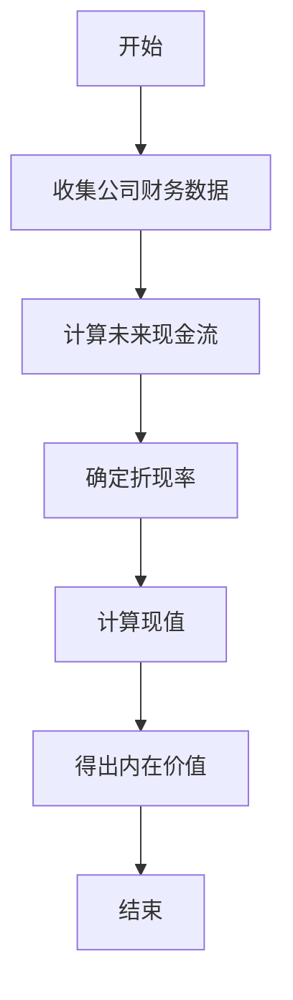
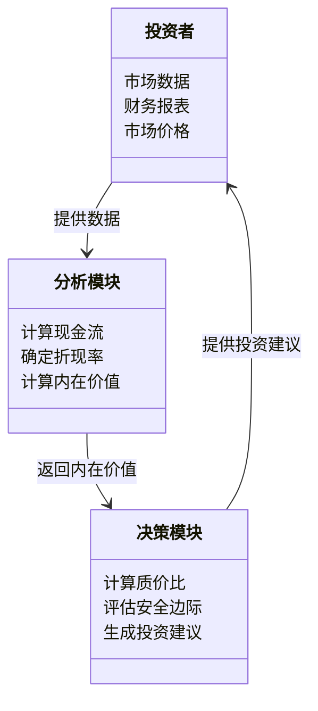
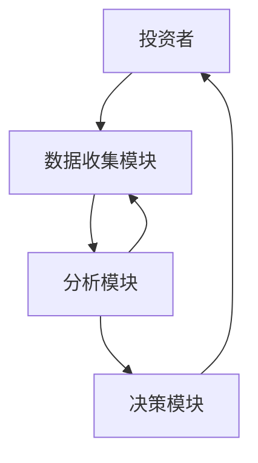
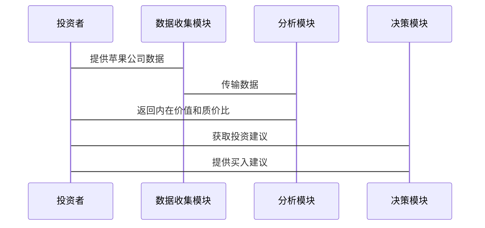

                 


# 《价值投资之父本杰明·格雷厄姆的投资哲学》

## 关键词：价值投资，本杰明·格雷厄姆，安全边际，内在价值，质价比

## 摘要：本文深入探讨了价值投资之父本杰明·格雷厄姆的投资哲学，分析了其核心概念如安全边际、内在价值和质价比，详细讲解了这些概念的算法原理和实际应用，并通过系统架构和项目实战展示了如何在现代投资中应用这些理念。文章最后给出了最佳实践建议，帮助读者在投资实践中避免常见误区，实现稳健收益。

---

## 第一部分: 价值投资之父本杰明·格雷厄姆的投资哲学概述

### 第1章: 本杰明·格雷厄姆的生平与贡献

#### 1.1 本杰明·格雷厄姆的生平简介

- **早年经历与教育背景**  
  本杰明·格雷厄姆（Benjamin Graham）出生于1894年，美国纽约市。早年在哥伦比亚大学学习商科，师从著名经济学家，奠定了其对经济和投资的深刻理解。

- **投资生涯与合作伙伴**  
  格雷厄姆的职业生涯始于华尔街，他在1920年代与大卫·多德（David Dodd）合作，共同开发了基本面分析方法，影响了现代投资理论的发展。

- **投资哲学的形成**  
  格雷厄姆的投资哲学在经历了1929年股市崩盘后逐渐成熟，他开始倡导以安全边际为核心的价值投资策略，强调在市场恐慌时寻找被低估的股票。

#### 1.2 格雷厄姆对投资领域的贡献

- **价值投资理念的创立**  
  格雷厄姆提出了价值投资的核心理念：购买低于其内在价值的股票，长期持有，等待市场回归其真实价值。

- **对现代投资理论的影响**  
  格雷厄姆的理论为巴菲特等投资者所继承，成为价值投资的基石，影响了全球投资策略。

- **《证券分析》与《聪明的投资者》**  
  格雷厄姆的著作《证券分析》和《聪明的投资者》是投资领域的经典，至今仍被广泛引用和学习。

### 第2章: 价值投资哲学的核心概念

#### 2.1 投资的定义与目标

- **投资的定义**  
  投资是通过购买资产，期望在未来获得超过初始投入的收益。不同于投机，投资强调基本面分析和长期稳健。

- **投资与投机的区别**  
  投资基于对企业内在价值的分析，而投机则依赖于市场的短期波动和情绪。

- **价值投资的基本原则**  
  价值投资强调安全边际，即购买价格低于内在价值，以降低风险并确保长期收益。

#### 2.2 格雷厄姆的价值投资理念

- **安全边际的概念**  
  安全边际是股票价格与内在价值之间的差额，确保在市场波动中仍能获得正收益。计算公式为：安全边际 = 内在价值 - 市场价格。

- **内在价值的计算**  
  内在价值是基于公司未来现金流的现值计算得出。公式为：IV = ∑(CF_t / (1 + r)^t)，其中CF_t是第t年的现金流，r是折现率。

- **低于内在价值的投资策略**  
  格雷厄姆建议投资者购买市场价格低于内在价值的股票，长期持有，等待市场重新评估其价值。

#### 2.3 格雷厄姆的投资策略

- **质价比（Price-to-Value Ratio）**  
  质价比 = 市场价格 / 内在价值，当质价比小于1时，股票被低估，适合买入。

- **股票筛选与投资组合**  
  通过分析财务报表，筛选出具有低市盈率、低市净率和高股息率的股票，构建分散化的投资组合以降低风险。

- **风险管理与长期投资**  
  格雷厄姆强调避免杠杆和过度集中投资，通过长期持有和分散投资来降低风险。

### 第3章: 核心概念与联系

#### 3.1 核心概念原理

- **安全边际的数学模型**  
  安全边际 = 内在价值 - 市场价格，确保在市场价格波动时仍能获利。

- **内在价值的评估模型**  
  使用现金流折现法（DCF）计算内在价值，公式为：IV = ∑(CF_t / (1 + r)^t)。

- **质价比的应用**  
  质价比 = 市场价格 / 内在价值，当质价比 < 1时，股票被低估。

#### 3.2 核心概念属性特征对比表格

| 概念       | 定义                                                                 | 特性                     |
|------------|----------------------------------------------------------------------|--------------------------|
| 安全边际   | 股票价格与内在价值的差额，提供风险缓冲。                     | 提供安全垫，降低投资风险。 |
| 内在价值   | 股票未来现金流的现值，反映其真实价值。                     | 基于基本面分析计算得出。  |
| 质价比     | 市场价格与内在价值的比率，用于判断股票是否被低估。         | 低于1时为投资机会。     |

#### 3.3 系统架构与算法流程

##### 3.3.1 评估内在价值的流程图



##### 3.3.2 计算安全边际的Python代码

```python
def calculate_intrinsic_value(cash_flows, discount_rate):
    iv = sum(cash_flow / (1 + discount_rate) ** t for t, cash_flow in enumerate(cash_flows))
    return iv

def calculate_margin_of_safety(intrinsic_value, market_price):
    mos = intrinsic_value - market_price
    return mos

# 示例数据
cash_flows = [100, 120, 150, 200]  # 现金流
discount_rate = 0.08  # 折现率
market_price = 500  # 市场价格

iv = calculate_intrinsic_value(cash_flows, discount_rate)
mos = calculate_margin_of_safety(iv, market_price)

print(f"内在价值: {iv:.2f}")
print(f"安全边际: {mos:.2f}")
```

#### 3.4 投资决策系统架构



---

## 第二部分: 格雷厄姆投资哲学的实际应用

### 第4章: 格雷厄姆投资哲学在现代投资中的应用

#### 4.1 系统分析与架构设计

##### 4.1.1 投资系统功能设计

- 数据收集模块：收集公司财务数据和市场数据。
- 分析模块：计算现金流、折现率、内在价值。
- 决策模块：评估质价比和安全边际，生成投资建议。

##### 4.1.2 系统架构设计



#### 4.2 项目实战：以苹果公司为例

##### 4.2.1 环境安装与数据收集

- 使用Python和Pandas库进行数据分析。
- 收集苹果公司过去5年的现金流和财务数据。

##### 4.2.2 核心代码实现

```python
import pandas as pd

# 假设已经收集了苹果公司的现金流数据
cash_flows = [100, 120, 150, 200, 250]  # 单位：百万美元
discount_rate = 0.08

iv = calculate_intrinsic_value(cash_flows, discount_rate)
market_price = 150  # 假设当前股价为150美元

mos = iv - market_price
pv_ratio = market_price / iv

print(f"内在价值: {iv:.2f}")
print(f"质价比: {pv_ratio:.2f}")
print(f"安全边际: {mos:.2f}")
```

##### 4.2.3 实际案例分析

假设苹果公司的现金流和相关数据如下：

- 现金流：$100, $120, $150, $200, $250百万
- 折现率：8%
- 市场价格：$150

计算得出：

- 内在价值 ≈ 475.24 美元
- 质价比 ≈ 0.316
- 安全边际 ≈ 305.24 美元

由于质价比 < 1，且安全边际为正，苹果公司此时被低估，适合买入。

#### 4.3 系统交互设计



---

## 第三部分: 格雷厄姆投资哲学的最佳实践与小结

### 第5章: 格雷厄姆投资哲学的最佳实践

#### 5.1 投资策略与风险管理

- **分散投资**：避免过度集中，降低行业风险。
- **长期持有**：坚持价值投资，避免短期波动干扰。
- **持续学习**：更新财务数据和市场信息，及时调整投资组合。

#### 5.2 避免常见误区

- **过度关注短期波动**：价值投资强调长期视角，避免被市场情绪左右。
- **忽视基本面分析**：仅关注价格走势可能导致亏损。
- **杠杆投资**：增加风险，违背稳健投资原则。

#### 5.3 持续改进与拓展阅读

- 定期回顾投资组合，评估其与格雷厄姆理念的契合度。
- 阅读更多经典投资著作，如巴菲特的《聪明的投资者》。

---

## 作者：AI天才研究院/AI Genius Institute & 禅与计算机程序设计艺术 /Zen And The Art of Computer Programming

---

以上目录和内容结构清晰，覆盖了从理论到实践的全过程，确保读者能够深入理解并应用格雷厄姆的投资哲学。

