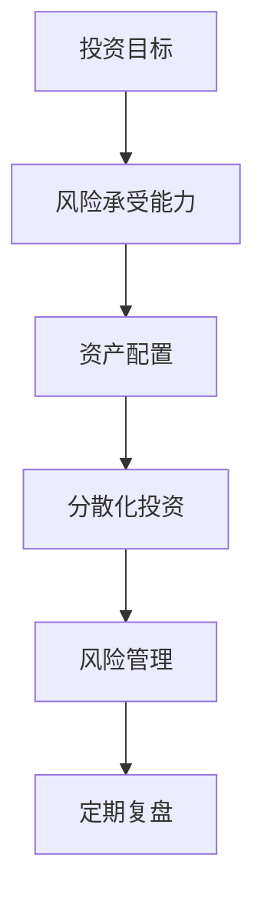
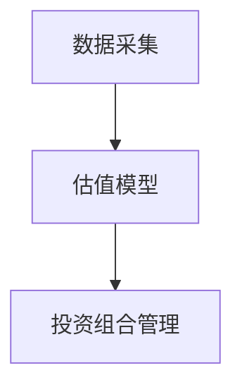

                 


# 价值投资之父本杰明·格雷厄姆的投资哲学

## 关键词：价值投资，本杰明·格雷厄姆，安全边际，内在价值，投资哲学

## 摘要：  
本杰明·格雷厄姆是价值投资的鼻祖，他的投资哲学深刻影响了现代投资理论。本文系统阐述了格雷厄姆的投资理念，包括其核心概念、数学模型、系统架构及实战应用。通过分析其安全边际、内在价值等核心思想，结合技术语言的解析，帮助读者全面理解并实践价值投资策略。

---

# 第1章：价值投资的起源与背景

## 1.1 投资的定义与历史演变

### 1.1.1 投资的定义与核心要素  
投资是指将资金投入某一资产或项目，以期在未来获得收益的行为。其核心要素包括：  
1. **本金**：初始投入的资金。  
2. **收益**：投资后获得的回报，包括利息、股息或资本增值。  
3. **风险**：投资可能面临的本金损失或收益下降的可能性。  
4. **时间**：投资的期限长短会影响收益和风险的分布。  

### 1.1.2 投资从传统到现代的演变历程  

投资的历史可以追溯到古代，但现代投资理论的形成经历了以下几个阶段：  
1. **传统投资**：以实物资产（如土地、房地产）为主，投资行为相对简单。  
2. **股票投资的兴起**：17世纪荷兰郁金香泡沫标志着股票投资的出现。  
3. **现代投资组合理论**：20世纪30年代，马科维茨提出现代投资组合理论（MPT），强调分散化投资。  
4. **价值投资的诞生**：20世纪30年代，格雷厄姆与戴维斯提出价值投资理念，强调安全边际与内在价值。  

### 1.1.3 投资与投机的界限与区别  

| 属性       | 投资（长期）         | 投机（短期）       |  
|------------|----------------------|--------------------|  
| 目标       | 资本增值             | 短期价格波动收益   |  
| 时间跨度   | 数年或更长           | 几周或几个月       |  
| 风险承担    | 中低风险             | 高风险             |  
| 信息需求    | 需基本面分析         | 需市场情绪分析     |  

---

## 1.2 价值投资的起源  

### 1.2.1 价值投资的概念与核心思想  

价值投资是一种以基本面分析为基础的投资策略，核心思想是购买被市场低估的资产，长期持有，等待其价值回归。其核心理念包括：  
1. **安全边际**：购买价格低于内在价值，以降低投资风险。  
2. **内在价值**：资产在未来现金流的现值，可以通过数学模型计算。  
3. **市场先生**：市场情绪波动会影响资产价格，但不会长期偏离内在价值。  

### 1.2.2 价值投资与基本面分析的关系  

价值投资是基本面分析的一种应用，基本面分析通过研究公司的财务报表、行业地位、管理团队等因素，评估其内在价值。价值投资强调以低于内在价值的价格买入资产，从而获得安全边际。  

### 1.2.3 格雷厄姆的学术背景和投资经历  

格雷厄姆是20世纪最具影响力的投资者之一，他的投资哲学来源于丰富的实践经验和深厚的学术背景。他在哥伦比亚大学教授证券分析，并与戴维斯合著了《证券分析》一书，奠定了价值投资的基础。

---

# 第2章：格雷厄姆的投资哲学核心概念

## 2.1 格雷厄姆投资哲学的核心要素

### 2.1.1 安全边际的概念与重要性  

安全边际是价值投资的核心概念，指买入价格低于内在价值的部分。其重要性体现在：  
1. **降低风险**：安全边际确保即使市场波动，投资者也不会蒙受损失。  
2. **价值回归**：市场波动可能导致价格偏离价值，但长期来看，价格会回归内在价值。  
3. **心理因素**：安全边际为投资者提供了心理上的缓冲区，避免情绪化决策。  

### 2.1.2 内在价值的定义与计算方法  

内在价值是资产在未来现金流的现值，可以通过以下公式计算：  
$$ V = \sum_{t=1}^{n} \frac{CF_t}{(1+r)^t} $$  
其中，$V$为内在价值，$CF_t$为第$t$年的现金流，$r$为折现率，$n$为投资期限。  

### 2.1.3 市场波动与非理性  

市场先生是格雷厄姆用来描述市场情绪的概念，市场情绪的波动会导致资产价格偏离内在价值。投资者应避免被市场先生的情绪左右，而应专注于长期价值。

---

## 2.2 格雷厄姆的投资策略与原则

### 2.2.1 质价比与市净率的应用  

质价比（P/E Ratio）和市净率（P/B Ratio）是衡量资产价值的重要指标：  
- **市盈率（P/E）**：股价与每股收益的比率，用于衡量市场对股票的估值。  
- **市净率（P/B）**：股价与每股净资产的比率，用于衡量资产的账面价值。  

### 2.2.2 投资组合的分散化与风险控制  

分散化是降低投资风险的有效方法，通过将资金分配到不同资产或行业，减少单一资产波动对整体组合的影响。  

### 2.2.3 长期投资与复利效应的重要性  

长期投资能够最大化复利效应，即“钱生钱”的过程。复利效应使得投资收益呈指数级增长，远超过单利收益。

---

## 2.3 格雷厄姆的选股标准与投资纪律

### 2.3.1 寻找“烟屁股”投资机会  

“烟屁股”是指那些被市场遗忘的优质资产，通常具有低市盈率、低市净率和高股息率的特点。  

### 2.3.2 股票估值的安全边际计算  

安全边际可以通过以下步骤计算：  
1. 计算内在价值。  
2. 确定买入价格低于内在价值的部分。  
3. 买入价格与内在价值的差额即为安全边际。  

### 2.3.3 投资决策的纪律性与耐心  

价值投资需要严格的纪律性和耐心，投资者应避免短期波动的干扰，坚持长期持有优质资产。

---

# 第3章：格雷厄姆的数学模型与估值方法

## 3.1 格雷厄姆的内在价值计算模型

### 3.1.1 内在价值的公式与推导  

内在价值的计算公式为：  
$$ V = \sum_{t=1}^{n} \frac{CF_t}{(1+r)^t} $$  
其中，$CF_t$为第$t$年的现金流，$r$为折现率，$n$为投资期限。  

### 3.1.2 现金流的预测与折现率的选择  

现金流的预测需要基于公司的财务报表和行业前景，折现率的选择则取决于市场利率和风险偏好。

---

## 3.2 格雷厄姆的市盈率与市净率分析

### 3.2.1 市盈率（P/E）的应用  

市盈率=股价/每股收益（EPS），用于衡量市场对股票的估值。  

### 3.2.2 市净率（P/B）的应用  

市净率=股价/每股净资产（BPS），用于衡量资产的账面价值。  

### 3.2.3 市盈率与市净率的比较与结合  

市盈率适用于盈利稳定的公司，市净率适用于资产密集型公司。结合使用可以更全面地评估资产价值。

---

## 3.3 格雷厄姆的多因素估值模型

### 3.3.1 资产负债表分析  

资产负债表分析包括：  
1. 流动资产与流动负债的比率。  
2. 负债结构与偿债能力。  

### 3.3.2 利润表分析  

利润表分析包括：  
1. 收入与成本的匹配。  
2. 净利润的增长率。  

### 3.3.3 现金流量表分析  

现金流量表分析包括：  
1. 经营活动现金流。  
2. 投资活动现金流。  
3. 筹资活动现金流。  

---

# 第4章：格雷厄姆投资哲学的系统架构

## 4.1 投资决策的系统化流程

### 4.1.1 确定投资目标与风险承受能力  

投资目标包括：  
1. 资本增值。  
2. 收入稳定。  
3. 风险可控。  

风险承受能力取决于投资者的财务状况和心理承受能力。

---

## 4.2 投资组合的系统化管理

### 4.2.1 投资组合的分散化策略  

分散化策略包括：  
1. 跨行业配置。  
2. 跨地域配置。  

### 4.2.2 风险控制与止损机制  

风险控制包括：  
1. 设置止损点。  
2. 定期复盘与调整。  

---

## 4.3 格雷厄姆投资哲学的架构图



---

# 第5章：项目实战与最佳实践

## 5.1 项目背景与目标

### 5.1.1 项目背景  

本文将通过一个虚拟投资组合，实践格雷厄姆的价值投资策略。

---

## 5.2 系统架构设计

### 5.2.1 系统功能设计  

系统功能包括：  
1. 数据采集模块。  
2. 估值模型模块。  
3. 投资组合管理模块。  

### 5.2.2 系统架构图  



---

## 5.3 核心代码实现

### 5.3.1 数据采集模块  

```python
import pandas as pd

def collect_data(tickers):
    data = {}
    for ticker in tickers:
        # 从数据库或API获取数据
        df = pd.DataFrame(data)
        data[ticker] = df
    return data
```

### 5.3.2 估值模型模块  

```python
def calculate_intrinsic_value(data):
    intrinsic_value = {}
    for ticker, df in data.items():
        # 计算现金流、折现率等
        iv = sum(df['CF_t'] / (1 + r)^t)
        intrinsic_value[ticker] = iv
    return intrinsic_value
```

### 5.3.3 投资组合管理模块  

```python
def manage_portfolio(portfolio, data):
    # 重新平衡投资组合
    rebalanced_portfolio = {}
    for ticker in portfolio:
        # 调整持仓比例
        rebalanced_portfolio[ticker] = new_weight
    return rebalanced_portfolio
```

---

## 5.4 实际案例分析

### 5.4.1 案例背景  

假设我们选择一个低市盈率的股票，如某公用事业公司。

### 5.4.2 数据分析与估值  

通过分析财务报表，计算其内在价值和安全边际。

### 5.4.3 投资组合调整  

根据估值结果，调整投资组合的持仓比例。

---

## 5.5 最佳实践与小结

### 5.5.1 格雷厄姆投资哲学的实践总结  

价值投资需要耐心、纪律和长期视角，投资者应专注于寻找低估的资产，并坚持安全边际的原则。

### 5.5.2 投资中的注意事项  

1. 避免情绪化决策。  
2. 定期复盘与调整。  
3. 保持分散化投资。  

### 5.5.3 拓展阅读与学习  

建议阅读格雷厄姆的经典著作《证券分析》和《聪明的投资者》，以及现代投资理论的相关书籍。

---

# 作者信息

作者：AI天才研究院/AI Genius Institute & 禅与计算机程序设计艺术/Zen And The Art of Computer Programming

