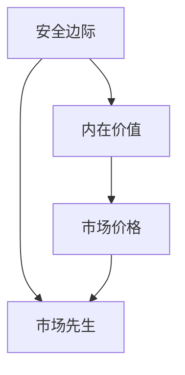
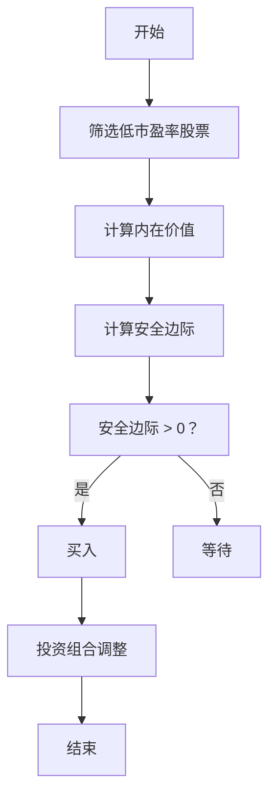
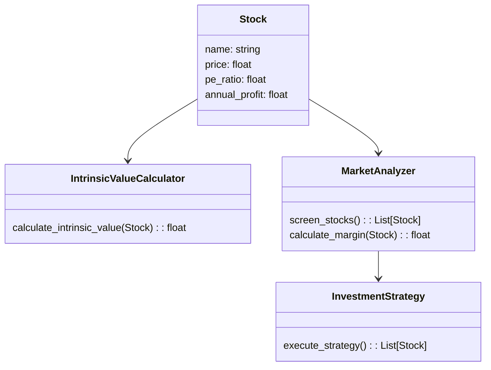
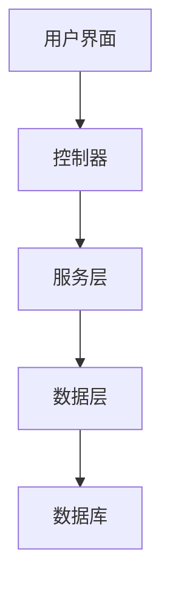

                 


# 价值投资之父格雷厄姆的投资哲学

> 关键词：价值投资，格雷厄姆，安全边际，市场先生，基本面分析，投资哲学

> 摘要：本文深入探讨了价值投资之父本杰明·格雷厄姆的投资哲学，从其核心理念、分析方法到实际应用进行了系统性分析。文章结合技术语言和专业方法，详细阐述了格雷厄姆的投资策略、数学模型及系统架构，旨在为投资者提供深度的理论指导和实践参考。

---

## 第一部分：背景介绍

### 第1章：价值投资的定义与核心概念

#### 1.1 价值投资的背景与问题背景

价值投资是一种以基本面分析为基础的投资策略，其核心在于寻找市场定价低于其内在价值的证券。本章将从投资历史的角度，分析传统投资方法的局限性，以及价值投资如何应运而生。

- 1.1.1 传统投资方法的局限性
  - 基于市场情绪的投资方法难以长期稳定盈利。
  - 缺乏对证券内在价值的深入分析，容易受到市场波动影响。

- 1.1.2 价值投资的兴起
  - 格雷厄姆与戴维斯的贡献。
  - 价值投资的核心问题：如何通过基本面分析发现市场低估的证券。

- 1.1.3 问题的边界与外延
  - 价值投资的适用场景：稳定、低波动的市场环境。
  - 价值投资的局限性：周期性行业的波动性较大。

#### 1.2 格雷厄姆的投资哲学

- 核心概念：安全边际与市场先生。
- 基本属性对比表：

| 概念       | 定义                                                                 | 特性                              |
|------------|----------------------------------------------------------------------|-----------------------------------|
| 安全边际   | 证券市场价与内在价值之间的差额。                                       | 提供缓冲空间，降低投资风险。     |
| 市场先生    | 比喻市场波动的因素，投资者应与市场先生博弈而非对抗。                 | 心理因素主导，非基本面因素。     |

- 概念结构：安全边际 = 内在价值 - 市场价；市场先生 = 市场波动的代表。

---

## 第二部分：价值投资的核心概念与联系

### 第2章：安全边际与市场先生

#### 2.1 安全边际的数学模型

- 格雷厄姆的安全边际公式：
  $$
  \text{安全边际} = \text{内在价值} - \text{市场价格}
  $$

- 内在价值的计算公式：
  $$
  \text{内在价值} = \frac{\text{年收益}}{\text{折现率} - \text{增长率}}
  $$

  例如，假设年收益为100，折现率为10%，增长率=0，则内在价值为1000。

#### 2.2 市场先生的模型分析

- 市场先生的随机游走模型：
  $$
  \text{市场价格} = \text{内在价值} + \epsilon
  $$
  其中，$\epsilon$代表市场波动。

  - $\epsilon$为正：市场价格高于内在价值。
  - $\epsilon$为负：市场价格低于内在价值。

#### 2.3 核心概念的联系

- 使用Mermaid绘制的概念关系图：



---

## 第三部分：价值投资的算法与数学模型

### 第3章：价值投资的算法实现

#### 3.1 基于安全边际的选股算法

- 算法流程图：



- Python实现代码示例：

```python
def calculate_intrinsic_value(annual_profit, discount_rate, growth_rate):
    return annual_profit / (discount_rate - growth_rate)

def screen_stocks(stocks, max_pe_ratio):
    return [stock for stock in stocks if stock.pe_ratio <= max_pe_ratio]

def graham_strategy(stocks, discount_rate=0.1):
    selected_stocks = screen_stocks(stocks, max_pe_ratio=15)
    for stock in selected_stocks:
        iv = calculate_intrinsic_value(stock.annual_profit, discount_rate, 0)
        margin = iv - stock.price
        if margin > 0:
            print(f"{stock.name}: 内在价值 {iv}, 安全边际 {margin}")
    return selected_stocks
```

---

## 第四部分：系统分析与架构设计

### 第4章：价值投资系统的架构

#### 4.1 价值投资系统介绍

- 系统目标：基于格雷厄姆的投资哲学，构建一个自动化的价值投资分析系统。

- 系统功能设计（领域模型）：



- 系统架构设计（分层架构）：



---

## 第五部分：项目实战

### 第5章：价值投资策略的实战应用

#### 5.1 环境安装

- 安装Python环境与必要的库：
  ```
  pip install pandas numpy matplotlib
  ```

#### 5.2 核心代码实现

- 价值投资策略实现：

```python
import pandas as pd
import numpy as np

class Stock:
    def __init__(self, name, price, pe_ratio, annual_profit):
        self.name = name
        self.price = price
        self.pe_ratio = pe_ratio
        self.annual_profit = annual_profit

def calculate_intrinsic_value(stock, discount_rate=0.1):
    return stock.annual_profit / (discount_rate - 0)

def graham_investment_strategy(stocks):
    selected = []
    for stock in stocks:
        iv = calculate_intrinsic_value(stock)
        margin = iv - stock.price
        if margin > 0:
            selected.append(stock)
    return selected

# 示例数据
stocks = [
    Stock("AAPL", 150, 10, 50),
    Stock("MSFT", 200, 12, 60),
    Stock("GOOGL", 250, 15, 70)
]

selected_stocks = graham_investment_strategy(stocks)
for stock in selected_stocks:
    print(f"{stock.name}: 内在价值 {calculate_intrinsic_value(stock)}, 安全边际 {calculate_intrinsic_value(stock) - stock.price}")
```

#### 5.3 案例分析

- 案例：假设某股票市场价格为100，内在价值为120，安全边际为20。
  - 计算结果：安全边际=20，符合买入条件。
  - 投资建议：立即买入该股票。

---

## 第六部分：总结与最佳实践

### 第6章：总结与注意事项

#### 6.1 核心总结

- 格雷厄姆的价值投资哲学强调安全边际和市场先生的概念。
- 基于基本面分析，寻找市场低估的证券。

#### 6.2 最佳实践 Tips

- 保持投资组合的分散性。
- 定期重新评估投资组合。
- 避免过度依赖单一指标。

#### 6.3 未来展望

- 结合大数据和AI技术，优化价值投资模型。
- 开发自动化投资工具。

---

## 作者信息

作者：AI天才研究院/AI Genius Institute & 禅与计算机程序设计艺术 /Zen And The Art of Computer Programming

---

本文通过技术语言与专业方法，深入解析了格雷厄姆的价值投资哲学，结合数学模型与系统架构，为投资者提供了理论与实践的双重指导。

