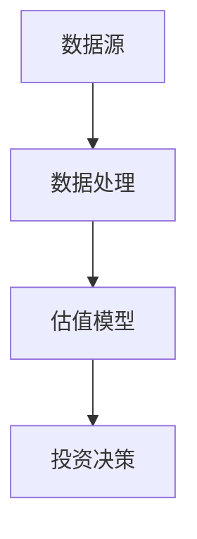

                 

# 价值投资在不同市场环境下的应用

## 关键词：价值投资、市场环境、投资策略、风险管理、财务分析

## 摘要

价值投资是一种以基本面分析为基础的投资策略，旨在通过识别市场价格低于其内在价值的股票来实现长期收益。本文探讨了价值投资在不同市场环境（牛市、熊市、震荡市）下的应用，分析了其核心概念、数学模型、系统架构，并通过实际案例展示了如何在复杂多变的市场中应用价值投资策略。文章还讨论了风险管理的重要性，并展望了价值投资的未来发展趋势。

---

# 第一部分: 价值投资的背景与基础

## 第1章: 价值投资的核心概念

### 1.1 价值投资的定义与背景

#### 1.1.1 价值投资的定义
价值投资是一种投资策略，强调以低于内在价值的价格买入优质资产，长期持有，以实现资本增值。其核心在于对公司基本面的深入分析，寻找被市场低估的投资标的。

#### 1.1.2 价值投资的起源与发展
价值投资的起源可以追溯到20世纪初，本杰明·格雷厄姆和戴维·多德是该领域的先驱。他们提出的“安全边际”概念奠定了价值投资的理论基础。随着金融市场的演变，价值投资策略不断完善，逐渐成为投资领域的重要流派。

#### 1.1.3 价值投资的核心原则
- **安全边际**：买入价格低于内在价值，确保投资的安全性。
- **长期视角**：关注企业的长期盈利能力，而非短期市场波动。
- **基本面分析**：通过财务报表分析企业的盈利能力、财务状况和行业地位。

### 1.2 价值投资与其他投资策略的对比

#### 1.2.1 股票投资的主要策略
- **价值投资**：寻找被低估的股票，注重内在价值。
- **成长投资**：投资于高成长性企业，注重未来盈利潜力。
- **趋势投资**：跟随市场趋势，利用技术分析进行交易。

#### 1.2.2 价值投资与成长投资的区别
| 方面 | 价值投资 | 成长投资 |
|------|----------|----------|
| 核心关注点 | 当前估值 | 未来成长性 |
| 适用场景 | 市场低估时 | 高成长行业 |
| 风险 | 较低 | 较高 |

#### 1.2.3 价值投资与趋势投资的对比
| 方面 | 价值投资 | 趋势投资 |
|------|----------|----------|
| 投资依据 | 基本面分析 | 技术分析 |
| 投资期限 | 长期 | 短期或中期 |
| 风险控制 | 强调安全边际 | 依赖趋势反转 |

### 1.3 价值投资的核心要素

#### 1.3.1 公司基本面分析
基本面分析包括对企业盈利能力、财务状况和行业地位的评估。常用的财务指标包括净利润、营业收入、资产负债率和ROE（净资产收益率）。

#### 1.3.2 市场情绪与估值
市场情绪会影响股票价格，但价值投资者更关注估值指标，如市盈率（P/E）和市净率（P/B）。

#### 1.3.3 长期投资与复利效应
长期投资通过复利效应实现财富增长，避免短期波动的干扰。

---

## 第2章: 价值投资的数学模型与算法原理

### 2.1 价值投资的数学模型

#### 2.1.1 市盈率（P/E）模型
市盈率是衡量股票估值的重要指标，公式为：
$$ P/E = \frac{Price}{Earnings} $$

#### 2.1.2 市净率（P/B）模型
市净率用于评估股票相对于其账面价值的估值，公式为：
$$ P/B = \frac{Price}{Book\ Value} $$

#### 2.1.3 内在价值模型
内在价值是股票的理论价值，公式为：
$$ V = \sum_{t=1}^{n} \frac{CF_t}{(1+r)^t} $$
其中，CF_t是第t年的现金流，r是折现率。

### 2.2 价值投资的算法流程

#### 2.2.1 数据收集与清洗
- 数据来源：股票价格、财务报表、行业数据。
- 数据清洗：去除异常值，处理缺失数据。

#### 2.2.2 财务指标计算与分析
- 计算市盈率、市净率、ROE等指标。
- 对比行业平均水平，识别低估股票。

#### 2.2.3 估值模型的实现
- 应用内在价值模型估算股票的合理价格。
- 对比市场价格，识别具有安全边际的股票。

#### 2.2.4 投资决策的逻辑
- 判断股票是否符合价值投资标准。
- 构建投资组合，分散风险。

### 2.3 价值投资的数学公式

#### 2.3.1 市盈率公式
$$ P/E = \frac{Price}{Earnings} $$

#### 2.3.2 市净率公式
$$ P/B = \frac{Price}{Book\ Value} $$

#### 2.3.3 内在价值公式
$$ V = \sum_{t=1}^{n} \frac{CF_t}{(1+r)^t} $$

---

## 第3章: 价值投资的系统架构设计

### 3.1 系统架构概述

#### 3.1.1 系统功能模块划分
- 数据采集模块：收集股票数据和财务报表。
- 数据处理模块：清洗和计算财务指标。
- 估值模块：应用数学模型计算内在价值。
- 投资决策模块：生成投资建议。

#### 3.1.2 系统架构设计图

---

## 第4章: 价值投资在不同市场环境下的应用

### 4.1 牛市环境下的价值投资策略

#### 4.1.1 牛市的特点
- 市场情绪高涨，股票价格可能被高估。
- 价值投资者应寻找低估值的股票，避免追涨杀跌。

#### 4.1.2 投资策略
- 选择基本面良好但被市场低估的股票。
- 分散投资，降低风险。

### 4.2 熊市环境下的价值投资策略

#### 4.2.1 熊市的特点
- 市场情绪低迷，股票价格可能被低估。
- 优质股票的价格可能大幅下降，提供买入机会。

#### 4.2.2 投资策略
- 增加对优质股票的配置，利用市场的恐慌性抛售。
- 保持耐心，长期持有优质资产。

### 4.3 震荡市环境下的价值投资策略

#### 4.3.1 震荡市的特点
- 市场波动剧烈，股票价格上下波动。
- 价值投资者需要耐心等待市场回归理性。

#### 4.3.2 投资策略
- 保持投资纪律，避免频繁交易。
- 逐步建仓，分批买入优质股票。

---

## 第5章: 价值投资的实战案例分析

### 5.1 案例背景介绍

#### 5.1.1 公司概况
- 公司名称：XYZ公司
- 主营业务：制造和销售电子产品
- 财务状况：净利润稳步增长，资产负债率较低

### 5.2 数据分析与模型应用

#### 5.2.1 财务指标计算
- 市盈率：$$ P/E = \frac{10}{2} = 5 $$
- 市净率：$$ P/B = \frac{10}{1} = 10 $$

#### 5.2.2 内在价值估算
假设折现率为8%，未来现金流为100万元，估算内在价值为：
$$ V = \sum_{t=1}^{5} \frac{100}{(1+0.08)^t} \approx 431.59 \text{万元} $$

#### 5.2.3 投资决策
市场价格为10元/股，内在价值为4.31元/股，存在低估，适合买入。

### 5.3 投资组合管理

#### 5.3.1 资产配置
- 60%股票，30%债券，10%现金。

#### 5.3.2 风险管理
- 设置止损点，控制单只股票的持仓比例。

### 5.4 案例总结

#### 5.4.1 成功经验
- 深入分析公司基本面，识别低估股票。
- 保持长期投资，避免短期波动干扰。

#### 5.4.2 经验教训
- 需要动态调整投资组合，应对市场变化。
- 加强对市场的监控，及时发现潜在风险。

---

## 第6章: 价值投资的未来展望

### 6.1 当前价值投资的趋势

#### 6.1.1 ESG投资的兴起
- 环境、社会和治理因素逐渐成为投资者关注的焦点。
- 价值投资与ESG理念的结合，为企业提供更全面的评估方法。

#### 6.1.2 数字化与智能化
- 人工智能技术的应用，提高了数据处理和模型计算的效率。
- 大数据分析技术帮助投资者发现更多的投资机会。

### 6.2 价值投资的挑战与机遇

#### 6.2.1 挑战
- 市场波动加剧，价值投资的适用性受到考验。
- 技术进步带来的投资机会和风险并存。

#### 6.2.2 机遇
- 全球化背景下，跨国投资机会增加。
- 新兴行业（如科技、新能源）的价值投资潜力巨大。

### 6.3 未来价值投资的发展方向

#### 6.3.1 结合ESG因素
- 将ESG指标纳入价值评估体系，实现可持续投资。

#### 6.3.2 利用技术进步
- 通过大数据和人工智能技术优化投资决策过程。
- 开发更先进的估值模型，提高投资效率。

---

## 作者：AI天才研究院/AI Genius Institute & 禅与计算机程序设计艺术 /Zen And The Art of Computer Programming

---

以上是《价值投资在不同市场环境下的应用》的技术博客文章的完整内容。文章从价值投资的背景、核心概念、数学模型、系统架构、实战案例和未来展望等方面进行了详细分析，结合技术语言和实际案例，为读者提供了全面的价值投资策略。

