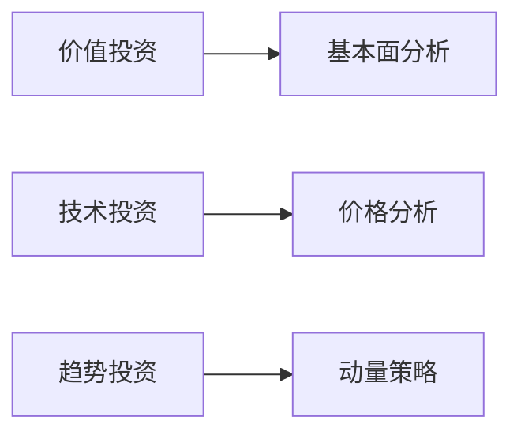
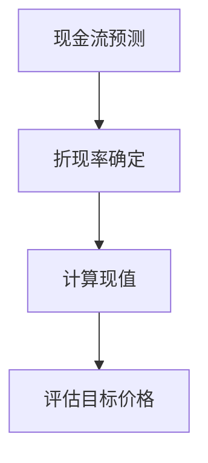
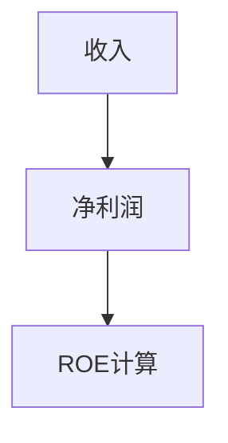
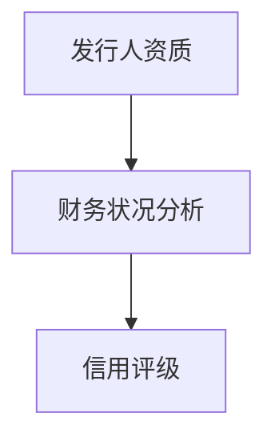
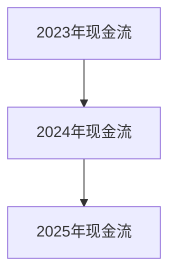

                 

# 《价值投资在不同资产类别中的应用》

> 关键词：价值投资、资产类别、股票、债券、风险管理、投资策略

> 摘要：本文探讨了价值投资在不同资产类别中的应用，分析了股票、债券、房地产等主要资产的特点，介绍了价值评估工具和方法，并通过实际案例展示了如何在这些资产中寻找投资机会。同时，本文还强调了风险管理的重要性，为投资者提供了实用的策略和建议。

---

## 第1章: 价值投资的核心概念与背景

### 1.1 价值投资的定义与核心理念

价值投资是一种以基本面分析为基础的投资策略，强调通过分析资产的内在价值来寻找被市场低估的投资机会。其核心理念包括：

1. **安全边际**：买入价格低于内在价值，以确保投资的安全性。
2. **长期视角**：关注企业的长期价值，而非短期市场波动。
3. **独立思考**：避免随市场情绪波动，坚持独立分析。

图1.1展示了价值投资与其他投资策略的区别：

### 1.2 资产类别概述

主要资产类别包括股票、债券、房地产、 commodities等。每种资产都有其特点和价值投资的适用性。

表1.1：不同资产类别的特点对比

| 资产类别 | 主要特点 | 价值投资适用性 |
|----------|----------|----------------|
| 股票     | 高增长潜力，波动性大 | 高             |
| 债券     | 稳定收入，低风险 | 中             |
| 房地产   | 实物资产，抗跌性好 | 高             |

---

## 第2章: 价值投资的关键工具与方法

### 2.1 资产定价模型

价值投资的核心工具之一是资产定价模型。现金流贴现模型（DCF）是常用的工具之一，用于估算企业的内在价值。

图2.1展示了DCF模型的流程：

数学公式如下：

$$
\text{内在价值} = \sum_{t=1}^{n} \frac{\text{现金流}_t}{(1 + r)^t}
$$

其中，$r$为折现率，$n$为预测年数。

---

## 第3章: 股票投资的深度分析

### 3.1 股票投资的基本策略

股票投资的核心在于基本面分析，包括财务报表分析和竞争优势评估。

表3.1：关键财务指标

| 指标         | 公式                     | 作用                     |
|--------------|--------------------------|--------------------------|
| 市盈率（P/E） | 市价/净利润               | 评估股票的估值合理性     |
| 市净率（P/B） | 市价/净资产               | 评估股票的安全边际       |
| 净资产收益率（ROE） | 净利润/净资产             | 评估企业的盈利能力       |

### 3.2 行业龙头企业的案例分析

以某科技公司为例，分析其财务状况和竞争优势：

图3.1展示了该公司的财务状况：

数学公式：

$$
\text{ROE} = \frac{\text{净利润}}{\text{净资产}}
$$

---

## 第4章: 价值投资在债券中的应用

### 4.1 债券投资的策略与技巧

债券投资注重信用评级和利率风险的控制。图4.1展示了债券评级的流程：

### 4.2 风险管理与债券组合优化

通过分散投资和设置止损点来控制风险。数学公式：

$$
\text{风险调整后收益} = \text{收益} - \text{风险溢价}
$$

---

## 第5章: 实战案例分析

### 5.1 股票投资案例

分析某公司的投资机会：

图5.1展示了该公司的现金流预测：

### 5.2 债券投资案例

评估某债券的信用风险：

图5.2展示了信用评级流程：

---

## 第6章: 价值投资的未来趋势

### 6.1 技术进步的影响

人工智能和大数据在价值投资中的应用日益广泛，提供更精准的估值模型。

### 6.2 全球化与多元化投资

随着全球市场的互联互通，投资者需要考虑更多的资产类别和地域。

---

## 附录

### 附录A: 价值投资工具推荐

包括财务分析软件、估值模型等。

### 附录B: 进一步阅读的书籍和资源

推荐相关书籍和在线资源。

---

# 作者：AI天才研究院/AI Genius Institute & 禅与计算机程序设计艺术 /Zen And The Art of Computer Programming

