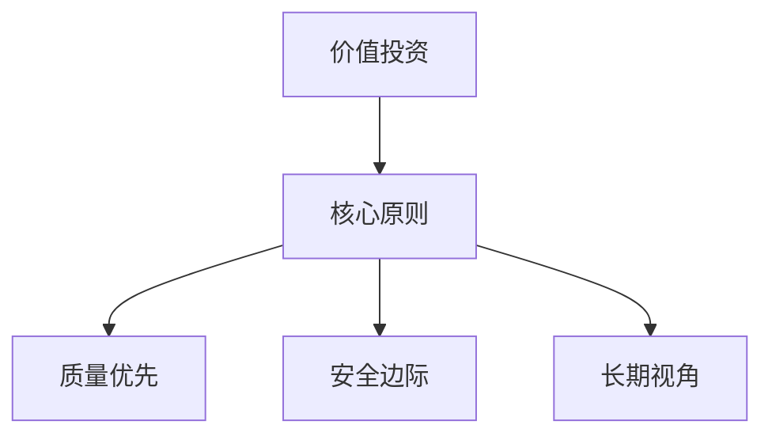
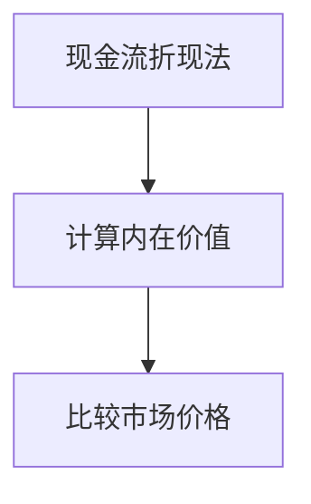
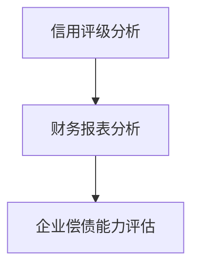

                 


# 《价值投资在固定收益市场的应用》

> 关键词：价值投资，固定收益市场，投资策略，风险管理，债券分析

> 摘要：本文探讨了价值投资在固定收益市场中的应用，从基本概念到具体策略，再到实际案例，系统地分析了如何在固定收益市场中应用价值投资方法，包括估值、风险控制、投资组合优化等内容，旨在为投资者提供理论和实践指导。

---

## 第一章：价值投资的基本概念

### 1.1 价值投资的定义与核心原则

- **价值投资的定义**：价值投资是一种以低于其内在价值的价格购买优质资产的投资策略，核心在于寻找市场低估的资产并长期持有。
- **价值投资的核心原则**：
  - 质量优先：选择财务健康、管理优秀的企业。
  - 安全边际：购买价格低于内在价值，确保足够的安全空间。
  - 长期视角：耐心持有，等待市场的认知回归。



### 1.2 固定收益市场的基本结构

- **固定收益市场的定义**：指那些定期支付固定利息，并在特定时间偿还本金的金融工具市场，如债券、国债等。
- **市场参与者**：政府、企业和个人投资者。
- **市场要素**：期限、面值、票面利率、到期日、偿还方式等。

### 1.3 价值投资与固定收益市场的结合

- 价值投资在固定收益市场中的独特优势：
  - 债券的内在价值可以通过现金流折现法计算。
  - 通过分析债券的信用评级和市场利率，寻找低估的债券。

---

## 第二章：价值投资的核心策略

### 2.1 债券的估值方法

- **现金流折现法**：
  - 计算债券的内在价值，比较市场价格。
  - 例如，计算债券的到期收益率(YTM)。



- 数学公式：
  $$ V = \sum_{t=1}^{n} \frac{C}{(1+r)^t} + \frac{F}{(1+r)^n} $$
  其中，V为债券价值，C为每期现金流，r为折现率，F为面值，n为期限。

### 2.2 风险管理与信用分析

- **信用评级分析**：
  - 使用 Moody's 和 S&P 的评级系统。
  - 通过财务报表分析企业的偿债能力。



### 2.3 投资组合优化

- **分散投资**：通过配置不同类型的债券降低风险。
- **久期管理**：根据市场利率变化调整债券的期限。

---

## 第三章：实际案例分析

### 3.1 案例：国债的价值投资策略

- **案例背景**：2023年某国债发行，票面利率3%，剩余期限10年。
- **分析步骤**：
  1. 计算国债的内在价值。
  2. 比较市场价与内在价值。
  3. 判断是否低估。

### 3.2 案例：企业债券的风险控制

- **案例分析**：
  1. 评估企业的信用状况。
  2. 计算债券的到期收益率。
  3. 结合市场利率制定投资策略。

---

## 第四章：系统设计与实现

### 4.1 系统架构设计


### 4.2 算法实现

- **Python代码示例**：

```python
import numpy as np
import pandas as pd

def calculate_intrinsic_value(cash_flows, discount_rate):
    present_value = np.sum(cash_flows / (1 + discount_rate)**np.arange(len(cash_flows)))
    return present_value

# 示例数据
cash_flows = [100, 100, 100, 100, 100, 100, 100, 100, 100, 100]
discount_rate = 0.05

intrinsic_value = calculate_intrinsic_value(cash_flows, discount_rate)
print(f"债券的内在价值为：{intrinsic_value}")
```

---

## 第五章：项目实战

### 5.1 环境安装

- 安装必要的Python库：numpy、pandas、scikit-learn。

### 5.2 核心代码实现

- **数据清洗与特征提取**：
  ```python
  data = pd.read_csv('bond_data.csv')
  data_clean = data.dropna()
  features = data_clean[['rating', 'yield', 'duration']]
  ```

- **模型训练**：
  ```python
  from sklearn.ensemble import RandomForestRegressor
  model = RandomForestRegressor(n_estimators=100)
  model.fit(features, data_clean['price'])
  ```

### 5.3 实际案例分析

- 分析某债券的价格是否被低估，给出投资建议。

---

## 结论与展望

- 价值投资在固定收益市场中具有广阔的前景，通过系统的分析和策略的应用，投资者可以有效识别低估资产，实现稳健收益。
- 未来，随着技术的进步，价值投资将更加依赖于数据驱动和算法优化。

---

## 作者信息

作者：AI天才研究院 & 禅与计算机程序设计艺术

---

以上是文章的详细结构和内容，确保每一部分都详细展开，涵盖从理论到实践的各个方面，帮助读者全面理解价值投资在固定收益市场的应用。

