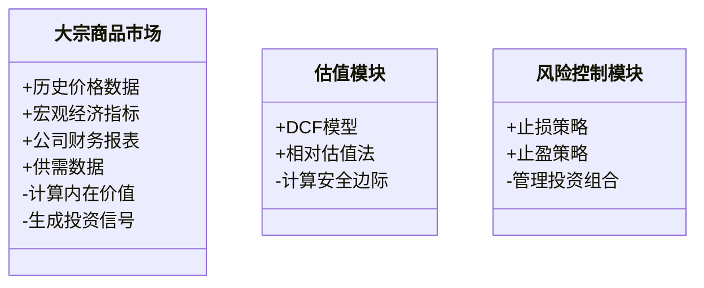

                 


# 价值投资在大宗商品市场的应用

> 关键词：价值投资，大宗商品市场，基本面分析，安全边际，量化分析

> 摘要：本文探讨了价值投资在大宗商品市场的应用，从基本概念到量化分析，结合系统架构和实际案例，分析了如何在大宗商品市场中运用价值投资策略，构建有效的投资模型和系统。

---

# 第一部分: 价值投资的基本理论与大宗商品市场的特点

## 第1章: 价值投资的核心概念与大宗商品市场的特点

### 1.1 价值投资的基本概念

#### 1.1.1 价值投资的定义与核心思想
- 价值投资是一种以基本面分析为基础的投资策略，强调以低于内在价值的价格买入资产。
- 核心思想：市场先生是价格的波动者，而非价值的决定者。
- 长期视角：关注企业的内在价值，而非短期价格波动。

#### 1.1.2 价值投资与其它投资策略的区别
- **区别于技术分析**：技术分析依赖价格和成交量的短期走势，而价值投资关注长期基本面。
- **区别于趋势投资**：趋势投资基于价格趋势的延续性，而价值投资基于价格与价值的偏离。
- **区别于指数投资**：指数投资通过分散化降低风险，而价值投资通过精选个股或商品实现超额收益。

#### 1.1.3 价值投资在不同市场中的适用性
- 股票市场：寻找被低估的公司。
- 大宗商品市场：寻找价格低于内在价值的原材料或资源。

### 1.2 大宗商品市场的特点

#### 1.2.1 大宗商品的定义与分类
- 大宗商品：用于工业生产或消费的初级产品，如原油、天然气、黄金、铜、铁矿石等。
- 分类：
  - 能源类：原油、天然气。
  - 金属类：黄金、白银、铜、铝。
  - 农产品类：大豆、小麦、玉米。
  - 其他：天然气、铀等。

#### 1.2.2 大宗商品市场的价格波动特点
- 周期性：大宗商品价格受经济周期影响较大。
- 季节性：部分农产品价格受季节影响显著。
- 波动性：价格波动较大，尤其是在供需失衡或地缘政治事件发生时。

#### 1.2.3 大宗商品市场的参与者与交易机制
- 参与者：
  - 生产者：如石油公司、矿业公司。
  - 消费者：如制造企业、电力公司。
  - 投资者：如对冲基金、机构投资者。
  - 中间商：如贸易公司、物流公司。
- 交易机制：
  - 期货交易：主要通过期货交易所进行。
  - 现货交易：直接买卖实物商品。
  - 期权交易：基于期货的衍生品交易。

---

## 第2章: 价值投资在大宗商品市场的独特性

### 2.1 大宗商品市场的基本面分析

#### 2.1.1 供需关系对价格的影响
- 供给端：
  - 生产成本：如开采成本、冶炼成本。
  - 行业集中度：寡头垄断（如石油） vs 分散生产（如农产品）。
- 需求端：
  - 经济增长：工业需求与GDP相关。
  - 技术进步：如新能源技术对传统能源的需求替代。

#### 2.1.2 宏观经济指标对大宗商品价格的影响
- 利率：实际利率下降，通胀预期上升，大宗商品价格上涨。
- 汇率：本币贬值，进口商品价格上涨。
- 通货膨胀：大宗商品作为保值工具，价格往往上涨。

#### 2.1.3 行业周期与企业基本面分析
- 行业周期：大宗商品价格受全球经济周期影响，具有明显的周期性。
- 企业基本面：生产企业的盈利能力、资产负债表、现金流等。

### 2.2 价值投资在大宗商品市场的核心要素

#### 2.2.1 安全边际的定义与计算
- 安全边际：买入价格与内在价值的差距，用于降低投资风险。
- 计算方法：内在价值 - 市场价格 > 安全边际阈值。

#### 2.2.2 价格与价值的偏离分析
- 价格低于内在价值时，存在投资机会。
- 内在价值的评估方法：DCF模型、相对估值法（市盈率、市净率）。

#### 2.2.3 长期视角与市场周期的结合
- 长期视角：关注大宗商品的长期供需关系。
- 市场周期：在周期性底部买入，在顶部卖出。

---

# 第三部分: 价值投资策略在大宗商品市场的应用

## 第3章: 大宗商品市场的量化分析与价值评估模型

### 3.1 量化分析的基本原理

#### 3.1.1 数据收集与处理
- 数据来源：期货交易所、金融数据供应商（如 Bloomberg、Reuters）。
- 数据类型：历史价格、成交量、持仓量、宏观经济指标。
- 数据清洗：处理缺失值、异常值。

#### 3.1.2 价格预测模型的构建
- 时间序列分析：ARIMA模型。
- 机器学习：随机森林、神经网络。

#### 3.1.3 风险控制与投资组合优化
- 风险管理：止损、止盈。
- 投资组合优化：基于现代投资组合理论（MPT）。

### 3.2 价值评估模型的构建与应用

#### 3.2.1 基于基本面的估值方法
- DCF模型：计算未来现金流的现值。
- 相对估值法：市盈率、市净率、EV/EBITDA等指标。

#### 3.2.2 市场情绪与价格波动的关系
- 市场情绪指标：VIX指数、成交量、持仓量。
- 情绪与价格的关系：过度乐观导致价格泡沫，过度悲观导致价格低估。

#### 3.2.3 多因素模型在大宗商品估值中的应用
- Fama三因子模型：规模、价值、动量因子。
- 自定义因子：供需、宏观经济、行业周期。

---

## 第4章: 价值投资策略在大宗商品交易中的应用

### 4.1 价值投资策略的核心步骤

#### 4.1.1 确定投资目标
- 确定投资品种：原油、黄金、铜等。
- 确定投资期限：短期、中期、长期。

#### 4.1.2 基本面分析
- 行业分析：供需、行业集中度。
- 公司分析：财务报表、管理层。

#### 4.1.3 估值与安全边际
- 计算内在价值。
- 确定安全边际。

#### 4.1.4 投资决策
- 买入：当价格低于内在价值。
- 卖出：当价格接近或超过内在价值。

### 4.2 价值投资策略的系统实现

#### 4.2.1 系统架构设计
- 数据采集模块：收集市场数据。
- 估值模块：计算内在价值。
- 决策模块：生成买入/卖出信号。
- 风险控制模块：管理投资组合。

#### 4.2.2 系统实现的代码示例

```python
import pandas as pd
import numpy as np

def calculate_intrinsic_value(free_cash_flow, discount_rate, growth_rate):
    # 简单DCF模型
    terminal_value = (free_cash_flow * (1 + growth_rate)) / (discount_rate - growth_rate)
    intrinsic_value = (free_cash_flow + terminal_value) / (1 + discount_rate)
    return intrinsic_value

# 示例数据
free_cash_flow = 100
discount_rate = 0.08
growth_rate = 0.05

iv = calculate_intrinsic_value(free_cash_flow, discount_rate, growth_rate)
print(f"内在价值：{iv:.2f}")
```

---

## 第5章: 价值投资策略在实际操作中的应用

### 5.1 项目实战

#### 5.1.1 环境配置
- 安装必要的Python库：pandas、numpy、matplotlib。

#### 5.1.2 数据获取
- 从Bloomberg获取原油期货价格数据。

#### 5.1.3 模型实现
- 使用历史数据计算内在价值。

#### 5.1.4 结果分析
- 对比价格与内在价值，判断是否存在投资机会。

---

# 第四部分: 系统分析与架构设计

## 第6章: 系统架构与功能设计

### 6.1 系统功能设计

#### 6.1.1 领域模型（mermaid类图）


#### 6.1.2 系统架构设计（mermaid架构图）
```mermaid
container 大宗商品价值投资系统 {
    class 大宗商品市场 {
        +历史价格数据
        +宏观经济指标
        +公司财务报表
        +供需数据
    }
    class 估值模块 {
        +DCF模型
        +相对估值法
        -计算内在价值
        -计算安全边际
    }
    class 风险控制模块 {
        +止损策略
        +止盈策略
        -管理投资组合
    }
    class 投资决策模块 {
        +买入信号
        +卖出信号
    }
}
```

---

# 第五部分: 最佳实践与小结

## 第7章: 最佳实践与小结

### 7.1 投资策略总结
- 理解大宗商品市场的特点。
- 结合基本面分析和量化模型。
- 保持长期视角，关注安全边际。

### 7.2 风险管理
- 设置止损和止盈。
- 分散投资，避免过度集中。

### 7.3 持续学习
- 关注行业动态和市场变化。
- 不断优化估值模型。

---

# 作者信息

作者：AI天才研究院/AI Genius Institute & 禅与计算机程序设计艺术 /Zen And The Art of Computer Programming

