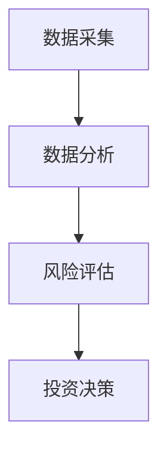

                 


# 价值投资在新经济时代的适应与变革

> 关键词：价值投资、新经济、投资策略、财务分析、技术创新  
> 摘要：本文深入探讨了价值投资在新经济时代的适应与变革，分析了传统价值投资在面对技术驱动和数字化转型中的挑战与机遇，提出了结合技术创新和长期价值创造的投资策略。

---

## 第一部分：价值投资的背景与现状

### 第1章：价值投资的起源与发展

#### 1.1 价值投资的起源
价值投资是一种基于对企业内在价值评估的投资策略，其核心理念是寻找市场价格低于内在价值的证券进行投资。这一理念由本杰明·格雷厄姆和戴维·多德在20世纪初提出，强调安全边际和长期持有。

#### 1.2 价值投资的核心要素
- **内在价值**：企业未来现金流的现值。
- **安全边际**：市场价格与内在价值的差距，确保投资的安全性。
- **长期视角**：关注企业的长期盈利能力而非短期波动。

### 第2章：新经济时代的投资变革

#### 2.1 新经济时代的特征
新经济时代以技术创新和数字化转型为核心，企业的价值不再仅依赖于传统财务指标，而是更关注技术创新、商业模式和长期增长潜力。

#### 2.2 价值投资在新经济中的挑战
- **技术驱动的不确定性**：技术创新可能导致企业价值快速变化。
- **传统模型的局限性**：传统财务指标（如市盈率、市净率）在衡量科技企业时失真。
- **短期波动的干扰**：市场对新技术的过度反应可能导致短期价格波动。

---

## 第二部分：价值投资的核心概念与分析框架

### 第3章：价值投资的核心概念

#### 3.1 内在价值的计算
内在价值是通过对企业未来现金流的贴现计算得出的。公式如下：
$$
\text{内在价值} = \sum_{t=1}^{n} \frac{\text{现金流}_t}{(1 + r)^t}
$$
其中，\( r \) 是折现率，\( n \) 是评估周期。

#### 3.2 价值投资的关键步骤
1. **识别低估企业**：寻找市场价格低于内在价值的企业。
2. **分析公司基本面**：评估公司的财务状况、行业地位和竞争优势。
3. **计算安全边际**：确保买入价格低于内在价值。

### 第4章：价值投资的分析框架

#### 4.1 财务指标分析
- **净利润与ROE**：衡量企业的盈利能力。
- **现金流分析**：评估企业的造血能力。
- **资产负债表分析**：关注企业的资产结构和偿债能力。

#### 4.2 行业分析与投资机会
- **行业生命周期**：选择处于成长期的行业。
- **竞争结构**：关注具有竞争优势的企业。
- **技术创新**：评估企业的技术创新能力。

---

## 第三部分：价值投资在新经济中的适应与变革

### 第5章：新经济时代的价值评估模型

#### 5.1 传统模型的局限性
- **市盈率（P/E）**：在科技企业中，高增长可能导致市盈率偏高。
- **市净率（P/B）**：对于无形资产占主导的科技企业，市净率失真。

#### 5.2 创新评估模型
- **现金流贴现模型（DCF）**：适用于科技企业的高增长特性。
- **相对价值评估**：结合可比公司分析和技术优势。

### 第6章：技术驱动下的投资策略

#### 6.1 技术创新与企业价值
- 技术创新是新经济的核心驱动力，企业的研发投入和技术储备是关键。
- 使用 **技术生命周期** 分析模型，判断技术创新对企业价值的影响：
  1. **技术成熟期**：技术创新放缓，企业进入稳定增长阶段。
  2. **技术突破期**：技术创新带来高增长，企业价值快速提升。

#### 6.2 数字化转型中的投资机会
- **数字化转型**：企业通过数字化改造提升效率和竞争力。
- **投资策略**：选择具有数字化转型能力的行业龙头。

---

## 第四部分：价值投资的系统架构与案例分析

### 第7章：系统架构设计方案

#### 7.1 价值投资评估系统的功能模块
1. **数据采集模块**：收集企业的财务数据和行业信息。
2. **数据分析模块**：计算内在价值和安全边际。
3. **风险评估模块**：分析市场波动和技术风险。

#### 7.2 系统架构图


### 第8章：项目实战与案例分析

#### 8.1 环境配置
- 使用 Python 和相关库（Pandas、NumPy）进行数据分析。
- 数据来源：公开财务数据和行业报告。

#### 8.2 核心代码实现
```python
import pandas as pd
import numpy as np

def calculate_intrinsic_value(free_cash_flow, discount_rate):
    # 假设永续增长率为g
    g = 0.05
    terminal_value = free_cash_flow[-1] * (1 + g) / (discount_rate - g)
    intrinsic_value = terminal_value / (1 + discount_rate)
    return intrinsic_value

# 示例数据
cash_flows = [100, 110, 120]
discount_rate = 0.1

iv = calculate_intrinsic_value(cash_flows, discount_rate)
print(f"内在价值：{iv:.2f}")
```

#### 8.3 案例分析
以某互联网公司为例，分析其财务数据和技术创新能力，结合DCF模型计算其内在价值，并与市场价格进行对比。

---

## 第五部分：最佳实践与总结

### 第9章：最佳实践

#### 9.1 小结
- 价值投资在新经济中需要灵活调整策略，注重技术创新和长期价值。
- 结合DCF模型和相对估值法，制定科学的投资决策。

#### 9.2 注意事项
- 避免过度依赖单一指标。
- 定期更新模型参数，适应市场变化。

#### 9.3 拓展阅读
- 格雷厄姆的《证券分析》
- 纳什的博弈论与投资策略

---

## 作者：AI天才研究院/AI Genius Institute & 禅与计算机程序设计艺术 /Zen And The Art of Computer Programming

---

### 总结
本文从价值投资的基本概念出发，分析了其在新经济时代的适应与变革，提出了结合技术创新和长期价值创造的投资策略。通过系统架构和案例分析，展示了如何在实践中应用这些理念，为投资者提供了新的思路和方法。

