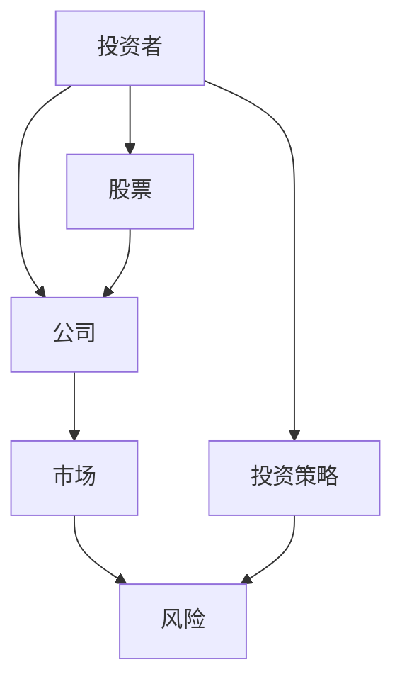
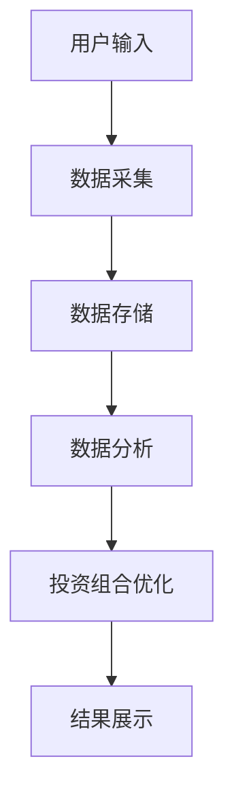

                 


# 价值投资大师的智慧：格雷厄姆、巴菲特、费雪和约翰伯格

## 关键词：价值投资、格雷厄姆、巴菲特、费雪、约翰伯格、投资策略、风险管理

## 摘要：  
价值投资是一种长期有效的投资策略，由多位大师如格雷厄姆、巴菲特、费雪和约翰伯格共同塑造。本文将深入分析这些大师的核心思想，探讨其背后的数学模型和算法，结合实际案例，展示如何将这些智慧应用于现代投资实践。通过系统化的分析与架构设计，本文旨在为读者提供一套科学的投资方法，帮助他们在复杂多变的市场中实现稳健收益。

---

## 第一部分：引言

### 1.1 价值投资的定义与重要性

价值投资是一种以低于内在价值的价格购买优质资产的投资策略。其核心在于寻找市场低估的股票，长期持有，等待其价值回归。与短期交易不同，价值投资注重企业的基本面分析，强调安全边际和长期收益。

**核心要素：**  
- **内在价值**：资产的真实价值，基于未来现金流的现值计算。  
- **安全边际**：买入价格低于内在价值，以降低风险。  
- **长期视角**：关注企业的持续盈利能力，而非短期市场波动。

### 1.2 价值投资大师的贡献

#### 1.2.1 格雷厄姆的贡献  
本杰明·格雷厄姆被誉为“价值投资之父”，其核心思想体现在《证券分析》和《聪明的投资者》中。他提出“市场先生”概念，强调市场情绪的波动性和非理性。格雷厄姆的防御性投资策略注重安全边际和低风险，为巴菲特等后辈奠定了基础。

#### 1.2.2 巴菲特的贡献  
沃伦·巴菲特是格雷厄姆的学生，将老师的思想发扬光大。巴菲特提出“护城河”概念，强调投资具有持续竞争优势的企业。他倡导长期持有优质股，每年 Compound 利益，实现财富的指数级增长。

#### 1.2.3 费雪的贡献  
菲利普·费雪是成长型投资的倡导者，提出“概念股”和“十倍股”概念。他认为，投资应着眼于企业的成长潜力，而非单纯的低估值。费雪的策略注重管理层质量和技术进步，为成长股投资提供了理论基础。

#### 1.2.4 约翰伯格的贡献  
约翰·伯格是指数投资的倡导者，强调投资的纪律性和分散性。他创立了 Vanguard 集团，推广低成本指数基金，为普通投资者提供了简单有效的投资工具。

---

## 第二部分：价值投资的核心概念与联系

### 2.1 价值投资的数学模型与公式

#### 2.1.1 市盈率（P/E）公式  
市盈率 = 股价 / 每股净利润  
$$ P/E = \frac{P}{E} $$  
市盈率反映了市场对公司未来盈利能力的预期，是衡量股票估值的重要指标。

#### 2.1.2 市净率（P/B）公式  
市净率 = 股价 / 每股净资产  
$$ P/B = \frac{P}{B} $$  
市净率适用于评估银行、地产等净资产占比高的行业。

#### 2.1.3 内在价值计算公式  
内在价值 = ∑(未来现金流的现值)  
$$ V = \sum_{t=1}^{n} \frac{CF_t}{(1+r)^t} $$  
内在价值是企业未来现金流的折现值，反映了其真实价值。

#### 2.1.4 投资组合的夏普比率  
夏普比率 = (投资组合收益 - 无风险利率) / 投资组合收益的标准差  
$$ Sharpe = \frac{R_p - R_f}{\sigma_p} $$  
夏普比率衡量投资组合的风险调整后收益。

### 2.2 核心概念对比表格

| 大师      | 核心思想                     | 投资策略                     | 风险管理                     |
|-----------|----------------------------|----------------------------|----------------------------|
| 格雷厄姆   | 安全边际，低估值             | 防御性投资，注重安全边际     | 风险厌恶，分散投资           |
| 巴菲特     | 护城河，长期持有             | 买入并持有优质股             | 通过分散和优质股降低风险     |
| 费雪       | 成长股，管理层质量           | 投资成长型企业               | 通过选择优秀管理层降低风险   |
| 约翰伯格   | 指数基金，分散投资           | 投资低成本指数基金             | 通过分散降低系统性风险       |

### 2.3 实体关系图（ER图）



---

## 第三部分：价值投资的算法原理

### 3.1 基本面分析算法

#### 3.1.1 财务报表分析  
分析企业的利润表、资产负债表和现金流量表，评估其盈利能力、偿债能力和成长性。

#### 3.1.2 盈利能力分析  
计算净利率、ROE（净资产收益率）等指标，判断企业的盈利能力。

#### 3.1.3 偿债能力分析  
计算流动比率、速动比率等指标，评估企业的偿债能力。

### 3.2 多因子模型

#### 3.2.1 Fama-French三因子模型  
Fama-French模型基于三个因子解释股票收益：市值、价值和动量。  
$$ R_i = R_f + \beta_1 (Size) + \beta_2 (Value) + \beta_3 (Momentum) $$  

#### 3.2.2 CAPM模型  
CAPM模型用于计算资产的预期收益。  
$$ R_i = R_f + \beta_i (R_m - R_f) $$  

#### 3.2.3 如何构建多因子模型  
步骤：  
1. 收集数据，计算因子值。  
2. 通过回归分析因子的解释能力。  
3. 构建投资组合，优化风险收益比。

### 3.3 投资组合优化算法

#### 3.3.1 Markowitz均值-方差优化  
Markowitz模型通过优化投资组合的收益和风险，找到最优配置。  
$$ \min \sigma^2 \quad \text{subject to} \quad \mu \cdot w = R_p, \quad w \cdot 1 = 1 $$  

#### 3.3.2 如何应用算法优化投资组合  
步骤：  
1. 确定目标收益和风险承受能力。  
2. 输入资产的期望收益、方差和协方差矩阵。  
3. 使用优化算法计算最优权重。

---

## 第四部分：系统分析与架构设计

### 4.1 价值投资系统的构建

#### 4.1.1 系统需求分析  
需求：  
- 实时数据获取  
- 基本面分析  
- 多因子模型计算  
- 投资组合优化  

#### 4.1.2 系统功能设计  
功能模块：  
- 数据采集模块  
- 分析模块  
- 优化模块  

#### 4.1.3 系统架构设计  
架构：  
- 前端：用户界面  
- 后端：算法处理  
- 数据层：数据库存储  

### 4.2 系统接口设计

#### 4.2.1 数据接口设计  
接口：  
- 数据来源：Yahoo Finance API  
- 数据格式：JSON  

#### 4.2.2 用户接口设计  
界面：  
- 输入：股票代码  
- 输出：分析报告  

### 4.3 系统流程图



---

## 第五部分：项目实战

### 5.1 环境安装与配置

#### 5.1.1 安装Python环境  
安装Python 3.8及以上版本。  
安装pip：  
```bash
python -m ensurepath
```

#### 5.1.2 安装必要的库  
安装numpy、pandas、matplotlib和yfinance。  
```bash
pip install numpy pandas matplotlib yfinance
```

### 5.2 核心代码实现

#### 5.2.1 基本面分析代码

```python
import pandas as pd
import yfinance as yf

def fetch_data(ticker):
    df = yf.download(ticker, start='2020-01-01', end='2023-01-01')
    return df

def calculate_P_E(df):
    pe = df['Close'] / df['EPS'].mean()
    return pe

# 示例代码
ticker = 'AAPL'
data = fetch_data(ticker)
pe = calculate_P_E(data)
print(f"PE ratio of {ticker}: {pe}")
```

#### 5.2.2 多因子模型代码

```python
import numpy as np

def calculate_sharp_ratio(returns, risk_free_rate):
    excess_returns = returns - risk_free_rate
    sharpe = np.mean(excess_returns) / np.std(excess_returns)
    return sharpe

# 示例代码
returns = np.array([0.05, 0.06, 0.04, 0.07])
risk_free_rate = 0.02
sharpe_ratio = calculate_sharp_ratio(returns, risk_free_rate)
print(f"Sharp ratio: {sharpe_ratio}")
```

---

## 第六部分：总结与展望

### 6.1 小结  
价值投资是一种长期有效的策略，结合基本面分析和数学模型，可以在复杂市场中实现稳健收益。

### 6.2 最佳实践 Tips  
- 保持纪律性，避免情绪化决策。  
- 定期复盘，优化投资组合。  
- 长期持有优质资产，避免频繁交易。

### 6.3 未来展望  
随着人工智能和大数据技术的发展，价值投资将更加系统化和自动化。投资者可以利用新技术提升分析效率，捕捉更多投资机会。

---

## 作者：AI天才研究院 & 禅与计算机程序设计艺术  
本文由AI天才研究院与“禅与计算机程序设计艺术”联合出品，转载请注明出处。

