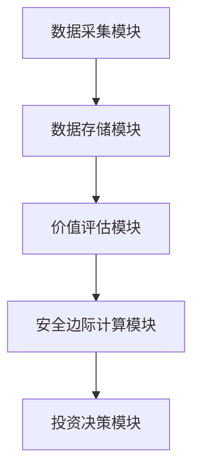

                 


# 价值投资的核心原则：安全边际

> 关键词：价值投资，安全边际，投资策略，风险管理，内在价值

> 摘要：本文深入探讨了价值投资中的核心原则——安全边际，通过数学模型、系统分析和项目实战，详细讲解了安全边际的概念、计算方法及其在投资决策中的应用，帮助读者优化投资策略，降低投资风险。

---

## 第一部分：价值投资的核心概念与背景

### 第1章：价值投资概述

#### 1.1 价值投资的起源与发展

价值投资是一种以基本面分析为基础的投资策略，起源于20世纪初，由本杰明·格雷厄姆和戴维·多德提出。其核心理念是购买那些市场价格低于其内在价值的资产，以获得长期稳定的收益。

- **起源**：20世纪20年代，格雷厄姆和多德在哥伦比亚大学教授证券分析课程，提出了价值投资的概念。
- **发展**：经过数十年的发展，价值投资理念被广泛应用于股票、债券和其他金融资产的投资中，形成了多种策略和方法。

#### 1.2 安全边际的定义与重要性

安全边际是价值投资中的核心原则，指的是资产的市场价格与其内在价值之间的差异。这种差异为投资者提供了风险缓冲，确保在市场价格波动时仍能获得收益。

- **定义**：安全边际 = 内在价值 - 市场价格。
- **重要性**：安全边际越高，投资的风险越低，收益的确定性越强。

### 第2章：价值投资的核心原则

#### 2.1 投资的三要素：价格、价值与安全边际

- **价格**：资产在市场上的交易价格，具有波动性。
- **价值**：资产的内在价值，基于其未来现金流的现值计算。
- **安全边际**：价格与价值之间的差异，是投资决策的关键因素。

#### 2.2 股票投资的内在价值模型

股票的内在价值可以通过多种方法评估，其中现金流折现模型（DCF）是常用的方法之一。公式如下：

$$ V = \frac{CF}{r - g} $$

其中：
- $V$ 表示内在价值
- $CF$ 表示自由现金流
- $r$ 表示折现率
- $g$ 表示现金流增长率

---

## 第二部分：安全边际的数学模型与公式

### 第3章：安全边际的数学模型与公式

#### 3.1 内在价值的计算公式

内在价值的计算公式基于现金流折现模型：

$$ V = \frac{CF}{r - g} $$

例如，假设某公司未来现金流为100万元，折现率为10%，增长率5%，则其内在价值为：

$$ V = \frac{100}{0.10 - 0.05} = 2000万元 $$

#### 3.2 安全边际的计算公式

安全边际的计算公式为：

$$ \text{安全边际} = \frac{V - P}{P} \times 100\% $$

其中：
- $V$ 表示内在价值
- $P$ 表示市场价格

例如，某公司内在价值为2000万元，市场价格为1500万元，则其安全边际为：

$$ \text{安全边际} = \frac{2000 - 1500}{1500} \times 100\% = 33.33\% $$

---

## 第三部分：安全边际在投资决策中的应用

### 第4章：安全边际与投资组合管理

#### 4.1 投资组合的构建

投资组合管理的核心在于分散风险，而安全边际可以帮助投资者在构建组合时选择具有较高安全边际的资产，从而降低整体风险。

#### 4.2 安全边际在不同市场周期的应用

在市场牛市中，安全边际较低，投资者应谨慎选择；在市场熊市中，安全边际较高，投资者可以积极布局。

---

## 第四部分：安全边际的系统分析与架构设计

### 第5章：安全边际的系统分析与架构设计

#### 5.1 投资决策系统的模块划分

- **数据采集模块**：收集市场数据，如股票价格、财务报表等。
- **价值评估模块**：计算资产的内在价值。
- **安全边际计算模块**：计算安全边际。
- **投资决策模块**：基于安全边际做出投资决策。

#### 5.2 系统架构设计

使用Mermaid绘制系统架构图：



---

## 第五部分：项目实战——基于安全边际的投资策略实现

### 第6章：项目实战

#### 6.1 环境安装与工具准备

- **Python环境安装**：安装Python 3.8及以上版本。
- **数据分析工具安装**：安装Pandas、NumPy等库。

#### 6.2 核心算法实现

##### 6.2.1 内在价值计算代码

```python
def calculate_intrinsic_value(cash_flow, discount_rate, growth_rate):
    return cash_flow / (discount_rate - growth_rate)
```

##### 6.2.2 安全边际计算代码

```python
def calculate_margin_ofSafety(intrinsic_value, market_price):
    return (intrinsic_value - market_price) / market_price * 100
```

---

## 结论

通过本文的详细讲解，我们可以看出，安全边际是价值投资中的核心原则，它帮助投资者在市场波动中保持理性，避免过度风险。在实际投资中，通过数学模型和系统设计，我们可以更科学地应用安全边际，优化投资决策。

---

## 作者

作者：AI天才研究院（AI Genius Institute） & 禅与计算机程序设计艺术（Zen And The Art of Computer Programming）

