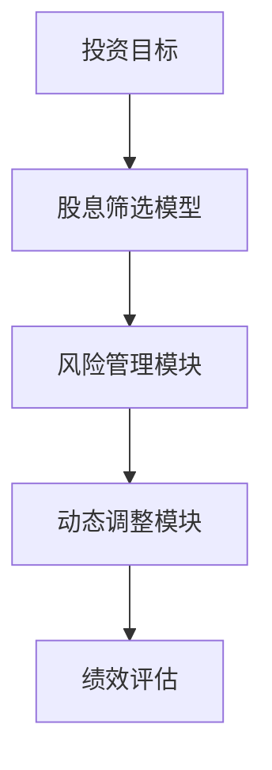
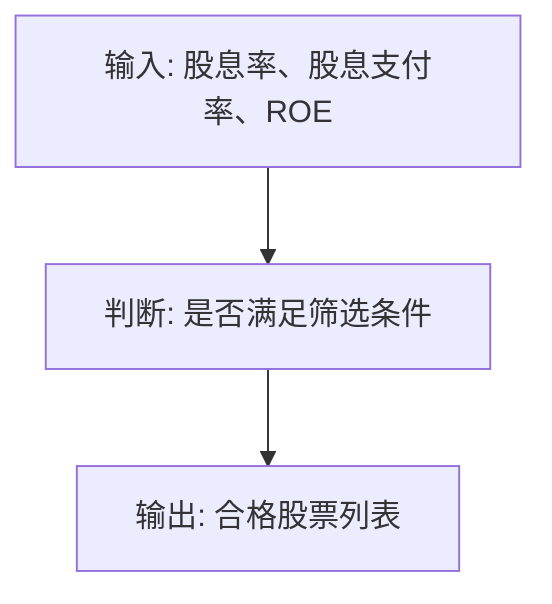

                 

# 价值投资者应该如何看待股息

## 关键词：价值投资、股息、股息率、股息支付率、股息增长模型、风险管理

## 摘要：  
股息是价值投资者评估股票投资价值的重要指标之一。本文从股息的本质、计算方法、投资策略、数学模型等多个维度，系统地分析了价值投资者应该如何看待股息。文章首先介绍了股息的基本概念和类型，然后详细探讨了股息在投资策略中的应用，包括如何通过股息率和股息支付率来筛选投资标的。接着，文章深入分析了股息增长模型和股息贴现模型（DDM）的原理，并通过实际案例展示了如何将这些模型应用于投资决策。最后，文章总结了股息投资的最佳实践和注意事项，为价值投资者提供了全面的指导。

---

# 第一部分：价值投资者与股息投资的背景与概念

## 第1章：股息投资的背景与核心概念

### 1.1 股息投资的背景

#### 1.1.1 股息投资的定义与来源  
股息是指公司分配给股东的利润部分，通常以现金或股票形式支付。股息投资的核心在于通过持有高股息率的股票，获得稳定的现金流。

#### 1.1.2 股息投资的现状与趋势  
随着市场波动加剧，股息投资因其稳定性而备受关注。近年来，股息率高的股票成为投资者的热门选择。

#### 1.1.3 股息投资与价值投资的关系  
价值投资强调以合理价格买入优质资产，股息投资是其重要组成部分，通过股息获得持续收益。

### 1.2 股息的核心概念与特征

#### 1.2.1 股息的本质与属性  
股息是股东权益的体现，反映公司盈利能力与分红政策。

#### 1.2.2 股息的分类与计算方式  
股息分为现金股息、股票股息等，计算公式为：  
$$\text{股息率} = \frac{\text{每股股息}}{\text{股价}}$$  

#### 1.2.3 股息与股价的关系  
股息影响股价，但股价还受市场情绪、公司基本面等多因素影响。

### 1.3 股息投资的核心要素

#### 1.3.1 股息率的定义与计算  
股息率衡量股票的收益能力，公式为：  
$$\text{股息率} = \frac{\text{每股股息}}{\text{股价}}$$  

#### 1.3.2 股息支付率的定义与影响  
股息支付率是股息与净利润的比率，公式为：  
$$\text{股息支付率} = \frac{\text{每股股息}}{\text{每股净利润}}$$  

#### 1.3.3 股息增长模型的原理  
股息增长模型预测未来股息，公式为：  
$$\text{股票价值} = \frac{\text{初始股息}}{\text{增长率} - \text{贴现率}}$$  

### 1.4 股息投资的边界与外延

#### 1.4.1 股息投资的适用场景  
适合追求稳定收益、风险承受能力较低的投资者。

#### 1.4.2 股息投资的局限性  
股息率高不一定代表公司盈利好，需警惕“高股息陷阱”。

#### 1.4.3 股息投资与其他投资策略的对比  
股息投资强调稳定性，而成长投资更看重未来增长潜力。

---

# 第二部分：股息投资的核心原理与数学模型

## 第2章：股息投资的数学模型与公式

### 2.1 股息率的数学模型

#### 2.1.1 股息率的定义与公式  
股息率是衡量股票收益的重要指标，公式为：  
$$\text{股息率} = \frac{\text{每股股息}}{\text{股价}}$$  

#### 2.1.2 股息率的计算与应用  
例如，某股票股息为1元，股价为10元，股息率为10%。

#### 2.1.3 股息率与投资决策的关系  
高股息率股票适合追求稳定收益的投资者。

### 2.2 股息增长模型

#### 2.2.1 股息增长模型的原理  
模型假设股息以固定速度增长，计算股票的内在价值。

#### 2.2.2 股息增长模型的公式  
$$\text{股票价值} = \frac{\text{初始股息}}{\text{增长率} - \text{贴现率}}$$  

#### 2.2.3 模型的假设与限制  
假设股息增长率恒定，贴现率稳定。

### 2.3 股息贴现模型（DDM）

#### 2.3.1 DDM的定义与原理  
基于未来股息的现值计算股票价值。

#### 2.3.2 DDM的数学公式  
$$\text{股票价值} = \sum_{t=1}^{\infty} \frac{\text{股息}_t}{(1 + r)^t}$$  

#### 2.3.3 模型的应用与案例分析  
例如，假设股息每年增长3%，贴现率为5%，计算股票价值。

### 2.4 股息与资产配置的数学关系

#### 2.4.1 股息在资产配置中的权重计算  
根据风险承受能力确定股息投资的权重。

#### 2.4.2 股息与风险分散的数学模型  
通过多元化投资降低风险。

#### 2.4.3 股息与收益目标的平衡公式  
调整股息投资比例以平衡收益与风险。

---

# 第三部分：股息投资的系统化策略与架构

## 第3章：股息投资的系统化策略

### 3.1 股息投资的系统架构

#### 3.1.1 系统架构的核心模块  
包括股息筛选、风险管理、动态调整、绩效评估。

#### 3.1.2 模块之间的关系与依赖  
模块化设计，各模块协同工作。

#### 3.1.3 系统架构的可视化图（Mermaid）

### 3.2 股息筛选模型的设计

#### 3.2.1 模型的输入与输出  
输入：股息率、股息支付率、ROE；输出：筛选结果。

#### 3.2.2 模型的逻辑流程图（Mermaid）

### 3.3 股息投资的风险管理策略

#### 3.3.1 风险识别与评估  
分析市场风险、公司风险、流动性风险。

#### 3.3.2 风险控制措施  
分散投资、设定止损、定期复盘。

### 3.4 股息投资的动态调整策略

#### 3.4.1 调整时机与频率  
定期评估股息率变化，及时调整持仓。

#### 3.4.2 调整幅度与比例  
根据市场变化和公司业绩调整股息投资比例。

---

# 第四部分：股息投资的实际案例与最佳实践

## 第4章：股息投资的实际案例分析

### 4.1 案例背景与目标

#### 4.1.1 投资目标  
选择高股息率的蓝筹股，构建稳定的股息投资组合。

### 4.2 股票筛选过程

#### 4.2.1 筛选标准  
股息率>3%，股息支付率<50%，ROE>10%。

#### 4.2.2 筛选出的股票  
如某公司股息率为4%，股息支付率为30%，ROE为12%。

### 4.3 投资组合构建

#### 4.3.1 股票配置比例  
根据风险承受能力分配资金，如50%配置股息股。

#### 4.3.2 组合的风险与收益分析  
预期年收益5%，波动率较低。

### 4.4 投资监控与调整

#### 4.4.1 监控指标  
定期检查股息率、股价变化、公司业绩。

#### 4.4.2 调整策略  
当股息率下降，考虑减持或替换股票。

---

# 第五部分：总结与展望

## 第5章：股息投资的总结与最佳实践

### 5.1 最佳实践 tips

#### 5.1.1 长期投资的重要性  
股息投资适合长期持有，避免短期波动。

#### 5.1.2 分散投资的好处  
通过多元化降低风险。

#### 5.1.3 持续学习的必要性  
关注公司基本面和市场动态。

### 5.2 投资的注意事项

#### 5.2.1 税法对股息的影响  
了解不同地区的税法政策。

#### 5.2.2 市场环境的变化  
股息投资在牛市和熊市的表现不同。

#### 5.2.3 公司分红政策的变化  
公司利润变化可能影响股息支付。

### 5.3 未来的研究方向

#### 5.3.1 股息与ESG投资的结合  
研究股息与社会责任投资的结合。

#### 5.3.2 数字技术在股息投资中的应用  
利用大数据和人工智能优化股息筛选模型。

---

# 作者：AI天才研究院/AI Genius Institute & 禅与计算机程序设计艺术 /Zen And The Art of Computer Programming

