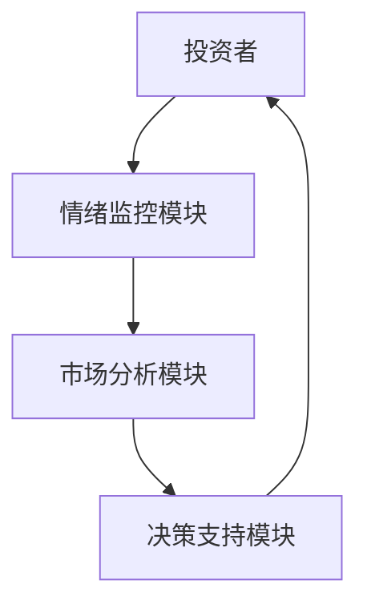
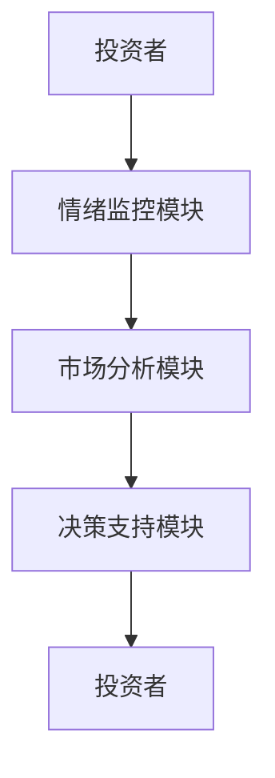

                 


# 《价值投资者的心理素质：如何在市场动荡中保持冷静》

> 关键词：价值投资、市场波动、心理素质、情绪管理、理性决策、投资策略、风险承受

> 摘要：  
本文将深入探讨价值投资者在面对市场波动时所需的心理素质，分析如何通过情绪管理、理性决策和风险承受能力来保持冷静。文章从背景介绍、心理素质模型、情绪管理与决策机制、系统架构设计、项目实战以及最佳实践等方面展开，结合实例和数学模型，帮助投资者在市场动荡中做出明智决策。

---

# 第一部分：价值投资与市场波动的背景

# 第1章：价值投资与市场波动概述

## 1.1 价值投资的核心理念

### 1.1.1 价值投资的定义  
价值投资是一种以基本面分析为基础的投资策略，旨在通过识别市场低估的资产，长期持有并获得超额收益。其核心理念是寻找具有持续竞争优势的企业，而非短期市场波动的驱动。

### 1.1.2 价值投资的核心原则  
- **安全边际**：买入价格低于内在价值，以降低风险。  
- **长期视角**：关注企业的长期盈利能力，而非短期市场波动。  
- **逆向思维**：在市场恐慌时寻找机会，在市场狂热时保持冷静。

### 1.1.3 价值投资与市场波动的关系  
市场波动是价值投资的“朋友”，因为波动会导致资产价格与内在价值的偏离，为投资者提供买入机会。然而，波动也是挑战，因为它容易引发投资者的恐慌或贪婪情绪。

## 1.2 市场波动的背景分析

### 1.2.1 市场波动的定义与特征  
市场波动是指资产价格在短时间内剧烈波动的现象，通常由市场参与者的心理预期、信息不对称和外部事件等因素引发。

### 1.2.2 市场波动的常见原因  
- **信息冲击**：市场参与者对新信息的反应可能导致价格短期波动。  
- **情绪驱动**：投资者的贪婪和恐慌情绪会放大市场波动。  
- **外部事件**：经济政策、地缘政治等外部因素可能引发市场波动。

### 1.2.3 市场波动对投资者的影响  
- **情绪影响**：波动会导致投资者情绪波动，进而影响决策。  
- **决策偏差**：市场波动容易引发非理性决策，如恐慌性抛售或盲目追涨。  
- **机会与风险**：波动为价值投资者提供了低吸的机会，但也增加了投资难度。

## 1.3 投资者的心理挑战

### 1.3.1 投资者常见心理问题  
- **过度自信**：认为自己能够预测市场波动，忽视风险。  
- **恐惧与贪婪**：在市场下跌时恐慌，在市场上涨时贪婪。  
- **认知偏差**：过度关注近期市场表现，忽视长期投资目标。

### 1.3.2 情绪化决策的危害  
情绪化决策可能导致以下后果：  
- **错失机会**：在市场底部恐慌卖出，错过反弹机会。  
- **过度交易**：频繁买卖增加交易成本，降低投资收益。  
- **承担过高风险**：在市场顶部追涨，导致亏损。

### 1.3.3 保持冷静的重要性  
冷静的头脑能够帮助投资者：  
- **抓住机会**：在市场低谷时买入优质资产。  
- **规避风险**：在市场高点时避免盲目追高。  
- **坚持策略**：在波动中保持长期投资目标不变。

## 1.4 本章小结  
价值投资的核心是通过长期持有优质资产实现超额收益，而市场波动是实现这一目标的“朋友”。然而，波动也对投资者的心理素质提出了极高要求，需要投资者在情绪波动中保持冷静，坚持理性决策。

---

# 第二部分：价值投资者的心理素质模型

# 第2章：心理素质的核心要素

## 2.1 理解市场波动的本质

### 2.1.1 市场波动的随机性  
市场波动具有随机性，难以通过简单的历史数据预测未来走势。投资者需要接受这一点，并在波动中寻找规律。

### 2.1.2 市场波动的周期性  
市场波动通常呈现周期性，从繁荣到衰退，再从衰退到复苏。理解这一周期有助于投资者制定长期策略。

### 2.1.3 市场波动的不可预测性  
尽管市场波动具有一定的周期性，但具体的时间和幅度难以预测。投资者需要学会在不可预测中寻找确定性。

## 2.2 理性决策的框架

### 2.2.1 理性决策的定义  
理性决策是指基于事实和逻辑分析，而非情绪或直觉做出的决策。

### 2.2.2 理性决策的步骤  
1. **明确目标**：确定投资目标和风险承受能力。  
2. **收集信息**：进行基本面分析，了解企业的财务状况和行业前景。  
3. **分析选项**：比较不同投资标的优缺点。  
4. **评估风险**：量化潜在风险和收益。  
5. **做出决策**：基于分析结果做出投资决策。  
6. **监控与调整**：定期评估决策效果，必要时进行调整。

### 2.2.3 理性决策与感性决策的对比

| 属性      | 理性决策                          | 感性决策                          |
|-----------|-----------------------------------|-----------------------------------|
| 基础      | 事实与逻辑分析                   | 情绪与直觉                       |
| 时间跨度  | 长期视角                         | 短期情绪驱动                     |
| 决策质量  | 高效且准确                      | 易错且不稳定                     |

## 2.3 心理素质的核心要素

### 2.3.1 自我认知能力  
自我认知能力是心理素质的基础，帮助投资者了解自己的优势和劣势，避免过度自信或低估风险。

### 2.3.2 情绪管理能力  
情绪管理能力是投资者在市场波动中保持冷静的关键，帮助投资者避免情绪化决策。

### 2.3.3 风险承受能力  
风险承受能力是投资者在面对市场波动时的心理底线，帮助投资者在极端情况下坚持投资策略。

## 2.4 心理素质与投资成功的关联

### 2.4.1 心理素质对投资决策的影响  
心理素质好的投资者能够更好地控制情绪，避免非理性决策，从而提高投资收益。

### 2.4.2 心理素质对投资结果的影响  
心理素质直接影响投资者的决策质量，进而影响投资结果。冷静的头脑能够帮助投资者抓住机会，规避风险。

### 2.4.3 心理素质的可培养性  
心理素质并非天生，而是可以通过训练和实践逐步提升。投资者可以通过模拟市场波动、阅读相关书籍等方式培养心理素质。

## 2.5 本章小结  
心理素质是价值投资者在市场波动中保持冷静的关键。自我认知、情绪管理和风险承受能力是心理素质的核心要素，帮助投资者在波动中做出理性决策。

---

# 第三部分：心理素质的培养与训练

# 第3章：情绪管理与决策机制

## 3.1 情绪管理的核心方法

### 3.1.1 情绪识别与监控  
投资者需要学会识别自己的情绪，避免被情绪支配。可以通过记录情绪日记、分析情绪触发点等方式进行监控。

### 3.1.2 情绪调节与控制  
- **深呼吸与冥想**：通过放松技巧缓解紧张情绪。  
- **分散注意力**：将注意力转移到其他事物上，避免过度关注市场波动。  
- **积极心态培养**：通过正面思考减少负面情绪的影响。

### 3.1.3 情绪记录与分析  
记录每天的情绪变化和决策过程，分析情绪波动对投资决策的影响，总结经验教训。

## 3.2 理性决策的训练方法

### 3.2.1 理性决策的思维框架  
- **明确目标**：在决策前明确投资目标和风险承受能力。  
- **收集信息**：进行充分的市场调研和基本面分析。  
- **分析选项**：比较不同投资标的优缺点，制定最优策略。  
- **评估风险**：量化潜在风险和收益，制定应对方案。  
- **做出决策**：基于分析结果做出投资决策。  
- **监控与调整**：定期评估决策效果，必要时进行调整。

### 3.2.2 理性决策的训练步骤  
1. **设定目标**：明确训练目标，如减少情绪化决策次数。  
2. **模拟市场波动**：通过模拟市场波动，训练投资者在不同情境下的决策能力。  
3. **分析与总结**：每次训练后进行分析，总结经验教训，改进决策机制。

### 3.2.3 理性决策的案例分析  
假设市场出现剧烈波动，投资者需要判断是否卖出。通过分析企业的基本面和市场前景，理性决策者会选择坚持持有，而非盲目抛售。

## 3.3 风险承受能力的培养

### 3.3.1 理解风险的本质  
风险是投资的一部分，无法完全避免，但可以通过合理的资产配置和风险管理降低风险。

### 3.3.2 建立风险承受模型  
通过量化分析，投资者可以制定适合自己的风险承受能力，避免在市场波动中超出心理底线。

### 3.3.3 风险管理技巧  
- **分散投资**：通过投资不同资产类别降低风险。  
- **设定止损**：在市场波动中设定止损点，避免亏损过大。  
- **定期评估**：定期评估投资组合的风险和收益，调整策略。

## 3.4 决策机制的优化

### 3.4.1 决策流程的优化  
- **简化决策步骤**：减少不必要的复杂性，提高决策效率。  
- **制定决策规则**：通过明确的规则减少主观判断，降低情绪影响。

### 3.4.2 决策规则的数学模型  
通过概率论和统计学方法，建立决策模型，帮助投资者在市场波动中做出理性决策。

## 3.5 本章小结  
情绪管理和决策机制是投资者在市场波动中保持冷静的关键。通过情绪管理减少情绪化决策，通过理性决策框架提高决策质量，最终帮助投资者在市场波动中实现长期收益。

---

# 第四部分：系统架构与项目实战

# 第4章：系统架构设计与实战

## 4.1 系统架构设计

### 4.1.1 问题场景介绍  
投资者需要在市场波动中保持冷静，避免情绪化决策。为了实现这一目标，我们可以设计一个心理评估与决策支持系统。

### 4.1.2 系统功能设计  
- **情绪监控模块**：实时监控投资者的情绪变化，提供预警。  
- **市场分析模块**：分析市场波动，提供投资建议。  
- **决策支持模块**：基于分析结果，提供理性决策建议。

### 4.1.3 系统架构图  



### 4.1.4 系统接口设计  
- **输入接口**：投资者情绪数据和市场数据输入。  
- **输出接口**：系统给出的决策建议。

### 4.1.5 系统交互流程图  



## 4.2 项目实战

### 4.2.1 环境安装  
- 安装Python和相关库（如Pandas、Matplotlib）。  
- 配置数据源（如股票价格数据）。

### 4.2.2 系统核心实现

#### 4.2.2.1 情绪监控模块实现

```python
def monitor_mood():
    # 模拟情绪数据
    mood = random.choice(['calm', 'anxious', 'confident', 'worried'])
    return mood
```

#### 4.2.2.2 市场分析模块实现

```python
def market_analysis(prices):
    # 计算波动率
    returns = prices.pct_change()
    volatility = returns.std() * 100
    return volatility
```

#### 4.2.2.3 决策支持模块实现

```python
def decision_support(mood, volatility):
    if mood == 'calm' and volatility < 10:
        return 'hold'
    elif mood == 'anxious' and volatility > 20:
        return 'review'
    else:
        return 'adjust'
```

### 4.2.3 代码应用解读与分析  
通过上述代码，投资者可以实时监控情绪变化和市场波动，系统根据分析结果提供决策建议，帮助投资者在市场波动中保持冷静。

### 4.2.4 实际案例分析  
假设市场波动率突然上升，系统会提示投资者进行情绪监控，并根据分析结果建议是否调整投资策略。

## 4.3 本章小结  
通过系统架构设计和项目实战，投资者可以更好地理解和应用心理素质模型，提升在市场波动中的决策能力。

---

# 第五部分：最佳实践与总结

# 第5章：最佳实践与总结

## 5.1 最佳实践

### 5.1.1 小结  
心理素质是价值投资者在市场波动中保持冷静的关键，通过情绪管理、理性决策和风险承受能力的培养，投资者可以提高投资成功的概率。

### 5.1.2 注意事项  
- **避免过度自信**：认识到市场波动的不可预测性。  
- **坚持长期视角**：避免被短期波动影响。  
- **定期反思**：总结经验教训，改进投资策略。

### 5.1.3 拓展阅读  
- 《股票作手回忆录》：了解优秀投资者的心理素质。  
- 《投资学原理》：深入理解市场波动的本质。  
- 《心理学与投资》：从心理学角度分析投资者行为。

## 5.2 本章小结  
通过最佳实践，投资者可以将理论知识转化为实际操作，提升心理素质，实现长期投资目标。

---

# 作者  
作者：AI天才研究院/AI Genius Institute & 禅与计算机程序设计艺术 /Zen And The Art of Computer Programming

