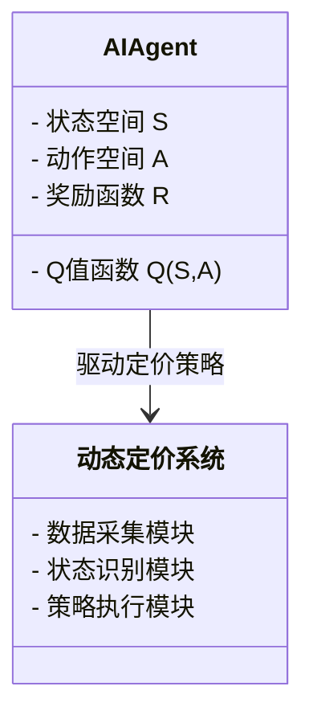
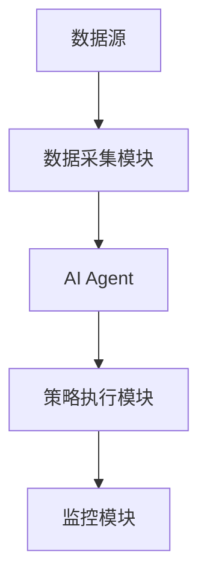

                 


# 企业AI Agent的强化学习在动态定价策略中的高级应用

## 关键词
企业AI Agent, 强化学习, 动态定价策略, Q-Learning, Deep Q-Network

## 摘要
本文详细探讨了企业AI Agent如何利用强化学习技术优化动态定价策略。通过分析强化学习的核心原理、算法实现及系统架构，结合实际案例，展示了AI Agent在动态定价中的高级应用。文章从背景介绍、算法原理、系统设计到项目实战，全面解析了强化学习在动态定价中的应用，并提供了具体的代码实现和案例分析。

---

# 第1章: AI Agent与强化学习概述

## 1.1 AI Agent的基本概念

### 1.1.1 AI Agent的定义与特点
AI Agent（人工智能代理）是指能够感知环境、自主决策并执行任务的智能实体。其特点包括自主性、反应性、目标导向和学习能力。AI Agent在企业中的应用广泛，如自动化交易、客户行为预测等。

### 1.1.2 AI Agent在企业中的应用场景
AI Agent可以用于优化企业运营，如动态定价、供应链管理、客户关系管理等。在动态定价中，AI Agent能够实时调整价格以适应市场变化。

### 1.1.3 强化学习的基本概念与特点
强化学习是一种通过试错机制优化决策的机器学习方法。其特点包括基于奖励的反馈机制、策略优化和经验积累。强化学习在动态定价中的优势在于能够适应非静态市场环境。

## 1.2 动态定价策略的背景与挑战

### 1.2.1 动态定价的定义与重要性
动态定价是指根据市场变化实时调整产品或服务价格的策略。其重要性在于能够提高企业竞争力，优化收益。

### 1.2.2 传统定价策略的局限性
传统定价策略通常基于固定规则，难以应对市场波动和客户需求变化。其局限性在于缺乏灵活性和适应性。

### 1.2.3 强化学习在动态定价中的优势
强化学习能够通过不断试错优化定价策略，适应复杂多变的市场环境。AI Agent结合强化学习，能够实现动态定价的智能化和自动化。

## 1.3 企业AI Agent与强化学习的结合

### 1.3.1 AI Agent在动态定价中的角色
AI Agent作为决策主体，负责感知市场环境、制定定价策略并执行定价调整。

### 1.3.2 强化学习在动态定价中的应用
强化学习通过模拟定价策略的执行，优化定价模型以提高收益。

### 1.3.3 企业AI Agent与强化学习的协同效应
AI Agent与强化学习的结合，实现了动态定价的智能化和自动化，提高了企业的市场响应能力。

## 1.4 本章小结
本章介绍了AI Agent和强化学习的基本概念，分析了动态定价的背景与挑战，并探讨了企业AI Agent与强化学习的结合及其优势。

---

# 第2章: 强化学习的核心原理

## 2.1 强化学习的基本框架

### 2.1.1 状态空间与动作空间
状态空间是环境中的所有可能状态，动作空间是AI Agent在每个状态下可执行的动作。

### 2.1.2 奖励机制与价值函数
奖励机制是强化学习的核心，通过奖励或惩罚指导AI Agent的决策。价值函数衡量某个状态或动作的优劣。

### 2.1.3 策略与价值函数的关系
策略决定AI Agent的动作选择，价值函数衡量策略的优劣。两者相互作用，共同优化决策过程。

## 2.2 马尔可夫决策过程（MDP）

### 2.2.1 MDP的定义与构成
MDP由状态空间、动作空间、奖励函数和转移概率构成。MDP适用于动态定价的非静态环境。

### 2.2.2 离散与连续MDP的区别
离散MDP适用于有限状态和动作空间，连续MDP适用于无限状态和动作空间。

### 2.2.3 MDP在动态定价中的应用
动态定价问题可建模为MDP，AI Agent通过策略优化实现价格调整。

## 2.3 强化学习的核心算法

### 2.3.1 Q-Learning算法
Q-Learning是一种基于价值函数的强化学习算法，通过更新Q值函数优化决策。

### 2.3.2 Deep Q-Network（DQN）算法
DQN通过深度神经网络近似Q值函数，解决了高维状态空间的计算难题。

### 2.3.3 其他强化学习算法简介
除了Q-Learning和DQN，还包括策略梯度方法（如PG、PPO）和Actor-Critic架构。

## 2.4 本章小结
本章介绍了强化学习的基本框架、MDP模型和核心算法，为动态定价策略的优化提供了理论基础。

---

# 第3章: 强化学习的数学模型与公式

## 3.1 Q-Learning算法的数学模型

### 3.1.1 Q值更新公式
$$ Q(s, a) = Q(s, a) + \alpha [r + \gamma \max Q(s', a') - Q(s, a)] $$
其中，$\alpha$是学习率，$\gamma$是折扣因子，$r$是奖励。

## 3.2 Deep Q-Network（DQN）算法的数学模型

### 3.2.1 DQN网络结构
DQN由两个神经网络：主网络和目标网络。主网络负责预测当前Q值，目标网络负责更新。

### 3.2.2 DQN的损失函数
$$ \mathcal{L} = \mathbb{E}[(r + \gamma Q_{target}(s', a') - Q_{main}(s, a))^2] $$

## 3.3 策略梯度方法

### 3.3.1 策略梯度公式
$$ \nabla \theta J(\theta) = \mathbb{E}[\nabla \log \pi(a|s) Q(s, a)] $$

## 3.4 本章小结
本章通过数学公式详细推导了Q-Learning和DQN算法，为动态定价策略的优化提供了理论支持。

---

# 第4章: 动态定价的系统分析与架构设计

## 4.1 问题场景介绍

### 4.1.1 动态定价的业务需求
动态定价需要实时感知市场环境，快速调整价格以适应需求变化。

### 4.1.2 价格调整的约束条件
包括成本、竞争、法规和客户敏感度等因素。

## 4.2 系统功能设计

### 4.2.1 领域模型设计
使用Mermaid类图描述系统功能模块，如数据采集、状态识别、策略执行等。



### 4.2.2 系统架构设计
使用Mermaid架构图描述系统架构，包括数据源、AI Agent、执行模块和监控模块。



### 4.2.3 系统接口设计
定义API接口，如获取当前状态、执行动作、更新Q值函数等。

## 4.3 本章小结
本章通过系统分析与架构设计，为动态定价策略的优化提供了实施框架。

---

# 第5章: 强化学习在动态定价中的项目实战

## 5.1 环境搭建与核心实现

### 5.1.1 环境搭建
安装Python、TensorFlow和OpenAI Gym等依赖库。

### 5.1.2 核心实现代码
实现一个简单的Q-Learning算法，用于模拟动态定价环境。

```python
import numpy as np

class QLearning:
    def __init__(self, state_space_size, action_space_size, alpha=0.1, gamma=0.99):
        self.q_table = np.zeros((state_space_size, action_space_size))
        self.alpha = alpha
        self.gamma = gamma

    def get_action(self, state):
        return np.argmax(self.q_table[state])

    def update_q_table(self, state, action, reward, next_state):
        self.q_table[state, action] = self.q_table[state, action] + self.alpha * (reward + self.gamma * np.max(self.q_table[next_state]) - self.q_table[state, action])
```

## 5.2 实际案例分析

### 5.2.1 数据准备
收集历史销售数据，包括价格、销量、竞争对手行为等。

### 5.2.2 模型训练
使用DQN算法训练定价策略，优化Q值函数。

### 5.2.3 结果分析
分析模型在不同环境下的定价表现，评估收益和客户满意度。

## 5.3 本章小结
本章通过项目实战，展示了强化学习在动态定价中的具体实现和应用效果。

---

# 第6章: 强化学习的高级应用与最佳实践

## 6.1 高级应用

### 6.1.1 多目标优化
在动态定价中，考虑利润最大化、客户满意度和市场占有率等多目标。

### 6.1.2 联合优化
结合强化学习与其他优化方法（如遗传算法）实现更优定价策略。

## 6.2 最佳实践 tips

### 6.2.1 数据质量
确保数据的准确性和完整性，是模型优化的基础。

### 6.2.2 模型选择
根据实际场景选择合适的强化学习算法，如DQN适用于复杂环境。

### 6.2.3 模型调参
合理调整学习率、折扣因子等超参数，优化模型性能。

## 6.3 本章小结
本章探讨了强化学习在动态定价中的高级应用，并提供了最佳实践建议。

---

# 作者

**作者：AI天才研究院 & 禅与计算机程序设计艺术**

---

通过以上结构，文章系统地介绍了企业AI Agent的强化学习在动态定价策略中的高级应用，从理论到实践，结合代码和案例，为读者提供了全面的指导。

