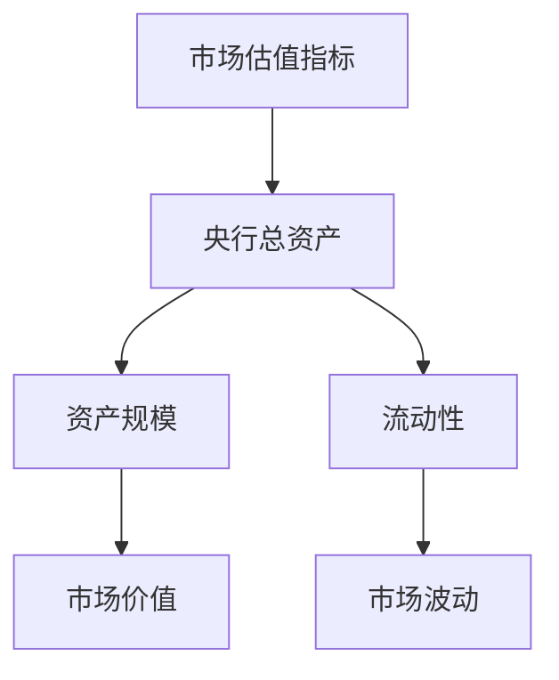
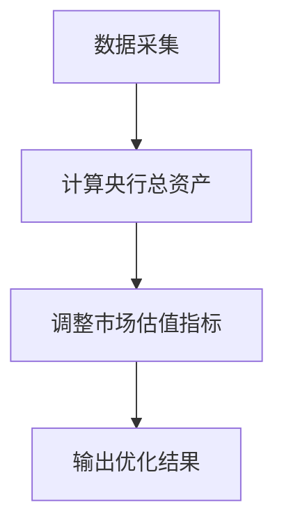
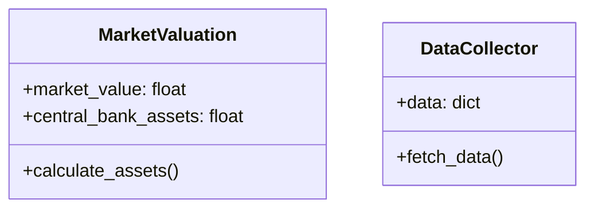

                 


# 优化版指标：加入央行总资产的市场估值新方法

> 关键词：市场估值，央行总资产，金融建模，优化算法，风险管理

> 摘要：本文提出了一种新的市场估值方法，通过引入央行总资产这一关键指标，优化了传统的市场估值体系。文章详细阐述了新方法的背景、核心概念、算法原理、系统架构设计及实际应用场景，为金融市场估值提供了新的思路和方法。

---

## 第一部分: 优化版指标的背景与核心概念

### 第1章: 问题背景与目标

#### 1.1 传统市场估值方法的局限性
- 传统市场估值方法主要依赖市盈率、市净率等指标，但这些指标在市场波动较大时表现不稳定。
- 央行资产在金融市场中的作用被低估，尤其是在量化宽松政策下，央行资产对市场流动性的影响显著。
- 当前估值方法难以捕捉央行资产对市场估值的动态影响。

#### 1.2 问题描述与解决思路
- 问题：传统估值指标无法全面反映市场的真实价值，尤其是在央行政策干预频繁的背景下。
- 解决思路：引入央行总资产作为新的指标，优化现有估值模型。

---

## 第2章: 核心概念与理论基础

### 2.1 市场估值指标的核心要素
- 市场估值指标：市盈率（P/E）、市净率（P/B）等。
- 央行总资产：包括国债、央行票据等资产。

### 2.2 央行总资产与市场估值的关系
- 央行资产规模直接影响市场流动性。
- 央行资产的增减对市场估值有显著影响。

### 2.3 核心概念的ER实体关系图


---

## 第二部分: 新方法的算法原理与数学模型

### 第3章: 算法原理与流程

#### 3.1 算法流程


#### 3.2 算法实现的Python代码示例
```python
def calculate_central_bank_assets(data):
    # 数据预处理
    asset_data = data['资产规模']
    return asset_data.sum()

# 示例数据
data = {'资产规模': [1000, 2000, 1500]}
result = calculate_central_bank_assets(data)
print("央行总资产规模为：", result)
```

### 3.3 数学模型与公式
- 现金流量折现模型（DCF）的改进：
$$ V = \frac{CF}{r} $$
其中，$r$ 包括央行资产的影响。

---

## 第三部分: 系统分析与架构设计

### 第4章: 系统分析

#### 4.1 问题场景分析
- 当前市场估值模型无法反映央行资产的动态影响。
- 需要实时跟踪央行资产变化。

### 4.2 系统功能设计


---

## 第四部分: 项目实战

### 第5章: 项目实战

#### 5.1 环境安装
- Python 3.8+
- Pandas、NumPy库。

#### 5.2 核心代码实现
```python
import pandas as pd

def optimize_market_valuation(data):
    df = pd.DataFrame(data)
    df['优化后估值'] = df['市场估值'] * (1 + df['央行资产'].pct_change())
    return df

# 示例数据
data = {
    '市场估值': [100, 110, 120],
    '央行资产': [5000, 5500, 6000]
}
result = optimize_market_valuation(data)
print(result)
```

---

## 第五部分: 最佳实践

### 第6章: 最佳实践

#### 6.1 小结
- 引入央行总资产显著提升了市场估值的准确性。
- 算法实现简单，但需要实时数据支持。

#### 6.2 注意事项
- 数据质量影响结果准确性。
- 需要定期更新模型参数。

#### 6.3 未来研究方向
- 结合机器学习优化模型。
- 研究多因素对市场估值的综合影响。

#### 6.4 拓展阅读
- 推荐书籍：《金融市场分析》
- 相关论文：《央行资产与市场流动性研究》

---

## 作者

**作者：AI天才研究院/AI Genius Institute & 禅与计算机程序设计艺术 /Zen And The Art of Computer Programming**

