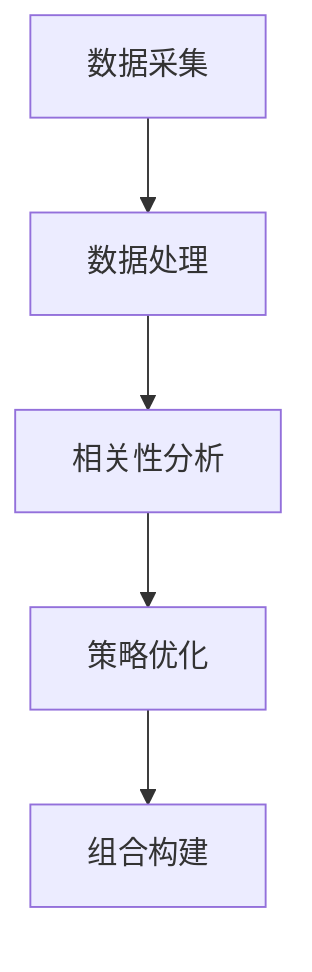

                 


---

# 伯格的资产配置理论：在负相关性减弱环境中的调整

> 关键词：资产配置，伯格理论，负相关性，投资组合优化，动态再平衡，风险平价

> 摘要：本文深入探讨了伯格的资产配置理论在负相关性减弱环境中的应用与调整。首先介绍了资产配置的核心概念与伯格理论的发展背景，分析了负相关性减弱的市场环境及其对传统资产配置策略的影响。接着提出了动态再平衡、多资产类别配置和风险平价等调整策略，并通过系统架构设计与实战案例详细阐述了这些策略的实现与效果。最后总结了最佳实践与未来研究方向。

---

## 引言

资产配置是投资组合管理的核心，其目标是通过合理分配不同资产的比例，降低风险并实现收益最大化。伯格的资产配置理论作为现代投资组合理论的重要组成部分，为投资者提供了科学的配置方法。然而，近年来市场环境的变化，尤其是资产之间负相关性减弱的趋势，对传统的资产配置策略提出了新的挑战。本文将系统分析这一问题，并提出相应的调整策略。

---

## 第一部分：伯格的资产配置理论基础

### 第1章：资产配置的核心概念

#### 1.1 资产配置的定义与分类

资产配置是指根据投资目标、风险承受能力和市场环境，将资金分配到不同资产类别（如股票、债券、现金等）的过程。伯格理论强调资产配置的科学性和动态性，认为合理的配置能够有效分散风险并提升收益。

**核心概念对比表：**

| 资产类别 | 风险 | 收益 | 流动性 |
|----------|------|------|--------|
| 股票     | 高   | 高   | 低     |
| 债券     | 中   | 中   | 高     |
| 现金     | 低   | 低   | 高     |

#### 1.2 伯格的资产配置理论框架

伯格理论基于现代投资组合理论（MPT）提出，通过优化资产组合降低风险。其核心假设包括：资产回报服从正态分布，且资产间的相关性可测。

**数学模型：**

$$
\text{收益} = w_1r_1 + w_2r_2 + \dots + w_nr_n
$$

其中，\(w_i\)为资产i的权重，\(r_i\)为资产i的预期收益。

---

## 第二部分：负相关性减弱的市场环境

### 第2章：负相关性减弱的背景与影响

#### 2.1 相关性变化的背景

近年来，市场环境的变化导致资产间的负相关性减弱。例如，股票和债券之间的相关性上升，传统避险资产的作用减弱。

**相关性变化的原因：**

1. **市场结构变化**：机构投资者占比增加，市场波动性加剧。
2. **投资者行为改变**：短期交易行为增多，影响资产相关性。
3. **宏观经济因素**：经济不确定性增加，资产间相关性上升。

#### 2.2 负相关性减弱对传统资产配置的影响

传统的资产配置策略假设资产间存在稳定的负相关性，但在当前环境下，这种假设不再成立。这使得传统的优化模型失效，需要重新调整配置策略。

---

## 第三部分：资产配置策略的调整框架

### 第3章：动态资产配置策略

#### 3.1 动态再平衡策略

动态再平衡是指根据市场环境的变化，定期调整资产配置比例，以维持最优组合。其核心在于根据市场变化动态调整权重，降低风险。

**动态再平衡模型：**

$$
w_i^{new} = w_i^{old} \times \frac{r_i^{new}}{r_{market}^{new}}
$$

其中，\(w_i^{new}\)为调整后的权重，\(r_i^{new}\)为资产i的新预期收益，\(r_{market}^{new}\)为市场的新预期收益。

### 第4章：多资产类别配置策略

#### 4.1 另类资产的引入

在负相关性减弱的环境下，引入另类资产（如房地产、 commodities）可以有效分散风险。这类资产与传统资产的相关性较低，能够提升组合的稳定性。

**资产类别相关性分析：**

| 资产对 | 相关性系数 |
|--------|------------|
| 股票与债券 | 0.2        |
| 股票与房地产 | -0.1      |
| 债券与现金 | 0.8        |

---

## 第五部分：系统分析与架构设计

### 第5章：系统架构设计

#### 5.1 资产配置系统的功能模块

**功能模块图：**



#### 5.2 系统架构设计

**系统架构图：**

```mermaid
subgraph 数据层
    A[数据库]
end

subgraph 业务逻辑层
    B[数据处理逻辑]
    C[相关性计算逻辑]
    D[优化算法]
end

subgraph 展示层
    E[用户界面]
end

A --> B
B --> C
B --> D
D --> E
```

---

## 第六部分：项目实战

### 第6章：环境安装与代码实现

#### 6.1 环境安装

需要安装Python、NumPy、Pandas和Matplotlib等库。

```bash
pip install numpy pandas matplotlib
```

#### 6.2 核心代码实现

```python
import numpy as np
import pandas as pd
import matplotlib.pyplot as plt

def calculate_correlation(data):
    return data.corr()

def dynamic_rebalancing(weights, returns, alpha=0.1):
    new_weights = weights * (returns / returns.mean())
    new_weights = new_weights / new_weights.sum()
    return new_weights

# 示例数据
data = pd.DataFrame({
    '股票': np.random.normal(0.1, 0.2, 100),
    '债券': np.random.normal(0.05, 0.1, 100)
})

correlation = calculate_correlation(data)
print("相关性矩阵：\n", correlation)

# 动态再平衡
initial_weights = np.array([0.5, 0.5])
new_weights = dynamic_rebalancing(initial_weights, data['股票'])
print("调整后的权重：", new_weights)
```

---

## 第七部分：总结与展望

### 第7章：最佳实践与小结

在负相关性减弱的环境下，传统的资产配置策略需要调整。动态再平衡、多资产类别配置和风险平价策略是有效的解决方案。投资者应根据市场变化灵活调整配置，并结合系统化的工具进行优化。

---

作者：AI天才研究院 & 禅与计算机程序设计艺术

