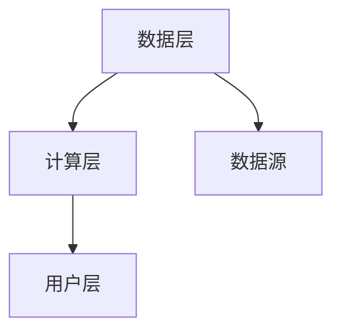
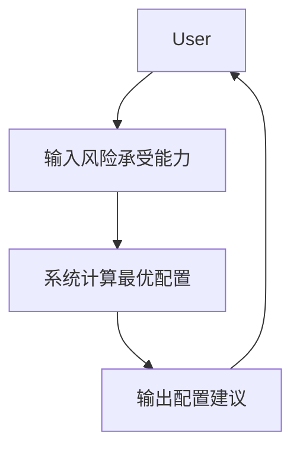

                 


```markdown
# 伯格的资产配置理论：应对极端市场波动的策略

> 关键词：资产配置，投资策略，风险管理，市场波动，防御性投资

> 摘要：本文深入探讨了伯格的资产配置理论，分析其在应对极端市场波动中的应用策略。通过理论背景、数学模型、系统架构和实战案例的详细讲解，本文为投资者提供了科学的投资方法，帮助其在不确定的市场环境中实现长期稳健收益。

---

## 第一部分：资产配置理论的背景与意义

### 第1章：资产配置理论的背景与意义

#### 1.1 资产配置的基本概念

##### 1.1.1 什么是资产配置
资产配置是指将资金分配到不同资产类别（如股票、债券、房地产等）中，以实现风险分散和收益最大化的一种投资策略。它通过调整各类资产的比重，优化投资组合的风险收益比。

##### 1.1.2 资产配置的重要性
- **风险分散**：通过投资不同类型的资产，降低单一资产带来的风险。
- **收益优化**：在不同市场条件下，各类资产的表现不同，合理配置可提升整体收益。
- **长期稳健**：资产配置强调长期投资，避免短期波动的干扰。

##### 1.1.3 资产配置的核心要素
- **资产类别**：股票、债券、现金、房地产等。
- **风险承受能力**：投资者对风险的容忍度。
- **投资期限**：资金的投资时间跨度。

#### 1.2 伯格的资产配置理论背景

##### 1.2.1 投资学的演变历程
从传统的个股选择到现代的资产配置，投资理论经历了从单一到多元的演变。伯格在20世纪提出的资产配置理论，奠定了现代投资组合理论的基础。

##### 1.2.2 伯格的投资哲学
- **长期投资**：相信市场会自我修复，长期持有优质资产。
- **价值投资**：寻找被市场低估的投资标的。
- **分散投资**：通过多样化降低风险。

##### 1.2.3 资产配置理论的提出
伯格提出，资产配置是投资组合收益的主要驱动因素，合理的资产配置能有效应对市场波动。

---

## 第二部分：资产配置的核心理论

### 第2章：资产配置的核心理论

#### 2.1 现代投资组合理论

##### 2.1.1 现代投资组合理论的起源
由哈里·马科维茨在1952年提出，强调通过分散投资降低风险，构建最优投资组合。

##### 2.1.2 投资组合理论的核心假设
- 投资者是风险厌恶的。
- 资产收益符合单变量分布。
- 市场是有效的，不存在无风险套利机会。

##### 2.1.3 风险与收益的权衡
投资组合的收益与风险成正相关，通过调整资产配置，找到收益与风险的最佳平衡点。

##### 2.1.4 有效前沿
在给定风险水平下，提供最高预期收益的投资组合构成的曲线，即为有效前沿。

#### 2.2 资产配置的数学模型

##### 2.2.1 均值-方差优化模型
$$ \text{目标函数} = \min \sigma^2 $$
$$ \text{约束条件} = \sum w_i r_i = \mu $$
$$ \sum w_i = 1 $$

##### 2.2.2 资产配置的约束条件
- 投资比例非负。
- 投资组合的总和为1。
- 符合风险承受能力。

##### 2.2.3 数学公式推导
使用拉格朗日乘数法求解优化问题，得到最优权重。

#### 2.3 资产配置的最优解
通过数学模型求解，找到在给定风险下收益最高的资产组合。

---

### 第3章：资产配置的实践策略

#### 3.1 战略性资产配置

##### 3.1.1 战略性资产配置的定义
基于长期投资目标和风险承受能力，确定各类资产的配置比例。

##### 3.1.2 战略性资产配置的步骤
1. 确定投资目标和期限。
2. 评估风险承受能力。
3. 选择资产类别。
4. 确定各类别配置比例。
5. 定期再平衡。

##### 3.1.3 战略性资产配置的优缺点
优点：稳定性强，适合长期投资。缺点：适应性差，需定期调整。

#### 3.2 战术性资产配置

##### 3.2.1 战术性资产配置的定义
根据市场短期变化，调整资产配置比例，以抓住市场机会或规避风险。

##### 3.2.2 战术性资产配置的应用场景
- 市场波动加剧时。
- 经济周期变化时。
- 特定资产出现投资机会时。

##### 3.2.3 战术性资产配置的风险管理
- 设置止损点。
- 严格控制头寸规模。
- 定期评估和调整。

---

## 第三部分：应对极端市场波动的资产配置策略

### 第4章：应对极端市场波动的资产配置策略

#### 4.1 极端市场波动的定义与特征

##### 4.1.1 市场波动的分类
- 正常波动：市场在合理范围内的上下浮动。
- 异常波动：超出常规范围的剧烈波动，通常由突发事件或市场恐慌引发。

##### 4.1.2 极端市场波动的表现形式
- 市场 crash：短时间内大幅下跌。
- 市场 bubble：价格远高于内在价值。
- 黑天鹅事件：低概率但高影响的突发事件。

##### 4.1.3 极端市场波动的影响因素
- 经济政策变化。
- 地缘政治冲突。
- 突发公共卫生事件。
- 市场参与者行为。

#### 4.2 伯格的防御性投资策略

##### 4.2.1 防御性投资的定义
一种在市场下跌时能够减少损失的投资策略，通过持有防御性资产（如债券、黄金）来规避风险。

##### 4.2.2 防御性投资的实施步骤
1. 识别市场风险因素。
2. 增加防御性资产配置。
3. 减少高风险资产的投资比例。
4. 定期监控和调整。

##### 4.2.3 防御性投资的案例分析
2008年金融危机期间，伯格通过增加债券配置，减少了投资组合的损失。

#### 4.3 应对极端波动的资产配置调整

##### 4.3.1 资产配置的动态调整
- 市场下跌时，增加债券配置。
- 市场上扬时，增加股票配置。

##### 4.3.2 防御性资产的选择
- 稳定收益资产：债券、优先股。
- 避险资产：黄金、现金。
- 逆周期资产：在市场低迷时表现较好的资产。

---

## 第四部分：资产配置的风险管理

### 第5章：资产配置的风险管理

#### 5.1 风险管理的基本概念

##### 5.1.1 风险的定义与分类
- 系统性风险：影响整个市场的风险，如经济衰退、战争。
- 非系统性风险：特定资产或行业的风险，如公司违约。

##### 5.1.2 风险衡量方法
- 标准差：衡量资产收益的波动性。
- VaR（在险价值）：在特定置信水平下，可能的最大损失。

#### 5.2 伯格的防御性投资策略

##### 5.2.1 防御性投资的风险管理
通过分散投资、持有防御性资产，降低系统性风险的影响。

##### 5.2.2 风险控制的具体措施
- 设定止损点。
- 定期评估投资组合。
- 保持充足流动性。

#### 5.3 压力测试与情景分析

##### 5.3.1 压力测试的定义
模拟极端市场条件下的投资组合表现，评估其承受压力的能力。

##### 5.3.2 压力测试的方法
- 历史模拟法：基于历史数据进行模拟。
- 方差-协方差法：基于资产的相关性矩阵。
- Monte Carlo模拟：随机生成市场情景。

##### 5.3.3 压力测试的应用
- 评估投资组合的抗跌能力。
- 确定防御性资产的配置比例。
- 制定风险管理策略。

#### 5.4 构建防御性投资组合

##### 5.4.1 防御性投资组合的构成
- 债券：提供稳定的利息收入。
- 黄金：作为避险资产。
- 现金：应对紧急情况。

##### 5.4.2 防御性投资组合的管理
- 定期再平衡。
- 监控市场变化。
- 适时调整配置比例。

---

## 第五部分：实证分析与投资实践

### 第6章：实证分析与投资实践

#### 6.1 伯格投资理论的实证分析

##### 6.1.1 伯格的投资业绩
- 长期稳定的超额收益。
- 低波动性，风险调整后收益较高。

##### 6.1.2 不同经济周期下的配置效果
- 经济衰退期：债券和现金表现较好。
- 经济复苏期：股票和成长性资产表现较好。

#### 6.2 投资者如何应用伯格的理论

##### 6.2.1 确定自身风险承受能力
- 通过问卷或评估工具，了解自己的风险偏好。

##### 6.2.2 制定长期投资计划
- 设定投资目标和时间表。
- 分阶段调整资产配置。

##### 6.2.3 定期监控和再平衡
- 每季度或半年调整一次。
- 根据市场变化和个人情况，动态调整配置比例。

#### 6.3 投资中的常见误区

##### 6.3.1 过度关注短期收益
- 忽视长期目标，频繁交易增加成本和风险。

##### 6.3.2 忽视风险分散
- 将所有资金投入高风险资产，增加整体风险。

##### 6.3.3 追赶市场潮流
- 跟风投资，忽视自身实际情况。

---

## 第六部分：系统架构与技术实现

### 第7章：系统架构与技术实现

#### 7.1 系统架构设计

##### 7.1.1 问题场景介绍
- 需要一个系统化的资产配置框架，帮助投资者制定和执行资产配置策略。

##### 7.1.2 系统功能设计
- 资产配置模型构建。
- 市场数据获取与处理。
- 风险评估与压力测试。
- 投资组合优化与模拟。

##### 7.1.3 系统架构设计
使用分层架构，包括数据层、计算层、用户层。

##### 7.1.4 系统架构图（Mermaid）



#### 7.2 系统功能实现

##### 7.2.1 资产配置模型构建
- 选择资产类别。
- 确定各类别权重。
- 计算预期收益和风险。

##### 7.2.2 数据处理与分析
- 获取市场数据。
- 计算资产的相关性矩阵。
- 进行风险收益分析。

##### 7.2.3 系统实现代码
```python
import numpy as np

def calculate_risk_return(weights, returns):
    portfolio_return = np.dot(weights.T, returns)
    portfolio_variance = np.dot(weights.T, np.dot(returns.cov(), weights))
    return portfolio_return, portfolio_variance
```

##### 7.2.4 优化与模拟
- 使用优化算法求解最优权重。
- 进行压力测试和情景分析。

#### 7.3 系统接口设计

##### 7.3.1 输入接口
- 用户输入风险承受能力和投资目标。

##### 7.3.2 输出接口
- 资产配置建议。
- 风险评估报告。
- 投资组合模拟结果。

#### 7.4 系统交互流程

##### 7.4.1 用户交互流程图（Mermaid）



---

## 第七部分：结论与展望

### 第8章：结论与展望

#### 8.1 理论总结

##### 8.1.1 伯格理论的核心要点
- 长期投资。
- 分散投资。
- 风险管理。

##### 8.1.2 资产配置的重要性
- 优化风险收益比。
- 应对市场波动。
- 实现长期稳健收益。

#### 8.2 投资实践中的应用

##### 8.2.1 投资者如何应用伯格理论
- 制定长期投资计划。
- 做好风险管理和资产再平衡。
- 保持纪律性，避免情绪化决策。

#### 8.3 未来展望

##### 8.3.1 资产配置理论的未来发展
- 更多资产类别的纳入。
- 更精细的风险管理方法。
- 更智能的系统化投资工具。

##### 8.3.2 人工智能在资产配置中的应用
- 利用机器学习优化资产配置。
- 通过大数据分析预测市场趋势。
- 实现个性化的投资建议。

---

## 参考文献

1. 伯格的原著《投资的革命》。
2. 马科维茨的《投资组合理论》。
3. 其他相关投资学文献。

---

## 作者信息

作者：AI天才研究院/AI Genius Institute & 禅与计算机程序设计艺术 /Zen And The Art of Computer Programming
```

