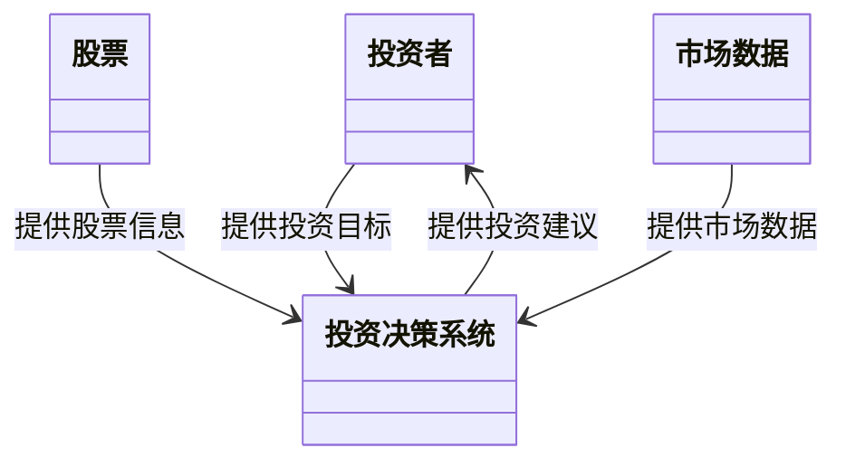
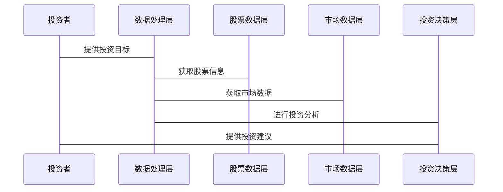

                 


# 伯格的长期投资理念：应对市场短期主义的挑战

## 关键词：长期投资、价值投资、安全边际、投资组合优化、市场波动、投资策略、伯格投资理念

## 摘要：  
本文深入分析了现代金融市场中短期主义的挑战，探讨了伯格的长期投资理念，包括价值投资、安全边际和投资组合优化的核心思想。通过数学模型、系统架构和实际案例，结合技术语言和专业分析，阐述了如何应对短期波动，实现长期稳健投资。文章最后总结了最佳实践和注意事项，为投资者提供实用的指导。

---

# 第一部分：长期投资理念的背景与挑战

## 第1章：投资市场的现状与短期主义的盛行

### 1.1 投资市场的现状分析  
#### 1.1.1 资本市场的基本特征  
资本市场是一个高度波动的环境，受多种因素影响，包括经济指标、政策变化和市场情绪。近年来，短期交易行为占据了市场的主要交易量，导致市场波动加剧。  

#### 1.1.2 短期交易的兴起  
技术进步和信息透明化使得投资者可以实时获取市场数据，高频交易和算法交易的兴起进一步加剧了市场的短期化。  

#### 1.1.3 短期主义对市场的影响  
短期主义可能导致市场的非理性波动，忽视企业的长期价值，影响资源配置效率。  

### 1.2 短期主义的定义与表现  
#### 1.2.1 短期主义的定义  
短期主义是指投资者过于关注短期市场波动，忽视长期价值的投资行为。  

#### 1.2.2 短期主义的表现形式  
- 过度依赖技术分析  
- 频繁交易以追求短期收益  
- 忽视企业的基本面分析  

#### 1.2.3 短期主义对投资者的影响  
- 交易成本增加  
- 投资收益不稳定  
- 难以实现长期财富增长  

### 1.3 长期投资理念的重要性  
#### 1.3.1 长期投资的核心理念  
长期投资强调关注企业的内在价值，通过持有优质资产实现稳健收益。  

#### 1.3.2 长期投资与短期投资的对比  
| 对比维度 | 长期投资 | 短期投资 |  
|----------|----------|----------|  
| 投资目标 | 实现财富的长期增长 | 追求短期收益 |  
| 分析方法 | 侧重基本面分析 | 侧重技术分析 |  
| 风险管理 | 通过分散投资降低风险 | 需要频繁调整以应对波动 |  

#### 1.3.3 长期投资在市场中的价值  
长期投资有助于避免市场的短期波动干扰，帮助投资者实现资产的稳健增值。  

### 1.4 伯格投资理念的提出背景  
#### 1.4.1 伯格的生平简介  
彼得·伯格（Peter C. Brown）是价值投资的倡导者，以其长期投资理念闻名。  

#### 1.4.2 伯格投资理念的形成  
伯格的理念源于对市场的深入观察和对短期主义的反思，强调长期持有优质资产。  

#### 1.4.3 伯格理念在现代市场中的意义  
在当前市场短期化趋势下，伯格的理念为投资者提供了应对短期波动的有效策略。  

### 1.5 本章小结  
本章分析了短期主义的现状及其对市场的负面影响，提出了长期投资的重要性，并引出了伯格投资理念的核心思想。

---

## 第二部分：伯格长期投资理念的核心概念

## 第2章：价值投资的定义与原则  

### 2.1 价值投资的定义  
价值投资是一种以企业内在价值为基础的投资方法，强调以低于内在价值的价格买入优质资产。  

### 2.2 伯格的价值投资策略  
#### 2.2.1 伯格的价值投资方法  
伯格主张通过基本面分析，选择具有强大竞争优势和良好财务状况的企业。  

#### 2.2.2 伯格的投资组合构建  
伯格的投资组合以分散化为特点，注重长期稳定的收益。  

#### 2.2.3 伯格的投资决策标准  
- 企业具有稳定的盈利能力  
- 企业具备良好的财务状况  
- 企业估值低于其内在价值  

### 2.3 安全边际的概念与应用  
#### 2.3.1 安全边际的定义  
安全边际是指股票价格与企业内在价值之间的差距，用于降低投资风险。  

#### 2.3.2 安全边际的计算方法  
安全边际 = 内在价值 - 市场价格  

#### 2.3.3 安全边际在投资中的应用  
通过安全边际，投资者可以在市场波动中保持投资的稳健性。  

### 2.4 伯格投资理念的数学模型  
#### 2.4.1 投资价值的计算公式  
$$ 内在价值 = \frac{预期现金流}{折现率} $$  

#### 2.4.2 安全边际的数学表达  
$$ 安全边际 = 内在价值 - 市场价格 $$  

#### 2.4.3 投资组合的优化模型  
通过优化模型，投资者可以在风险和收益之间找到最佳平衡点。  

### 2.5 本章小结  
本章详细阐述了价值投资的核心概念和伯格的投资策略，强调了安全边际在投资中的重要性。

---

## 第三部分：伯格投资理念的系统分析与架构设计

## 第3章：投资决策系统的构建  

### 3.1 问题场景介绍  
#### 3.1.1 短期市场波动的挑战  
市场短期波动可能导致投资者频繁调整策略，增加交易成本。  

#### 3.1.2 长期投资策略的实现难点  
如何在长期投资中应对短期波动，是投资者面临的主要挑战。  

#### 3.1.3 系统化投资决策的必要性  
通过系统化的方法，投资者可以更好地实施长期投资策略。  

### 3.2 系统功能设计  
#### 3.2.1 领域模型设计（Mermaid 类图）  


#### 3.2.2 系统架构设计（Mermaid 架构图）  


#### 3.2.3 系统接口设计  
- 投资者输入投资目标  
- 系统输出投资建议  

#### 3.2.4 系统交互流程（Mermaid 序列图）  


### 3.3 本章小结  
本章通过系统架构设计，展示了如何将伯格投资理念转化为可执行的投资决策系统。

---

## 第四部分：项目实战与案例分析  

## 第4章：投资组合优化的实现  

### 4.1 环境安装  
需要安装Python、Pandas、NumPy等工具。  

### 4.2 核心实现代码  
```python
import pandas as pd
import numpy as np

def calculate_intrinsic_value(enterprise_value, expected_cash_flow, discount_rate):
    return enterprise_value / (1 + discount_rate)**(1/2)

def calculate_margin_of_safety(intrinsic_value, market_price):
    return intrinsic_value - market_price

# 示例数据
enterprise_value = 1000000
expected_cash_flow = 500000
discount_rate = 0.1
market_price = 800000

# 计算内在价值
intrinsic_value = calculate_intrinsic_value(enterprise_value, expected_cash_flow, discount_rate)
# 计算安全边际
margin_of_safety = calculate_margin_of_safety(intrinsic_value, market_price)

print(f"内在价值: {intrinsic_value}")
print(f"安全边际: {margin_of_safety}")
```

### 4.3 代码应用解读与分析  
上述代码展示了如何计算内在价值和安全边际，帮助投资者评估股票的投资价值。  

### 4.4 实际案例分析  
通过具体案例，分析伯格投资理念在实际中的应用。  

### 4.5 本章小结  
本章通过实际案例和代码实现，验证了伯格投资理念的有效性。

---

## 第五部分：总结与最佳实践  

## 第5章：总结与注意事项  

### 5.1 本章小结  
总结了伯格投资理念的核心思想和实际应用。  

### 5.2 投资注意事项  
- 避免频繁交易  
- 注重企业基本面分析  
- 保持投资组合的分散化  

### 5.3 拓展阅读  
推荐阅读价值投资相关的书籍和文献。  

### 5.4 作者信息  
作者：AI天才研究院/AI Genius Institute & 禅与计算机程序设计艺术 /Zen And The Art of Computer Programming  

---

以上是《伯格的长期投资理念：应对市场短期主义的挑战》的技术博客文章的完整大纲和内容。通过系统化的方法和实际案例，结合技术语言和专业分析，本文深入探讨了伯格投资理念的核心思想及其在现代市场中的应用。

