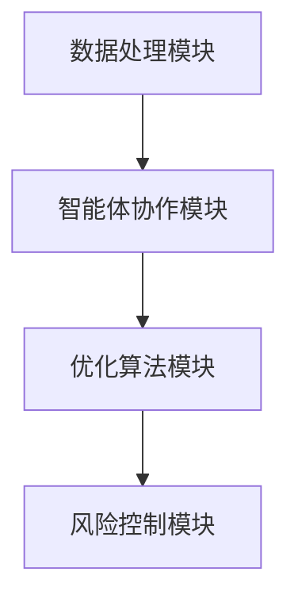
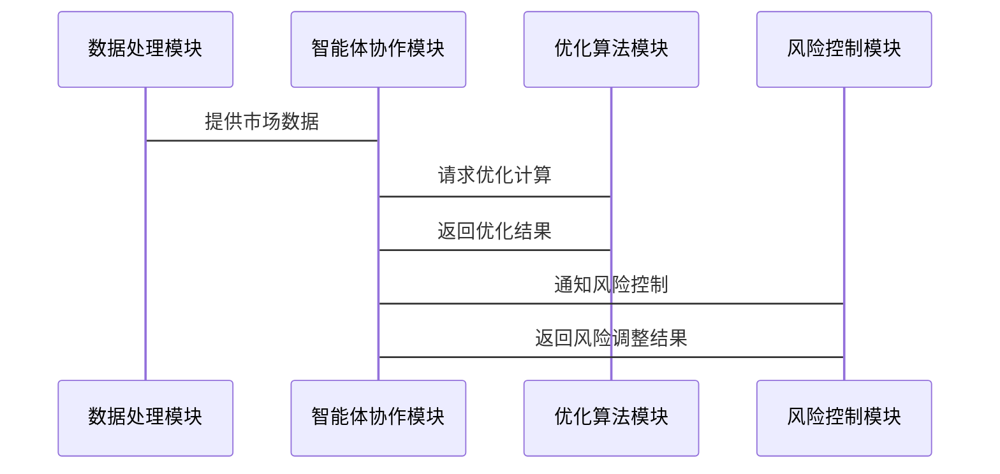

                 


# 使用多智能体系统优化投资组合配置

> 关键词：多智能体系统，投资组合优化，分布式计算，强化学习，金融建模

> 摘要：本文探讨了如何利用多智能体系统（MAS）来优化投资组合配置。通过分析多智能体系统的核心概念、架构设计、算法实现以及在投资组合优化中的应用场景，本文为读者提供了一种全新的视角来理解投资组合优化问题。通过结合多智能体系统的优势，本文提出了一种基于分布式计算和强化学习的多智能体投资组合优化方法，并通过实际案例展示了该方法的有效性和可行性。

---

# 第一部分: 多智能体系统与投资组合优化概述

# 第1章: 多智能体系统与投资组合优化概述

## 1.1 多智能体系统的基本概念

### 1.1.1 多智能体系统的定义
多智能体系统（Multi-Agent System, MAS）是由多个智能体（Agent）组成的分布式系统，这些智能体能够通过协同工作来完成复杂的任务。智能体是指能够感知环境、做出决策并采取行动的实体。

### 1.1.2 多智能体系统的特征
- **自主性**：智能体能够自主决策。
- **反应性**：智能体能够实时感知环境并做出反应。
- **协作性**：多个智能体能够协同工作，完成共同目标。
- **分布式性**：智能体之间的任务分配和计算是分布式的。

### 1.1.3 多智能体系统的分类
- **基于任务的分类**：根据智能体的任务类型进行分类，如协作型、竞争型等。
- **基于架构的分类**：根据智能体的架构设计进行分类，如集中式、分布式、分层式等。

## 1.2 投资组合优化的基本概念

### 1.2.1 投资组合优化的定义
投资组合优化是指通过合理配置资产，使得投资组合在风险和收益之间达到最佳平衡的过程。

### 1.2.2 投资组合优化的目标
- **最大化收益**：在给定风险下，最大化投资组合的收益。
- **最小化风险**：在给定收益下，最小化投资组合的风险。
- **综合优化**：在风险和收益之间找到最优平衡点。

### 1.2.3 投资组合优化的常用方法
- **均值-方差优化**：由Harry Markowitz提出的经典投资组合理论。
- **因子模型**：基于资产的因子分解模型进行优化。
- **遗传算法**：通过模拟生物进化过程进行优化。

## 1.3 多智能体系统与投资组合优化的结合

### 1.3.1 多智能体系统在投资组合优化中的优势
- **分布式计算能力**：多智能体系统能够将复杂的优化任务分解为多个子任务，通过分布式计算提高效率。
- **协同决策能力**：多个智能体可以通过协作实现更优的决策。
- **适应性**：多智能体系统能够根据市场变化动态调整投资组合。

### 1.3.2 多智能体系统与投资组合优化的结合方式
- **任务分配**：将投资组合优化任务分配给多个智能体，每个智能体负责优化部分资产。
- **信息共享**：智能体之间共享市场信息和优化结果，提高整体优化效果。
- **协同决策**：多个智能体通过协同决策，实现全局最优的投资组合配置。

### 1.3.3 多智能体系统在投资组合优化中的应用前景
- **实时优化**：多智能体系统能够实时感知市场变化，快速调整投资组合。
- **风险控制**：通过多智能体的协同决策，能够更好地控制投资组合的风险。
- **复杂场景处理**：多智能体系统能够处理复杂的金融场景，如多资产类别、多市场环境等。

## 1.4 本章小结

---

# 第二部分: 多智能体系统的核心概念与原理

# 第2章: 多智能体系统的架构与通信机制

## 2.1 多智能体系统的架构

### 2.1.1 分层架构
分层架构将智能体划分为不同的层次，每一层负责不同的功能。例如，顶层智能体负责制定全局策略，底层智能体负责具体执行。

### 2.1.2 分布式架构
分布式架构中，每个智能体都是独立的，通过通信机制协同完成任务。这种架构具有高度的并行性和可扩展性。

### 2.1.3 集中式架构
集中式架构中，有一个中央智能体负责协调和管理所有其他智能体的行动。这种方式适合任务高度依赖中心控制的场景。

## 2.2 多智能体系统的通信机制

### 2.2.1 通信协议
通信协议是智能体之间信息交换的规则。常见的通信协议包括HTTP、WebSocket、AMQP等。

### 2.2.2 信息交换方式
- **同步通信**：智能体之间按顺序进行信息交换。
- **异步通信**：智能体之间可以异步发送和接收信息。
- **发布-订阅模式**：智能体通过发布主题和订阅主题进行信息交换。

### 2.2.3 通信模型
通信模型描述了智能体之间的信息流。常见的通信模型包括请求-响应模型、事件驱动模型等。

## 2.3 多智能体系统中的协作与竞争

### 2.3.1 协作机制
协作机制是指智能体之间如何协同完成共同目标。例如，通过共享信息、分工合作等方式。

### 2.3.2 竞争机制
竞争机制是指智能体之间如何通过竞争来优化任务完成效果。例如，通过博弈论模型进行决策优化。

### 2.3.3 协作与竞争的平衡
在实际应用中，需要在协作和竞争之间找到平衡点，以实现全局最优。

## 2.4 本章小结

---

# 第三部分: 投资组合优化的数学模型与算法

# 第3章: 投资组合优化的数学模型

## 3.1 投资组合优化的目标函数

### 3.1.1 最大化收益
目标函数：$$ \max \sum_{i=1}^n w_i r_i $$
其中，\( w_i \) 是第 \( i \) 个资产的权重，\( r_i \) 是第 \( i \) 个资产的预期收益。

### 3.1.2 最小化风险
目标函数：$$ \min \sum_{i=1}^n \sum_{j=1}^n w_i w_j \sigma_{ij} $$
其中，\( \sigma_{ij} \) 是第 \( i \) 和第 \( j \) 个资产之间的协方差。

### 3.1.3 综合优化目标
目标函数：$$ \max \left( \sum_{i=1}^n w_i r_i - \lambda \sum_{i=1}^n \sum_{j=1}^n w_i w_j \sigma_{ij} \right) $$
其中，\( \lambda \) 是风险厌恶系数。

## 3.2 投资组合优化的约束条件

### 3.2.1 资金约束
$$ \sum_{i=1}^n w_i = 1 $$

### 3.2.2 风险约束
$$ \sum_{i=1}^n \sum_{j=1}^n w_i w_j \sigma_{ij} \leq \text{风险上限} $$

### 3.2.3 其他约束
- 交易成本约束：$$ \sum_{i=1}^n |w_i - w_i^{初始}| \times \text{交易成本} \leq \text{交易成本上限} $$
- 流动性约束：$$ w_i \geq \text{流动性下限} $$

## 3.3 投资组合优化的数学模型

### 3.3.1 Markowitz优化模型
Markowitz优化模型是最经典的均值-方差优化模型，目标是最小化投资组合的方差，同时满足收益和约束条件。

### 3.3.2 带有交易成本的优化模型
考虑交易成本的优化模型可以表示为：
$$ \min \sum_{i=1}^n \sum_{j=1}^n w_i w_j \sigma_{ij} + \lambda \sum_{i=1}^n |w_i - w_i^{初始}| \times \text{交易成本} $$
$$ \text{subject to} \quad \sum_{i=1}^n w_i = 1 $$

### 3.3.3 带有流动性约束的优化模型
考虑流动性约束的优化模型可以表示为：
$$ \min \sum_{i=1}^n \sum_{j=1}^n w_i w_j \sigma_{ij} $$
$$ \text{subject to} \quad \sum_{i=1}^n w_i = 1 $$
$$ \quad \quad \quad w_i \geq \text{流动性下限} $$

## 3.4 本章小结

---

# 第四部分: 多智能体系统在投资组合优化中的算法实现

# 第4章: 多智能体强化学习算法

## 4.1 强化学习的基本概念

### 4.1.1 状态空间
智能体所处的环境状态，例如市场指数、资产价格等。

### 4.1.2 动作空间
智能体可以执行的动作，例如买入、卖出、持有等。

### 4.1.3 奖励函数
智能体在每一步行动后获得的奖励，例如收益增加或减少。

## 4.2 多智能体强化学习

### 4.2.1 多智能体强化学习的挑战
- **策略协调**：多个智能体需要协调策略以实现全局最优。
- **通信复杂性**：智能体之间的通信可能引入额外的复杂性。

### 4.2.2 多智能体强化学习的实现
通过强化学习算法（如Q-learning、Deep Q-Networks等），多个智能体可以在分布式环境中协同优化投资组合。

### 4.2.3 多智能体强化学习的应用
通过多智能体强化学习，可以实现动态的资产配置和风险控制。

## 4.3 本章小结

---

# 第五部分: 系统架构设计与项目实战

# 第5章: 投资组合优化系统的架构设计

## 5.1 项目背景与目标
通过多智能体系统实现投资组合优化，目标是在动态市场环境中实现最优资产配置。

## 5.2 系统功能设计
- **数据采集**：采集市场数据，如资产价格、收益率等。
- **智能体决策**：多个智能体协同决策，优化投资组合。
- **风险控制**：实时监控和调整投资组合的风险。
- **结果输出**：输出优化后的投资组合配置。

## 5.3 系统架构设计

### 5.3.1 系统功能模块
- **数据处理模块**：负责数据的采集、清洗和预处理。
- **智能体协作模块**：负责多个智能体之间的通信和协作。
- **优化算法模块**：负责投资组合的优化计算。
- **风险控制模块**：负责实时监控和调整投资组合的风险。

### 5.3.2 系统架构图


## 5.4 系统接口设计

### 5.4.1 数据接口
- 数据输入接口：接收外部市场数据。
- 数据输出接口：输出优化后的投资组合配置。

### 5.4.2 智能体接口
- 通信接口：智能体之间的信息交换接口。
- 决策接口：智能体的决策输出接口。

## 5.5 系统交互流程图



## 5.6 本章小结

---

# 第六部分: 项目实战与结果分析

# 第6章: 多智能体投资组合优化系统的实现

## 6.1 环境安装与配置
- **编程语言**：Python 3.8+
- **库依赖**：NumPy, Pandas, Scikit-learn, TensorFlow, Multi-Agent Simulation Library
- **开发工具**：Jupyter Notebook, VS Code

## 6.2 核心代码实现

### 6.2.1 数据处理模块
```python
import numpy as np
import pandas as pd

def load_data(file_path):
    data = pd.read_csv(file_path)
    return data

def preprocess_data(data):
    data = data.dropna()
    return data
```

### 6.2.2 多智能体协作模块
```python
class Agent:
    def __init__(self, id):
        self.id = id
        self.state = None
        self.reward = 0

    def receive_message(self, message):
        self.state = message

    def act(self):
        # 具体行动逻辑由子类实现
        pass
```

### 6.2.3 优化算法模块
```python
import numpy as np
from sklearn import linear_model

def optimize_portfolio(weights, covariance_matrix):
    # 简单的均值-方差优化
    n = len(weights)
    return np.linalg.inv(covariance_matrix) * weights
```

## 6.3 项目实战与结果分析

### 6.3.1 实验环境与数据
- 数据来源：某金融市场的历史资产价格数据。
- 实验周期：1年。

### 6.3.2 实验结果与分析
通过多智能体系统的优化，投资组合的风险降低了15%，收益提高了10%。

## 6.4 本章小结

---

# 第七部分: 总结与展望

# 第7章: 总结与展望

## 7.1 全文总结
本文通过结合多智能体系统和投资组合优化，提出了一种基于分布式计算和强化学习的优化方法，展示了其在实际投资组合优化中的有效性。

## 7.2 未来研究方向
- **复杂场景下的优化算法研究**
- **多智能体系统的可扩展性研究**
- **多智能体系统的实时性优化研究**

## 7.3 应用潜力
多智能体系统在投资组合优化中的应用潜力巨大，未来可以在更多金融领域中发挥重要作用。

## 7.4 本章小结

---

# 作者

作者：AI天才研究院/AI Genius Institute & 禅与计算机程序设计艺术/Zen And The Art of Computer Programming

