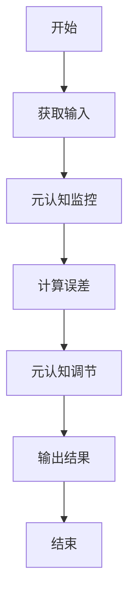

                 


# 《元认知AI Agent：具备自我监控和调节能力》

## 关键词：
元认知、AI Agent、自我监控、调节能力、人工智能、认知科学、机器学习

## 摘要：
本文深入探讨了元认知AI Agent的概念、原理及其在人工智能领域的应用。通过分析元认知的定义、属性特征以及与AI Agent的结合，阐述了元认知AI Agent的算法原理、系统架构设计及实际项目实现。本文旨在为AI开发者、研究人员及相关领域技术人员提供理论与实践相结合的指导，助力开发更高效、自适应的AI系统。

---

# 正文部分：

## 第一部分: 元认知AI Agent的背景与概念

### 第1章: 元认知AI Agent的背景介绍

#### 1.1 元认知的基本概念
- **1.1.1 元认知的定义与核心要素**  
  元认知是指个体对自身认知过程的认知，包括对思维过程的监控、评估和调节。其核心要素包括目标设定、策略选择、监控能力、调节能力和自我反思能力。
  
- **1.1.2 元认知与人工智能的结合**  
  元认知AI Agent是一种结合了元认知能力的人工智能代理，能够实时监控自身的认知过程，并根据反馈进行调整，从而提高决策的准确性和效率。

- **1.1.3 元认知AI Agent的定义与特点**  
  元认知AI Agent是一种具备自我监控和调节能力的智能体，其特点包括自主性、适应性、自我反思性和目标导向性。

#### 1.2 元认知AI Agent的问题背景
- **1.2.1 当前AI Agent的局限性**  
  当前AI Agent主要依赖预设规则和数据驱动的方法，缺乏对自身认知过程的监控和调节能力，难以适应动态变化的环境。

- **1.2.2 元认知能力对AI Agent的提升作用**  
  元认知能力使AI Agent能够实时监控自身的认知过程，发现偏差并及时调整，从而提高其在复杂环境中的适应能力和问题解决能力。

- **1.2.3 元认知AI Agent的应用场景**  
  元认知AI Agent适用于需要动态适应和自优化的场景，如智能助手、自动驾驶、智能客服等领域。

#### 1.3 元认知AI Agent的核心概念
- **1.3.1 元认知的层次结构**  
  元认知分为元认知知识、元认知体验和元认知调节三个层次，分别对应对认知过程的知识性了解、情感体验以及实际的调节行为。

- **1.3.2 元认知AI Agent的系统架构**  
  元认知AI Agent的系统架构包括认知层、元认知监控层和元认知调节层，分别负责处理具体任务、监控认知过程和调节认知策略。

- **1.3.3 元认知能力的实现机制**  
  元认知能力通过结合认知科学和人工智能技术，利用神经网络、强化学习和符号推理等方法实现对认知过程的监控和调节。

---

### 第2章: 元认知与AI Agent的核心概念联系

#### 2.1 元认知的属性特征对比
- **2.1.1 元认知的维度分析**  
  元认知从维度上可以分为时间维度、空间维度和内容维度，分别对应对认知过程的纵向监控、横向监控和内容监控。

- **2.1.2 元认知与认知的关系**  
  元认知是对认知过程的高层次控制，能够指导和调节认知过程的方向和强度。

- **2.1.3 元认知的可量化特征**  
  元认知能力可以通过认知负荷、注意力分配和任务绩效等指标进行量化评估。

#### 2.2 元认知AI Agent的ER实体关系图
```mermaid
er
actor: 用户
agent: 元认知AI Agent
metadata: 元数据
knowledge: 知识库
goal: 目标
action: 行动
monitor: 监控模块
adjust: 调节模块
```

---

### 第3章: 元认知AI Agent的算法原理

#### 3.1 元认知AI Agent的算法框架
- **3.1.1 元认知监控模块的算法流程**  
  监控模块通过感知当前认知状态，评估任务目标的完成情况，并识别可能的偏差。

- **3.1.2 元认知调节模块的算法实现**  
  调节模块根据监控结果，调整认知策略和参数，优化后续的认知过程。

- **3.1.3 元认知决策模块的数学模型**  
  决策模块基于监控和调节结果，做出最优决策，确保任务目标的实现。

#### 3.2 元认知监控的数学模型
$$
\text{监控函数} = f_{\text{monitor}}(s, a) = \text{评估状态} \, s \, \text{和动作} \, a
$$

#### 3.3 元认知调节的数学公式
$$
\text{调节函数} = f_{\text{adjust}}(e) = \text{根据误差} \, e \, \text{调整参数}
$$

#### 3.4 算法流程图


---

## 第二部分: 系统分析与架构设计

### 第4章: 系统分析与架构设计

#### 4.1 项目介绍
- **4.1.1 项目目标**  
  开发一个具备自我监控和调节能力的元认知AI Agent，能够在动态环境中自适应优化其认知过程。

- **4.1.2 项目范围**  
  本项目涵盖元认知AI Agent的设计、实现和测试，重点关注其监控和调节机制。

#### 4.2 系统功能设计
- **4.2.1 功能模块划分**  
  系统主要包括认知模块、监控模块、调节模块和决策模块四个部分。

- **4.2.2 功能流程图**  
  认知模块负责处理具体任务，监控模块实时评估认知过程，调节模块根据评估结果调整策略，决策模块基于调整后的策略做出最终决策。

#### 4.3 系统架构设计


#### 4.4 系统接口设计
- **4.4.1 接口描述**  
  系统提供标准API接口，支持与外部系统的交互，包括任务输入、状态反馈和结果输出。

- **4.4.2 接口实现**  
  使用RESTful API实现系统接口，确保与其他系统的兼容性和可扩展性。

#### 4.5 系统交互流程图
```mermaid
sequenceDiagram
actor 用户
system 元认知AI Agent

用户 -> 元认知AI Agent: 发送任务请求
元认知AI Agent -> 认知模块: 处理任务
认知模块 -> 监控模块: 传输认知状态
监控模块 -> 调节模块: 提供评估结果
调节模块 -> 决策模块: 调整策略
决策模块 -> 用户: 返回最终结果
```

---

## 第三部分: 项目实战

### 第5章: 项目实战

#### 5.1 环境安装
- **5.1.1 系统要求**  
  需要安装Python 3.8及以上版本，安装必要的库如numpy、pandas、scikit-learn和matplotlib。

- **5.1.2 安装依赖**  
  使用pip安装所需库：
  ```bash
  pip install numpy scikit-learn matplotlib
  ```

#### 5.2 核心代码实现
- **5.2.1 元认知监控模块的实现**  
  ```python
  import numpy as np

  def monitor(s, a):
      # 监控函数，评估状态s和动作a的合理性
      return np.dot(s, a)  # 示例实现，具体逻辑根据实际需求调整
  ```

- **5.2.2 元认知调节模块的实现**  
  ```python
  def adjust(e):
      # 调节函数，根据误差e调整参数
      return e * 0.1  # 示例实现，具体逻辑根据实际需求调整
  ```

- **5.2.3 决策模块的实现**  
  ```python
  def decide(monitor_result, adjust_result):
      # 决策函数，综合监控和调节结果做出最终决策
      return monitor_result + adjust_result  # 示例实现，具体逻辑根据实际需求调整
  ```

#### 5.3 案例分析与解读
- **5.3.1 案例场景**  
  假设一个智能客服系统，元认知AI Agent需要监控与客户的对话过程，实时调节对话策略，以提高客户满意度。

- **5.3.2 实现步骤**  
  1. 初始化系统，接收客户咨询请求。
  2. 认知模块处理客户问题，生成初步回复。
  3. 监控模块评估回复的准确性。
  4. 调节模块根据评估结果调整回复策略。
  5. 决策模块生成最终回复并发送给客户。

#### 5.4 项目小结
- **5.4.1 实践收获**  
  通过实际项目，我们掌握了元认知AI Agent的实现方法，熟悉了系统架构设计和接口实现。

- **5.4.2 经验总结**  
  在实际开发中，需要根据具体场景调整监控和调节策略，确保系统的自适应能力和高效性。

---

## 第四部分: 总结与展望

### 第6章: 总结与展望

#### 6.1 总结
- **6.1.1 核心内容回顾**  
  元认知AI Agent是一种具备自我监控和调节能力的智能体，通过结合元认知理论和人工智能技术，能够实现动态环境中的自适应优化。

- **6.1.2 本文创新点**  
  提出了元认知AI Agent的系统架构和实现方法，为未来的智能系统开发提供了新的思路。

#### 6.2 展望
- **6.2.1 未来研究方向**  
  进一步研究元认知AI Agent的可扩展性和可解释性，探索其在更多领域的应用。

- **6.2.2 技术发展趋势**  
  结合边缘计算和分布式系统，开发更高效、更智能的元认知AI Agent。

---

## 第五部分: 最佳实践与小结

### 第7章: 最佳实践与小结

#### 7.1 最佳实践
- **7.1.1 开发建议**  
  在开发元认知AI Agent时，建议先从简单的场景入手，逐步增加复杂度，确保系统稳定性和可维护性。

- **7.1.2 注意事项**  
  重视系统监控和调节模块的设计，确保其能够实时反馈和调整，避免系统僵化。

#### 7.2 小结
- **7.2.1 内容回顾**  
  本文从背景、理论、算法、系统设计到项目实现，全面探讨了元认知AI Agent的开发与应用。

- **7.2.2 未来展望**  
  元认知AI Agent将朝着更智能化、自适应化的方向发展，为人工智能领域带来更多的创新和突破。

---

## 作者：AI天才研究院/AI Genius Institute & 禅与计算机程序设计艺术 /Zen And The Art of Computer Programming

---

**注**：由于篇幅限制，以上仅为文章的部分内容。完整文章需要按照上述大纲，逐章节展开详细编写。

