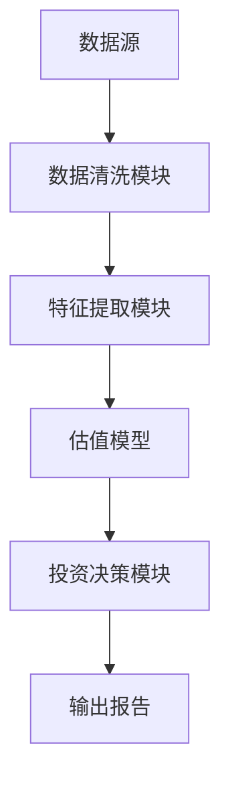

                 


# 深度价值投资：寻找极度低估的股票

---

## 关键词：深度价值投资、股票估值、内在价值、安全边际、低估股票、投资策略

---

## 摘要：深度价值投资是一种通过分析企业的内在价值，寻找市场低估的股票的投资策略。本文详细探讨了深度价值投资的核心概念、算法原理、系统架构设计、实战案例分析以及数学模型，帮助读者全面理解如何在市场中发现低估的投资机会。

---

## 第一部分：深度价值投资的背景与基础

### 第1章：价值投资概述

#### 1.1 价值投资的起源与发展
价值投资是一种以基本面分析为基础的投资策略，起源于20世纪初。本节将介绍价值投资的起源、发展历程以及其在现代投资领域中的地位。

#### 1.2 核心概念与定义
- 内在价值：企业未来现金流的现值，是衡量股票合理价格的标准。
- 市场价值：市场参与者对股票的定价，可能高于或低于内在价值。
- 安全边际：内在价值与市场价值之间的差异，是投资的安全垫。

#### 1.3 与其他投资策略的区别
- 技术分析：基于价格和成交量的波动进行预测。
- 股票筛选：基于量化指标如市盈率、市净率等进行筛选。
- 基本面分析：深入分析企业的财务状况、行业地位和竞争优势。

---

## 第二部分：深度价值投资的核心理论

### 第2章：内在价值与安全边际

#### 2.1 内在价值的计算方法
- 现金流折现法（DCF模型）：通过预测企业未来现金流并折现计算内在价值。
- 市盈率倒数法：利用市盈率的倒数作为估值基准。

#### 2.2 安全边际的重要性
- 确保在市场价格低于内在价值时买入，降低投资风险。

#### 2.3 财务报表分析
- 利润表：分析企业的盈利能力和成长性。
- 资产负债表：评估企业的财务健康状况和资本结构。
- 现金流量表：监控企业的现金流状况。

#### 2.4 估值指标对比
| 指标         | 定义                          | 优缺点分析                         |
|--------------|-------------------------------|------------------------------------|
| 市盈率（P/E） | 当前股价 / 每股净利润          | 反映盈利能力，但受行业影响较大。    |
| 市净率（P/B） | 当前股价 / 每股净资产          | 适用于净资产驱动型企业，低估时P/B < 1。 |
| 市销率（P/S） | 当前股价 / 每股销售收入          | 适用于销售驱动型企业，低P/S可能低估。 |

---

## 第三部分：投资策略与方法论

### 第3章：筛选低估股票的标准与指标

#### 3.1 筛选标准
- 市盈率低于行业平均值。
- 市净率低于行业平均值。
- 净利润增长率持续为正。

#### 3.2 量化指标
- 市盈率（P/E）：$$P/E = \frac{\text{股价}}{\text{每股净利润}}$$
- 市净率（P/B）：$$P/B = \frac{\text{股价}}{\text{每股净资产}}$$

#### 3.3 克里斯·布朗的策略
- 专注于企业基本面分析。
- 寻找市场忽视的优质企业。
- 长期持有，避免频繁交易。

#### 3.4 投资组合构建
- 分散投资：降低单一股票的风险。
- 定期再平衡：根据市场变化调整持仓。

---

## 第四部分：系统分析与架构设计

### 第4章：投资分析系统设计

#### 4.1 系统架构图



#### 4.2 数据分析模块
- 数据清洗：处理缺失值、异常值。
- 特征提取：提取市盈率、市净率等关键指标。

#### 4.3 估值模型实现
- 使用Python编写估值模型，计算股票的内在价值。
- 示例代码：

```python
def calculate_intrinsic_value(enterprise_value, free_cash_flow):
    return enterprise_value / free_cash_flow
```

---

## 第五部分：项目实战

### 第5章：实战案例分析

#### 5.1 环境安装
- 安装Python、Pandas、NumPy等工具。
- 使用Yahoo Finance获取股票数据。

#### 5.2 核心代码实现
```python
import pandas as pd
import numpy as np

def calculate_pe_ratio(df):
    pe_ratio = df['Close'] / df['EPS']
    return pe_ratio

# 示例数据
data = {'Close': [100, 90, 80, 70, 60],
        'EPS': [10, 9, 8, 7, 6]}
df = pd.DataFrame(data)
pe_ratio = calculate_pe_ratio(df)
print(pe_ratio)
```

#### 5.3 案例分析与解读
- 分析某公司股票，计算其市盈率和市净率，判断是否低估。

---

## 第六部分：数学模型与公式

### 第6章：相关数学模型

#### 6.1 内在价值计算公式
$$\text{内在价值} = \sum_{t=1}^{n} \frac{\text{现金流}_t}{(1 + r)^t}$$
其中，$$r$$ 是折现率。

#### 6.2 估值指标的数学表达
- 市盈率：$$P/E = \frac{P}{E}$$
- 市净率：$$P/B = \frac{P}{B}$$

---

## 第七部分：最佳实践与总结

### 第7章：最佳实践与注意事项

#### 7.1 投资中的注意事项
- 避免情绪化投资。
- 定期复盘，评估投资组合的表现。
- 保持学习，更新投资策略。

#### 7.2 小结与未来展望
深度价值投资是一种长期有效的策略，但需要投资者具备扎实的分析能力和耐心。未来，结合人工智能技术，可以进一步提升估值的准确性和效率。

#### 7.3 拓展阅读推荐
- 《The Intelligent Investor》——本杰明·格雷厄姆
- 《价值投资实战手册》——李录

---

## 作者：AI天才研究院 & 禅与计算机程序设计艺术

---

以上是《克里斯·布朗的深度价值投资：寻找极度低估的股票》的完整目录和内容概要，涵盖了从基础到实战的各个方面，帮助读者系统地理解和掌握深度价值投资的策略与方法。

