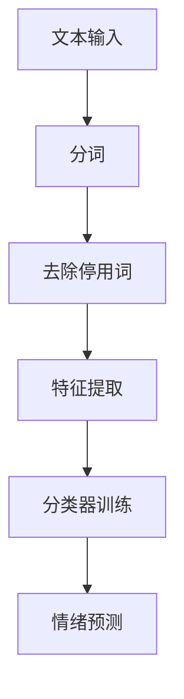
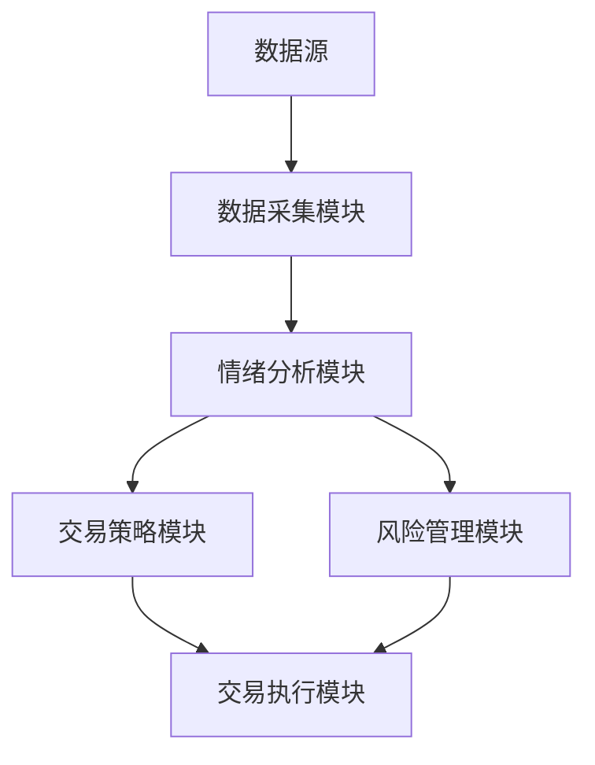

                 

# 克里斯托弗·布朗的极端市场情绪利用策略

> 关键词：极端市场情绪，情绪分析，投资策略，风险管理，NLP，数学模型

> 摘要：本文详细探讨了克里斯托弗·布朗提出的极端市场情绪利用策略，分析了其背后的理论基础、算法原理、数学模型和系统架构。文章从市场情绪的定义、量化方法、情绪分析技术、交易策略设计、风险管理等多个维度展开，结合实际案例，深入剖析了如何利用极端市场情绪进行投资决策优化。同时，文章还讨论了情绪分析在金融领域的应用前景和挑战。

---

## 第一部分: 极端市场情绪与投资心理学基础

### 第1章: 极端市场情绪的定义与背景

#### 1.1 市场情绪的定义与分类
- 市场情绪的定义
- 市场情绪的分类：乐观、悲观、恐慌、狂热
- 极端市场情绪的特征

#### 1.2 为什么极端市场情绪值得关注
- 市场情绪与资产价格的关系
- 极端情绪对市场波动的影响
- 投资者行为偏差与情绪周期

#### 1.3 市场情绪与投资者行为
- 羊群效应
- 情绪驱动的决策错误
- 极端情绪下的市场崩盘

### 第2章: 极端市场情绪的核心概念

#### 2.1 情绪分析的原理与方法
- 基于文本的情绪分析
- 基于数据的情绪指标
- 综合情绪分析模型

#### 2.2 极端市场情绪的量化指标
- 情绪指数的构建与计算
- 市场情绪与资产价格的关系
- 情绪指标的验证与优化

#### 2.3 极端市场情绪与投资策略
- 情绪驱动的投资策略
- 情绪指标在交易中的应用
- 极端情绪下的风险管理

---

## 第二部分: 极端市场情绪分析的算法与数学模型

### 第3章: 基于NLP的市场情绪分析

#### 3.1 自然语言处理（NLP）基础
- NLP的核心技术与工具
- 常见的NLP算法与模型

#### 3.2 市场情绪分析的NLP实现
- 文本预处理与特征提取
- 情感分类算法的选择与实现
- 基于深度学习的情绪分析模型

#### 3.3 基于NLP的情绪分析流程图

### 第4章: 市场情绪指数的数学模型

#### 4.1 情绪指数的构建公式
$$ 情绪指数 = \sum_{i=1}^{n} w_i \times s_i $$
其中，$w_i$ 是第 $i$ 个指标的权重，$s_i$ 是第 $i$ 个指标的情绪评分。

#### 4.2 情绪指数的验证与优化
- 回归分析与模型验证
- 基于统计学的优化方法
- 情绪指数的动态调整

#### 4.3 情绪指数与资产回报的关系
$$ R = \alpha \times E + \beta \times \epsilon $$
其中，$R$ 是资产回报，$E$ 是情绪指数，$\alpha$ 是回归系数，$\epsilon$ 是误差项。

---

## 第三部分: 极端市场情绪的交易策略与风险管理

### 第5章: 基于情绪分析的交易策略

#### 5.1 交易信号的生成
- 基于情绪指数的买卖信号
- 情绪拐点的识别方法
- 交易策略的回测与优化

#### 5.2 基于情绪分析的风险管理
- 极端情绪下的仓位调整
- 风险敞口的量化与控制
- 情绪波动的预警机制

#### 5.3 交易策略的数学模型
$$ P_t = \theta \times E_{t-1} + \beta \times P_{t-1} $$
其中，$P_t$ 是当前价格，$E_{t-1}$ 是前一期的情绪指数，$\beta$ 是动量因子。

### 第6章: 极端情绪下的风险管理

#### 6.1 风险管理的核心原则
- 风险与收益的平衡
- 头寸规模的控制
- 止损与止盈机制

#### 6.2 基于情绪分析的风险管理模型
- 情绪驱动的风险评估
- 多因素风险模型的构建
- 风险控制的动态调整

#### 6.3 风险管理的实战案例
- 案例分析：2008年金融危机中的情绪风险管理
- 案例分析：2020年新冠疫情的情绪风险管理

---

## 第四部分: 系统架构与数据源

### 第7章: 系统架构设计

#### 7.1 系统功能设计
- 数据采集模块
- 情绪分析模块
- 交易策略模块
- 风险管理模块

#### 7.2 系统架构图

#### 7.3 系统接口设计
- 数据接口：API调用与数据格式
- 模块接口：模块间的通信与数据传递
- 用户接口：前端展示与交互设计

### 第8章: 数据源与数据处理

#### 8.1 数据源的选择
- 市场数据源：股票、期货、外汇等
- 文本数据源：新闻、社交媒体、公司财报
- 数据清洗与预处理
- 数据格式化与标准化

#### 8.2 数据处理的实战案例
- 文本数据的清洗与分词
- 市场数据的特征提取与分析
- 数据的动态更新与实时处理

---

## 第五部分: 最佳实践与未来展望

### 第9章: 最佳实践

#### 9.1 实战经验总结
- 情绪分析的准确性提升
- 交易策略的优化
- 风险管理的改进

#### 9.2 注意事项
- 情绪分析的局限性
- 数据质量的影响
- 模型的过拟合与欠拟合问题

### 第10章: 未来展望

#### 10.1 情绪分析技术的未来发展
- 更先进的NLP模型
- 多模态情绪分析
- 实时情绪监控

#### 10.2 交易策略的创新
- 结合AI的自适应交易策略
- 基于情绪网络的复杂策略
- 情绪驱动的量化投资

---

## 作者：AI天才研究院/AI Genius Institute & 禅与计算机程序设计艺术 /Zen And The Art of Computer Programming

---

以上是文章的详细目录和部分章节内容的概述。

