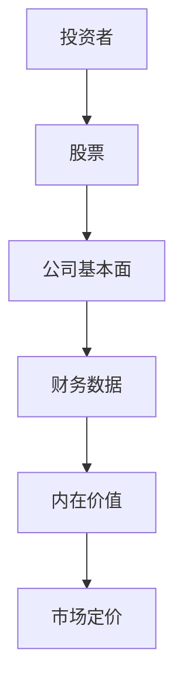
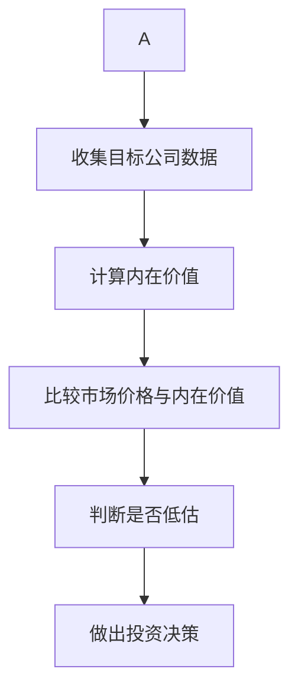
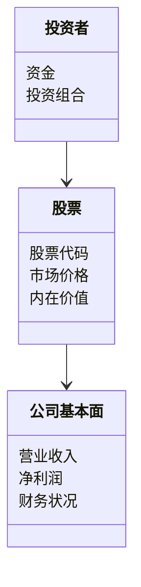
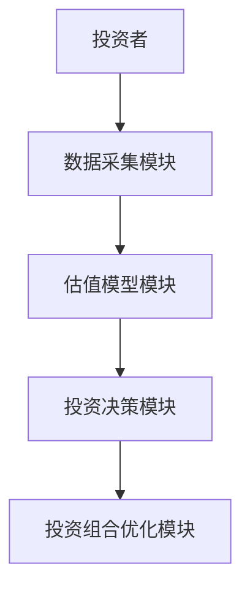

                 


# 克里斯托弗·布朗的深度价值投资：寻找严重低估的股票

**关键词**：深度价值投资，严重低估股票，内在价值，安全边际，市场先生，DCF模型，投资组合优化

**摘要**：本文详细介绍了克里斯托弗·布朗的深度价值投资方法，通过分析如何识别严重低估的股票，帮助投资者构建稳健的投资组合。文章从价值投资的背景、核心概念、算法原理、系统分析、项目实战等方面展开，为读者提供全面的指导。

---

# 第一部分：深度价值投资的背景与核心概念

## 第1章：深度价值投资的起源与定义

### 1.1 价值投资的起源
- **价值投资的起源背景**：价值投资起源于20世纪30年代，由本杰明·格雷厄姆和大卫·多德提出，强调以低于内在价值的价格买入优质股票。
- **价值投资的核心理念**：投资的本质是购买企业的一部分，而非单纯买卖股票。价值投资通过分析企业的基本面，寻找市场价格低于内在价值的投资标的。
- **克里斯托弗·布朗的价值投资体系**：克里斯托弗·布朗继承并发展了格雷厄姆的价值投资理念，提出深度价值投资的概念，即通过深入分析企业的财务数据和行业地位，寻找被市场严重低估的股票。

### 1.2 深度价值投资的定义
- **什么是深度价值投资**：深度价值投资是一种以低于企业内在价值的价格买入优质股票的投资策略，强调对企业基本面的深入分析和对市场估值的精准判断。
- **深度价值投资的核心要素**：包括对企业财务状况的全面分析、行业地位的评估、管理层素质的判断以及市场价格与内在价值的对比。
- **深度价值投资与传统价值投资的区别**：传统价值投资更注重安全边际和内在价值的计算，而深度价值投资则进一步强调对企业未来现金流的预测和市场波动的分析。

### 1.3 深度价值投资的哲学基础
- **投资的三大核心原则**：
  1. 安全边际：买入价格低于内在价值，确保投资的安全性。
  2. 内在价值：企业未来现金流的现值，是衡量股票价值的核心指标。
  3. 市场先生：市场情绪波动对股票价格的影响，投资者应理性应对市场波动。
- **安全边际的概念与作用**：安全边际是内在价值与市场价格之间的差距，能够有效降低投资风险，提高投资回报率。
- **内在价值的计算与市场定价的关系**：内在价值是股票的公允价值，而市场价格受市场情绪和短期因素影响，两者之间的差异为投资者提供了套利机会。

## 第2章：深度价值投资的核心概念与联系

### 2.1 核心概念原理
- **安全边际的数学模型**：  
  安全边际 = 内在价值 × 安全边际系数  
  其中，安全边际系数通常为20%~50%，根据企业的具体情况调整。
- **内在价值的计算公式**：  
  内在价值（DCF模型）= ∑(CF_t / (1 + r)^t) + TV / (1 + r)^n  
  其中，CF_t为第t年的现金流，r为折现率，TV为终值，n为预测年数。
- **市场先生的波动性分析**：市场先生代表市场的波动性，投资者应通过分析市场情绪和市场周期，找到买入低估股票的最佳时机。

### 2.2 核心概念属性特征对比表格

| 概念       | 安全边际 | 内在价值 | 市场定价 |
|------------|----------|----------|----------|
| 定义       | 股价与内在价值的差距 | 股票的公允价值 | 市场交易价格 |
| 计算公式   | 股价 < 内在价值 × 安全边际系数 | DCF模型计算 | 市场供需决定 |
| 作用       | 风险控制 | 价值发现 | 价格波动 |

### 2.3 ER实体关系图（Mermaid流程图）


---

# 第二部分：深度价值投资的分析方法

## 第3章：深度价值投资的算法原理

### 3.1 DCF模型的数学公式
$$\text{DCF模型} = \sum_{t=1}^{n} \frac{\text{CF}_t}{(1 + r)^t} + \frac{\text{TV}}{(1 + r)^n}$$  
其中，CF_t为第t年的自由现金流，r为折现率，TV为终值，n为预测年数。

### 3.2 相对估值法的计算公式
$$\text{相对估值} = \frac{\text{可比公司平均市盈率}}{\text{目标公司每股收益}}$$  
通过比较目标公司与可比公司的估值倍数，判断目标公司是否被低估。

### 3.3 算法流程图（Mermaid）


---

## 第4章：深度价值投资的系统分析

### 4.1 系统功能设计
- **领域模型（Mermaid类图）**  


### 4.2 系统架构设计
- **系统架构图（Mermaid）**  


---

# 第三部分：深度价值投资的实战应用

## 第5章：深度价值投资的项目实战

### 5.1 项目介绍
- **项目目标**：通过深度价值投资的方法，寻找一家被市场严重低估的公司。
- **项目步骤**：
  1. 数据采集：收集目标公司的财务数据和行业信息。
  2. 估值计算：使用DCF模型和相对估值法计算内在价值。
  3. 投资决策：比较市场价格与内在价值，判断是否买入。

### 5.2 核心实现源代码
```python
def calculate_intrinsic_value(revenue,净利润,折现率,预测年数):
    cf = [revenue * (1 - 净利率)] * 预测年数
   终值 = revenue * (1 - 净利率) / (折现率 - 增长率)
    内在价值 = sum(cf / (1 + 折现率)^i for i in range(预测年数)) + 终值 / (1 + 折现率)^预测年数
    return 内在价值
```

### 5.3 实际案例分析
- **案例公司**：假设某公司营业收入为10亿元，净利润率为10%，折现率为8%，预测年数为5年，无增长假设。
- **计算过程**：
  - 每年现金流：10亿元 × 10% = 1亿元
  - 终值：1亿元 / 0.08 = 12.5亿元
  - 内在价值：∑(1亿元 / (1.08)^i) + 12.5亿元 / (1.08)^5 ≈ 8.5亿元
- **结论**：如果市场价格低于8.5亿元，则该股票被低估。

---

# 第四部分：深度价值投资的最佳实践

## 第6章：最佳实践与小结

### 6.1 投资中的注意事项
- **避免情绪化决策**：投资者应保持理性，避免受市场情绪影响。
- **持续学习与更新**：市场环境不断变化，投资者需要不断更新知识和方法。

### 6.2 深度价值投资的未来趋势
- **技术驱动**：随着大数据和人工智能技术的发展，深度价值投资将更加依赖于数据驱动的决策。
- **全球化视角**：投资者需要关注全球市场，寻找跨市场的低估机会。

---

# 作者信息

作者：AI天才研究院/AI Genius Institute & 禅与计算机程序设计艺术 /Zen And The Art of Computer Programming

---

通过本文的详细分析，读者可以全面了解深度价值投资的核心理念和实际操作方法，为寻找严重低估的股票提供了系统化的指导。

